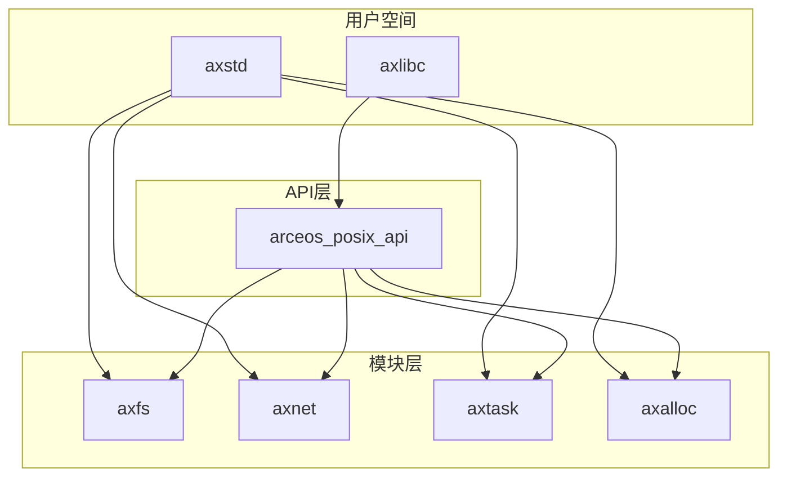
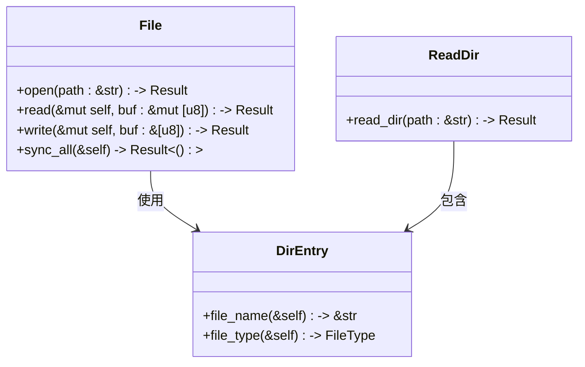
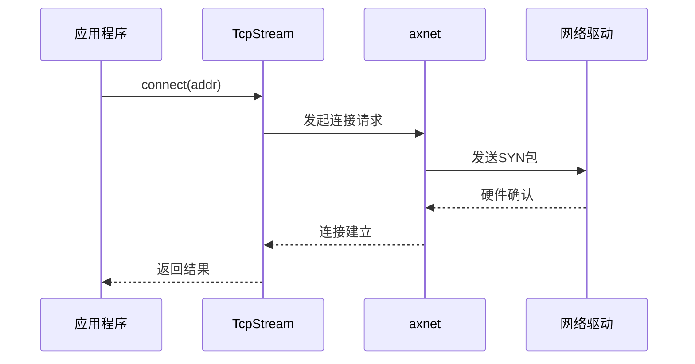
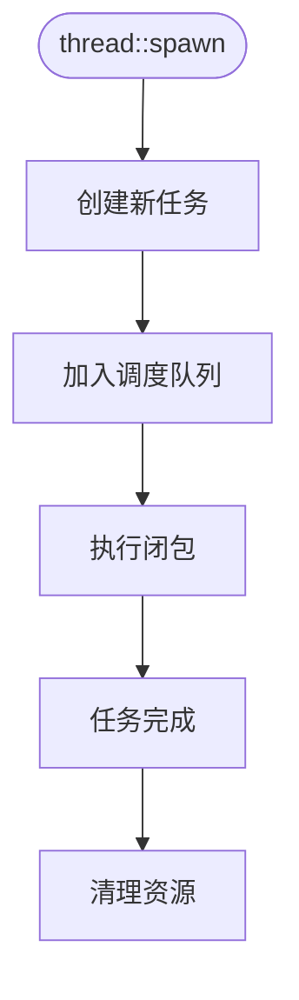
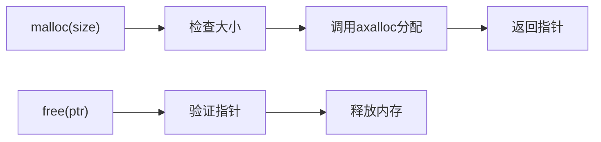
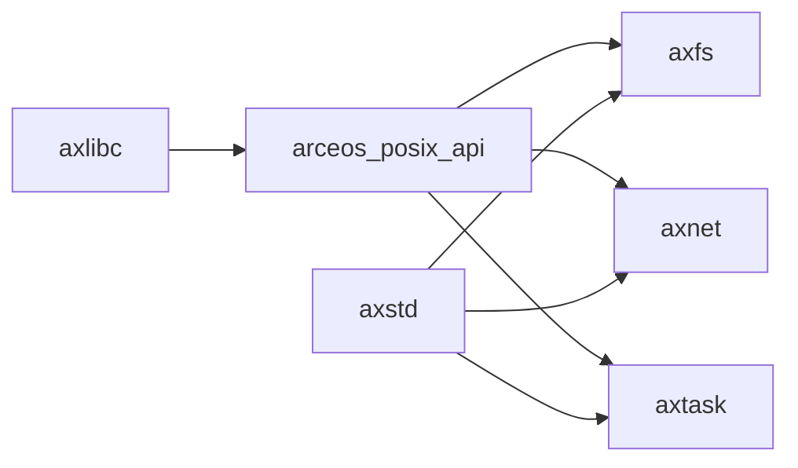

# API与用户库

<cite>
**本文档中引用的文件**
- [lib.rs](file://api/arceos_posix_api/src/lib.rs)
- [ctypes.h](file://api/arceos_posix_api/ctypes.h)
- [lib.rs](file://ulib/axstd/src/lib.rs)
- [lib.rs](file://ulib/axlibc/src/lib.rs)
- [malloc.rs](file://ulib/axlibc/src/malloc.rs)
- [fcntl.h](file://ulib/axlibc/include/fcntl.h)
- [socket.h](file://ulib/axlibc/include/sys/socket.h)
- [dir.rs](file://ulib/axstd/src/fs/dir.rs)
- [file.rs](file://ulib/axstd/src/fs/file.rs)
- [mod.rs](file://ulib/axstd/src/fs/mod.rs)
- [tcp.rs](file://ulib/axstd/src/net/tcp.rs)
- [udp.rs](file://ulib/axstd/src/net/udp.rs)
- [mod.rs](file://ulib/axstd/src/net/mod.rs)
- [mod.rs](file://ulib/axstd/src/thread/mod.rs)
- [multi.rs](file://ulib/axstd/src/thread/multi.rs)
</cite>

## 目录
1. [简介](#简介)
2. [项目结构](#项目结构)
3. [核心组件](#核心组件)
4. [架构概述](#架构概述)
5. [详细组件分析](#详细组件分析)
6. [依赖分析](#依赖分析)
7. [性能考虑](#性能考虑)
8. [故障排除指南](#故障排除指南)
9. [结论](#结论)

## 简介
ArceOS 是一个模块化操作系统框架，提供多层编程接口以支持不同类型的用户程序。本项目暴露了三种主要的API层次：POSIX兼容API（arceos_posix_api）、Rust风格标准库（axstd）和C运行时库（axlibc）。这些接口分别面向需要传统C语言环境的应用、偏好Rust原生语法的开发者以及希望使用标准C库函数的场景。文档将全面覆盖这些接口的设计、实现机制及使用方法。

## 项目结构
ArceOS 的代码组织清晰地划分为多个功能模块。顶层目录包括 `api`、`modules` 和 `ulib`，分别对应系统级API定义、内核模块实现和用户空间库。其中：
- `api/arceos_posix_api` 提供POSIX系统调用的封装。
- `ulib/axstd` 实现Rust风格的标准库，直接调用底层模块。
- `ulib/axlibc` 提供C语言运行时支持，包括malloc、printf等标准函数。
- `modules` 包含内存管理、任务调度、文件系统、网络堆栈等核心子系统。

这种分层设计使得上层应用可以灵活选择合适的接口层进行开发。



**Diagram sources**
- [lib.rs](file://api/arceos_posix_api/src/lib.rs#L1-L60)
- [lib.rs](file://ulib/axstd/src/lib.rs#L1-L77)
- [lib.rs](file://ulib/axlibc/src/lib.rs#L1-L124)

**Section sources**
- [lib.rs](file://api/arceos_posix_api/src/lib.rs#L1-L60)
- [lib.rs](file://ulib/axstd/src/lib.rs#L1-L77)
- [lib.rs](file://ulib/axlibc/src/lib.rs#L1-L124)

## 核心组件
ArceOS的核心由三个关键用户库构成：`arceos_posix_api`、`axstd` 和 `axlibc`。`arceos_posix_api` 提供与POSIX标准兼容的系统调用接口，允许C程序通过熟悉的API访问操作系统服务。`axstd` 是为Rust程序设计的标准库，提供类似`std`的接口但直接调用ArceOS内部模块，避免了传统libc的开销。`axlibc` 则实现了完整的C运行时环境，包含动态内存分配、I/O操作、线程管理等功能，使C应用程序能够无缝运行在ArceOS之上。

**Section sources**
- [lib.rs](file://api/arceos_posix_api/src/lib.rs#L1-L60)
- [lib.rs](file://ulib/axstd/src/lib.rs#L1-L77)
- [lib.rs](file://ulib/axlibc/src/lib.rs#L1-L124)

## 架构概述
ArceOS采用分层架构，从下到上的层次依次为硬件抽象层（HAL）、核心模块层、API接口层和用户库层。用户程序可以通过`axstd`直接调用模块层的功能，也可以通过`axlibc`经由`arceos_posix_api`间接访问。这种设计既保证了高性能的原生调用路径，又提供了良好的兼容性支持。

```mermaid
graph TD
A[用户程序] --> B{调用方式}
B --> C[axstd (Rust-native)]
B --> D[axlibc (C Runtime)]
C --> E[直接调用模块]
D --> F[arceos_posix_api]
F --> E
E --> G[axfs, axnet, axtask...]
G --> H[axhal]
H --> I[硬件]
```

**Diagram sources**
- [lib.rs](file://ulib/axstd/src/lib.rs#L1-L77)
- [lib.rs](file://ulib/axlibc/src/lib.rs#L1-L124)
- [lib.rs](file://api/arceos_posix_api/src/lib.rs#L1-L60)

## 详细组件分析

### POSIX API 分析
`arceos_posix_api` 模块通过条件编译特性（Cargo features）按需导出POSIX系统调用。例如，当启用`fs`特性时，会暴露`sys_open`、`sys_stat`等文件系统相关调用；启用`net`特性则提供`sys_socket`、`sys_connect`等网络接口。所有类型定义均生成自`ctypes_gen.rs`，确保与C ABI兼容。

#### 系统调用映射表
| POSIX 函数 | 对应 sys_ 函数 | 所属特性 |
|------------|----------------|----------|
| open       | sys_open       | fs       |
| read       | sys_read       | io       |
| write      | sys_write      | io       |
| socket     | sys_socket     | net      |
| pthread_create | sys_pthread_create | multitask |

**Section sources**
- [lib.rs](file://api/arceos_posix_api/src/lib.rs#L1-L60)
- [ctypes.h](file://api/arceos_posix_api/ctypes.h)

### Rust标准库（axstd）分析
`axstd` 提供Rust风格的异步/同步API，其设计目标是尽可能接近标准库`std`的体验。该库通过条件编译支持多种可选功能，如`fs`用于文件系统访问，`net`用于网络通信，`multitask`用于多线程编程。

#### 文件系统模块


**Diagram sources**
- [file.rs](file://ulib/axstd/src/fs/file.rs)
- [dir.rs](file://ulib/axstd/src/fs/dir.rs)
- [mod.rs](file://ulib/axstd/src/fs/mod.rs)

**Section sources**
- [file.rs](file://ulib/axstd/src/fs/file.rs)
- [dir.rs](file://ulib/axstd/src/fs/dir.rs)
- [mod.rs](file://ulib/axstd/src/fs/mod.rs)

#### 网络模块


**Diagram sources**
- [tcp.rs](file://ulib/axstd/src/net/tcp.rs)
- [mod.rs](file://ulib/axstd/src/net/mod.rs)

**Section sources**
- [tcp.rs](file://ulib/axstd/src/net/tcp.rs)
- [udp.rs](file://ulib/axstd/src/net/udp.rs)
- [mod.rs](file://ulib/axstd/src/net/mod.rs)

#### 线程模块


**Diagram sources**
- [multi.rs](file://ulib/axstd/src/thread/multi.rs)
- [mod.rs](file://ulib/axstd/src/thread/mod.rs)

**Section sources**
- [multi.rs](file://ulib/axstd/src/thread/multi.rs)
- [mod.rs](file://ulib/axstd/src/thread/mod.rs)

### C运行时库（axlibc）分析
`axlibc` 实现了完整的C标准库功能，其核心机制是将C函数调用转换为对`arceos_posix_api`的系统调用。例如，`malloc`和`free`基于`axalloc`模块实现动态内存分配；`printf`系列函数通过格式化字符串并调用底层写入接口完成输出。

#### malloc/free 实现机制


**Diagram sources**
- [malloc.rs](file://ulib/axlibc/src/malloc.rs)

**Section sources**
- [malloc.rs](file://ulib/axlibc/src/malloc.rs)

#### printf 实现流程
`printf` 函数族首先解析格式字符串，然后根据参数类型调用相应的转换函数（如`itoa`处理整数），最终通过`write`系统调用将结果输出到标准输出设备。

#### pthread 实现
多线程支持通过`pthread_create`等函数暴露，底层依赖于`axtask`模块的任务创建与调度机制。互斥锁（mutex）由`axsync`提供同步原语支持。

**Section sources**
- [lib.rs](file://ulib/axlibc/src/lib.rs#L1-L124)
- [pthread.c](file://ulib/axlibc/c/pthread.c)

## 依赖分析
各组件之间的依赖关系体现了ArceOS的分层设计理念。`axlibc` 依赖 `arceos_posix_api` 来实现系统调用，而 `arceos_posix_api` 又依赖于底层模块如 `axfs`、`axnet` 等。`axstd` 则直接依赖这些底层模块，形成更短的调用链。



**Diagram sources**
- [lib.rs](file://ulib/axlibc/src/lib.rs#L1-L124)
- [lib.rs](file://api/arceos_posix_api/src/lib.rs#L1-L60)
- [lib.rs](file://ulib/axstd/src/lib.rs#L1-L77)

**Section sources**
- [lib.rs](file://ulib/axlibc/src/lib.rs#L1-L124)
- [lib.rs](file://api/arceos_posix_api/src/lib.rs#L1-L60)
- [lib.rs](file://ulib/axstd/src/lib.rs#L1-L77)

## 性能考虑
- **调用开销**：`axstd` 因为直接调用模块层，相比经过`axlibc`→`arceos_posix_api`的双层间接调用具有更低的开销。
- **内存分配**：`malloc` 的性能取决于所选的分配器策略（TLSF、slab或buddy），建议根据应用场景选择合适配置。
- **I/O多路复用**：`epoll` 比 `select` 更高效，尤其在处理大量文件描述符时表现更优。

## 故障排除指南
常见问题包括：
- 启用`multitask`特性后未正确初始化调度器导致死锁。
- 使用`fs`功能