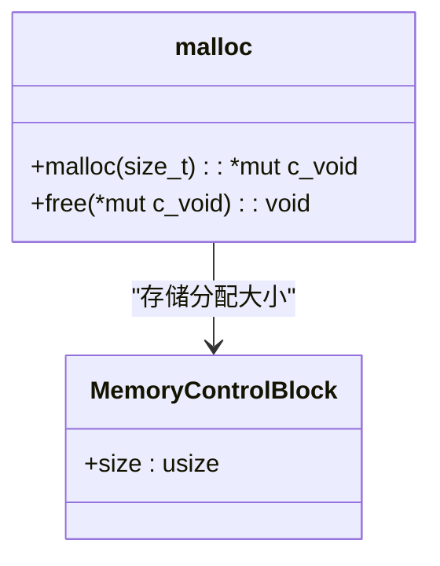
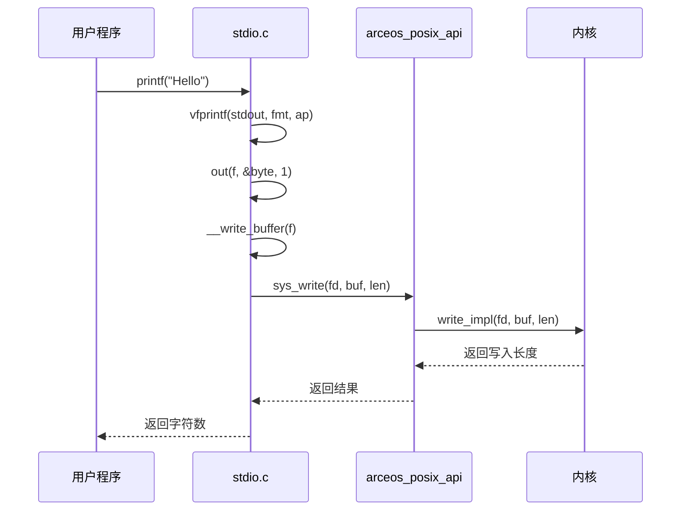

# C运行时库(axlibc)

<cite>
**本文档引用的文件**   
- [malloc.rs](file://ulib/axlibc/src/malloc.rs)
- [stdio.c](file://ulib/axlibc/c/stdio.c)
- [string.c](file://ulib/axlibc/c/string.c)
- [pthread.rs](file://ulib/axlibc/src/pthread.rs)
- [errno.rs](file://ulib/axlibc/src/errno.rs)
- [printf.c](file://ulib/axlibc/c/printf.c)
- [lib.rs](file://api/arceos_posix_api/src/lib.rs)
- [mod.rs](file://api/arceos_posix_api/src/imp/pthread/mod.rs)
- [io.rs](file://api/arceos_posix_api/src/imp/io.rs)
- [stdio.rs](file://api/arceos_posix_api/src/imp/stdio.rs)
</cite>

## 目录
1. [简介](#简介)
2. [动态内存管理](#动态内存管理)
3. [标准I/O缓冲机制](#标准i/o缓冲机制)
4. [字符串处理函数](#字符串处理函数)
5. [多线程支持与任务系统集成](#多线程支持与任务系统集成)
6. [errno线程局部存储实现](#errno线程局部存储实现)
7. [浮点数格式化输出](#浮点数格式化输出)
8. [典型使用场景与最佳实践](#典型使用场景与最佳实践)

## 简介
axlibc库为ArceOS操作系统提供C语言运行时支持，实现了标准C库的核心功能。该库在unikernel环境中运行，与内核共享堆内存，通过arceos_posix_api与底层系统交互。本技术文档深入解析其核心组件的实现原理、性能特征和安全机制。

## 动态内存管理

axlibc库的动态内存管理采用基于Rust全局分配器的实现，绕过传统的sys_brk系统调用，直接与内核共享堆内存。



**图示来源**
- [malloc.rs](file://ulib/axlibc/src/malloc.rs#L1-L56)

### 分配算法
`malloc`函数使用以下策略：
1. 在请求大小基础上增加`MemoryControlBlock`的大小（8字节）
2. 使用`Layout::from_size_align`创建对齐的内存布局
3. 调用Rust的`alloc`函数分配内存
4. 在内存块起始处写入`MemoryControlBlock`记录实际大小
5. 返回偏移后的指针供用户使用

### 释放机制
`free`函数执行以下步骤：
1. 将用户指针回退到`MemoryControlBlock`位置
2. 读取记录的内存大小
3. 构造相同的内存布局
4. 调用Rust的`dealloc`函数释放内存

此设计确保了分配和释放的一致性，但由于当前使用的Buddy系统分配器不验证释放地址的有效性，错误的释放操作不会被检查出来。

**章节来源**
- [malloc.rs](file://ulib/axlibc/src/malloc.rs#L1-L56)

## 标准I/O缓冲机制

axlibc的标准I/O实现包含完整的缓冲机制，支持文件流操作和格式化输出。



**图示来源**
- [stdio.c](file://ulib/axlibc/c/stdio.c#L142-L150)
- [io.rs](file://api/arceos_posix_api/src/imp/io.rs#L0-L85)
- [stdio.rs](file://api/arceos_posix_api/src/imp/stdio.rs#L0-L175)

### 缓冲策略
标准I/O采用行缓冲策略：
- 当缓冲区满或遇到换行符`\n`时自动刷新
- 提供`fflush`函数强制刷新缓冲区
- `stdout`和`stderr`分别对应文件描述符1和2

### 多线程保护
在多任务配置下，`puts`函数使用互斥锁保护：
```c
#ifdef AX_CONFIG_MULTITASK
#include <pthread.h>
static pthread_mutex_t lock = PTHREAD_MUTEX_INITIALIZER;
#endif
```
这确保了多线程环境下输出的原子性。

**章节来源**
- [stdio.c](file://ulib/axlibc/c/stdio.c#L0-L412)

## 字符串处理函数

axlibc提供了完整的字符串处理函数集，注重性能和安全性。

### strcpy实现
`strcpy`函数采用简洁高效的实现：
```c
char *strcpy(char *restrict d, const char *restrict s)
{
    for (; (*d = *s); s++, d++)
        ;
    return d;
}
```
该实现直接复制字符直到遇到空终止符，没有边界检查，使用者需确保目标缓冲区足够大。

### strlen实现
`strlen`函数计算字符串长度：
```c
size_t strlen(const char *s)
{
    const char *a = s;
    for (; *s; s++)
        ;
    return s - a;
}
```
通过指针算术计算长度，时间复杂度为O(n)。

### 安全性保障
虽然基础函数如`strcpy`本身不提供边界检查，但库提供了`strncpy`等更安全的替代函数。开发者应根据需要选择适当的函数以避免缓冲区溢出。

**章节来源**
- [string.c](file://ulib/axlibc/c/string.c#L7-L92)

## 多线程支持与任务系统集成

axlibc通过pthread接口与ArceOS的任务系统深度集成，提供完整的多线程支持。

```mermaid
graph TD
A[用户程序] --> B[pthread_create]
B --> C[sys_pthread_create]
C --> D[axtask::spawn]
D --> E[创建AxTaskRef]
E --> F[插入TID_TO_PTHREAD映射]
F --> G[返回pthread_t]
H[用户程序] --> I[pthread_join]
I --> J[sys_pthread_join]
J --> K[Pthread::join]
K --> L[task_inner.join()]
L --> M[清理资源]
```

**图示来源**
- [pthread.rs](file://ulib/axlibc/src/pthread.rs#L1-L59)
- [mod.rs](file://api/arceos_posix_api/src/imp/pthread/mod.rs#L1-L154)

### 线程创建
`pthread_create`调用链路：
1. 用户调用`pthread_create`
2. 转到Rust实现的`sys_pthread_create`
3. 调用`Pthread::create`工厂方法
4. 使用`axtask::spawn`创建新任务
5. 将线程信息存入全局`TID_TO_PTHREAD`映射

### 线程管理
- **线程标识**: 使用`lazy_static`创建的`BTreeMap`维护TID到pthread指针的映射
- **线程退出**: `pthread_exit`设置返回值并调用`axtask::exit`
- **线程连接**: `pthread_join`等待任务完成并回收资源，防止死锁

**章节来源**
- [pthread.rs](file://ulib/axlibc/src/pthread.rs#L1-L59)
- [mod.rs](file://api/arceos_posix_api/src/imp/pthread/mod.rs#L1-L154)

## errno线程局部存储实现

errno变量采用线程局部存储(TLS)机制，确保多线程环境下的正确性。

```mermaid
classDiagram
class errno {
+errno : c_int
+__errno_location() : *mut c_int
+set_errno(code : i32) : void
+strerror(e : c_int) : *mut c_char
}
note right of errno
#[cfg_attr(feature = "tls", thread_local)]
static mut errno : c_int = 0;
end note
```

**图示来源**
- [errno.rs](file://ulib/axlibc/src/errno.rs#L1-L39)

### 实现机制
```rust
#[cfg_attr(feature = "tls", thread_local)]
pub static mut errno: c_int = 0;

pub unsafe extern "C" fn __errno_location() -> *mut c_int {
    core::ptr::addr_of_mut!(errno)
}
```
- 使用`thread_local`属性确保每个线程有独立的errno副本
- `__errno_location`函数返回errno变量的地址
- `strerror`函数将错误码转换为字符串描述

### 错误处理
- `set_errno`函数用于设置错误码
- `strerror`函数提供线程安全的错误消息缓冲区
- 通过LinuxError枚举确保错误码的正确性

**章节来源**
- [errno.rs](file://ulib/axlibc/src/errno.rs#L1-L39)

## 浮点数格式化输出

printf函数族支持浮点数的精确格式化输出，包括小数精度控制。

### 精度控制
默认浮点数精度由`PRINTF_DEFAULT_FLOAT_PRECISION`定义：
```c
#define PRINTF_DEFAULT_FLOAT_PRECISION 6
```
用户可通过格式说明符指定精度，如`%.2f`表示保留两位小数。

### 实现原理
浮点数格式化涉及：
1. 将double分解为整数和小数部分
2. 应用指定精度进行舍入
3. 处理特殊值（无穷大、NaN）
4. 支持科学计数法（%e, %g）

### 舍入规则
采用银行家舍入法（偶数舍入）：
- 当舍入位恰好为5时，向最近的偶数舍入
- 减少长期累积的舍入误差

**章节来源**
- [printf.c](file://ulib/axlibc/c/printf.c#L0-L799)

## 典型使用场景与最佳实践

### 动态内存使用
```c
// 正确用法
int *arr = (int*)malloc(10 * sizeof(int));
if (arr != NULL) {
    // 使用内存
    free(arr);
}
```
**陷阱**: 忘记检查malloc返回值或重复释放同一指针。

### 多线程编程
```c
void* thread_func(void* arg) {
    // 线程工作
    return NULL;
}

// 创建线程
pthread_t tid;
pthread_create(&tid, NULL, thread_func, NULL);
pthread_join(tid, NULL);
```
**最佳实践**: 始终检查pthread函数返回值，避免资源泄漏。

### I/O操作
```c
// 使用格式化输出
printf("Value: %d\n", value);

// 安全的字符串复制
char dest[50];
strncpy(dest, source, sizeof(dest) - 1);
dest[sizeof(dest) - 1] = '\0';
```
**建议**: 优先使用`snprintf`而非`sprintf`，避免缓冲区溢出。

**章节来源**
- [stdio.c](file://ulib/axlibc/c/stdio.c#L142-L150)
- [string.c](file://ulib/axlibc/c/string.c#L87-L92)
- [pthread.c](file://ulib/axlibc/c/pthread.c)