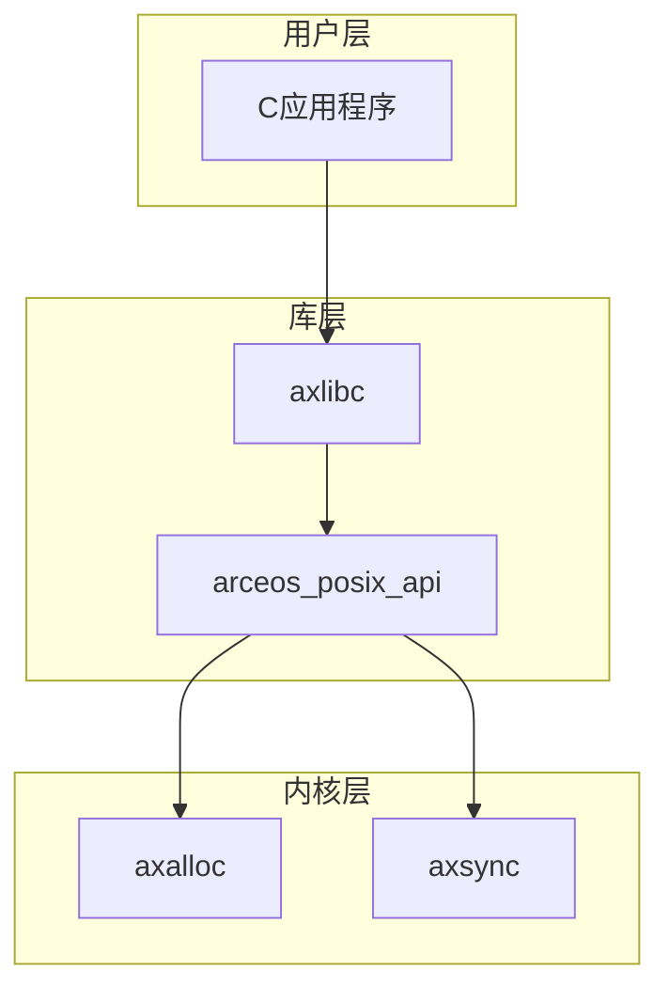
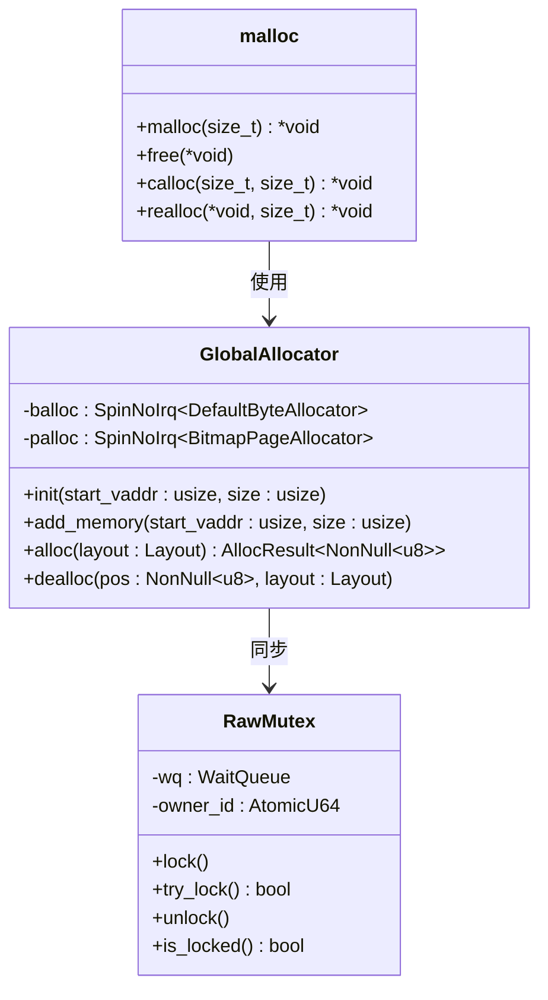
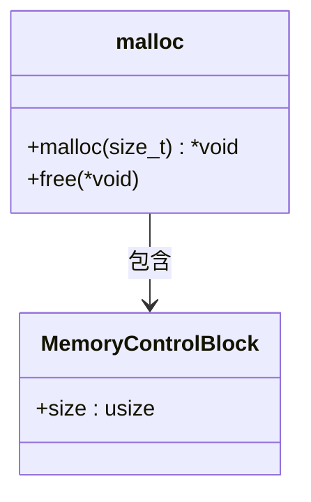
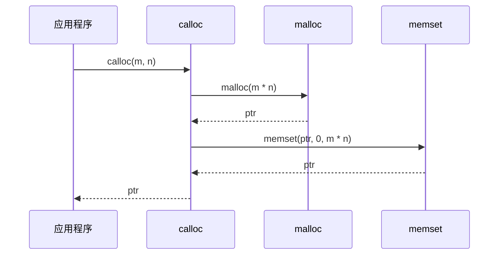
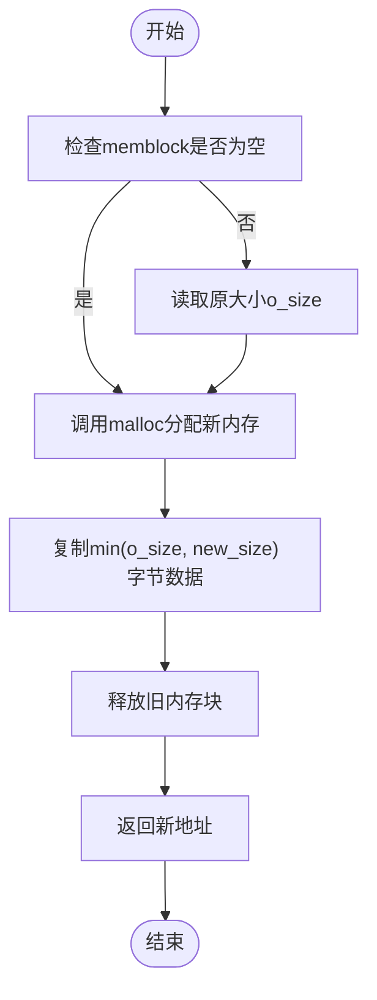

# 内存管理

<cite>
**本文档中引用的文件**
- [malloc.rs](file://ulib/axlibc/src/malloc.rs)
- [resources.rs](file://api/arceos_posix_api/src/imp/resources.rs)
- [lib.rs](file://modules/axalloc/src/lib.rs)
- [mutex.rs](file://modules/axsync/src/mutex.rs)
</cite>

## 目录
1. [简介](#简介)
2. [项目结构](#项目结构)
3. [核心组件](#核心组件)
4. [架构概述](#架构概述)
5. [详细组件分析](#详细组件分析)
6. [依赖关系分析](#依赖关系分析)
7. [性能考虑](#性能考虑)
8. [故障排除指南](#故障排除指南)
9. [结论](#结论)

## 简介
本文档深入解析了ArceOS操作系统中axlibc内存管理子系统的实现机制。重点分析了`malloc`、`calloc`、`realloc`和`free`等C标准库函数在no_std环境下的具体实现方式，以及它们如何与底层arceos_posix_api资源管理接口进行交互。文档还探讨了线程安全性保障措施及多任务并发调用时的锁竞争处理策略。

## 项目结构
该内存管理系统主要由以下几个模块构成：`axalloc`负责全局内存分配；`axlibc`提供C语言兼容的内存操作接口；`arceos_posix_api`封装POSIX标准系统调用；`axsync`则提供了同步原语支持。

**图示来源**
- [malloc.rs](file://ulib/axlibc/src/malloc.rs#L1-L56)
- [resources.rs](file://api/arceos_posix_api/src/imp/resources.rs#L1-L51)
- [lib.rs](file://modules/axalloc/src/lib.rs#L1-L325)
- [mutex.rs](file://modules/axsync/src/mutex.rs#L1-L150)

**本节来源**
- [malloc.rs](file://ulib/axlibc/src/malloc.rs#L1-L56)
- [resources.rs](file://api/arceos_posix_api/src/imp/resources.rs#L1-L51)

## 核心组件
axlibc内存管理子系统的核心在于其对动态内存分配的支持，通过结合Rust的`GlobalAlloc` trait与C风格API实现了高效且安全的内存管理机制。其中`malloc`和`free`函数直接映射到底层`axalloc`模块提供的功能，并利用TLSF（Two-Level Segregated Fit）算法优化小块内存分配效率。

**本节来源**
- [malloc.rs](file://ulib/axlibc/src/malloc.rs#L1-L56)
- [lib.rs](file://modules/axalloc/src/lib.rs#L1-L325)

## 架构概述
整个内存管理体系采用分层设计思想，上层为用户提供熟悉的C标准库接口，下层基于Rust生态系统中的成熟库构建高效的内存池管理和碎片整理能力。这种架构既保证了向后兼容性又充分发挥了现代编程语言的优势。

**图示来源**
- [malloc.rs](file://ulib/axlibc/src/malloc.rs#L1-L56)
- [lib.rs](file://modules/axalloc/src/lib.rs#L1-L325)
- [mutex.rs](file://modules/axsync/src/mutex.rs#L1-L150)

## 详细组件分析

### malloc函数分析
`malloc`函数用于分配指定大小的内存空间并返回指向该区域起始位置的指针。其实现细节包括维护一个控制块来记录实际分配尺寸以便后续释放操作能够正确执行。

#### 对象导向组件：

**图示来源**
- [malloc.rs](file://ulib/axlibc/src/malloc.rs#L1-L56)

**本节来源**
- [malloc.rs](file://ulib/axlibc/src/malloc.rs#L1-L56)

### calloc函数分析
`calloc`函数不仅完成内存分配工作还会自动将所分配区域初始化为零值，这在某些场景下可以避免显式清零步骤从而提高性能。

#### API/服务组件：

**图示来源**
- [stdlib.c](file://ulib/axlibc/c/stdlib.c#L21-L26)

**本节来源**
- [stdlib.c](file://ulib/axlibc/c/stdlib.c#L21-L26)

### realloc函数分析
当需要调整已分配内存块大小时可使用`realloc`函数。它会尝试扩展原有区域或重新分配更大空间并将旧数据复制过去，最后释放原始地址。

#### 复杂逻辑组件：

**图示来源**
- [stdlib.c](file://ulib/axlibc/c/stdlib.c#L28-L42)

**本节来源**
- [stdlib.c](file://ulib/axlibc/c/stdlib.c#L28-L42)

## 依赖关系分析
各关键模块之间存在紧密联系，如`axlibc`依赖于`axalloc`提供的基础分配能力，而后者又借助`axsync`确保并发访问的安全性。此外，所有这些都建立在`arceos_posix_api`所提供的抽象之上以实现跨平台一致性。

**图示来源**
- [Cargo.toml](file://modules/axalloc/Cargo.toml#L1-L26)
- [lib.rs](file://modules/axalloc/src/lib.rs#L1-L325)

**本节来源**
- [Cargo.toml](file://modules/axalloc/Cargo.toml#L1-L26)
- [lib.rs](file://modules/axalloc/src/lib.rs#L1-L325)

## 性能考虑
选择合适的内存分配器对于整体系统性能至关重要。当前配置默认启用TLSF算法，在处理大量小对象时表现出色。同时通过双层级设计有效减少了页级分配开销，使得长时间运行的应用程序也能保持良好响应速度。

## 故障排除指南
常见问题主要包括内存泄漏和越界访问。建议开发者充分利用工具链自带的检测机制定期审查代码质量。另外注意遵循RAII原则及时释放不再使用的资源以防累积导致耗尽可用内存。

**本节来源**
- [malloc.rs](file://ulib/axlibc/src/malloc.rs#L1-L56)
- [lib.rs](file://modules/axalloc/src/lib.rs#L1-L325)

## 结论
综上所述，ArceOS通过精心设计的内存管理体系成功地平衡了易用性与效率之间的矛盾。未来可通过引入更多高级特性进一步增强其实力，例如支持NUMA感知分配或者集成更先进的垃圾回收技术等。