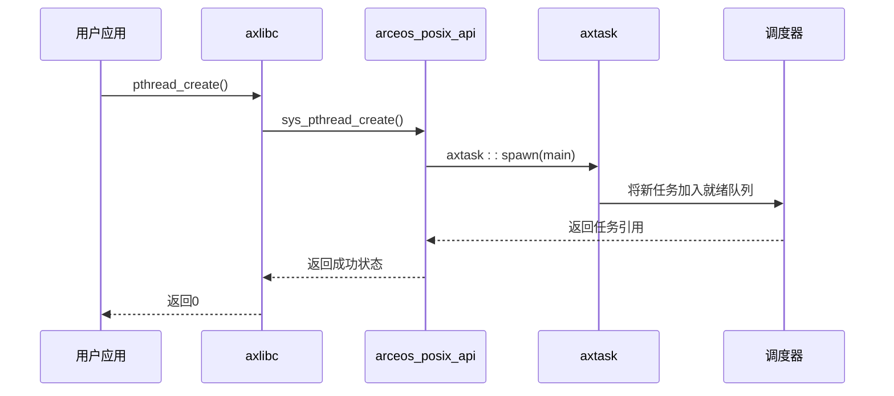
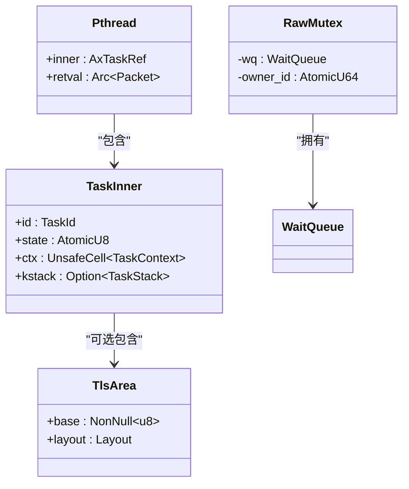
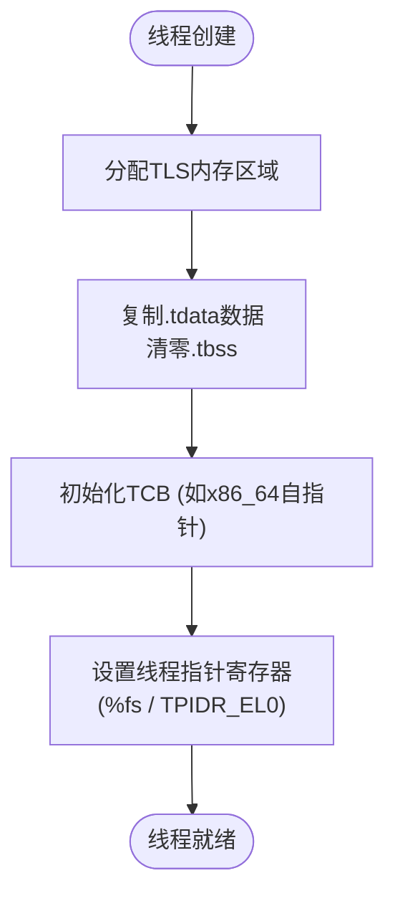

# 多线程支持

<cite>
**本文档引用的文件**
- [pthread.rs](file://ulib/axlibc/src/pthread.rs)
- [mod.rs](file://api/arceos_posix_api/src/imp/pthread/mod.rs)
- [task.rs](file://modules/axtask/src/task.rs)
- [mutex.rs](file://modules/axsync/src/mutex.rs)
- [tls.rs](file://modules/axhal/src/tls.rs)
</cite>

## 目录
1. [引言](#引言)
2. [核心组件分析](#核心组件分析)
3. [POSIX线程API实现细节](#posix线程api实现细节)
4. [线程生命周期管理](#线程生命周期管理)
5. [线程局部存储(TLS)机制](#线程局部存储tls机制)
6. [同步原语集成](#同步原语集成)
7. [栈空间分配与取消机制](#栈空间分配与取消机制)
8. [多线程编程最佳实践](#多线程编程最佳实践)

## 引言
本技术文档深入解析arceos操作系统中axlibc库的多线程支持模块。重点阐述POSIX线程API（如`pthread_create`、`pthread_join`、`pthread_mutex_lock`）在底层的实现原理，以及它们如何与内核级任务调度器(axtask)和同步原语(axsync)进行深度集成。文档还将详细说明线程局部存储(TLS)的实现机制，特别是对errno等全局变量的线程隔离保障，并提供混合使用Rust原生线程模型与C风格pthread时的最佳实践建议。

## 核心组件分析

该模块的核心由多个协同工作的组件构成：用户态的`axlibc`提供标准C接口，`arceos_posix_api`作为中间层将POSIX调用转换为内部表示，`axtask`负责内核级的任务创建、调度和生命周期管理，`axsync`提供基础的同步原语，而`axhal`则处理硬件相关的TLS设置。

**Section sources**
- [pthread.rs](file://ulib/axlibc/src/pthread.rs#L0-L59)
- [mod.rs](file://api/arceos_posix_api/src/imp/pthread/mod.rs#L0-L154)
- [task.rs](file://modules/axtask/src/task.rs#L0-L555)
- [mutex.rs](file://modules/axsync/src/mutex.rs#L0-L150)
- [tls.rs](file://modules/axhal/src/tls.rs#L0-L181)

## POSIX线程API实现细节

### pthread_create 实现流程
`pthread_create`函数是创建新线程的入口点。其工作流程如下：
1.  用户程序调用`pthread_create`。
2.  调用进入`axlibc`中的包装函数，该函数进一步调用`arceos_posix_api`提供的`sys_pthread_create`系统调用。
3.  `sys_pthread_create`通过`Pthread::create`方法，在内部创建一个`Pthread`结构体。
4.  该方法利用`axtask::spawn`创建一个新的内核任务(`AxTaskRef`)，并将用户提供的线程入口函数`start_routine`包装成一个闭包。
5.  新任务被加入到调度器的就绪队列中等待执行。
6.  创建成功后，指向`Pthread`结构体的指针被写入`res`参数，并返回0。

**Diagram sources**
- [pthread.rs](file://ulib/axlibc/src/pthread.rs#L15-L25)
- [mod.rs](file://api/arceos_posix_api/src/imp/pthread/mod.rs#L60-L90)
- [task.rs](file://modules/axtask/src/task.rs#L100-L150)

### pthread_join 实现机制
`pthread_join`用于等待指定线程的结束并获取其返回值。
1.  调用`sys_pthread_join`，传入目标线程的`pthread_t`句柄。
2.  系统通过全局映射`TID_TO_PTHREAD`查找对应的`Pthread`结构体。
3.  调用`Pthread::join`方法，该方法会检查是否试图连接自身以避免死锁。
4.  调用内核任务的`join()`方法，该方法会使当前线程阻塞，直到目标线程退出。
5.  目标线程退出后，从`Packet`结构中读取返回值，并将其写入`retval`参数。
6.  最后，从全局映射中移除已终止线程的记录并释放资源。

**Section sources**
- [pthread.rs](file://ulib/axlibc/src/pthread.rs#L35-L40)
- [mod.rs](file://api/arceos_posix_api/src/imp/pthread/mod.rs#L120-L140)

### pthread_mutex_lock 集成分析
`pthread_mutex_lock`的实现依赖于`axsync`模块提供的`RawMutex`。
1.  `pthread_mutex_lock`调用`sys_pthread_mutex_lock`。
2.  后者直接调用`axsync::RawMutex`的`lock()`方法。
3.  `RawMutex`使用原子操作尝试将`owner_id`从0（未锁定）更新为当前任务的ID。
4.  如果失败（表明已被其他线程持有），当前线程会被放入`WaitQueue`并阻塞，直到互斥锁被释放。
5.  当持有锁的线程调用`unlock`时，它会将`owner_id`重置为0，并唤醒等待队列中的一个线程。

**Diagram sources**
- [pthread.rs](file://ulib/axlibc/src/pthread.rs#L45-L50)
- [mod.rs](file://api/arceos_posix_api/src/imp/pthread/mod.rs#L145-L150)
- [mutex.rs](file://modules/axsync/src/mutex.rs#L10-L50)

## 线程生命周期管理

线程的生命周期由`axtask`模块精确控制。每个线程对应一个`TaskInner`结构体，其状态通过`AtomicU8`原子地在`Running`、`Ready`、`Blocked`和`Exited`之间转换。

- **创建**: `pthread_create`最终调用`TaskInner::new`，分配内核栈(`TaskStack`)，初始化任务上下文(`TaskContext`)，并将其状态设为`Ready`。
- **运行**: 调度器选择就绪任务，通过`task_entry`函数切换上下文开始执行。
- **退出**: `pthread_exit`调用`Pthread::exit_current`，设置返回值后调用`axtask::exit(0)`。这会将任务状态改为`Exited`，并通知所有等待该线程的`wait_for_exit`队列。
- **清理**: 当最后一个对`AxTaskRef`的引用被释放时，`TaskInner`的`Drop`实现会被调用，完成资源回收。

**Section sources**
- [mod.rs](file://api/arceos_posix_api/src/imp/pthread/mod.rs#L100-L120)
- [task.rs](file://modules/axtask/src/task.rs#L50-L100)

## 线程局部存储(TLS)机制

TLS机制确保了像`errno`这样的全局变量在多线程环境下的安全访问，每个线程都拥有自己独立的副本。

### 实现原理
1.  **内存布局**: `TlsArea`结构体代表每个线程的TLS区域。其大小和布局根据架构（x86_64, AArch64, RISC-V）有所不同。
2.  **静态数据复制**: 在`TlsArea::alloc()`中，`.tdata`段的数据从加载地址复制到新分配的TLS区域，`.tbss`段则被清零。
3.  **TCB初始化**: 对于x86_64，会在TCB末尾写入一个指向自身的指针，这是ABI的要求。
4.  **硬件寄存器设置**: 当新线程首次被调度时，`CurrentTask::init_current`会调用`axhal::asm::write_thread_pointer`，将`tls_ptr()`的值写入CPU的线程指针寄存器（如x86_64的`%fs`或AArch64的`TPIDR_EL0`）。

### errno隔离
当C库需要访问`errno`时，编译器生成的代码会通过线程指针寄存器来寻址。由于每个线程的寄存器指向不同的TLS区域，因此对`errno`的读写操作自然地隔离到了各自的内存空间，从而实现了线程安全。

**Diagram sources**
- [tls.rs](file://modules/axhal/src/tls.rs#L50-L150)
- [task.rs](file://modules/axtask/src/task.rs#L200-L220)

## 同步原语集成

`axlibc`的`pthread_mutex_t`被设计为与`axsync::RawMutex`兼容。这种集成方式使得用户态的POSIX互斥锁能够直接复用内核提供的高效、可靠的同步机制。

- **轻量级封装**: `pthread_mutex_lock`等函数只是对`axsync::RawMutex`相应方法的简单封装，几乎没有额外开销。
- **基于任务的阻塞**: `RawMutex`的`WaitQueue`直接操作`AxTaskRef`，当线程因锁争用而阻塞时，整个内核任务都会被挂起，这与`axtask`的调度模型完美契合。
- **所有权跟踪**: `RawMutex`通过`owner_id`原子地记录当前持有者的任务ID，这在调试死锁或非法解锁时非常有用。

**Section sources**
- [mutex.rs](file://modules/axsync/src/mutex.rs#L10-L100)
- [mod.rs](file://api/arceos_posix_api/src/imp/pthread/mod.rs#L145-L150)

## 栈空间分配与取消机制

### 栈空间分配
每个线程的内核栈在`TaskInner::new`中通过`TaskStack::alloc`分配。该函数使用`alloc::alloc::alloc`从堆上分配指定大小（默认对齐到4KB）的内存块。栈顶地址被用来初始化`TaskContext`，以便在任务切换时正确设置堆栈指针。

### 取消机制
当前代码库中并未实现完整的`pthread_cancel`机制。线程的正常终止完全依赖于`pthread_exit`或从线程函数中`return`。这意味着线程是协作式取消的，没有强制中断其他线程执行的能力。这是一个重要的