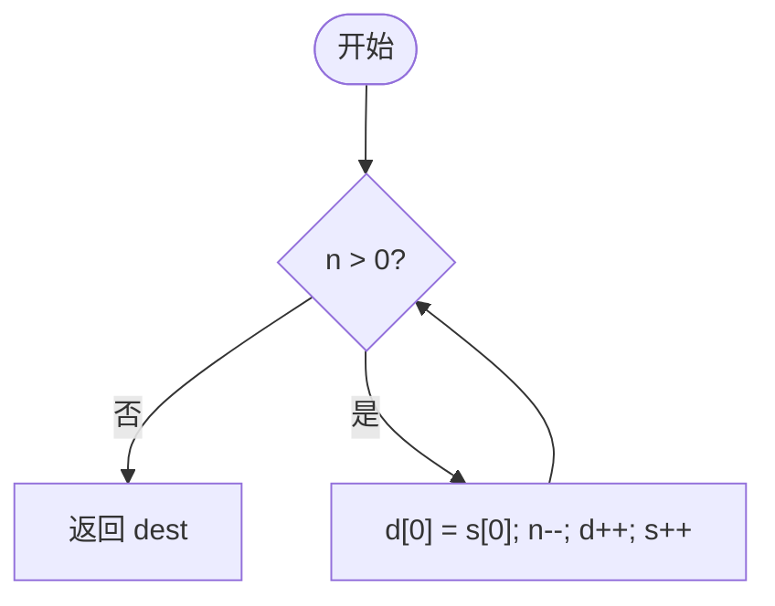

# 字符串与数学函数

<cite>
**本文档引用的文件**
- [string.c](file://ulib/axlibc/c/string.c)
- [math.c](file://ulib/axlibc/c/math.c)
- [pow.c](file://ulib/axlibc/c/pow.c)
- [string.h](file://ulib/axlibc/include/string.h)
- [math.h](file://ulib/axlibc/include/math.h)
- [libm.h](file://ulib/axlibc/c/libm.h)
</cite>

## 目录
1. [引言](#引言)
2. [字符串操作函数](#字符串操作函数)
3. [内存操作函数](#内存操作函数)
4. [数学计算函数](#数学计算函数)
5. [浮点运算与硬件协同](#浮点运算与硬件协同)
6. [无副作用特性与异常处理](#无副作用特性与异常处理)

## 引言
本参考文档系统性地介绍 axlibc 库中核心的字符串处理和数学计算函数。重点阐述 `strcpy`、`strcat`、`strcmp`、`strlen` 等字符串操作函数的实现机制，以及 `memcpy`、`memmove` 等内存操作函数的优化策略。同时，详述 `sin`、`cos`、`sqrt`、`pow` 等数学函数的算法基础和精度控制，并分析这些纯计算函数在嵌入式环境下的性能表现。

**Section sources**
- [string.h](file://ulib/axlibc/include/string.h#L0-L50)
- [math.h](file://ulib/axlibc/include/math.h#L0-L321)

## 字符串操作函数

### strcpy 函数
`strcpy` 函数用于将源字符串复制到目标缓冲区。该函数通过指针遍历的方式逐字节复制，直到遇到源字符串的结束符 `\0`。其核心实现不包含边界检查，调用者必须确保目标缓冲区有足够的空间以避免溢出。

**Section sources**
- [string.c](file://ulib/axlibc/c/string.c#L87-L92)
- [string.h](file://ulib/axlibc/include/string.h#L13)

### strcat 函数
`strcat` 函数用于将一个字符串追加到另一个字符串的末尾。其实现依赖于 `strlen` 和 `strcpy` 函数，首先计算目标字符串的长度以定位末尾，然后从该位置开始执行复制操作。

**Section sources**
- [string.c](file://ulib/axlibc/c/string.c#L101-L105)
- [string.h](file://ulib/axlibc/include/string.h#L16)

### strcmp 函数
`strcmp` 函数用于比较两个字符串的大小。它按字典序逐字符进行比较，返回值表示两字符串的相对顺序。比较过程对每个字符强制转换为 `unsigned char` 以保证结果的一致性。

**Section sources**
- [string.c](file://ulib/axlibc/c/string.c#L116-L121)
- [string.h](file://ulib/axlibc/include/string.h#L19)

### strlen 函数
`strlen` 函数用于计算字符串的长度（不包括终止符 `\0`）。其实现简单高效，通过一个指针从起始位置开始递增，直到找到 `\0`，然后返回起始位置与当前指针之间的偏移量。

**Section sources**
- [string.c](file://ulib/axlibc/c/string.c#L7-L13)
- [string.h](file://ulib/axlibc/include/string.h#L10)

## 内存操作函数

### memcpy 函数
`memcpy` 函数用于在内存块之间进行数据复制。其标准实现采用逐字节拷贝的方式，适用于非重叠的内存区域。该函数不处理内存重叠的情况，对于此类场景应使用 `memmove`。

**Diagram sources**
- [string.c](file://ulib/axlibc/c/string.c#L236-L242)

**Section sources**
- [string.c](file://ulib/axlibc/c/string.c#L236-L242)
- [string.h](file://ulib/axlibc/include/string.h#L41)

### memmove 函数
`memmove` 函数是 `memcpy` 的安全版本，能够正确处理源地址和目标地址存在重叠的情况。其实现通过判断源和目标的相对位置来决定复制方向：当目标地址低于源地址时，从前向后复制；否则，从后向前复制，从而避免数据覆盖问题。

**Section sources**
- [string.c](file://ulib/axlibc/c/string.c#L244-L261)
- [string.h](file://ulib/axlibc/include/string.h#L43)

## 数学计算函数

### sin 和 cos 函数
`sin` 和 `cos` 函数分别用于计算角度的正弦和余弦值。根据代码分析，这些函数的实现目前标记为 `unimplemented()`，表明在当前库版本中尚未提供具体算法。通常，这类函数会基于泰勒级数展开或查表法结合插值技术来实现。

**Section sources**
- [math.c](file://ulib/axlibc/c/math.c#L182-L186)
- [math.c](file://ulib/axlibc/c/math.c#L151-L155)
- [math.h](file://ulib/axlibc/include/math.h#L290)
- [math.h](file://ulib/axlibc/include/math.h#L130)

### sqrt 函数
`sqrt` 函数用于计算一个数的平方根。与 `sin` 和 `cos` 类似，其当前实现也为空桩（stub），返回 0。高效的平方根算法通常采用牛顿迭代法或二分法，在嵌入式环境中可能还会利用硬件加速单元。

**Section sources**
- [math.c](file://ulib/axlibc/c/math.c#L127-L131)
- [math.h](file://ulib/axlibc/include/math.h#L298)

### pow 函数
`pow` 函数用于计算幂运算（x^y）。其完整实现位于 `pow.c` 文件中，采用了基于对数和指数变换的通用算法：`x^y = exp(y * log(x))`。该实现包含了对各种特殊情况（如无穷大、零、负数底数等）的详细处理，并利用了预计算的查找表来优化 `log` 函数的性能。

**Section sources**
- [pow.c](file://ulib/axlibc/c/pow.c#L730-L813)
- [math.h](file://ulib/axlibc/include/math.h#L262)

## 浮点运算与硬件协同

### FPU 协同工作
axlibc 中的数学函数仅在定义了 `AX_CONFIG_FP_SIMD` 宏时才被编译。这表明库的设计考虑到了硬件浮点单元（FPU）的存在与否。当 FPU 可用时，函数可以利用硬件指令集（如 SIMD）进行加速；而在没有 FPU 的嵌入式系统上，这些函数可能不会被链接，或者需要由其他库提供软件实现。

**Section sources**
- [math.h](file://ulib/axlibc/include/math.h#L2)
- [math.c](file://ulib/axlibc/c/math.c#L1)

### 向量化操作
虽然当前代码未直接展示向量化操作，但 `AX_CONFIG_FP_SIMD` 宏的存在暗示了未来支持的可能性。向量化操作能显著提升批量数学运算的性能，尤其是在信号处理或图形计算等场景中。

## 无副作用特性与异常处理

### 无副作用函数
axlibc 中的字符串和数学函数被设计为纯计算函数，即它们只依赖于输入参数并产生确定的输出，不会修改全局状态或产生外部可见的副作用。这种特性使得函数易于测试、推理和优化。

### 浮点异常处理
数学函数的实现通过 `libm.h` 头文件中的宏（如 `FORCE_EVAL` 和 `fp_force_eval`）来管理浮点环境（fenv）的副作用。例如，`__math_invalid` 函数通过 `(x - x) / (x - x)` 这种表达式来生成 NaN 并触发相应的浮点异常，实现了对无效操作的标准化错误处理。

**Section sources**
- [libm.h](file://ulib/axlibc/c/libm.h#L0-L233)
- [math.c](file://ulib/axlibc/c/math.c#L0-L35)