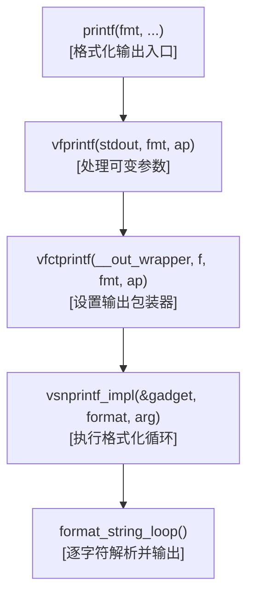
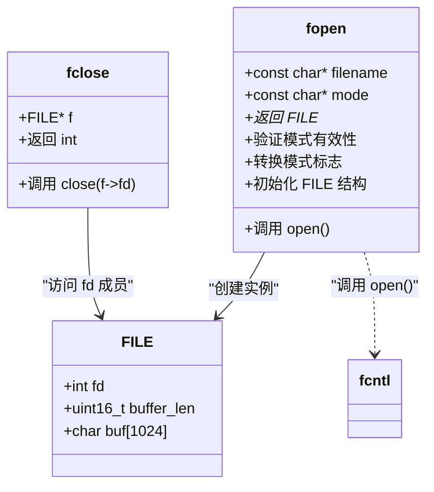
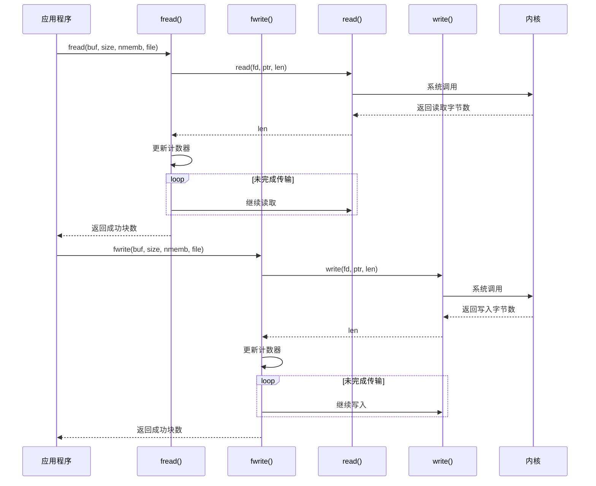
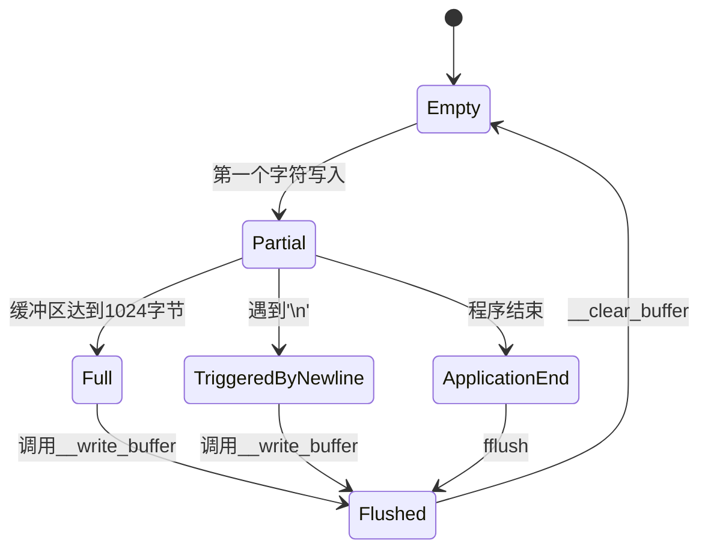
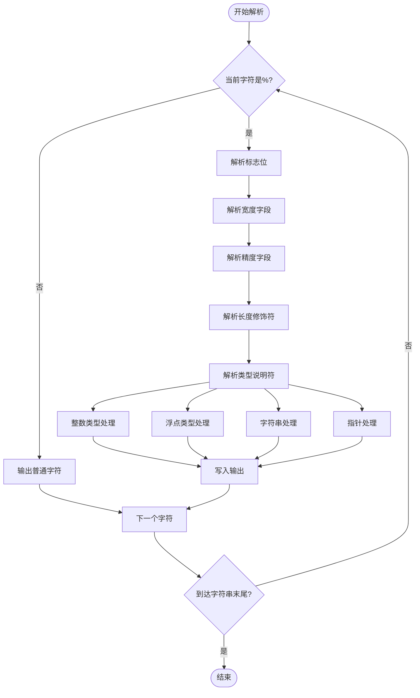
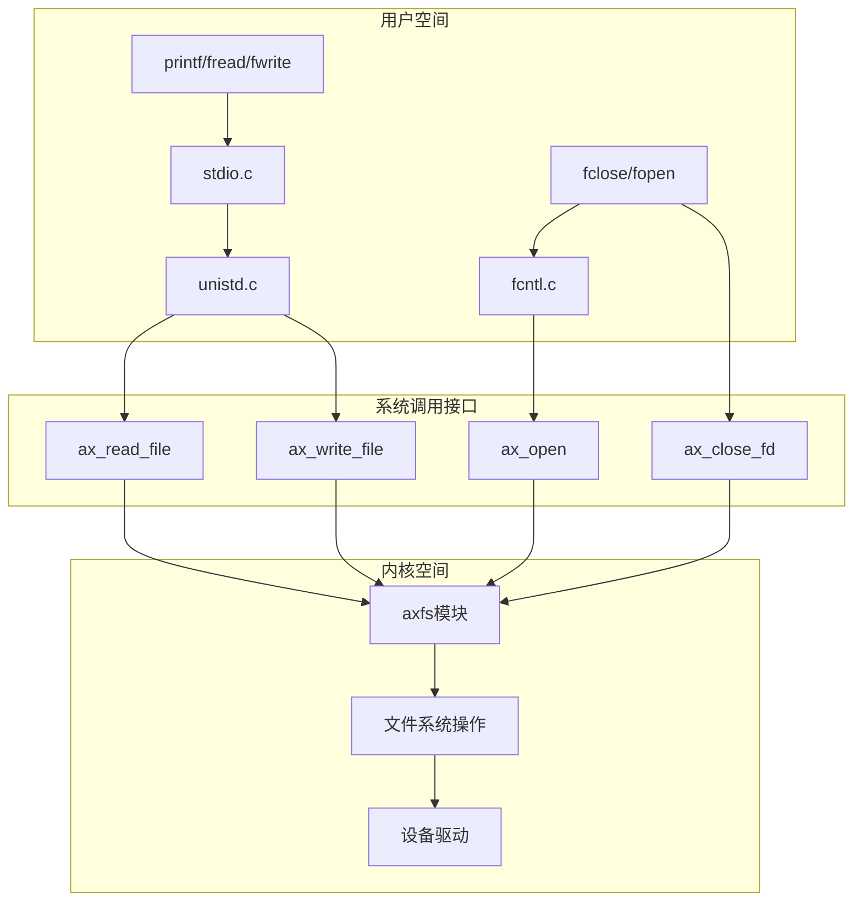

# 标准I/O与文件操作

<cite>
**本文档引用的文件**  
- [stdio.c](file://ulib/axlibc/c/stdio.c)
- [printf.c](file://ulib/axlibc/c/printf.c)
- [fcntl.c](file://ulib/axlibc/c/fcntl.c)
- [stdio.h](file://ulib/axlibc/include/stdio.h)
- [unistd.h](file://ulib/axlibc/include/unistd.h)
- [fcntl.h](file://ulib/axlibc/include/fcntl.h)
- [axfs模块](file://modules/axfs/src/lib.rs)
</cite>

## 目录
1. [引言](#引言)
2. [核心函数工作机制](#核心函数工作机制)
3. [缓冲区管理策略](#缓冲区管理策略)
4. [格式化字符串解析与安全检查](#格式化字符串解析与安全检查)
5. [系统调用与内核通信机制](#系统调用与内核通信机制)
6. [典型使用场景与代码示例](#典型使用场景与代码示例)
7. [同步与异步I/O行为差异](#同步与异步i/o行为差异)
8. [性能优化建议](#性能优化建议)

## 引言
本文档全面阐述arceos操作系统中axlibc标准I/O子系统的实现机制。重点分析`printf`、`scanf`、`fopen`、`fclose`、`fread`、`fwrite`等核心C库函数的内部工作原理，深入探讨其缓冲区管理策略、格式化字符串处理逻辑以及与底层文件系统模块（axfs）的交互方式。通过详细的技术剖析和实际代码示例，为开发者提供完整的参考指南。

## 核心函数工作机制

### printf函数链式调用流程
`printf`函数通过一系列封装调用最终完成输出任务。其调用链为：`printf` → `vfprintf` → `vfctprintf` → `vsnprintf_impl`，实现了从可变参数到格式化输出的完整转换过程。



**图示来源**
- [stdio.c](file://ulib/axlibc/c/stdio.c#L142-L150)
- [stdio.c](file://ulib/axlibc/c/stdio.c#L162-L165)
- [printf.c](file://ulib/axlibc/c/printf.c#L1440-L1445)
- [printf.c](file://ulib/axlibc/c/printf.c#L1077-L1405)

**本节来源**
- [stdio.c](file://ulib/axlibc/c/stdio.c#L142-L150)
- [stdio.c](file://ulib/axlibc/c/stdio.c#L162-L165)
- [printf.c](file://ulib/axlibc/c/printf.c#L1440-L1445)

### 文件打开与关闭机制
`fopen`函数负责创建FILE结构体并初始化文件描述符，而`fclose`则简单地调用`close`系统调用来释放资源。



**图示来源**
- [stdio.c](file://ulib/axlibc/c/stdio.c#L198-L218)
- [stdio.c](file://ulib/axlibc/c/stdio.c#L278-L281)
- [stdio.h](file://ulib/axlibc/include/stdio.h#L18-L18)

**本节来源**
- [stdio.c](file://ulib/axlibc/c/stdio.c#L198-L218)
- [stdio.c](file://ulib/axlibc/c/stdio.c#L278-L281)

### 数据读写操作实现
`fread`和`fwrite`函数直接基于底层`read`和`write`系统调用实现，采用循环读写机制确保尽可能多地传输数据。



**图示来源**
- [stdio.c](file://ulib/axlibc/c/stdio.c#L244-L256)
- [stdio.c](file://ulib/axlibc/c/stdio.c#L258-L270)
- [unistd.h](file://ulib/axlibc/include/unistd.h#L28-L29)

**本节来源**
- [stdio.c](file://ulib/axlibc/c/stdio.c#L244-L256)
- [stdio.c](file://ulib/axlibc/c/stdio.c#L258-L270)

## 缓冲区管理策略

### 缓冲区结构与触发条件
axlibc实现了基于固定大小缓冲区（1024字节）的行缓冲机制。当缓冲区满或遇到换行符时触发实际写入操作。



**图示来源**
- [stdio.c](file://ulib/axlibc/c/stdio.c#L56-L73)
- [stdio.c](file://ulib/axlibc/c/stdio.c#L34-L41)
- [stdio.c](file://ulib/axlibc/c/stdio.c#L44-L47)

**本节来源**
- [stdio.c](file://ulib/axlibc/c/stdio.c#L56-L73)

### 缓冲区操作函数
缓冲区的核心操作由`__write_buffer`和`__clear_buffer`两个静态函数完成，分别负责将数据提交到底层和清空缓冲区状态。

```c
static int __write_buffer(FILE *f) {
    if (f->buffer_len == 0) return 0;
    return write(f->fd, f->buf, f->buffer_len);
}

static void __clear_buffer(FILE *f) {
    f->buffer_len = 0;
}
```

**本节来源**
- [stdio.c](file://ulib/axlibc/c/stdio.c#L34-L47)

## 格式化字符串解析与安全检查

### 格式化字符串解析流程
`format_string_loop`函数是格式化字符串处理的核心，它逐字符扫描输入字符串，并在遇到'%'时启动格式说明符解析。



**图示来源**
- [printf.c](file://ulib/axlibc/c/printf.c#L1077-L1405)

**本节来源**
- [printf.c](file://ulib/axlibc/c/printf.c#L1077-L1405)

### 安全性保障措施
系统通过以下机制防止常见的格式化字符串漏洞：
1. 使用`va_list`安全访问可变参数
2. 在`s`说明符中对NULL指针进行特殊处理
3. 对字符串长度进行边界检查
4. 不支持可能导致任意写入的`%n`说明符（默认禁用）

```c
case 's': {
    const char *p = va_arg(args, char *);
    if (p == NULL) {
        out_rev_(output, ")llun(", 6, width, flags); // 安全显示null
    } else {
        printf_size_t l = strnlen_s_(p, precision ? precision : MAX_SIZE);
        ...
    }
}
```

**本节来源**
- [printf.c](file://ulib/axlibc/c/printf.c#L1077-L1405)

## 系统调用与内核通信机制

### 用户态到内核态调用链
标准I/O函数通过fd_ops接口与axfs文件系统模块通信，形成清晰的调用层次。



**图示来源**
- [fcntl.c](file://ulib/axlibc/c/fcntl.c#L2