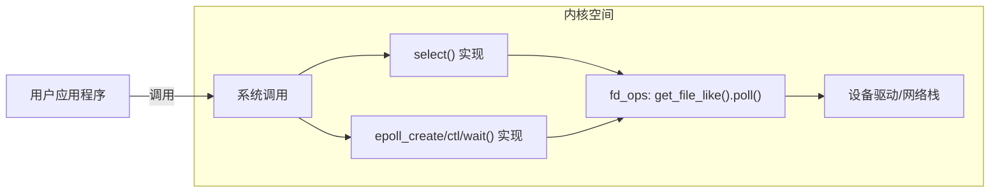
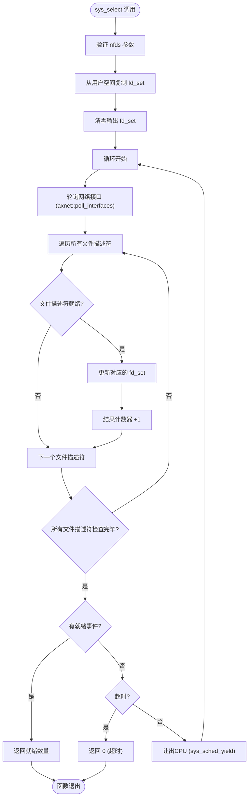
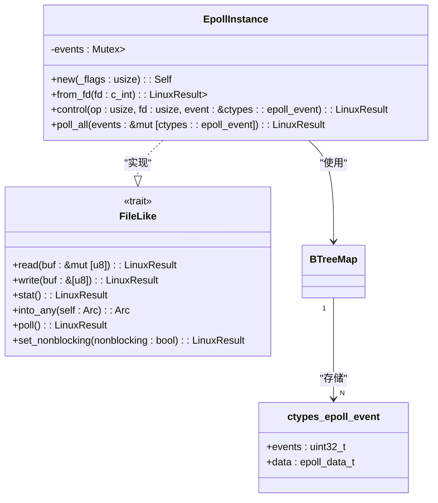

# I/O多路复用机制

<cite>
**本文档引用的文件**
- [mod.rs](file://api/arceos_posix_api/src/imp/io_mpx/mod.rs)
- [select.rs](file://api/arceos_posix_api/src/imp/io_mpx/select.rs)
- [epoll.rs](file://api/arceos_posix_api/src/imp/io_mpx/epoll.rs)
- [sys/select.h](file://ulib/axlibc/include/sys/select.h)
- [sys/epoll.h](file://ulib/axlibc/include/sys/epoll.h)
</cite>

## 目录
1. [引言](#引言)
2. [项目结构](#项目结构)
3. [核心组件](#核心组件)
4. [架构概述](#架构概述)
5. [详细组件分析](#详细组件分析)
6. [依赖分析](#依赖分析)
7. [性能考量](#性能考量)
8. [故障排除指南](#故障排除指南)
9. [结论](#结论)

## 引言
本文档深入分析了ArceOS操作系统中实现的I/O多路复用机制，重点研究`select`和`epoll`两种POSIX标准下的事件通知机制。基于`io_mpx`模块中的Rust源码，文档将详细阐述事件监听、就绪判断和回调触发的核心流程。通过对比两种机制在性能、可扩展性和使用场景上的差异，并结合C语言示例，为构建高性能网络服务提供指导。

## 项目结构
`io_mpx`目录位于`api/arceos_posix_api/src/imp/`路径下，是POSIX I/O多路复用API的具体实现模块。该模块包含三个主要文件：`mod.rs`作为模块入口，定义了对外暴露的系统调用接口；`select.rs`实现了传统的`select`系统调用；`epoll.rs`则实现了更高效的`epoll`系列系统调用。

```mermaid
graph TD
subgraph "I/O 多路复用模块"
mod_rs[mod.rs]
select_rs[select.rs]
epoll_rs[epoll.rs]
end
mod_rs --> select_rs : "条件编译引用"
mod_rs --> epoll_rs : "条件编译引用"
select_rs --> fd_ops["fd_ops.rs (文件描述符操作)"]
epoll_rs --> fd_ops
epoll_rs --> BTreeMap["BTreeMap (事件存储)"]
```

**Diagram sources**
- [mod.rs](file://api/arceos_posix_api/src/imp/io_mpx/mod.rs#L1-L16)
- [select.rs](file://api/arceos_posix_api/src/imp/io_mpx/select.rs#L1-L165)
- [epoll.rs](file://api/arceos_posix_api/src/imp/io_mpx/epoll.rs#L1-L205)

**Section sources**
- [mod.rs](file://api/arceos_posix_api/src/imp/io_mpx/mod.rs#L1-L16)

## 核心组件
本模块的核心在于`select`和`epoll`两种I/O事件监控机制的实现。`select`通过位图（bitmask）管理文件描述符集合，适用于小规模并发场景；而`epoll`采用红黑树和就绪列表的组合，能够高效处理大规模并发连接，是现代高性能服务器的首选方案。两者均通过`fd_ops`模块与底层文件描述符进行交互，获取其I/O状态。

**Section sources**
- [select.rs](file://api/arceos_posix_api/src/imp/io_mpx/select.rs#L1-L165)
- [epoll.rs](file://api/arceos_posix_api/src/imp/io_mpx/epoll.rs#L1-L205)

## 架构概述
整个I/O多路复用系统的架构围绕着文件描述符的状态查询展开。用户程序通过系统调用注册感兴趣的文件描述符及其事件类型。内核模块（即本`io_mpx`模块）负责周期性地轮询这些文件描述符的实际状态，并在有事件就绪时唤醒等待的进程。`select`和`epoll`代表了两种不同的轮询策略和数据结构设计。



**Diagram sources**
- [select.rs](file://api/arceos_posix_api/src/imp/io_mpx/select.rs#L121-L165)
- [epoll.rs](file://api/arceos_posix_api/src/imp/io_mpx/epoll.rs#L144-L204)
- [fd_ops.rs](file://api/arceos_posix_api/src/imp/fd_ops.rs#L1-L139)

## 详细组件分析

### select 机制分析
`select`机制的实现遵循经典的POSIX规范。它使用一个固定大小的位图（`FD_SETSIZE=1024`）来表示文件描述符集合。当用户调用`sys_select`时，内核会复制传入的读、写、异常三个位图，并遍历所有被标记的文件描述符，逐一调用`get_file_like(fd)?.poll()`检查其状态。

#### select 系统调用流程


**Diagram sources**
- [select.rs](file://api/arceos_posix_api/src/imp/io_mpx/select.rs#L121-L165)

**Section sources**
- [select.rs](file://api/arceos_posix_api/src/imp/io_mpx/select.rs#L1-L165)
- [sys/select.h](file://ulib/axlibc/include/sys/select.h#L1-L36)

### epoll 机制分析
`epoll`机制的设计旨在解决`select`的性能瓶颈。它不采用每次调用都传递整个文件描述符集合的方式，而是引入了一个“epoll实例”（`EpollInstance`），通过`epoll_ctl`对这个实例进行增删改查操作，从而维护一个长期存在的事件注册表。

#### epoll 核心数据结构


**Diagram sources**
- [epoll.rs](file://api/arceos_posix_api/src/imp/io_mpx/epoll.rs#L44-L114)

#### epoll 工作流程
```mermaid
sequenceDiagram
participant App as 用户应用
participant Syscall as sys_epoll_wait
participant Instance as EpollInstance
participant FdOps as get_file_like.poll()
App->>Syscall : epoll_wait(epfd, events, maxevents, timeout)
Syscall->>Instance : from_fd(epfd)
loop 每次循环
Syscall->>FdOps : axnet : : poll_interfaces()
Syscall->>Instance : poll_all(events)
Instance->>Instance : 遍历 events 映射
loop 每个注册的 fd
Instance->>FdOps : get_file_like(fd).poll()
alt 就绪
FdOps-->>Instance : 返回 readable/writable
Instance->>Instance : 检查事件掩码
Instance->>events : 填充就绪事件
else 错误
Instance->>events : 填充 EPOLLERR 事件
end
end
alt 有事件就绪
Instance-->>Syscall : 返回事件数量
Syscall-->>App : 返回就绪数量
break 退出循环
else 超时
Syscall->>Syscall : 检查 deadline
alt 超时
Syscall-->>App : 返回 0
break 退出循环
else 未超时
Syscall->>Syscall : sys_sched_yield()
end
end
end
```

**Diagram sources**
- [epoll.rs](file://api/arceos_posix_api/src/imp/io_mpx/epoll.rs#L181-L204)

**Section sources**
- [epoll.rs](file://api/arceos_posix_api/src/imp/io_mpx/epoll.rs#L1-L205)
- [sys/epoll.h](file://ulib/axlibc/include/sys/epoll.h#L1-L60)

## 依赖分析
`io_mpx`模块高度依赖于`fd_ops`模块提供的抽象。`get_file_like`和`add_file_like`函数是连接上层I/O多路复用逻辑与底层具体文件或设备的关键桥梁。此外，`epoll`的实现利用了`alloc::collections::BTreeMap`来高效地存储和查找