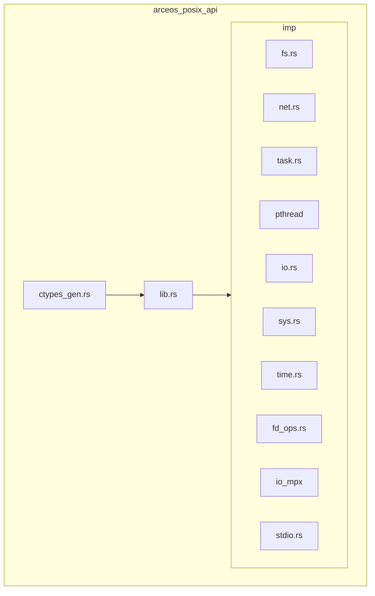
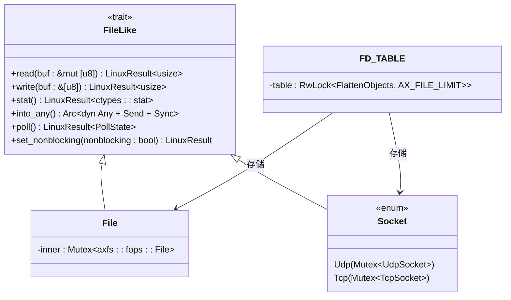
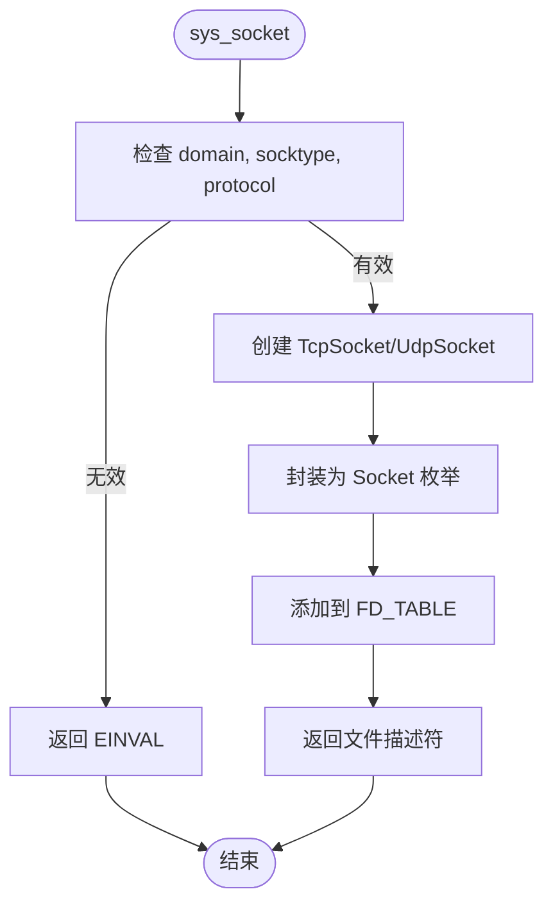
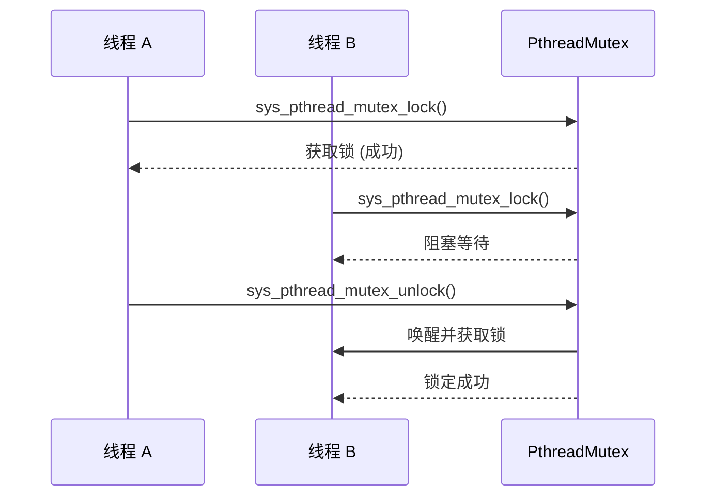
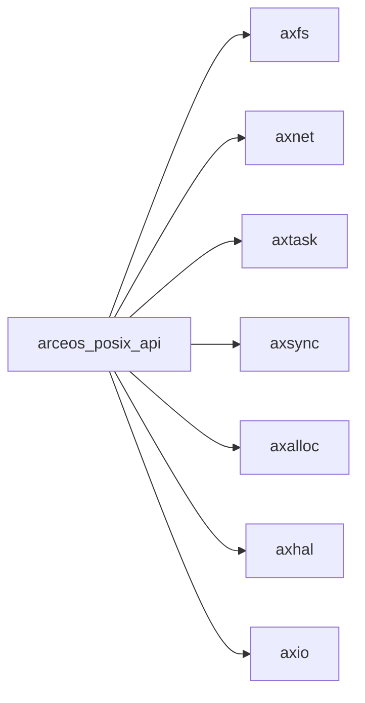

# POSIX API接口

<cite>
**本文档引用的文件**
- [fs.rs](file://api/arceos_posix_api/src/imp/fs.rs)
- [net.rs](file://api/arceos_posix_api/src/imp/net.rs)
- [task.rs](file://api/arceos_posix_api/src/imp/task.rs)
- [pthread/mutex.rs](file://api/arceos_posix_api/src/imp/pthread/mutex.rs)
- [io.rs](file://api/arceos_posix_api/src/imp/io.rs)
- [sys.rs](file://api/arceos_posix_api/src/imp/sys.rs)
- [time.rs](file://api/arceos_posix_api/src/imp/time.rs)
- [fd_ops.rs](file://api/arceos_posix_api/src/imp/fd_ops.rs)
- [io_mpx/select.rs](file://api/arceos_posix_api/src/imp/io_mpx/select.rs)
- [io_mpx/epoll.rs](file://api/arceos_posix_api/src/imp/io_mpx/epoll.rs)
- [stdio.rs](file://api/arceos_posix_api/src/imp/stdio.rs)
- [ctypes_gen.rs](file://api/arceos_posix_api/src/ctypes_gen.rs)
</cite>

## 目录
1. [简介](#简介)
2. [项目结构](#项目结构)
3. [核心组件](#核心组件)
4. [架构概述](#架构概述)
5. [详细组件分析](#详细组件分析)
6. [依赖分析](#依赖分析)
7. [性能考虑](#性能考虑)
8. [故障排除指南](#故障排除指南)
9. [结论](#结论)

## 简介
ArceOS是一个单体内核操作系统，其`arceos_posix_api`模块为应用程序提供了POSIX兼容的系统调用接口。该文档旨在全面说明此API的实现细节，涵盖文件操作、网络编程、进程与线程管理等核心功能。通过分析`src/imp`目录下的具体实现，我们将解释每个系统调用的行为、参数约束和返回值语义，并与传统Linux系统调用进行对比，阐明为适应单体内核架构所做的调整。

## 项目结构
`arceos_posix_api`模块位于`api/arceos_posix_api`目录下，其核心实现在`src/imp`子目录中。该模块通过Rust代码实现了标准的C语言POSIX API，使得使用C语言编写的程序可以无缝地在ArceOS上运行。主要功能模块包括文件系统（fs.rs）、网络（net.rs）、任务调度（task.rs）和线程同步（pthread/mutex.rs）等。

**图示来源**
- [lib.rs](file://api/arceos_posix_api/src/lib.rs#L1-L60)

**本节来源**
- [lib.rs](file://api/arceos_posix_api/src/lib.rs#L1-L60)

## 核心组件
`arceos_posix_api`的核心是将POSIX C函数映射到ArceOS内核提供的底层服务。这些组件通过`syscall_body!`宏来处理错误并记录调试信息，确保了系统调用的安全性和可追踪性。关键的数据结构如`File`和`Socket`被设计为可放入文件描述符表（FD_TABLE）中的`FileLike`对象，从而实现了统一的I/O抽象。

**本节来源**
- [fs.rs](file://api/arceos_posix_api/src/imp/fs.rs#L1-L218)
- [net.rs](file://api/arceos_posix_api/src/imp/net.rs#L1-L581)
- [fd_ops.rs](file://api/arceos_posix_api/src/imp/fd_ops.rs#L1-L139)

## 架构概述
整个POSIX API的架构围绕着文件描述符（File Descriptor）的概念构建。所有可读写的资源，无论是普通文件、套接字还是标准输入输出，都被抽象为一个实现了`FileLike` trait的对象，并通过`FD_TABLE`全局哈希表进行管理。当用户程序调用如`open()`或`socket()`时，内核会创建相应的对象（如`File`或`Socket`），将其包装成`Arc<dyn FileLike>`，然后分配一个文件描述符ID并存入表中。后续的`read()`、`write()`等操作都基于这个ID查找并操作对应的对象。

**图示来源**
- [fd_ops.rs](file://api/arceos_posix_api/src/imp/fd_ops.rs#L1-L139)
- [fs.rs](file://api/arceos_posix_api/src/imp/fs.rs#L1-L218)
- [net.rs](file://api/arceos_posix_api/src/imp/net.rs#L1-L581)

## 详细组件分析

### 文件操作分析
文件操作API（如`open`, `read`, `write`, `lseek`）由`fs.rs`模块实现。`sys_open`函数负责解析路径名和标志位，创建`OpenOptions`，并最终调用`axfs`模块打开文件。成功后，它会创建一个`File`对象，并通过`add_to_fd_table`方法获取一个唯一的文件描述符。`File`结构体内部持有一个`Mutex<axfs::fops::File>`，以保证多线程环境下的安全访问。

**本节来源**
- [fs.rs](file://api/arceos_posix_api/src/imp/fs.rs#L1-L218)

### 网络编程分析
网络编程API（如`socket`, `bind`, `connect`, `sendto`, `recvfrom`）由`net.rs`模块实现。`sys_socket`函数根据传入的域（AF_INET）、类型（SOCK_STREAM/SOCK_DGRAM）和协议（IPPROTO_TCP/IPPROTO_UDP）创建相应的`TcpSocket`或`UdpSocket`对象，并将其封装为`Socket`枚举。`Socket`同样实现了`FileLike` trait，因此可以像文件一样被`read`和`write`。值得注意的是，`recvfrom`和`sendto`在UDP模式下必须先绑定地址，这与某些传统实现有所不同。

#### 系统调用流程图

**图示来源**
- [net.rs](file://api/arceos_posix_api/src/imp/net.rs#L1-L581)

**本节来源**
- [net.rs](file://api/arceos_posix_api/src/imp/net.rs#L1-L581)

### 进程与线程管理分析
进程与线程管理API（如`getpid`, `exit`, `pthread_create`, `pthread_join`）由`task.rs`和`pthread`模块实现。`sys_getpid`返回当前任务（Task）的ID。`sys_exit`用于终止当前任务。对于多线程支持，`pthread`模块维护了一个从任务ID（TID）到`pthread_t`指针的全局映射（`TID_TO_PTHREAD`）。`sys_pthread_create`会创建一个新的`AxTask`，并将新线程的控制结构`Pthread`存入该映射中。

**本节来源**
- [task.rs](file://api/arceos_posix_api/src/imp/task.rs#L1-L40)
- [pthread/mod.rs](file://api/arceos_posix_api/src/imp/pthread/mod.rs#L1-L154)

### 线程同步分析
线程同步API（如`pthread_mutex_init`, `pthread_mutex_lock`, `pthread_mutex_unlock`）由`pthread/mutex.rs`模块实现。`PthreadMutex`结构体直接包装了一个`axsync::Mutex<()>`。`sys_pthread_mutex_lock`会尝试获取锁，并在成功时返回；`sys_pthread_mutex_unlock`则通过`force_unlock`方法强制释放锁。这种实现简单高效，但需要注意的是，它不支持递归锁定。

**图示来源**
- [pthread/mutex.rs](file://api/arceos_posix_api/src/imp/pthread/mutex.rs#L1-L70)

**本节来源**
- [pthread/mutex.rs](file://api/arceos_posix_api/src/imp/pthread/mutex.rs#L1-L70)

### I/O复用机制分析
I/O复用机制（`select`和`epoll`）由`io_mpx`子模块提供。`sys_select`允许程序监视多个文件描述符，直到其中任何一个准备好进行I/O操作。它通过轮询`FD_TABLE`中指定的文件描述符的`poll`状态来实现。`sys_epoll_create`创建一个`EpollInstance`，该实例内部维护一个`BTreeMap`来存储被监视的文件描述符及其事件。`sys_epoll_wait`会遍历这个映射，检查每个文件描述符的状态，并将就绪的事件填充到用户提供的数组中。

**本节来源**
- [io_mpx/select.rs](file://api/arceos_posix_api/src/imp/io_mpx/select.rs#L1-L165)
- [io_mpx/epoll.rs](file://api/arceos_posix_api/src/imp/io_mpx/epoll.rs#L1-L205)

## 依赖分析
`arceos_posix_api`模块高度依赖于ArceOS的其他核心模块。例如，文件系统操作依赖于`axfs`模块，网络操作依赖于`axnet`模块，内存分配依赖于`axalloc`模块，而任务调度则依赖于`axtask`模块。此外，它还利用了`axsync`模块提供的同步原语（如`Mutex`）和`axns`模块提供的命名空间功能。这些依赖关系通过Cargo.toml中的`[dependencies]`声明，并在编译时链接。

**图示来源**
- [Cargo.toml](file://api/arceos_posix_api/Cargo.toml)

**本节来源**
- [Cargo.toml](file://api/arceos_posix_api/Cargo.toml)

## 性能考虑
由于ArceOS是单体内核，系统调用的开销相对较低，因为没有用户态和内核态之间的上下文切换。然而，频繁的系统调用仍然会产生一定的性能影响。建议使用`writev`等向量I/O函数来减少系统调用次数。对于高并发网络应用，推荐使用`epoll`而非`select`，因为`epoll`的时间复杂度为O(就绪事件数)，而`select`为O(最大文件描述符数)，在处理大量连接时效率更高。

## 故障排除指南
- **`sys_open`返回-1**: 检查文件路径是否正确，以及文件系统是否已正确挂载。
- **`sys_socket`返回-1**: 确认传入的参数（domain, type, protocol）组合是否受支持，目前仅支持IPv4的TCP和UDP。
- **`sys_pthread_create`失败**: 检查是否启用了`multitask`特性，并确认系统有足够的资源创建新任务。
- **`sys_read`/`sys_write`返回EAGAIN**: 对于非阻塞文件描述符，这表示暂时无法进行I/O操作，应稍后重试或使用`select`/`epoll`进行异步通知。
- **`sys_getaddrinfo`解析失败**: 确保网络接口已配置且DNS服务器可达。

**本节来源**
- [fs.rs](file://api/arceos_posix_api/src/imp/fs.rs#L1-L218)
- [net.rs](file://api/arceos_posix_api/src/imp/net.rs#L1-L581)
- [pthread/mod.rs](file://api/arceos_posix_api/src/imp/pthread/mod.rs#L1-L154)

## 结论
`arceos_posix_api`模块成功地为ArceOS提供了一套完整的POSIX兼容接口，使得传统的C程序能够在此单体内核环境中运行。通过对`src/imp`目录下各模块的分析，我们可以看到其实现既遵循了POSIX标准，又针对单体内核的特点进行了优化。尽管在某些边缘情况下与传统Linux行为存在差异，但其核心功能稳定可靠，为构建高性能、低延迟的应用程序奠定了坚实的基础。