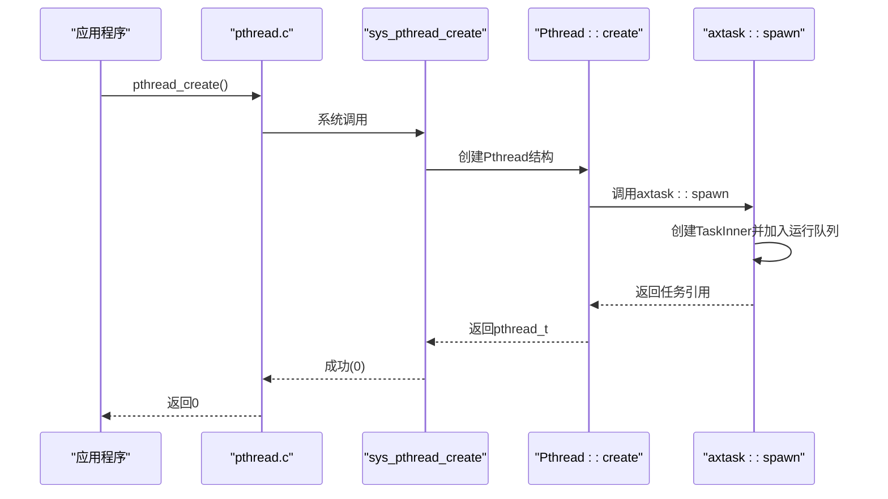
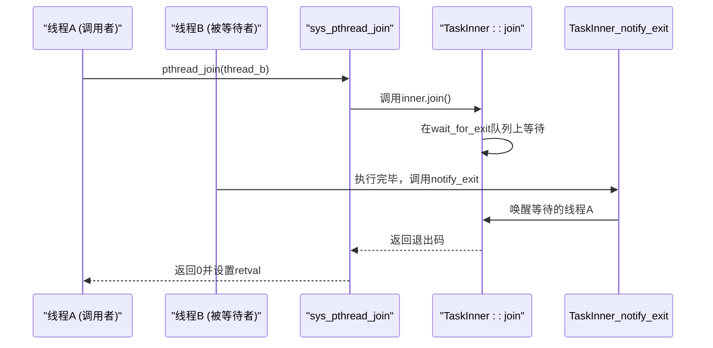
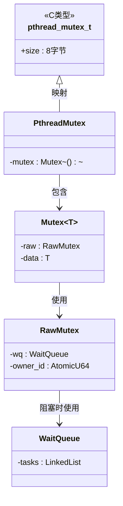
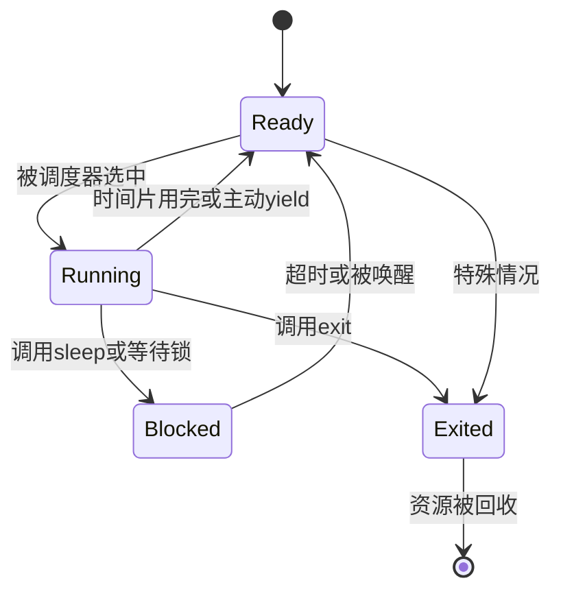

# 任务与线程管理API

<cite>
**本文档引用的文件**  
- [task.rs](file://api/arceos_api/src/imp/task.rs)
- [pthread/mod.rs](file://api/arceos_posix_api/src/imp/pthread/mod.rs)
- [pthread/mutex.rs](file://api/arceos_posix_api/src/imp/pthread/mutex.rs)
- [pthread.h](file://ulib/axlibc/include/pthread.h)
- [pthread.c](file://ulib/axlibc/c/pthread.c)
- [multi.rs](file://ulib/axstd/src/thread/multi.rs)
- [task.rs](file://modules/axtask/src/task.rs)
- [mutex.rs](file://modules/axsync/src/mutex.rs)
- [mutex.rs](file://ulib/axstd/src/sync/mutex.rs)
- [lib.rs](file://modules/axtask/src/lib.rs)
- [api.rs](file://modules/axtask/src/api.rs)
- [api_s.rs](file://modules/axtask/src/api_s.rs)
</cite>

## 目录
1. [引言](#引言)
2. [POSIX线程接口实现机制](#posix线程接口实现机制)
3. [任务创建与调度映射关系](#任务创建与调度映射关系)
4. [单体内核下fork/exec的简化与禁用](#单体内核下forkexec的简化与禁用)
5. [互斥锁实现原理与axsync同步原语关联](#互斥锁实现原理与axsync同步原语关联)
6. [多线程程序C代码示例](#多线程程序c代码示例)
7. [ArceOS轻量级线程支持策略](#arceos轻量级线程支持策略)
8. [与传统多进程系统的根本区别](#与传统多进程系统的根本区别)

## 引言
ArceOS是一个面向嵌入式和操作系统研究的模块化操作系统框架，其任务与线程管理API设计体现了现代操作系统在资源受限环境下的优化思路。本文档深入解析ArceOS中POSIX任务与线程管理接口的实现机制，重点分析`fork`、`exec`、`pthread_create`、`pthread_join`、`pthread_mutex_lock/unlock`等核心函数的工作原理。通过剖析`task.rs`中的任务创建与调度机制，阐明在单体内核架构下为何`fork/exec`被简化或禁用。同时，详细说明`pthread`子模块中互斥锁的实现及其与底层`axsync`同步原语的关联，并通过实际C代码示例展示多线程程序如何使用`pthread.h`进行线程同步。最后，总结ArceOS对轻量级线程的支持策略以及与传统多进程系统的本质差异。

## POSIX线程接口实现机制

### pthread_create与pthread_join实现
ArceOS通过`pthread_create`和`pthread_join`提供标准的POSIX线程创建与等待机制。这些接口在用户态库`axlibc`中声明，在内核态通过系统调用实现。

**图解来源**
- [pthread.h](file://ulib/axlibc/include/pthread.h#L54-L55)
- [mod.rs](file://api/arceos_posix_api/src/imp/pthread/mod.rs#L50-L90)
- [task.rs](file://modules/axtask/src/task.rs#L100-L150)

`pthread_create`的实现流程如下：
1. 用户程序调用`pthread_create`，传入线程入口函数和参数。
2. `axlibc`中的`pthread.c`封装系统调用。
3. 内核态`sys_pthread_create`接收调用，创建`Pthread`结构体。
4. `Pthread::create`方法内部调用`axtask::spawn`创建新的`TaskInner`实例。
5. 新任务被加入到合适的运行队列中等待调度。

`pthread_join`的实现则涉及线程等待与资源回收：

**图解来源**
- [pthread.h](file://ulib/axlibc/include/pthread.h#L56-L56)
- [mod.rs](file://api/arceos_posix_api/src/imp/pthread/mod.rs#L92-L110)
- [task.rs](file://modules/axtask/src/task.rs#L200-L250)

### pthread_mutex_lock/unlock实现
互斥锁的实现是线程同步的核心。ArceOS通过分层设计将POSIX接口与底层同步原语解耦。

**图解来源**
- [pthread.h](file://ulib/axlibc/include/pthread.h#L64-L65)
- [mutex.rs](file://api/arceos_posix_api/src/imp/pthread/mutex.rs#L10-L50)
- [mutex.rs](file://modules/axsync/src/mutex.rs#L10-L50)

当线程调用`pthread_mutex_lock`时：
1. 系统调用`sys_pthread_mutex_lock`检查指针有效性。
2. 将`pthread_mutex_t`指针转换为内部`PthreadMutex`结构。
3. 调用`PthreadMutex::lock()`，进而调用`RawMutex::lock()`。
4. `RawMutex`使用原子操作尝试获取锁，若失败则进入`WaitQueue`等待。

**本节来源**
- [pthread.h](file://ulib/axlibc/include/pthread.h)
- [mod.rs](file://api/arceos_posix_api/src/imp/pthread/mod.rs)
- [mutex.rs](file://api/arceos_posix_api/src/imp/pthread/mutex.rs)
- [mutex.rs](file://modules/axsync/src/mutex.rs)

## 任务创建与调度映射关系

### 任务结构与状态机
ArceOS的任务管理基于`TaskInner`结构体，它封装了任务的所有元数据和控制信息。

**图解来源**
- [task.rs](file://modules/axtask/src/task.rs#L30-L40)

`TaskInner`的关键字段包括：
- `id`: 唯一任务标识符
- `name`: 任务名称
- `state`: 原子状态变量
- `kstack`: 内核栈
- `ctx`: 任务上下文（保存寄存器）
- `wait_for_exit`: 用于`join`操作的等待队列

### 任务创建流程
任务创建是一个分阶段的过程，从用户