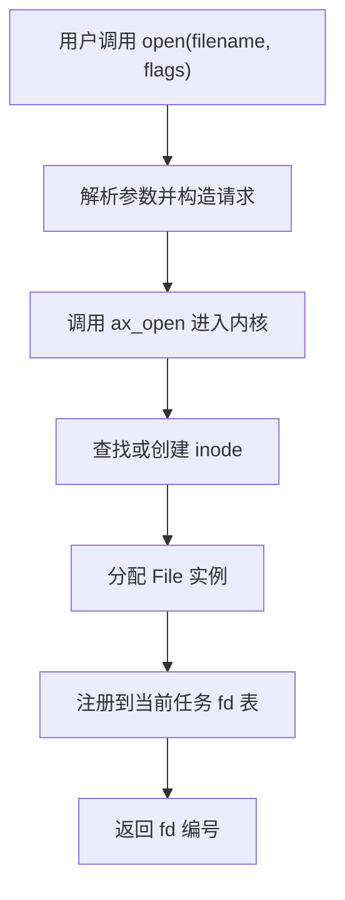
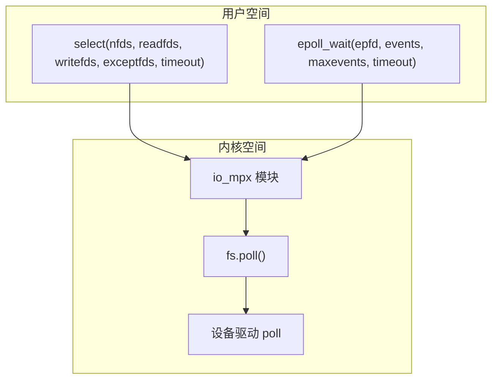
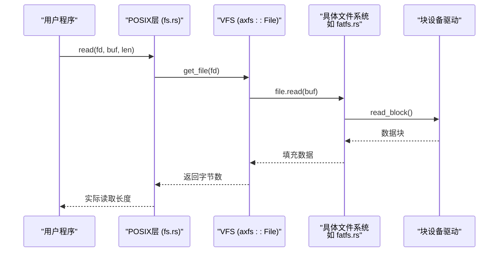

# 文件操作API

<cite>
**本文档中引用的文件**
- [fcntl.c](file://ulib/axlibc/c/fcntl.c)
- [fcntl.h](file://ulib/axlibc/include/fcntl.h)
- [unistd.h](file://ulib/axlibc/include/unistd.h)
- [fs.rs](file://api/arceos_posix_api/src/imp/fs.rs)
- [fd_ops.rs](file://api/arceos_posix_api/src/imp/fd_ops.rs)
- [io_mpx/select.rs](file://api/arceos_posix_api/src/imp/io_mpx/select.rs)
- [io_mpx/epoll.rs](file://api/arceos_posix_api/src/imp/io_mpx/epoll.rs)
- [axfs/src/api/file.rs](file://modules/axfs/src/api/file.rs)
</cite>

## 目录
1. [简介](#简介)
2. [核心系统调用接口](#核心系统调用接口)
3. [文件描述符管理机制](#文件描述符管理机制)
4. [I/O多路复用支持](#i/o多路复用支持)
5. [与axfs文件系统的交互流程](#与axfs文件系统的交互流程)
6. [C语言使用示例](#c语言使用示例)
7. [与传统Linux行为的差异](#与传统linux行为的差异)
8. [设计调整说明](#设计调整说明)

## 简介
ArceOS作为一个单体内核操作系统，提供了对POSIX标准文件操作接口的支持。本文档详细阐述了`open`、`close`、`read`、`write`和`fcntl`等核心系统调用在ArceOS环境下的实现语义、参数限制及错误码返回机制。通过分析`fs.rs`中的具体实现逻辑，深入探讨文件描述符管理、I/O多路复用（如`poll`/`select`）支持以及与底层axfs文件系统模块的交互流程。同时，对比传统Linux行为，说明为适应无进程模型所进行的设计调整。

**Section sources**
- [fcntl.c](file://ulib/axlibc/c/fcntl.c#L7-L39)
- [fcntl.h](file://ulib/axlibc/include/fcntl.h#L116-L120)
- [unistd.h](file://ulib/axlibc/include/unistd.h#L19-L29)

## 核心系统调用接口

### open系统调用
`open`函数用于打开或创建文件，并返回一个文件描述符。其原型定义于`fcntl.h`头文件中，支持可变参数以传递`mode_t`权限模式。当指定了`O_CREAT`或`O_TMPFILE`标志时，会从可变参数列表中提取`mode`值用于设置新文件的访问权限。

该调用最终委托给内部`ax_open`函数处理，后者由内核侧实现，负责与虚拟文件系统层交互完成实际的文件打开操作。

**Section sources**
- [fcntl.c](file://ulib/axlibc/c/fcntl.c#L27-L39)
- [fcntl.h](file://ulib/axlibc/include/fcntl.h#L120)

### close系统调用
`close`用于关闭指定的文件描述符，释放相关资源。其声明位于`unistd.h`中，调用路径经由用户库转发至内核实现。

**Section sources**
- [unistd.h](file://ulib/axlibc/include/unistd.h#L19)

### read/write系统调用
`read`和`write`分别用于从文件描述符读取数据和向其写入数据，定义于`unistd.h`中。这两个调用同样通过用户库封装后进入内核空间执行实际I/O操作。

**Section sources**
- [unistd.h](file://ulib/axlibc/include/unistd.h#L28-L29)

### fcntl系统调用
`fcntl`提供对文件描述符的各种控制操作，如获取/设置文件状态标志、复制文件描述符等。其可变参数机制允许传入额外的控制参数，最终调用`ax_fcntl`进入内核处理。

**Section sources**
- [fcntl.c](file://ulib/axlibc/c/fcntl.c#L9-L18)
- [fcntl.h](file://ulib/axlibc/include/fcntl.h#L116)

## 文件描述符管理机制
ArceOS在用户态库中维护每个任务的文件描述符表，通过`fd_ops.rs`实现增删查改操作。文件描述符本质上是索引，指向内核中由`axfs`模块管理的打开文件对象（`File`结构）。每次`open`成功返回一个未被使用的最小整数作为fd，`close`则将其标记为空闲以便复用。



**Diagram sources**
- [fs.rs](file://api/arceos_posix_api/src/imp/fs.rs)
- [fd_ops.rs](file://api/arceos_posix_api/src/imp/fd_ops.rs)
- [file.rs](file://modules/axfs/src/api/file.rs)

**Section sources**
- [fs.rs](file://api/arceos_posix_api/src/imp/fs.rs)
- [fd_ops.rs](file://api/arceos_posix_api/src/imp/fd_ops.rs)

## I/O多路复用支持
ArceOS实现了`select`和`epoll`两种I/O事件监控机制，位于`io_mpx`子模块中。`select.rs`提供基于位掩码的文件描述符集合监控，适用于小规模并发；`epoll.rs`则采用更高效的红黑树+就绪链表结构，适合大规模连接场景。

两者均依赖于文件系统层提供的`poll`接口来查询设备或文件的当前就绪状态，从而决定是否唤醒等待的任务。



**Diagram sources**
- [select.rs](file://api/arceos_posix_api/src/imp/io_mpx/select.rs)
- [epoll.rs](file://api/arceos_posix_api/src/imp/io_mpx/epoll.rs)
- [fs.rs](file://api/arceos_posix_api/src/imp/fs.rs)

**Section sources**
- [select.rs](file://api/arceos_posix_api/src/imp/io_mpx/select.rs)
- [epoll.rs](file://api/arceos_posix_api/src/imp/io_mpx/epoll.rs)

## 与axfs文件系统的交互流程
所有文件I/O操作最终都会通过`axfs`模块提供的API完成。例如，`read`调用会触发以下流程：
1. 根据fd查找对应的`File`对象；
2. 调用该文件类型的`read`方法（如普通文件、设备文件等）；
3. 若为磁盘文件，则进一步调用相应文件系统（如FAT32、EXT4）的读取逻辑；
4. 数据经缓冲区管理后返回用户空间。

此过程体现了ArceOS分层设计思想：POSIX API → 虚拟文件系统抽象 → 具体文件系统实现 → 存储设备驱动。



**Diagram sources**
- [fs.rs](file://api/arceos_posix_api/src/imp/fs.rs)
- [file.rs](file://modules/axfs/src/api/file.rs)
- [fatfs.rs](file://modules/axfs/src/fs/fatfs.rs)

**Section sources**
- [fs.rs](file://api/arceos_posix_api/src/imp/fs.rs)
- [file.rs](file://modules/axfs/src/api/file.rs)

## C语言使用示例
以下代码展示了如何使用标准`fcntl.h`头文件进行文件控制操作：

```c
#include <fcntl.h>
#include <unistd.h>
#include <stdio.h>

int main() {
    int fd = open("/test.txt", O_RDWR | O_CREAT, 0644);
    if (fd < 0) {
        perror("open failed");
        return -1;
    }

    // 获取文件状态标志
    int flags = fcntl(fd, F_GETFL, 0);
    printf("Current flags: %d\n", flags);

    // 关闭文件
    close(fd);
    return 0;
}
```

上述代码演示了打开文件、使用`fcntl`查询状态标志以及关闭文件的标准流程。

**Section sources**
- [fcntl.c](file://ulib/axlibc/c/fcntl.c#L7-L39)
- [fcntl.h](file://ulib/axlibc/include/fcntl.h)

## 与传统Linux行为的差异
尽管ArceOS努力兼容POSIX标准，但在某些方面存在差异：
- **不支持信号驱动I/O**：由于缺乏完整的信号机制，`F_SETOWN`和`SIGIO`相关功能不可用；
- **无fork/exec模型**：文件描述符继承行为简化，无需考虑跨进程传递；
- **线程模型不同**：基于协作式调度，I/O阻塞行为需特别注意避免影响整体性能。

这些差异源于ArceOS作为嵌入式单体内核的设计目标，牺牲部分复杂特性以换取更高的确定性和更低的开销。

**Section sources**
- [fs.rs](file://api/arceos_posix_api/src/imp/fs.rs)
- [fcntl.c](file://ulib/axlibc/c/fcntl.c)

## 设计调整说明
为适应无进程模型，ArceOS对传统POSIX文件操作进行了如下调整：
- **全局文件表共享**：所有任务共享同一命名空间，但各自维护独立的fd映射；
- **异步I/O统一接口**：通过轮询+事件驱动结合的方式替代信号通知；
- **资源生命周期绑定任务**：文件描述符随任务销毁自动关闭，无需显式管理。

这些设计确保了在资源受限环境下仍能提供稳定可靠的文件操作服务。

**Section sources**
- [fs.rs](file://api/arceos_posix_api/src/imp/fs.rs)
- [fd_ops.rs](file://api/arceos_posix_api/src/imp/fd_ops.rs)
- [task.rs](file://api/arceos_posix_api/src/imp/task.rs)