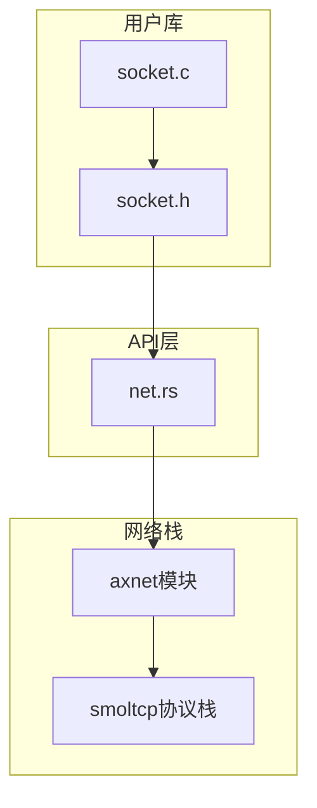
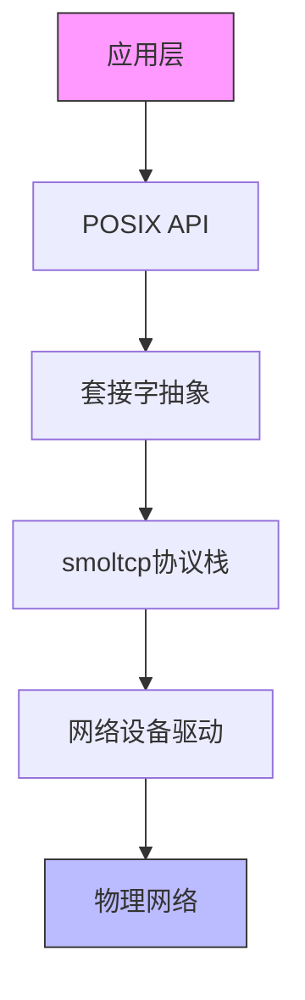
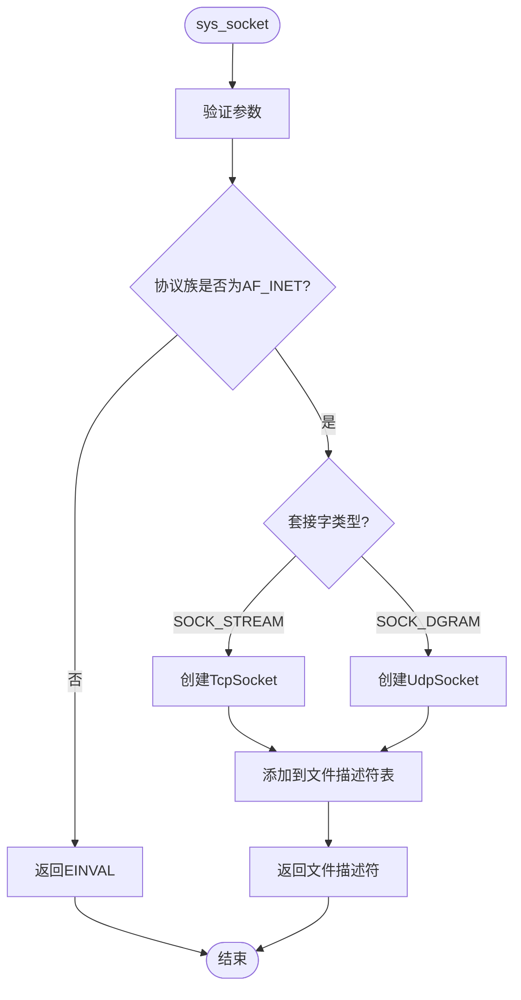
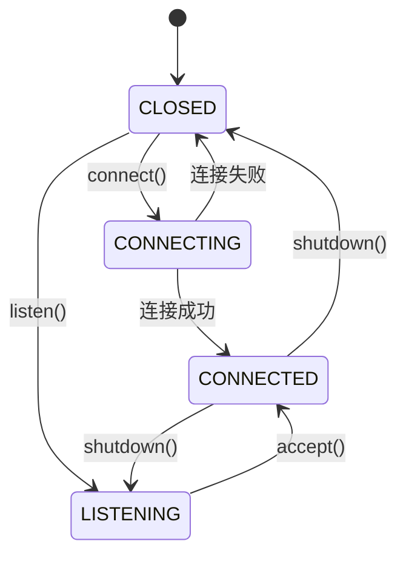
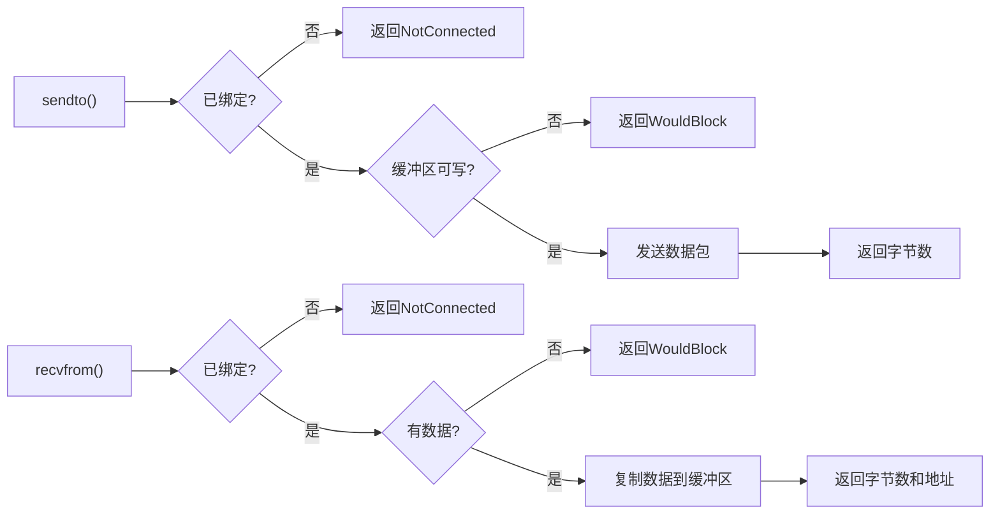
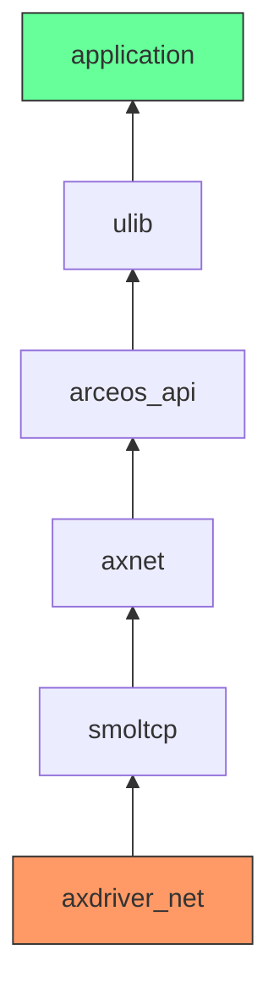

# 网络编程API

<cite>
**本文档引用的文件**
- [net.rs](file://api/arceos_posix_api/src/imp/net.rs)
- [socket.h](file://ulib/axlibc/include/sys/socket.h)
- [lib.rs](file://modules/axnet/src/lib.rs)
- [mod.rs](file://modules/axnet/src/smoltcp_impl/mod.rs)
- [tcp.rs](file://modules/axnet/src/smoltcp_impl/tcp.rs)
- [udp.rs](file://modules/axnet/src/smoltcp_impl/udp.rs)
- [listen_table.rs](file://modules/axnet/src/smoltcp_impl/listen_table.rs)
</cite>

## 目录
1. [简介](#简介)
2. [项目结构](#项目结构)
3. [核心组件](#核心组件)
4. [架构概述](#架构概述)
5. [详细组件分析](#详细组件分析)
6. [依赖分析](#依赖分析)
7. [性能考虑](#性能考虑)
8. [故障排除指南](#故障排除指南)
9. [结论](#结论)

## 简介
本文档旨在提供POSIX网络编程接口的完整技术文档，重点描述socket、bind、connect、listen、accept、send、recv等系统调用的实现细节。基于net.rs源码分析套接字创建、地址绑定、连接建立等关键路径的处理逻辑。详细说明sys/socket.h头文件定义的协议族、套接字类型及选项支持情况。结合axnet模块的smoltcp协议栈，解释TCP/UDP通信在用户态API与内核网络栈之间的数据流。

## 项目结构
ArceOS项目的网络编程功能分布在多个模块中，主要涉及API层、网络栈实现和用户库三个部分。API层提供POSIX兼容的系统调用接口，网络栈实现基于smoltcp提供TCP/UDP通信能力，用户库则封装了C语言可用的网络函数。

**图示来源**
- [net.rs](file://api/arceos_posix_api/src/imp/net.rs)
- [socket.h](file://ulib/axlibc/include/sys/socket.h)
- [socket.c](file://ulib/axlibc/c/socket.c)

**本节来源**
- [net.rs](file://api/arceos_posix_api/src/imp/net.rs)
- [socket.h](file://ulib/axlibc/include/sys/socket.h)

## 核心组件
系统的核心网络组件包括Socket枚举类型、TCP/UDP套接字实现以及网络初始化机制。Socket枚举封装了TCP和UDP两种套接字类型，通过文件描述符表进行管理。TcpSocket和UdpSocket结构体提供了POSIX风格的API接口，而axnet模块负责底层网络栈的初始化和数据包处理。

**本节来源**
- [net.rs](file://api/arceos_posix_api/src/imp/net.rs)
- [tcp.rs](file://modules/axnet/src/smoltcp_impl/tcp.rs)
- [udp.rs](file://modules/axnet/src/smoltcp_impl/udp.rs)

## 架构概述
系统的网络架构采用分层设计，从上到下分别为POSIX API层、套接字抽象层、smoltcp协议栈层和网络设备驱动层。这种设计实现了用户态API与内核网络功能的解耦，同时保持了与标准BSD socket API的高度兼容性。

**图示来源**
- [net.rs](file://api/arceos_posix_api/src/imp/net.rs)
- [mod.rs](file://modules/axnet/src/smoltcp_impl/mod.rs)
- [lib.rs](file://modules/axnet/src/lib.rs)

## 详细组件分析

### Socket系统调用分析
Socket系统调用是网络通信的起点，负责创建新的套接字实例并返回文件描述符。该实现支持AF_INET协议族下的SOCK_STREAM（TCP）和SOCK_DGRAM（UDP）两种套接字类型。

#### 系统调用流程图

**图示来源**
- [net.rs](file://api/arceos_posix_api/src/imp/net.rs#L100-L150)

**本节来源**
- [net.rs](file://api/arceos_posix_api/src/imp/net.rs#L100-L150)

### TCP套接字状态机
TcpSocket实现了一个复杂的状态机，管理连接的整个生命周期，包括连接建立、数据传输和连接终止等阶段。

#### TCP状态转换图

**图示来源**
- [tcp.rs](file://modules/axnet/src/smoltcp_impl/tcp.rs#L20-L50)

**本节来源**
- [tcp.rs](file://modules/axnet/src/smoltcp_impl/tcp.rs#L20-L100)

### UDP套接字实现
UdpSocket提供无连接的数据报服务，其设计相对简单，主要关注数据报的发送和接收功能。

#### UDP数据流图

**图示来源**
- [udp.rs](file://modules/axnet/src/smoltcp_impl/udp.rs#L50-L100)

**本节来源**
- [udp.rs](file://modules/axnet/src/smoltcp_impl/udp.rs#L50-L150)

## 依赖分析
网络模块的依赖关系清晰，形成了一个自底向上的依赖链。底层网络设备驱动为上层协议栈提供数据收发能力，smoltcp协议栈实现TCP/IP协议，axnet模块在此基础上提供统一的API接口，最终由POSIX API层暴露给应用程序。

**图示来源**
- [mod.rs](file://modules/axnet/src/smoltcp_impl/mod.rs)
- [lib.rs](file://modules/axnet/src/lib.rs)
- [net.rs](file://api/arceos_posix_api/src/imp/net.rs)

**本节来源**
- [mod.rs](file://modules/axnet/src/smoltcp_impl/mod.rs)
- [lib.rs](file://modules/axnet/src/lib.rs)

## 性能考虑
系统在网络性能方面进行了多项优化。TCP和UDP套接字均采用64KB的接收和发送缓冲区，确保足够的吞吐能力。端口分配使用循环算法，在C000-FFFF范围内查找可用端口，平衡了分配速度和端口利用率。非阻塞模式下，系统通过轮询机制实现高效的I/O多路复用。

## 故障排除指南
常见的网络问题主要包括套接字状态错误、地址绑定冲突和连接超时等。调试时应首先检查套接字状态是否符合操作要求，例如只有在CONNECTED状态才能进行数据收发。对于bind失败的情况，需要确认端口是否已被占用。连接问题通常与网络配置有关，应检查IP地址、子网掩码和网关设置是否正确。

**本节来源**
- [tcp.rs](file://modules/axnet/src/smoltcp_impl/tcp.rs#L500-L550)
- [udp.rs](file://modules/axnet/src/smoltcp_impl/udp.rs#L250-L280)

## 结论
ArceOS的网络编程接口实现了完整的POSIX socket API功能，基于smoltcp协议栈提供了可靠的TCP/UDP通信能力。系统设计合理，层次分明，既保证了与标准API的兼容性，又适应了操作系统内核的特殊需求。通过详细的源码分析，我们可以深入理解各个系统调用的实现细节和内部工作机制，为开发和调试网络应用提供了有力支持。