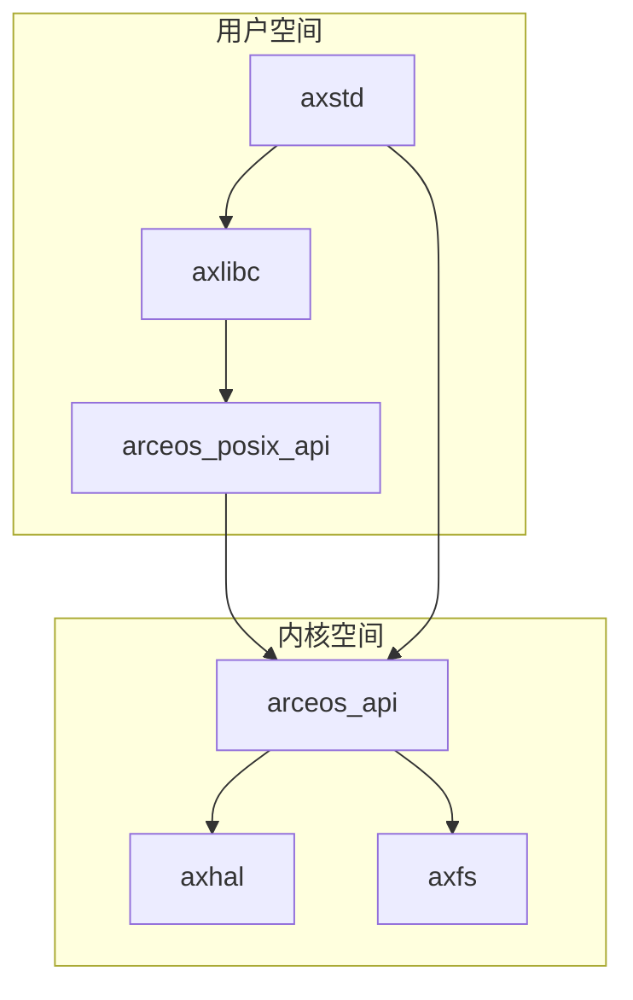
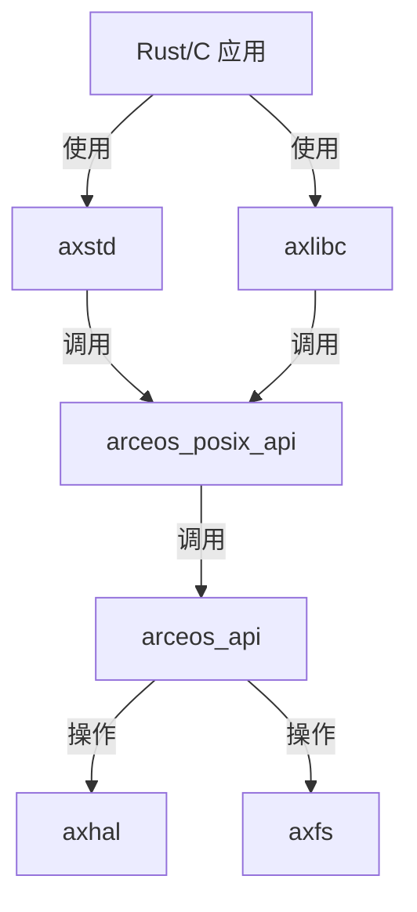
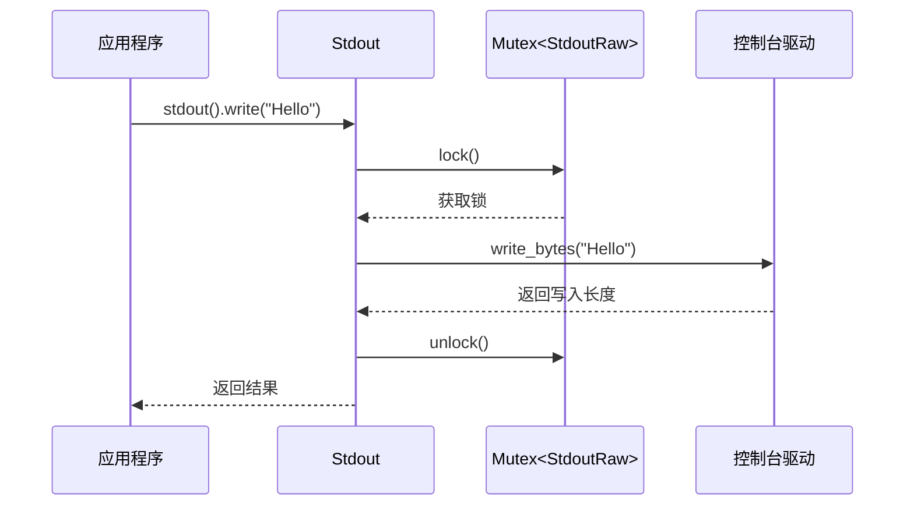
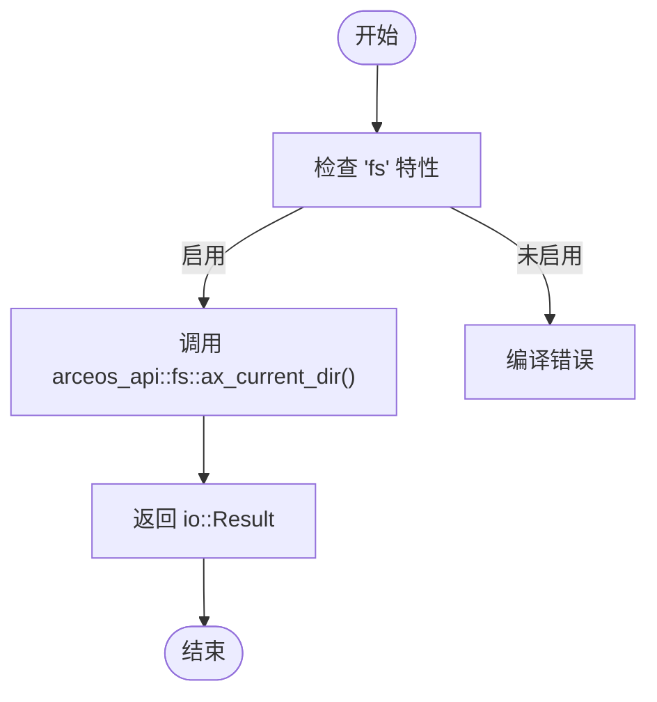
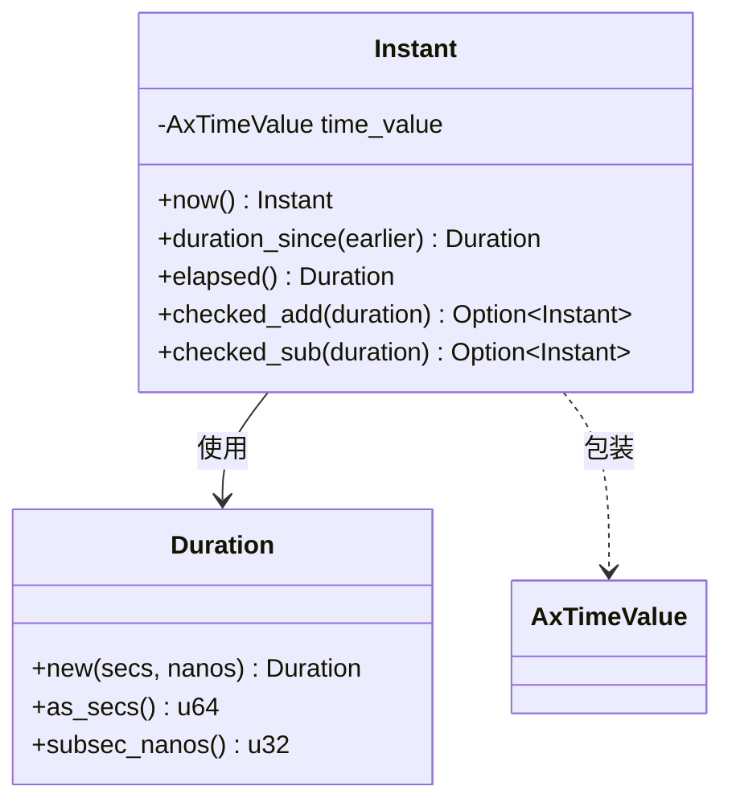
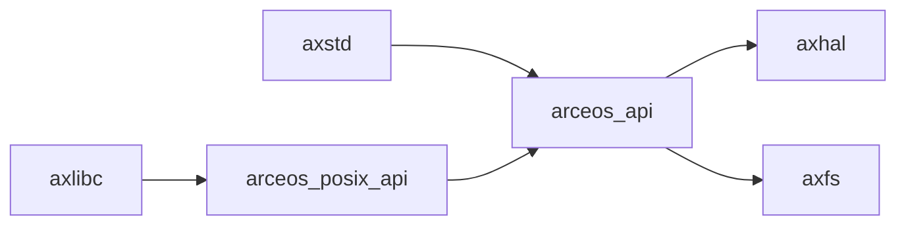

# I/O与环境接口

<cite>
**本文档中引用的文件**
- [env.rs](file://ulib/axstd/src/env.rs)
- [os.rs](file://ulib/axstd/src/os.rs)
- [time.rs](file://ulib/axstd/src/time.rs)
- [stdio.rs](file://ulib/axstd/src/io/stdio.rs)
- [lib.rs](file://ulib/axstd/src/lib.rs)
- [stdio.rs](file://api/arceos_posix_api/src/imp/stdio.rs)
- [time.rs](file://api/arceos_posix_api/src/imp/time.rs)
- [fs.rs](file://api/arceos_posix_api/src/imp/fs.rs)
- [lib.rs](file://ulib/axlibc/src/lib.rs)
</cite>

## 目录
1. [简介](#简介)
2. [项目结构](#项目结构)
3. [核心组件](#核心组件)
4. [架构概述](#架构概述)
5. [详细组件分析](#详细组件分析)
6. [依赖关系分析](#依赖关系分析)
7. [性能考虑](#性能考虑)
8. [故障排除指南](#故障排除指南)
9. [结论](#结论)

## 简介
本文档旨在整合并记录 ArceOS 操作系统中的基础运行时服务，重点涵盖标准输入输出（stdin/stdout/stderr）的重定向机制、环境变量存取（env模块）、操作系统抽象接口（os模块）以及时钟时间获取。这些组件共同构建了用户程序执行的完整上下文。通过具体示例，展示如何在 ArceOS 应用中读取启动参数、操作环境变量、进行日志输出及时间测量，并阐明其与 axlibc 和 arceos_posix_api 库的互补关系。

## 项目结构
ArceOS 的相关功能分布在多个模块中，主要涉及 `ulib` 用户库和 `api` 接口层。`ulib/axstd` 提供了类似 Rust 标准库的接口，直接调用内核功能；`api/arceos_posix_api` 则提供了 POSIX 兼容的 C API 实现；而 `ulib/axlibc` 是为 C 应用提供的用户程序库，封装了底层系统调用。

**图源**
- [lib.rs](file://ulib/axstd/src/lib.rs)
- [lib.rs](file://ulib/axlibc/src/lib.rs)
- [lib.rs](file://api/arceos_posix_api/src/lib.rs)

**节源**
- [lib.rs](file://ulib/axstd/src/lib.rs)
- [lib.rs](file://ulib/axlibc/src/lib.rs)
- [lib.rs](file://api/arceos_posix_api/src/lib.rs)

## 核心组件
`axstd` 库是构建 ArceOS 用户程序的核心，它通过 `env`、`io`、`os` 和 `time` 模块提供基础运行时服务。这些模块不依赖传统的 libc 和系统调用，而是直接与 ArceOS 内核模块通信，从而实现更高效的执行。

**节源**
- [lib.rs](file://ulib/axstd/src/lib.rs)
- [env.rs](file://ulib/axstd/src/env.rs)
- [os.rs](file://ulib/axstd/src/os.rs)
- [time.rs](file://ulib/axstd/src/time.rs)

## 架构概述
整个 I/O 与环境接口的架构分为三层：上层是 `axstd` 提供的高级 Rust 接口，中层是 `arceos_posix_api` 提供的 POSIX 兼容 C 接口，底层是 `arceos_api` 提供的内核功能抽象。`axlibc` 库则作为 C 语言应用的桥梁，复用 `arceos_posix_api` 的实现。

**图源**
- [lib.rs](file://ulib/axstd/src/lib.rs)
- [lib.rs](file://ulib/axlibc/src/lib.rs)
- [lib.rs](file://api/arceos_posix_api/src/lib.rs)

## 详细组件分析

### 标准输入输出（Stdio）分析
`axstd` 中的 `io::stdio` 模块负责管理标准输入输出流。它通过全局静态 `Mutex` 来保证对控制台的线程安全访问。`Stdin` 和 `Stdout` 结构体分别封装了对输入和输出流的操作，`lock()` 方法返回一个可读写的守卫对象，确保在作用域内独占访问。

#### 对于API/服务组件：

**图源**
- [stdio.rs](file://ulib/axstd/src/io/stdio.rs)
- [stdio.rs](file://api/arceos_posix_api/src/imp/stdio.rs)

**节源**
- [stdio.rs](file://ulib/axstd/src/io/stdio.rs)

### 环境变量与工作目录分析
`env` 模块提供了对进程环境的检查和操作功能。目前主要实现了当前工作目录（CWD）的查询和修改。`current_dir()` 函数返回当前工作目录的路径，而 `set_current_dir(path)` 函数用于更改当前工作目录。这些功能依赖于 `fs` 功能特性，并通过 `arceos_api::fs` 模块与文件系统交互。

#### 对于复杂逻辑组件：

**图源**
- [env.rs](file://ulib/axstd/src/env.rs)
- [fs.rs](file://api/arceos_posix_api/src/imp/fs.rs)

**节源**
- [env.rs](file://ulib/axstd/src/env.rs)

### 时间与操作系统接口分析
`time` 模块提供了时间度量功能，核心是 `Instant` 结构体，它代表一个单调递增的时钟测量点。`Instant::now()` 静态方法返回当前时刻，可用于计算代码执行耗时。`os` 模块则是一个命名空间，导出了 `arceos` 子模块，该子模块进一步暴露了 `arceos_api` 和 `modules`，为需要直接访问底层系统功能的高级用户提供入口。

#### 对于对象导向组件：

**图源**
- [time.rs](file://ulib/axstd/src/time.rs)
- [time.rs](file://api/arceos_posix_api/src/imp/time.rs)

**节源**
- [time.rs](file://ulib/axstd/src/time.rs)
- [os.rs](file://ulib/axstd/src/os.rs)

## 依赖关系分析
各组件之间存在清晰的依赖链。`axstd` 依赖 `arceos_api` 进行内核调用；`arceos_posix_api` 同样依赖 `arceos_api` 并实现具体的 POSIX 语义；`axlibc` 则依赖 `arceos_posix_api` 来提供 C 函数。这种分层设计使得 `axstd` 可以独立于 POSIX 标准，同时又能让 C 应用无缝集成。

**图源**
- [lib.rs](file://ulib/axstd/src/lib.rs)
- [lib.rs](file://ulib/axlibc/src/lib.rs)
- [lib.rs](file://api/arceos_posix_api/src/lib.rs)

**节源**
- [lib.rs](file://ulib/axstd/src/lib.rs)
- [lib.rs](file://ulib/axlibc/src/lib.rs)

## 性能考虑
由于 `axstd` 绕过了传统 libc 层，直接与内核通信，因此在系统调用开销上具有显著优势。标准 I/O 操作通过 `Mutex` 加锁来保证同步，这在单线程或低并发场景下性能良好。对于高精度计时，`Instant::now()` 提供了纳秒级的分辨率，适用于性能剖析等场景。建议在频繁 I/O 的循环中，尽量减少 `lock()` 调用的次数，可以一次性读写更多数据以提高效率。

## 故障排除指南
常见问题包括无法读取输入、工作目录设置失败或时间测量不准确。对于输入问题，请确认控制台驱动（如 `axhal::console`）已正确初始化。对于文件系统相关操作失败，请检查是否启用了 `fs` Cargo 特性。若时间测量出现异常，请验证 `axhal::time` 模块的时钟源是否正常工作。调试时可利用 `axlog` 模块增加日志输出，追踪函数调用流程。

**节源**
- [stdio.rs](file://ulib/axstd/src/io/stdio.rs)
- [env.rs](file://ulib/axstd/src/env.rs)
- [time.rs](file://ulib/axstd/src/time.rs)

## 结论
`axstd` 库成功地为 ArceOS 构建了一套高效、安全的基础运行时服务。其与 `axlibc` 和 `arceos_posix_api` 的协同工作，既满足了追求极致性能的 Rust 应用的需求，也兼容了现有的 C 生态。通过清晰的分层架构和模块化设计，开发者可以根据具体需求选择合适的接口，无论是使用高级的 `axstd` 还是遵循 POSIX 标准的 `axlibc`，都能获得一致且可靠的体验。