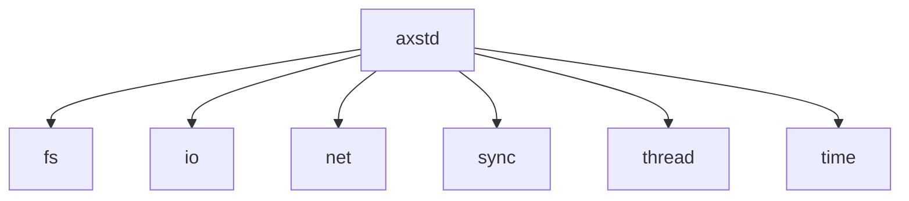
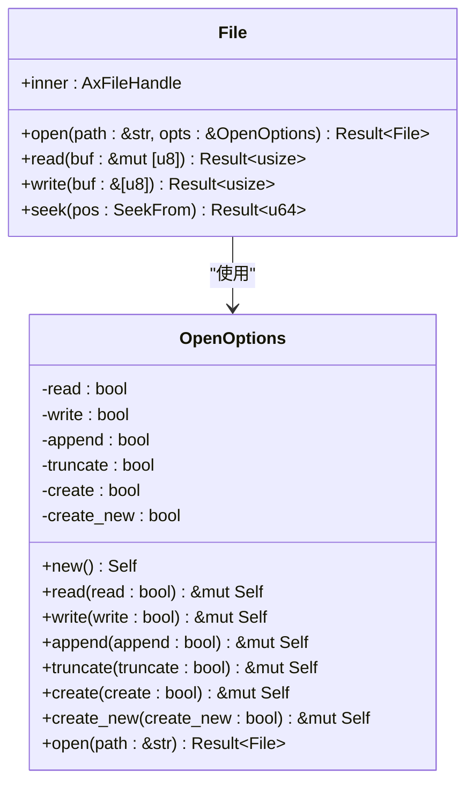
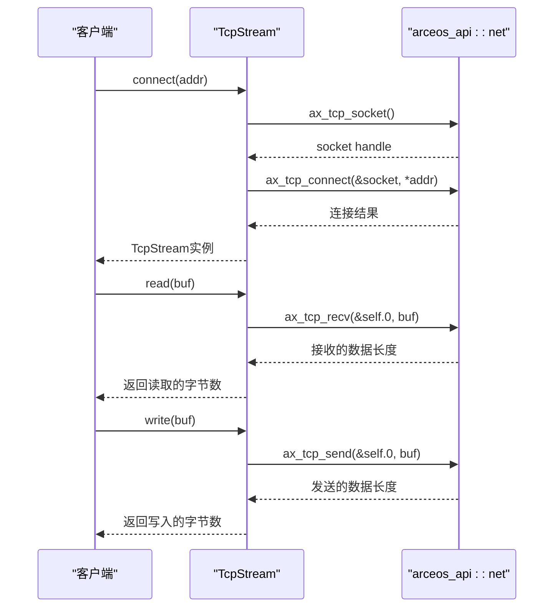
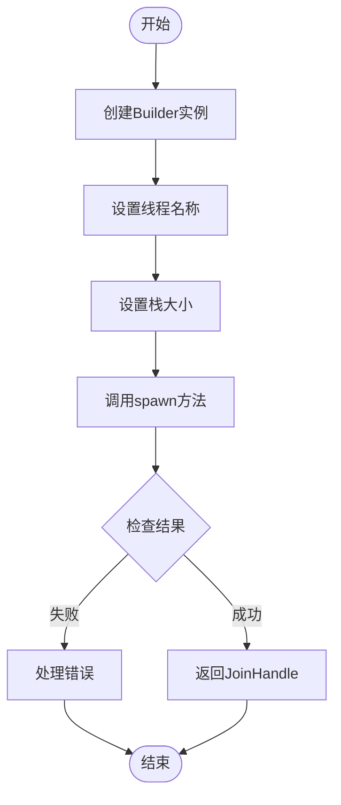
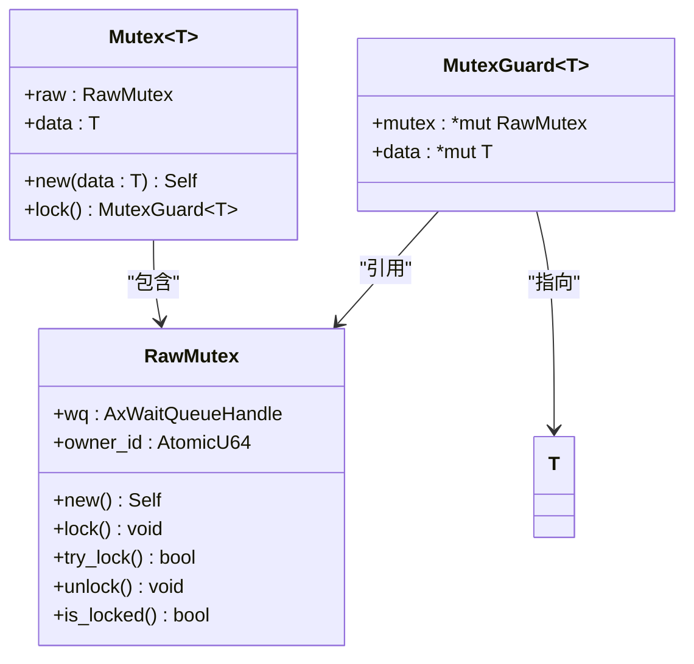
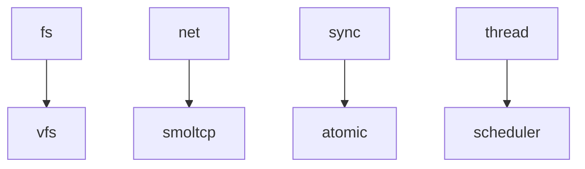

# Rust原生标准库(axstd)

<cite>
**本文档引用的文件**
- [lib.rs](file://ulib/axstd/src/lib.rs)
- [file.rs](file://ulib/axstd/src/fs/file.rs)
- [tcp.rs](file://ulib/axstd/src/net/tcp.rs)
- [multi.rs](file://ulib/axstd/src/thread/multi.rs)
- [mutex.rs](file://ulib/axstd/src/sync/mutex.rs)
</cite>

## 目录
1. [简介](#简介)
2. [项目结构](#项目结构)
3. [核心组件](#核心组件)
4. [架构概述](#架构概述)
5. [详细组件分析](#详细组件分析)
6. [依赖关系分析](#依赖关系分析)
7. [性能考虑](#性能考虑)
8. [故障排除指南](#故障排除指南)
9. [结论](#结论)

## 简介
ArceOS标准库（axstd）是一个轻量级的标准库，其接口设计与Rust标准库[std]相似，但直接调用ArceOS模块中的函数，而非通过libc和系统调用来实现。该库旨在为用户提供一个类似于Rust标准库的编程体验，同时充分利用ArceOS内核提供的功能。

## 项目结构
axstd库位于`ulib/axstd`目录下，主要包含以下几个模块：
- `fs`：文件系统操作
- `io`：输入输出操作
- `net`：网络通信
- `sync`：同步原语
- `thread`：线程管理
- `time`：时间相关操作

这些模块共同构成了axstd的核心功能集，支持在no_std环境下进行高效的安全应用开发。

**图示来源**
- [lib.rs](file://ulib/axstd/src/lib.rs#L1-L77)

**章节来源**
- [lib.rs](file://ulib/axstd/src/lib.rs#L1-L77)

## 核心组件
axstd库的核心组件包括文件系统模块、网络模块、线程模块和同步原语模块。这些组件的设计理念是提供一种类似Rust标准库的API层，但在底层直接与ArceOS内核交互，从而避免了传统操作系统中常见的系统调用开销。

**章节来源**
- [lib.rs](file://ulib/axstd/src/lib.rs#L1-L77)

## 架构概述
axstd的整体架构基于ArceOS内核提供的服务，通过一系列抽象层将底层硬件和内核功能暴露给用户程序。这种设计使得axstd能够在保持高性能的同时，提供丰富的高级功能。

**图示来源**
- [lib.rs](file://ulib/axstd/src/lib.rs#L1-L77)

## 详细组件分析

### 文件系统模块分析
axstd的文件系统模块提供了异步读写能力，允许开发者以非阻塞的方式处理文件操作。这不仅提高了应用程序的响应性，还优化了资源利用率。

#### 对象导向组件：

**图示来源**
- [file.rs](file://ulib/axstd/src/fs/file.rs#L1-L187)

**章节来源**
- [file.rs](file://ulib/axstd/src/fs/file.rs#L1-L187)

### 网络模块分析
axstd的网络模块实现了TCP流的非阻塞特性，确保在网络通信过程中不会因为等待数据而阻塞整个程序。此外，它还支持多种调度策略，可以根据具体需求选择最适合的方案。

#### API/服务组件：

**图示来源**
- [tcp.rs](file://ulib/axstd/src/net/tcp.rs#L1-L105)

**章节来源**
- [tcp.rs](file://ulib/axstd/src/net/tcp.rs#L1-L105)

### 线程模块分析
axstd的线程模块通过`thread::spawn`函数实现了灵活的任务调度行为。开发者可以轻松地创建新的线程，并对其进行命名和配置栈大小等属性。

#### 复杂逻辑组件：

**图示来源**
- [multi.rs](file://ulib/axstd/src/thread/multi.rs#L1-L189)

**章节来源**
- [multi.rs](file://ulib/axstd/src/thread/multi.rs#L1-L189)

### 同步原语模块分析
axstd的同步原语模块采用了无锁优化策略来提高并发性能。特别是`sync::Mutex`的实现，利用原子操作和等待队列机制有效地减少了锁竞争带来的开销。

#### 对象导向组件：

**图示来源**
- [mutex.rs](file://ulib/axstd/src/sync/mutex.rs#L1-L94)

**章节来源**
- [mutex.rs](file://ulib/axstd/src/sync/mutex.rs#L1-L94)

## 依赖关系分析
axstd各模块之间的依赖关系清晰明了，每个模块都专注于特定的功能领域。例如，文件系统模块依赖于底层的VFS（虚拟文件系统）接口，而网络模块则依赖于smoltcp协议栈的实现。

**图示来源**
- [lib.rs](file://ulib/axstd/src/lib.rs#L1-L77)
- [file.rs](file://ulib/axstd/src/fs/file.rs#L1-L187)
- [tcp.rs](file://ulib/axstd/src/net/tcp.rs#L1-L105)
- [multi.rs](file://ulib/axstd/src/thread/multi.rs#L1-L189)
- [mutex.rs](file://ulib/axstd/src/sync/mutex.rs#L1-L94)

**章节来源**
- [lib.rs](file://ul