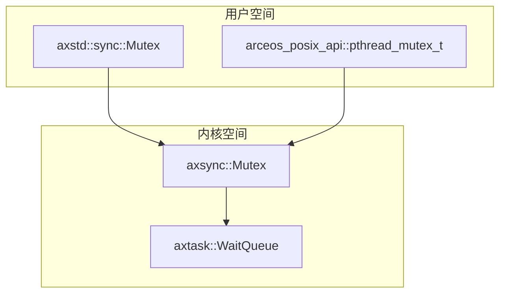
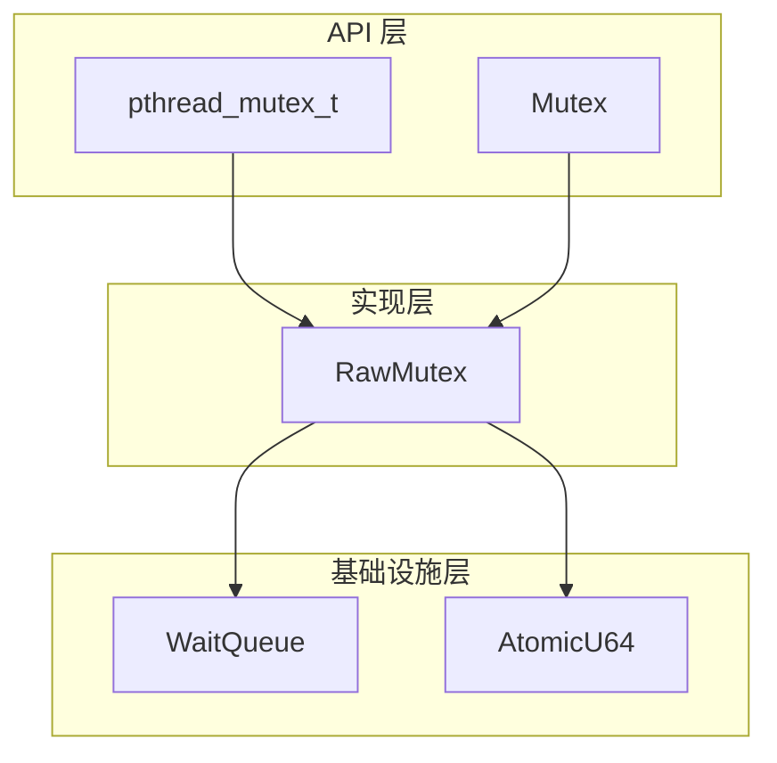
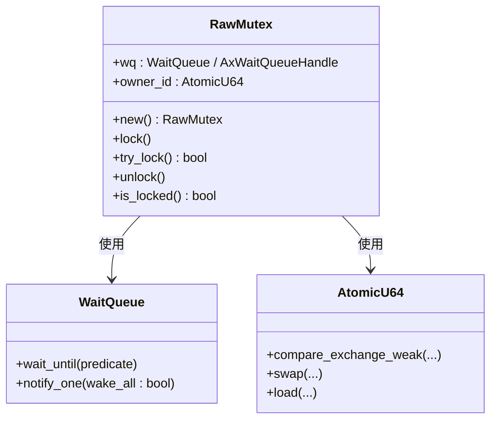
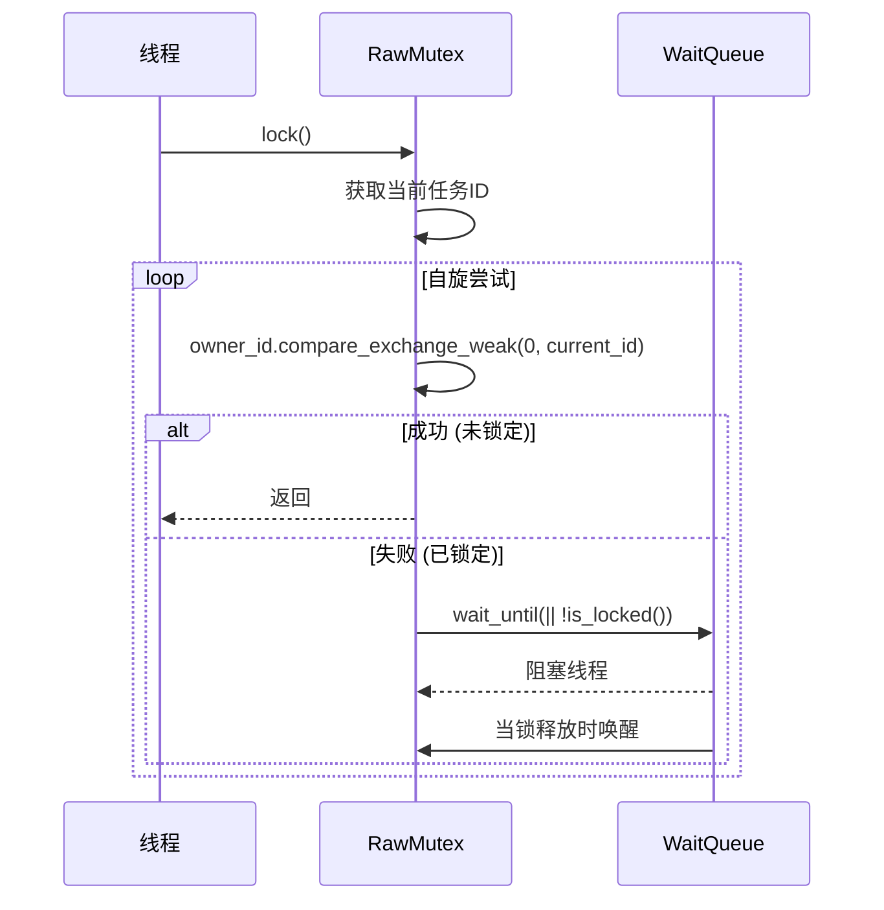
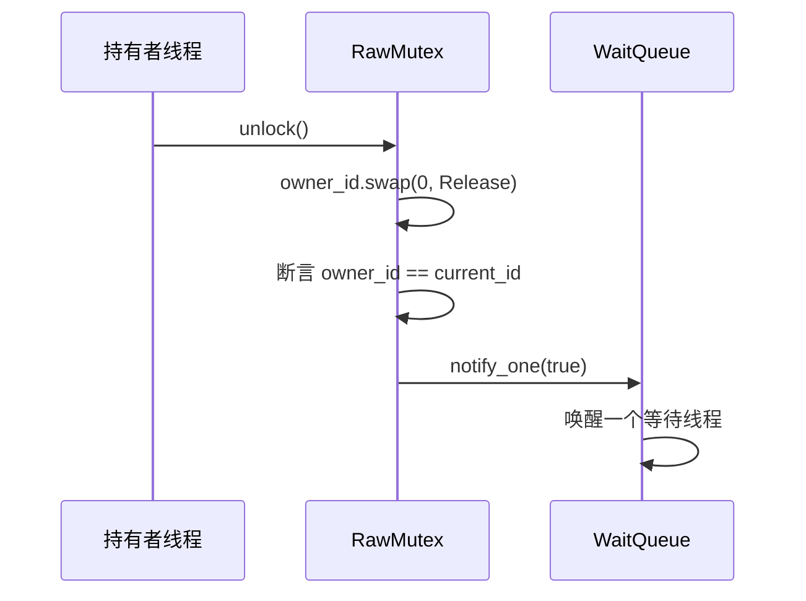
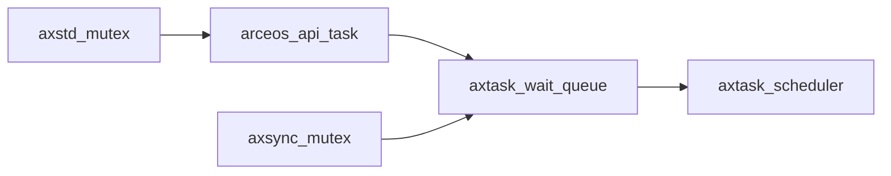

# 同步原语模块

<cite>
**本文档中引用的文件**
- [mutex.rs](file://modules/axsync/src/mutex.rs)
- [mutex.rs](file://ulib/axstd/src/sync/mutex.rs)
- [lib.rs](file://modules/axsync/src/lib.rs)
- [mod.rs](file://ulib/axstd/src/sync/mod.rs)
- [mutex.rs](file://api/arceos_posix_api/src/imp/pthread/mutex.rs)
</cite>

## 目录
1. [引言](#引言)
2. [项目结构](#项目结构)
3. [核心组件](#核心组件)
4. [架构概述](#架构概述)
5. [详细组件分析](#详细组件分析)
6. [依赖分析](#依赖分析)
7. [性能考量](#性能考量)
8. [故障排除指南](#故障排除指南)
9. [结论](#结论)

## 引言
本文档详细说明了ArceOS操作系统中`axstd`同步模块的互斥锁（Mutex）实现机制。重点分析其基于`axsync`底层原语的无锁化设计思路、自旋等待优化策略、RAII风格的Guard对象生命周期管理、死锁检测机制以及递归锁定限制。结合多线程共享资源访问场景，演示了Mutex在实际应用中的使用模式，并与标准库`std::sync::Mutex`的行为一致性进行对比，指出在ArceOS运行时环境下的特殊考量与性能特征。

## 项目结构
ArceOS的同步原语主要分布在两个核心模块中：内核态的`axsync`和用户态的`axstd`。`axsync`模块提供基础的同步原语，而`axstd`则为用户程序提供符合Rust标准库习惯的封装接口。此外，POSIX API层通过`arceos_posix_api`模块将这些原语暴露给C/C++等传统系统编程语言。

**Diagram sources**
- [mutex.rs](file://ulib/axstd/src/sync/mutex.rs#L1-L95)
- [mutex.rs](file://modules/axsync/src/mutex.rs#L1-L151)
- [mutex.rs](file://api/arceos_posix_api/src/imp/pthread/mutex.rs#L1-L69)

**Section sources**
- [mutex.rs](file://ulib/axstd/src/sync/mutex.rs#L1-L95)
- [mutex.rs](file://modules/axsync/src/mutex.rs#L1-L151)

## 核心组件
`axsync`模块中的`RawMutex`是整个同步机制的核心。它利用原子操作和任务等待队列实现了高效的互斥锁。`axstd`模块在此基础上提供了更高级别的`Mutex<T>`类型，确保了与Rust标准库API的一致性。`arceos_posix_api`模块则进一步将此功能映射到POSIX线程（pthread）的互斥锁上，实现了跨语言兼容。

**Section sources**
- [mutex.rs](file://modules/axsync/src/mutex.rs#L1-L151)
- [mutex.rs](file://ulib/axstd/src/sync/mutex.rs#L1-L95)

## 架构概述
该同步系统的架构分为三层：最底层是`axsync`提供的`RawMutex`，它直接与任务调度器交互；中间层是`axstd`的`Mutex<T>`，它遵循Rust的`lock_api`规范；最上层是POSIX兼容的`pthread_mutex_t`。这种分层设计保证了内核功能的稳定性和用户接口的灵活性。

**Diagram sources**
- [mutex.rs](file://modules/axsync/src/mutex.rs#L1-L151)
- [mutex.rs](file://ulib/axstd/src/sync/mutex.rs#L1-L95)
- [mutex.rs](file://api/arceos_posix_api/src/imp/pthread/mutex.rs#L1-L69)

## 详细组件分析

### RawMutex 实现分析
`RawMutex`的实现基于原子比较交换（CAS）操作和任务等待队列。其核心数据结构包含一个`owner_id`原子变量和一个`WaitQueue`。

#### 类图

**Diagram sources**
- [mutex.rs](file://modules/axsync/src/mutex.rs#L10-L30)
- [mutex.rs](file://ulib/axstd/src/sync/mutex.rs#L10-L30)

#### 加锁流程序列图

**Diagram sources**
- [mutex.rs](file://modules/axsync/src/mutex.rs#L40-L60)
- [mutex.rs](file://ulib/axstd/src/sync/mutex.rs#L40-L60)

#### 解锁流程序列图

**Diagram sources**
- [mutex.rs](file://modules/axsync/src/mutex.rs#L100-L120)
- [mutex.rs](file://ulib/axstd/src/sync/mutex.rs#L70-L90)

**Section sources**
- [mutex.rs](file://modules/axsync/src/mutex.rs#L1-L151)
- [mutex.rs](file://ulib/axstd/src/sync/mutex.rs#L1-L95)

### RAII 与 Guard 对象
`MutexGuard<'a, T>` 是 `lock_api::MutexGuard` 的别名，它实现了RAII（Resource Acquisition Is Initialization）模式。当调用`lock()`方法时，返回一个`MutexGuard`对象，该对象在作用域结束时自动调用`Drop` trait来释放锁，从而防止因忘记解锁而导致的死锁。

**Section sources**
- [mutex.rs](file://modules/axsync/src/mutex.rs#L130-L151)
- [mutex.rs](file://ulib/axstd/src/sync/mutex.rs#L90-L95)

### 死锁检测与递归锁定限制
`RawMutex`通过`owner_id`字段实现了基本的死锁检测。在`lock()`和`unlock()`方法中，都会断言当前任务ID与`owner_id`是否匹配。如果一个任务试图获取自己已经持有的锁，`lock()`中的`assert_ne!`会触发panic。同样，如果一个任务试图释放不属于自己的锁，`unlock()`中的`assert_eq!`也会触发panic。这有效地防止了递归锁定和误释放，但同时也意味着该Mutex不支持递归锁定。

**Section sources**
- [mutex.rs](file://modules/axsync/src/mutex.rs#L55-L58)
- [mutex.rs](file://modules/axsync/src/mutex.rs#L105-L108)
- [mutex.rs](file://ulib/axstd/src/sync/mutex.rs#L55-L58)
- [mutex.rs](file://ulib/axstd/src/sync/mutex.rs#L75-L78)

## 依赖分析
`axsync::RawMutex`依赖于`axtask`模块的`WaitQueue`和`current()`函数来管理阻塞和唤醒任务。`axstd::Mutex`则依赖于`arceos_api`模块的`AxWaitQueueHandle`和`ax_current_task_id()`函数，这是一个抽象层，允许用户态代码通过系统调用与内核的同步设施交互。

**Diagram sources**
- [mutex.rs](file://ulib/axstd/src/sync/mutex.rs#L2-L5)
- [mutex.rs](file://modules/axsync/src/mutex.rs#L2-L5)

**Section sources**
- [mutex.rs](file://ulib/axstd/src/sync/mutex.rs#L1-L95)
- [mutex.rs](file://modules/axsync/src/mutex.rs#L1-L151)

## 性能考量
`axsync`的Mutex采用“休眠”而非“自旋”的策略。当竞争发生时，任务会被放入等待队列并让出CPU，这避免了在长时间持有锁的情况下浪费CPU周期。然而，上下文切换的开销可能比短暂的自旋更高。因此，这种设计更适合锁持有时间较长或不确定的场景。与标准库`std::sync::Mutex`相比，其行为非常相似，都旨在提供公平且安全的互斥访问。在ArceOS环境下，由于其微内核架构，用户态的`axstd::Mutex`需要通过系统调用进入内核态来操作`WaitQueue`，这引入了额外的开销，但换来了更好的隔离性和安全性。

## 故障排除指南
- **问题：程序在`lock()`处挂起，永不返回。**
  - **原因**：持有锁的任务崩溃或陷入无限循环，未能释放锁。
  - **解决**：检查持有锁的代码路径，确保所有分支都能正常退出并释放锁。利用RAII可以降低此类风险。

- **问题：出现panic，提示"tried to acquire mutex it already owns"。**
  - **原因**：同一个任务尝试递归地获取同一个`RawMutex`。
  - **解决**：重构代码以避免递归锁定，或考虑使用支持递归的锁类型（如果ArceOS提供）。

- **问题：出现panic，提示"tried to release mutex it doesn't own"。**
  - **原因**：一个任务试图释放另一个任务持有的锁。
  - **解决**：确保`unlock()`操作总是在正确的任务上下文中执行。通常这是由错误地手动调用`force_unlock()`或在`MutexGuard`被转移后导致的。

**Section sources**
- [mutex.rs](file://modules/axsync/src/mutex.rs#L55-L58)
-