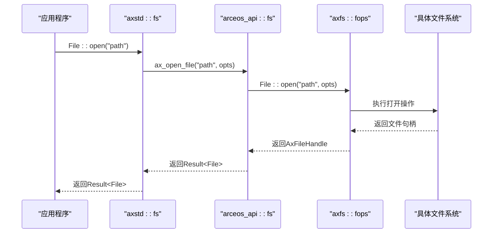
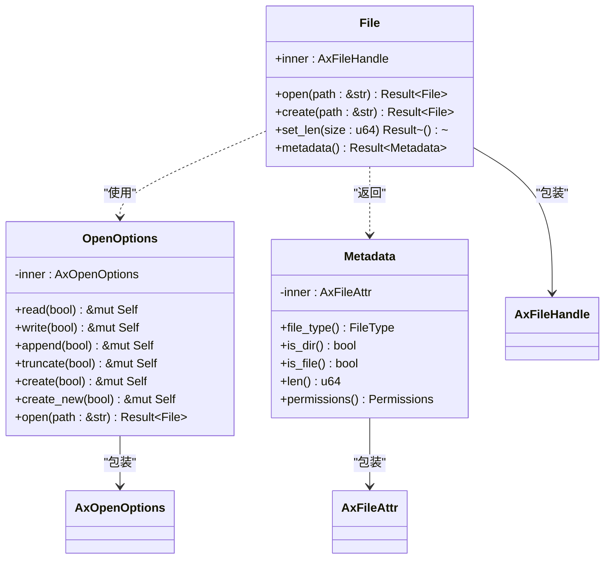
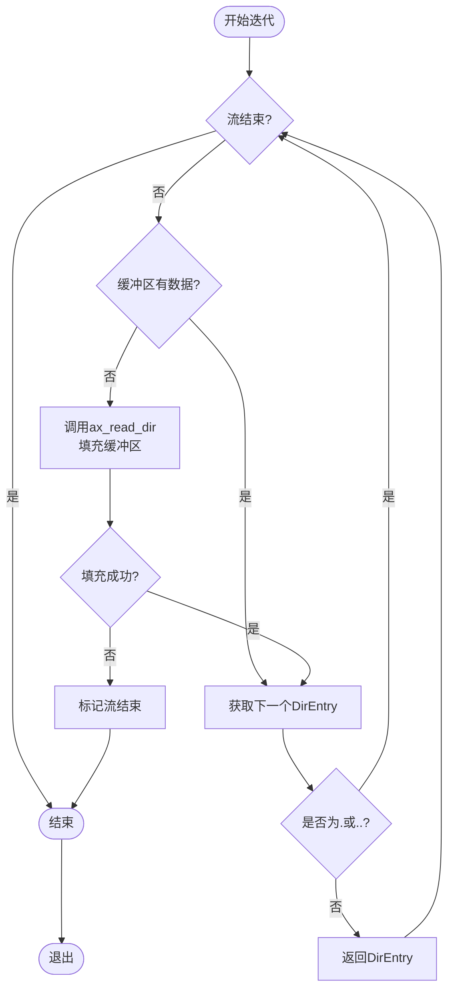
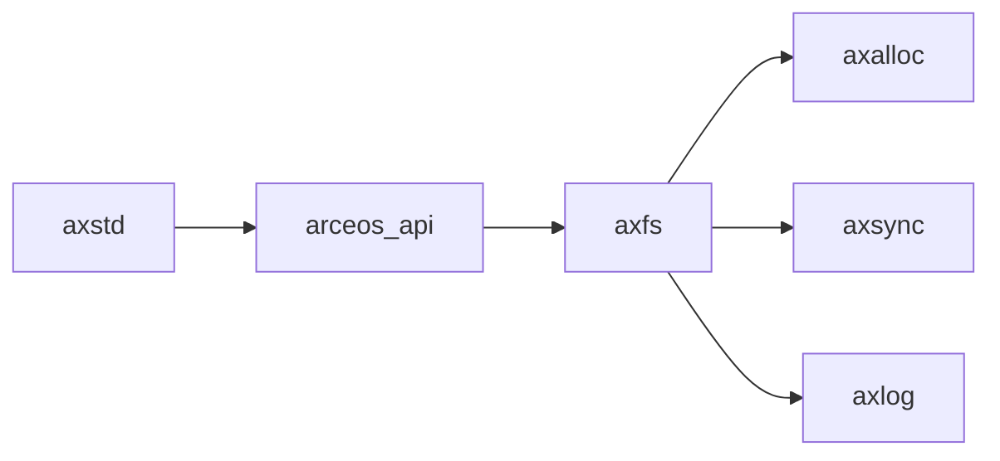

# 文件系统模块

<cite>
**本文档引用的文件**  
- [dir.rs](file://ulib/axstd/src/fs/dir.rs)
- [file.rs](file://ulib/axstd/src/fs/file.rs)
- [mod.rs](file://ulib/axstd/src/fs/mod.rs)
- [fs.rs](file://api/arceos_api/src/imp/fs.rs)
- [dir.rs](file://modules/axfs/src/api/dir.rs)
- [file.rs](file://modules/axfs/src/api/file.rs)
- [mod.rs](file://modules/axfs/src/api/mod.rs)
</cite>

## 目录
1. [简介](#简介)
2. [项目结构](#项目结构)
3. [核心组件](#核心组件)
4. [架构概述](#架构概述)
5. [详细组件分析](#详细组件分析)
6. [依赖分析](#依赖分析)
7. [性能考虑](#性能考虑)
8. [故障排除指南](#故障排除指南)
9. [结论](#结论)

## 简介
本文档旨在深入解析 ArceOS 操作系统中 `axstd` 库的文件系统模块，重点阐述 `fs::File` 和 `fs::Dir` 的 API 设计与异步 I/O 实现机制。文档将说明在 `no_std` 环境下如何通过 ArceOS 内核接口实现 POSIX 风格的文件操作，包括打开、读写、创建目录等行为。同时，结合代码示例展示非阻塞文件访问模式及其与底层 `axfs` 模块的交互流程。此外，还将解释路径解析、权限控制及错误处理策略，并对比其与 Rust 标准库 `std::fs` 的行为差异，最后提供性能优化建议和常见陷阱规避方法。

## 项目结构
ArceOS 的文件系统功能分布在多个模块中，形成了清晰的分层架构。顶层是用户空间的 `axstd` 库，它为应用程序提供了类似标准库的 API 接口。该库通过 `arceos_api` 模块与内核态的 `axfs` 模块进行通信。`axfs` 模块实现了文件系统的具体逻辑，包括对不同文件系统（如 FATFS、EXT4FS）的支持以及核心的文件操作原语。

```mermaid
graph TB
subgraph "用户空间"
axstd[axstd::fs]
arceos_api[arceos_api::fs]
end
subgraph "内核空间"
axfs[axfs::fops]
fs_impl["具体文件系统<br/>(fatfs, ext4fs)"]
end
axstd --> arceos_api : "调用内核API"
arceos_api --> axfs : "转发请求"
axfs --> fs_impl : "执行具体操作"
```

**Diagram sources**
- [mod.rs](file://ulib/axstd/src/fs/mod.rs#L1-L77)
- [fs.rs](file://api/arceos_api/src/imp/fs.rs#L1-L87)
- [mod.rs](file://modules/axfs/src/api/mod.rs#L1-L89)

**Section sources**
- [mod.rs](file://ulib/axstd/src/fs/mod.rs#L1-L77)
- [fs.rs](file://api/arceos_api/src/imp/fs.rs#L1-L87)
- [mod.rs](file://modules/axfs/src/api/mod.rs#L1-L89)

## 核心组件
本模块的核心组件包括 `fs::File` 和 `fs::Dir` 结构体，它们分别代表了对文件和目录的操作句柄。`OpenOptions` 结构体用于配置文件打开时的各种标志位（如只读、写入、追加等）。`Metadata` 结构体封装了文件的元数据信息，如大小、类型和权限。`ReadDir` 迭代器则提供了遍历目录内容的能力。这些高层 API 在 `axstd` 中定义，并最终通过 `arceos_api` 调用 `axfs` 模块中的具体实现。

**Section sources**
- [file.rs](file://ulib/axstd/src/fs/file.rs#L1-L187)
- [dir.rs](file://ulib/axstd/src/fs/dir.rs#L1-L154)
- [file.rs](file://modules/axfs/src/api/file.rs#L1-L193)
- [dir.rs](file://modules/axfs/src/api/dir.rs#L1-L150)

## 架构概述
整个文件系统模块采用分层设计，确保了用户空间与内核空间的隔离。`axstd` 提供了符合 Rust 习惯的、易于使用的高级 API。当用户调用这些 API 时，请求会通过 `arceos_api` 这个抽象层传递到内核。`arceos_api` 将高层调用转换为对 `axfs` 模块中 `fops`（文件操作）子模块的具体函数调用。`axfs` 模块负责管理挂载点、解析路径，并将操作委托给具体的文件系统实现（如 `MyFileSystemIf` 或 `Ext4FileSystem`）。



**Diagram sources**
- [file.rs](file://ulib/axstd/src/fs/file.rs#L1-L187)
- [fs.rs](file://api/arceos_api/src/imp/fs.rs#L1-L87)
- [file.rs](file://modules/axfs/src/api/file.rs#L1-L193)

## 详细组件分析

### fs::File 分析
`fs::File` 是一个轻量级的句柄包装器，其内部包含一个指向内核态 `AxFileHandle` 的引用。所有 I/O 操作（读、写、寻址、刷新）都通过 `Read`、`Write` 和 `Seek` trait 实现，并最终调用 `arceos_api` 中对应的函数，如 `ax_read_file` 和 `ax_write_file`。这些函数再进一步调用 `axfs` 模块中 `fops::File` 的具体方法。

#### File 类图


**Diagram sources**
- [file.rs](file://ulib/axstd/src/fs/file.rs#L1-L187)
- [fs.rs](file://api/arceos_api/src/imp/fs.rs#L1-L87)

**Section sources**
- [file.rs](file://ulib/axstd/src/fs/file.rs#L1-L187)

### fs::Dir 分析
`fs::Dir` 的核心是 `ReadDir` 迭代器，它允许逐条读取目录项。`ReadDir` 内部维护一个缓冲区（`dirent_buf`），每次调用 `next()` 方法时，如果缓冲区已空，则会触发一次对 `ax_read_dir` 的系统调用，从内核批量读取多个目录项以提高效率。`DirEntry` 结构体表示单个目录项，包含了名称、类型和父目录路径等信息。

#### ReadDir 迭代流程


**Diagram sources**
- [dir.rs](file://ulib/axstd/src/fs/dir.rs#L1-L154)
- [fs.rs](file://api/arceos_api/src/imp/fs.rs#L1-L87)

**Section sources**
- [dir.rs](file://ulib/axstd/src/fs/dir.rs#L1-L154)

## 依赖分析
文件系统模块的依赖关系清晰地体现了其分层设计。`axstd` 依赖于 `arceos_api` 来进行系统调用，而 `arceos_api` 又直接依赖于 `axfs` 模块来实现文件操作。`axfs` 模块本身可能还依赖于内存分配（`axalloc`）、同步（`axsync`）和日志（`axlog`）等基础服务。这种设计使得上层应用无需关心底层文件系统的具体实现细节。



**Diagram sources**
- [mod.rs](file://ulib/axstd/src/fs/mod.rs#L1-L77)
- [fs.rs](file://api/arceos_api/src/imp/fs.rs#L1-L87)
- [mod.rs](file://modules/axfs/src/api/mod.rs#L1-L89)

**Section sources**
- [mod.rs](file://ulib/axstd/src/fs/mod.rs#L1-L77)
- [fs.rs](file://api/arceos_api/src/imp/fs.rs#L1-L87)

## 性能考虑
为了在 `no_std` 环境下获得最佳性能，应遵循以下建议：
1.  **批量读取目录**：`ReadDir` 的设计已经通过内部缓冲区减少了系统调用次数，这是高效的。
2.  **避免频繁的小I/O操作**：尽量使用较大的缓冲区进行读写，以减少 `ax_read_file` 和 `ax_write_file` 的调用开销。
3.  **合理使用 `OpenOptions`**：明确指定所需的访问模式（只读、写入等），避免不必要的权限检查开销。
4.  **注意路径解析开销**：`axfs` 在处理每个文件操作前都需要解析路径，因此应尽量使用绝对路径或缓存常用路径的句柄。

## 故障排除指南
在使用此文件系统模块时，可能会遇到以下问题：
-   **文件或目录不存在**：检查路径是否正确，特别是相对路径的解析是否符合预期。确保目标文件系统已正确挂载。
-   **权限不足**：虽然当前实现可能简化了权限模型，但仍需确认打开文件时指定了正确的模式（例如，尝试写入只读文件）。
-   **递归创建目录失败**：根据源码，`DirBuilder::recursive(true)` 当前返回 `Unsupported` 错误。需要手动逐级创建目录。
-   **I/O 操作阻塞**：尽管接口设计为异步，但底层实现的行为取决于具体的文件系统驱动。对于网络文件系统，应预期会有延迟。

**Section sources**
- [dir.rs](file://ulib/axstd/src/fs/dir.rs#L1-L154)
- [file.rs](file://ulib/axstd/src/fs/file.rs#L1-L187)
- [fs.rs](file://api/arceos_api/src/imp/fs.rs#L1-L87)

## 结论
ArceOS 的 `axstd` 文件系统模块成功地在 `no_std` 环境中复刻了 `std::fs` 的核心功能，为用户提供了熟悉且安全的 API。其分层架构通过 `arceos_api` 将用户空间与内核空间解耦，保证了系统的稳定性和可维护性。尽管某些高级功能（如递归目录创建）尚不支持，但其核心的打开、读写、元数据查询和目录遍历功能均已完备，为构建更复杂的应用程序奠定了坚实的基础。未来的工作可以集中在完善 POSIX 兼容性、支持更多文件系统类型以及优化异步 I/O 性能上。