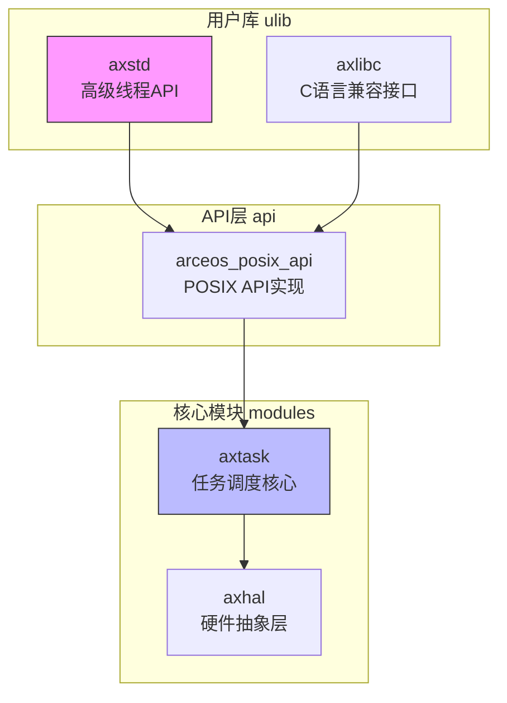
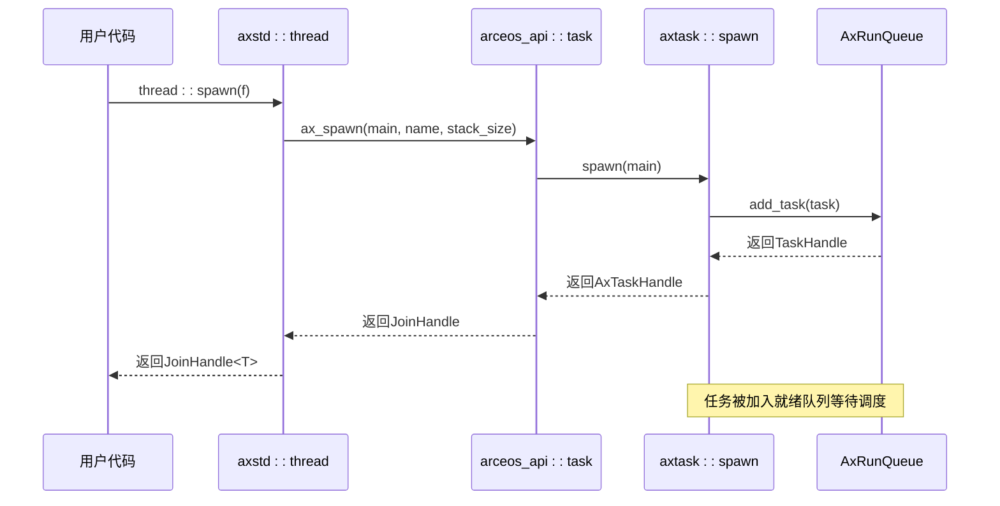
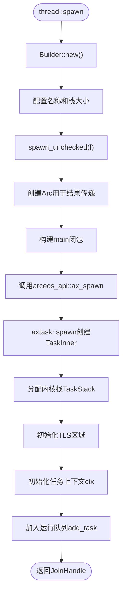
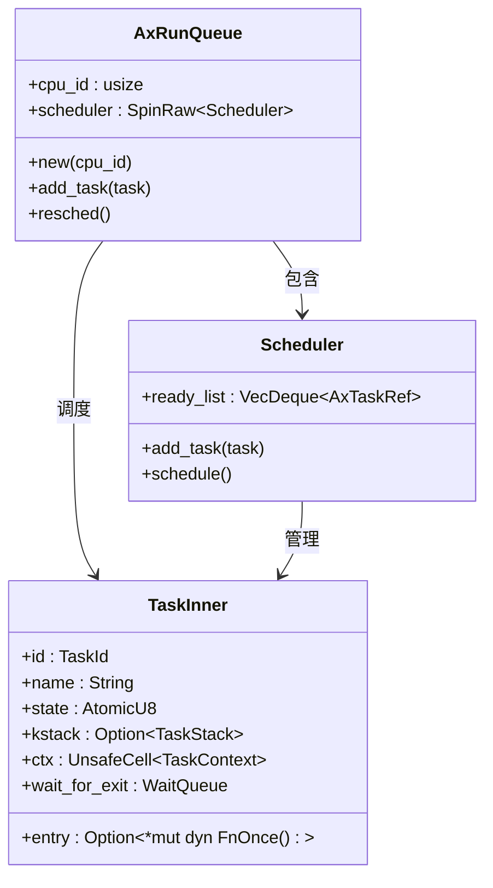
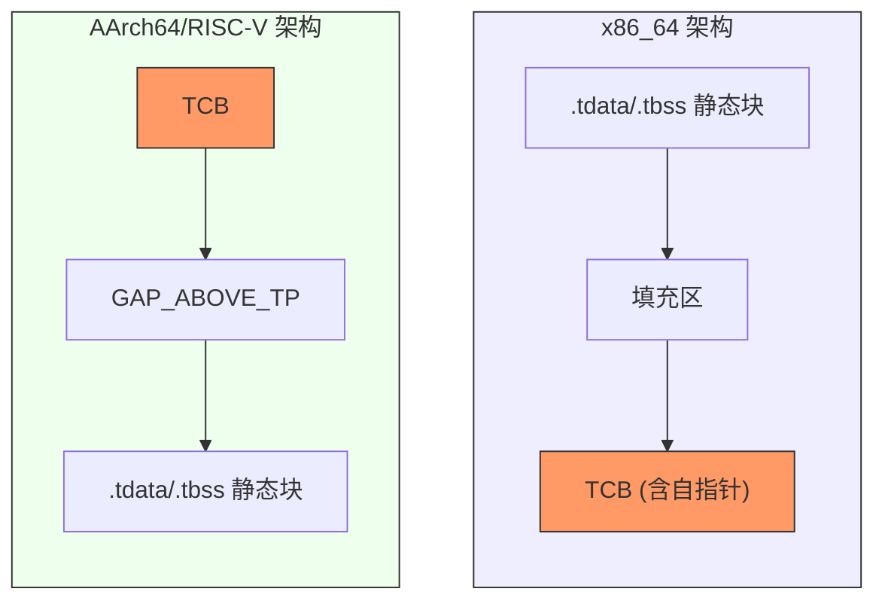
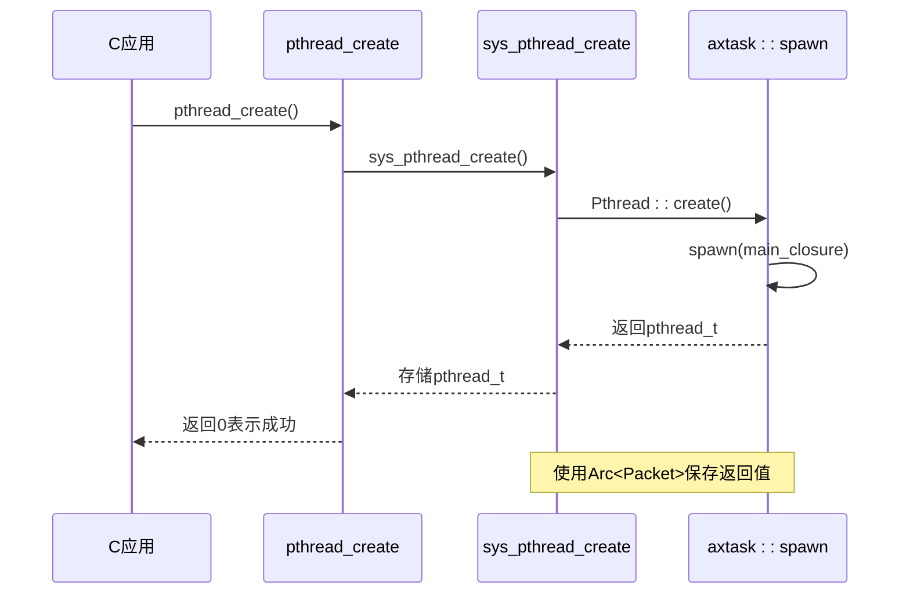
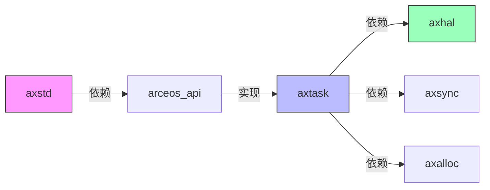

# 线程管理模块

<cite>
**本文档中引用的文件**  
- [multi.rs](file://ulib/axstd/src/thread/multi.rs)
- [mod.rs](file://ulib/axstd/src/thread/mod.rs)
- [task.rs](file://modules/axtask/src/task.rs)
- [tls.rs](file://modules/axhal/src/tls.rs)
- [pthread/mod.rs](file://api/arceos_posix_api/src/imp/pthread/mod.rs)
</cite>

## 目录
1. [引言](#引言)
2. [项目结构](#项目结构)
3. [核心组件](#核心组件)
4. [架构概述](#架构概述)
5. [详细组件分析](#详细组件分析)
6. [依赖分析](#依赖分析)
7. [性能考虑](#性能考虑)
8. [故障排除指南](#故障排除指南)
9. [结论](#结论)

## 引言
ArceOS 是一个基于微内核理念设计的操作系统，其线程管理模块在单体内核架构下实现了轻量级并发模型。本文档全面阐述了 `axstd` 线程模块的实现原理，重点解析 `thread::spawn` 的调度机制及其与底层 `axtask` 任务系统的集成方式。同时说明多线程环境下的进程模型、栈分配策略以及线程本地存储（TLS）的支持情况，并通过实际示例展示线程创建、join 操作、panic 传播等行为特性。

## 项目结构
ArceOS 的线程相关功能分布在多个模块中，形成清晰的分层架构：



**图源**
- [multi.rs](file://ulib/axstd/src/thread/multi.rs)
- [pthread/mod.rs](file://api/arceos_posix_api/src/imp/pthread/mod.rs)
- [task.rs](file://modules/axtask/src/task.rs)
- [tls.rs](file://modules/axhal/src/tls.rs)

**节源**
- [multi.rs](file://ulib/axstd/src/thread/multi.rs)
- [task.rs](file://modules/axtask/src/task.rs)

## 核心组件
线程管理模块的核心由四个主要部分构成：高层API（axstd）、POSIX兼容层、任务调度器和硬件抽象层。这些组件协同工作，提供了从Rust原生线程到低级任务控制的完整链条。

**节源**
- [multi.rs](file://ulib/axstd/src/thread/multi.rs)
- [task.rs](file://modules/axtask/src/task.rs)
- [tls.rs](file://modules/axhal/src/tls.rs)

## 架构概述
整个线程系统的调用流程如下所示：



**图源**
- [multi.rs](file://ulib/axstd/src/thread/multi.rs#L91-L130)
- [task.rs](file://modules/axtask/src/task.rs#L100-L141)
- [run_queue.rs](file://modules/axtask/src/run_queue.rs#L221-L240)

**节源**
- [multi.rs](file://ulib/axstd/src/thread/multi.rs)
- [task.rs](file://modules/axtask/src/task.rs)

## 详细组件分析

### 线程创建与调度机制
`thread::spawn` 是创建新线程的主要入口点，它通过一系列封装最终调用底层任务系统完成线程的创建和调度。

#### 创建流程分析


**图源**
- [multi.rs](file://ulib/axstd/src/thread/multi.rs#L91-L130)
- [task.rs](file://modules/axtask/src/task.rs#L100-L141)

**节源**
- [multi.rs](file://ulib/axstd/src/thread/multi.rs#L53-L89)
- [task.rs](file://modules/axtask/src/task.rs#L100-L141)

#### 调度器集成
`axtask` 模块是真正的任务调度核心，每个CPU拥有独立的运行队列（Run Queue），实现了FIFO调度策略。



**图源**
- [run_queue.rs](file://modules/axtask/src/run_queue.rs)
- [task.rs](file://modules/axtask/src/task.rs)

**节源**
- [run_queue.rs](file://modules/axtask/src/run_queue.rs)
- [task.rs](file://modules/axtask/src/task.rs)

### 进程模型与栈分配
在 ArceOS 中，线程即为基本的执行单元，每个线程都有独立的内核栈空间。

#### 内核栈分配
```rust
struct TaskStack {
    ptr: NonNull<u8>,
    layout: Layout,
}
```
内核栈通过 `alloc::alloc::alloc()` 动态分配，大小可配置，默认值由 `arceos_api::config::TASK_STACK_SIZE` 定义。

**节源**
- [task.rs](file://modules/axtask/src/task.rs#L300-L315)

### 线程本地存储（TLS）支持
TLS 支持根据不同架构有不同的内存布局设计。

#### TLS内存布局


**图源**
- [tls.rs](file://modules/axhal/src/tls.rs)

**节源**
- [tls.rs](file://modules/axhal/src/tls.rs)

### POSIX线程兼容性实现
为了提供POSIX线程接口，系统通过 `arceos_posix_api` 模块进行了兼容层封装。



**图源**
- [pthread/mod.rs](file://api/arceos_posix_api/src/imp/pthread/mod.rs)
- [multi.rs](file://ulib/axstd/src/thread/multi.rs)

**节源**
- [pthread/mod.rs](file://api/arceos_posix_api/src/imp/pthread/mod.rs)

### 并发编程实践示例
以下展示了典型的线程使用模式：

#### 基本线程创建与join
```rust
let handle = thread::spawn(|| {
    println!("Hello from spawned thread!");
    42
});

let result = handle.join().unwrap(); // 获取返回值
assert_eq!(result, 42);
```

#### panic传播测试
当子线程发生panic时，join操作会捕获异常并返回错误。

**节源**
- [tests.rs](file://modules/axtask/src/tests.rs#L91-L129)

## 依赖分析
各模块之间的依赖关系如下：



**图源**
- [Cargo.toml](file://modules/axtask/Cargo.toml)
- [mod.rs](file://ulib/axstd/src/thread/mod.rs)

**节源**
- [Cargo.toml](file://modules/axtask/Cargo.toml)

## 性能考虑
- **轻量级切换**：由于采用协作式调度为主，上下文切换开销较小。
- **栈分配优化**：内核栈按需分配，避免内存浪费。
- **无抢占开销**：默认配置下无时间片中断，减少调度干扰。
- **TLS高效访问**：直接映射到硬件线程指针寄存器，访问速度快。

## 故障排除指南
常见问题及解决方案：

| 问题现象 | 可能原因 | 解决方案 |
|--------|--------|--------|
| 线程无法启动 | 栈空间不足 | 检查TASK_STACK_SIZE配置 |
| join操作卡住 | 任务未正确退出 | 确保任务函数正常返回或调用exit |
| TLS变量访问异常 | 架构特定布局错误 | 检查目标平台的tp_offset计算 |
| 多核调度不均 | 缺少负载均衡 | 启用SMP特性并优化选择算法 |

**节源**
- [task.rs](file://modules/axtask/src/task.rs)
- [tls.rs](file://modules/axhal/src/tls.rs)

## 结论
ArceOS 的线程管理模块在单体内核架构下实现了高效的轻量级并发模型。通过 `thread::spawn` 与 `axtask` 系统的紧密集成，提供了简洁而强大的线程创建和管理能力。TLS 支持跨多种架构的兼容性实现，确保了线程本地数据的安全访问。整体设计兼顾了性能与可移植性，为上层应用提供了可靠的并发基础。