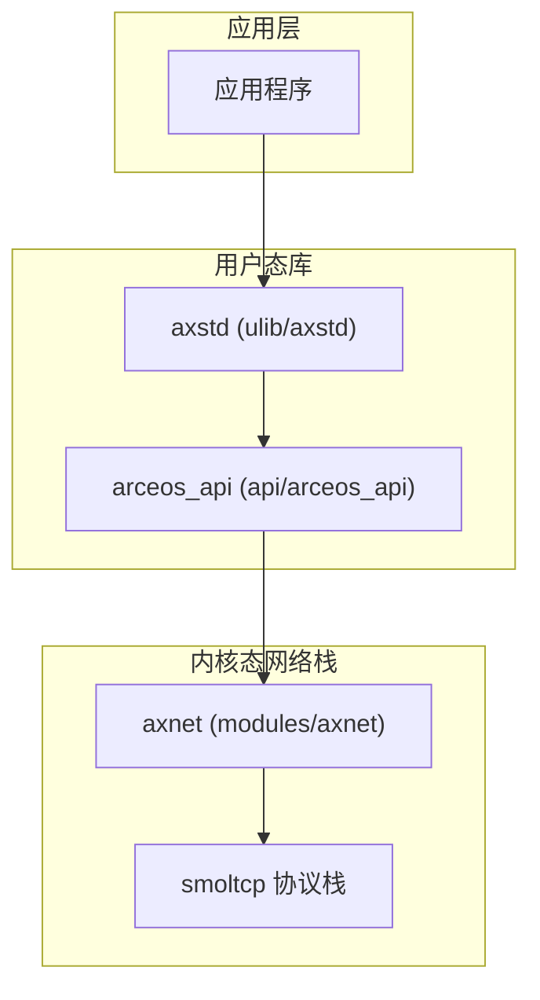
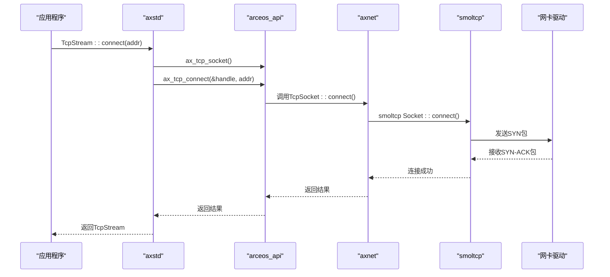
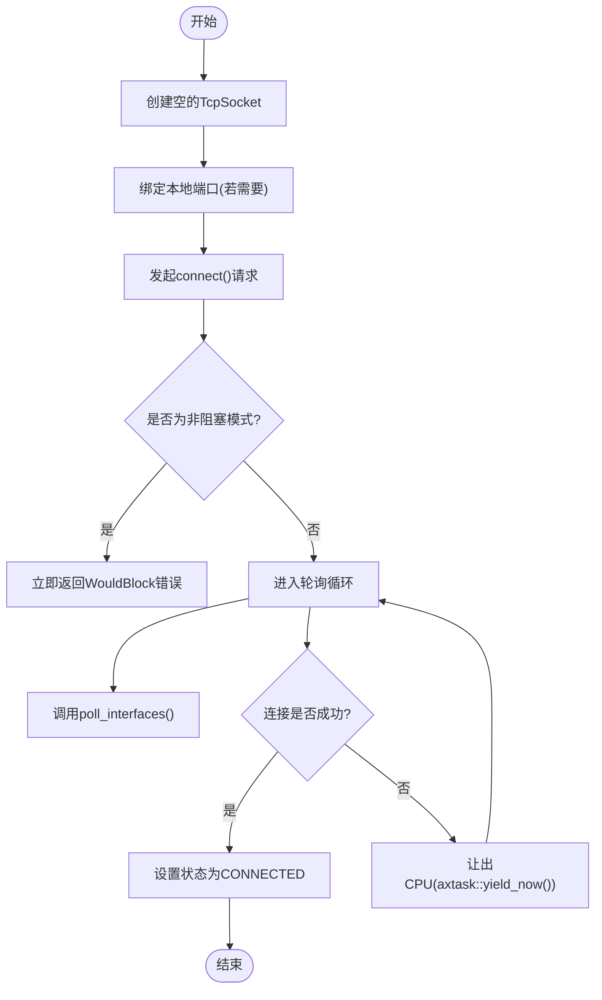
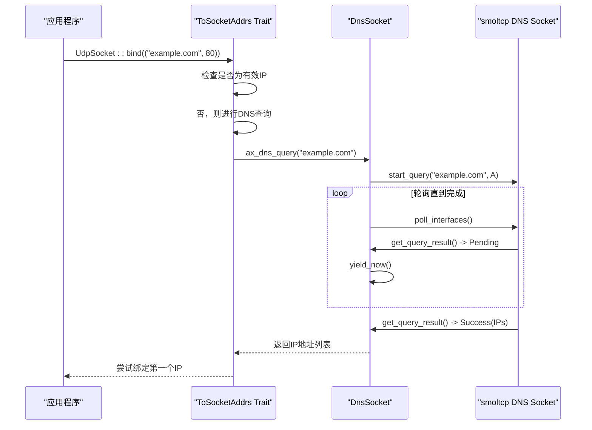
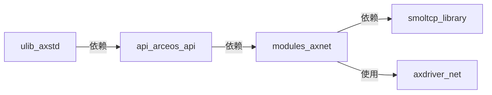

# 网络通信模块

<cite>
**本文档引用的文件**  
- [tcp.rs](file://ulib/axstd/src/net/tcp.rs)
- [udp.rs](file://ulib/axstd/src/net/udp.rs)
- [socket_addr.rs](file://ulib/axstd/src/net/socket_addr.rs)
- [mod.rs](file://ulib/axstd/src/net/mod.rs)
- [net.rs](file://api/arceos_api/src/imp/net.rs)
- [lib.rs](file://modules/axnet/src/lib.rs)
- [tcp.rs](file://modules/axnet/src/smoltcp_impl/tcp.rs)
- [udp.rs](file://modules/axnet/src/smoltcp_impl/udp.rs)
- [mod.rs](file://modules/axnet/src/smoltcp_impl/mod.rs)
- [dns.rs](file://modules/axnet/src/smoltcp_impl/dns.rs)
- [listen_table.rs](file://modules/axnet/src/smoltcp_impl/listen_table.rs)
</cite>

## 目录
1. [引言](#引言)
2. [项目结构](#项目结构)
3. [核心组件](#核心组件)
4. [架构概述](#架构概述)
5. [详细组件分析](#详细组件分析)
6. [依赖分析](#依赖分析)
7. [性能考虑](#性能考虑)
8. [故障排除指南](#故障排除指南)
9. [结论](#结论)

## 引言
本技术文档深入记录了ArceOS操作系统中`axstd`网络模块的设计与实现，重点聚焦于`TcpStream`和`UdpSocket`的非阻塞套接字封装机制。文档详细描述了其底层如何通过`arceos_posix_api`与`axnet`网络栈协同工作，支持TCP连接建立、数据收发、超时控制等关键功能。同时，提供了客户端/服务器编程范例，涵盖地址绑定、监听、连接管理等典型场景。此外，还分析了`SocketAddr`的解析逻辑与跨平台兼容性处理，并说明了与smoltcp协议栈的数据交互路径。

## 项目结构
`axstd`网络模块是ArceOS用户态标准库的一部分，位于`ulib/axstd/src/net/`目录下。该模块向上为应用程序提供符合POSIX规范的高级API，向下则通过`arceos_api`抽象层与内核态的`axnet`网络栈进行交互。`axnet`模块作为网络子系统的核心，基于`smoltcp`协议栈实现了完整的TCP/IP功能。



**图示来源**
- [mod.rs](file://ulib/axstd/src/net/mod.rs#L1-L47)
- [lib.rs](file://modules/axnet/src/lib.rs#L1-L48)

**章节来源**
- [mod.rs](file://ulib/axstd/src/net/mod.rs#L1-L47)
- [lib.rs](file://modules/axnet/src/lib.rs#L1-L48)

## 核心组件
`axstd`网络模块的核心由三个主要部分构成：高层API封装（`TcpStream`, `UdpSocket`）、中间层接口（`arceos_api::net`）以及底层网络栈（`axnet`）。`TcpStream`和`UdpSocket`结构体为开发者提供了面向对象的、易于使用的接口。这些接口调用`arceos_api`中的函数，后者再将请求转发给`axnet`模块中的具体实现。`axnet`模块利用`smoltcp`库来处理所有底层的网络协议细节，如IP分组、TCP状态机和UDP数据报传输。

**章节来源**
- [tcp.rs](file://ulib/axstd/src/net/tcp.rs#L1-L106)
- [udp.rs](file://ulib/axstd/src/net/udp.rs#L1-L97)
- [net.rs](file://api/arceos_api/src/imp/net.rs#L1-L132)

## 架构概述
整个网络通信系统的架构遵循清晰的分层设计。最上层是`axstd`提供的`TcpStream`和`UdpSocket`，它们实现了Rust标准库的`Read`和`Write` trait，使得网络I/O操作如同文件读写一样简单。当应用调用`send()`或`recv()`方法时，请求会通过`arceos_api`定义的C风格函数接口传递到内核空间。在内核空间，`axnet`模块接收这些请求，并将其映射到`smoltcp`协议栈中的相应Socket对象上。`smoltcp`负责与物理网卡驱动程序交互，完成数据包的发送和接收。



**图示来源**
- [tcp.rs](file://ulib/axstd/src/net/tcp.rs#L36-L61)
- [net.rs](file://api/arceos_api/src/imp/net.rs#L20-L48)
- [tcp.rs](file://modules/axnet/src/smoltcp_impl/tcp.rs#L1-L564)

## 详细组件分析

### TcpStream 分析
`TcpStream`是`axstd`中用于TCP通信的主要类型。它封装了一个`AxTcpSocketHandle`，并通过实现`Read`和`Write` trait来提供流式I/O能力。其核心功能包括连接建立、数据收发和连接关闭。

#### TCP连接建立流程


**图示来源**
- [tcp.rs](file://modules/axnet/src/smoltcp_impl/tcp.rs#L1-L564)
- [net.rs](file://api/arceos_api/src/imp/net.rs#L30-L48)

**章节来源**
- [tcp.rs](file://ulib/axstd/src/net/tcp.rs#L36-L61)
- [tcp.rs](file://modules/axnet/src/smoltcp_impl/tcp.rs#L1-L564)

### UdpSocket 分析
`UdpSocket`为无连接的UDP通信提供了接口。与`TcpStream`不同，它可以执行`send_to`和`recv_from`操作，直接指定目标地址或获取发送方地址。

#### UDP数据收发流程
```mermaid
classDiagram
class UdpSocket {
+handle : SocketHandle
+local_addr : RwLock~Option<IpEndpoint>~
+peer_addr : RwLock~Option<IpEndpoint>~
+nonblock : AtomicBool
+bind(local_addr : SocketAddr) : AxResult
+send_to(buf : &[u8], remote_addr : SocketAddr) : AxResult~usize~
+recv_from(buf : &mut [u8]) : AxResult~(usize, SocketAddr)~
+connect(addr : SocketAddr) : AxResult
+send(buf : &[u8]) : AxResult~usize~
+recv(buf : &mut [u8]) : AxResult~usize~
}
class SocketSetWrapper {
-sockets : Mutex~SocketSet~
+add(socket : AnySocket) : SocketHandle
+with_socket_mut(handle : SocketHandle, f : FnOnce(&mut T)) : R
}
class smoltcp : : socket : : udp : : Socket {
+rx_buffer : PacketBuffer
+tx_buffer : PacketBuffer
+bind(endpoint : IpListenEndpoint) : Result<(), BindError>
+send_slice(data : &[u8], endpoint : IpEndpoint) : Result<(), SendError>
+recv_slice(buffer : &mut [u8]) : Result<(usize, Meta), ()>
}
UdpSocket --> SocketSetWrapper : "使用"
UdpSocket --> smoltcp : : socket : : udp : : Socket : "委托"
SocketSetWrapper --> smoltcp : : socket : : udp : : Socket : "持有"
```

**图示来源**
- [udp.rs](file://modules/axnet/src/smoltcp_impl/udp.rs#L1-L296)
- [net.rs](file://api/arceos_api/src/imp/net.rs#L70-L130)

**章节来源**
- [udp.rs](file://ulib/axstd/src/net/udp.rs#L1-L97)
- [udp.rs](file://modules/axnet/src/smoltcp_impl/udp.rs#L1-L296)

### SocketAddr 解析逻辑
`SocketAddr`的解析是网络编程的基础，它允许程序通过域名或IP地址进行通信。

#### 地址解析与DNS查询


**图示来源**
- [socket_addr.rs](file://ulib/axstd/src/net/socket_addr.rs#L1-L191)
- [dns.rs](file://modules/axnet/src/smoltcp_impl/dns.rs#L1-L90)

**章节来源**
- [socket_addr.rs](file://ulib/axstd/src/net/socket_addr.rs#L1-L191)
- [dns.rs](file://modules/axnet/src/smoltcp_impl/dns.rs#L1-L90)

## 依赖分析
`axstd`网络模块的依赖关系清晰地体现了其分层架构。`axstd`直接依赖`arceos_api`以访问内核服务。`arceos_api`又依赖`axnet`来获得具体的网络功能实现。而`axnet`模块本身则深度依赖`smoltcp`库来处理所有的网络协议逻辑。这种设计确保了用户代码与底层硬件和协议栈的解耦，提高了代码的可维护性和可移植性。



**图示来源**
- [Cargo.toml](file://ulib/axstd/Cargo.toml)
- [Cargo.toml](file://api/arceos_api/Cargo.toml)
- [Cargo.toml](file://modules/axnet/Cargo.toml)

**章节来源**
- [mod.rs](file://ulib/axstd/src/net/mod.rs#L1-L47)
- [lib.rs](file://modules/axnet/src/lib.rs#L1-L48)

## 性能考虑
`axstd`网络模块通过非阻塞I/O和高效的事件轮询机制来优化性能。当套接字处于非阻塞模式时，`send`和`recv`操作会立即返回，避免了线程的长时间挂起。对于阻塞操作，系统采用`yield_now()`而非忙等待，这保证了CPU资源的有效利用。此外，`axnet`模块中的`LISTEN_TABLE`使用固定大小的数组来索引监听端口，确保了`accept`操作的时间复杂度为O(1)，这对于高并发的服务器应用至关重要。

## 故障排除指南
常见的网络问题通常源于配置错误或资源耗尽。例如，`bind`失败可能是因为端口已被占用（`AddrInUse`），此时应检查`LISTEN_TABLE`的状态。`connect`失败可能是由于网络不可达或远程主机拒绝连接（`ConnectionRefused`），建议检查防火墙设置和目标服务状态。如果遇到`WouldBlock`错误，这通常是正常的非阻塞I/O行为，程序应正确处理此错误并稍后重试。对于DNS查询失败，应验证`AX_IP`和`AX_GW`环境变量是否正确设置，并确认DNS服务器可达。

**章节来源**
- [tcp.rs](file://modules/axnet/src/smoltcp_impl/tcp.rs#L1-L564)
- [udp.rs](file://modules/axnet/src/smoltcp_impl/udp.rs#L1-L296)
- [dns.rs](file://modules/axnet/src/smoltcp_impl/dns.rs#L1-L90)

## 结论
综上所述，ArceOS的`axstd`网络模块通过精心设计的分层架构，成功地将复杂的网络通信功能封装成简洁易用的API。它不仅实现了标准的TCP和UDP套接字功能，还通过与`smoltcp`协议栈的深度集成，确保了高性能和高可靠性。其非阻塞I/O模型和对DNS解析的支持，使其能够满足现代网络应用的需求。未来的工作可以集中在进一步优化性能监控和提供更多高级网络特性上。