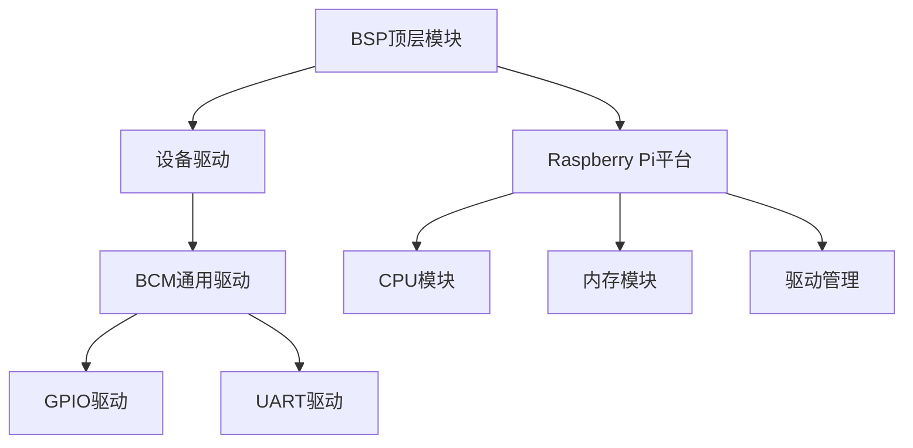
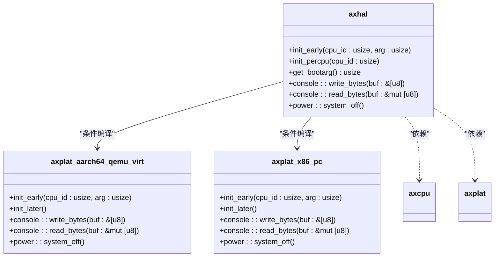
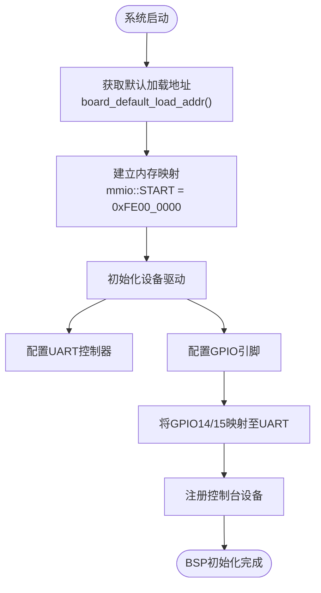
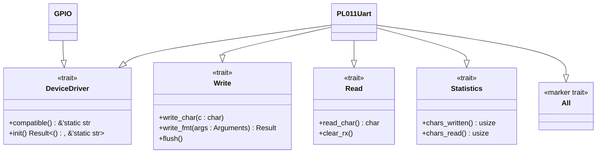

# BSP模块概述与设计原则

<cite>
**本文档引用的文件**
- [lib.rs](file://modules/axhal/src/lib.rs)
- [bsp.rs](file://tools/raspi4/chainloader/src/bsp.rs)
- [raspberrypi.rs](file://tools/raspi4/chainloader/src/bsp/raspberrypi.rs)
- [memory.rs](file://tools/raspi4/chainloader/src/bsp/raspberrypi/memory.rs)
- [driver.rs](file://tools/raspi4/chainloader/src/bsp/raspberrypi/driver.rs)
- [bcm2xxx_gpio.rs](file://tools/raspi4/chainloader/src/bsp/device_driver/bcm/bcm2xxx_gpio.rs)
- [bcm2xxx_pl011_uart.rs](file://tools/raspi4/chainloader/src/bsp/device_driver/bcm/bcm2xxx_pl011_uart.rs)
- [Cargo.toml](file://modules/axhal/Cargo.toml)
</cite>

## 目录
1. [引言](#引言)
2. [BSP模块结构分析](#bsp模块结构分析)
3. [硬件抽象层接口实现](#硬件抽象层接口实现)
4. [Raspi4平台实例分析](#raspi4平台实例分析)
5. [模块化设计与Trait接口](#模块化设计与trait接口)
6. [初始化顺序与协调机制](#初始化顺序与协调机制)
7. [最佳实践建议](#最佳实践建议)
8. [结论](#结论)

## 引言
板级支持包（BSP）在Arceos系统中扮演着关键角色，作为连接硬件平台与操作系统内核的桥梁。它为axhal模块提供了一套统一的硬件抽象接口，屏蔽了不同硬件平台之间的差异性，使得上层内核代码能够以一致的方式访问CPU、内存和外设等底层资源。通过条件编译机制，BSP实现了对多种目标平台的支持，包括x86-pc、riscv64-qemu-virt、aarch64-qemu-virt以及aarch64-raspi等。这种设计不仅提高了系统的可移植性，还简化了针对特定平台的开发工作。

## BSP模块结构分析



**图示来源**
- [bsp.rs](file://tools/raspi4/chainloader/src/bsp.rs#L1-L12)
- [raspberrypi.rs](file://tools/raspi4/chainloader/src/bsp/raspberrypi.rs#L1-L25)

**本节来源**
- [bsp.rs](file://tools/raspi4/chainloader/src/bsp.rs#L1-L12)
- [raspberrypi.rs](file://tools/raspi4/chainloader/src/bsp/raspberrypi.rs#L1-L25)

BSP模块采用分层架构设计，顶层模块`bsp.rs`负责根据编译特征条件性地导入具体平台的实现。对于Raspberry Pi系列平台，通过`#[cfg(any(feature = "bsp_rpi3", feature = "bsp_rpi4"))]`条件编译指令引入`raspberrypi`子模块。该子模块进一步划分为CPU、内存和驱动三个核心组件，分别处理处理器核心、物理内存映射和外设驱动的初始化工作。设备驱动部分则独立组织在`device_driver`模块中，其中`bcm`子模块封装了Broadcom SoC特有的GPIO和PL011 UART控制器驱动。

## 硬件抽象层接口实现



**图示来源**
- [lib.rs](file://modules/axhal/src/lib.rs#L1-L143)
- [Cargo.toml](file://modules/axhal/Cargo.toml#L1-L25)

**本节来源**
- [lib.rs](file://modules/axhal/src/lib.rs#L1-L143)

axhal模块作为硬件抽象层的核心，通过条件编译机制链接到具体的平台实现库。当目标架构为aarch64时，会链接`axplat_aarch64_qemu_virt`；当为x86_64时，则链接`axplat_x86_pc`。这些平台特定的crate提供了底层硬件操作的具体实现，而axhal向上层提供统一的API接口。例如，`console::write_bytes`和`console::read_bytes`函数被重新导出，使得上层代码无需关心底层串口或显示设备的具体实现细节。此外，`init_early`和`init_percpu`等初始化函数确保了系统启动早期阶段的正确执行顺序。

## Raspi4平台实例分析



**图示来源**
- [memory.rs](file://tools/raspi4/chainloader/src/bsp/raspberrypi/memory.rs#L1-L47)
- [driver.rs](file://tools/raspi4/chainloader/src/bsp/raspberrypi/driver.rs#L1-L71)
- [bcm2xxx_gpio.rs](file://tools/raspi4/chainloader/src/bsp/device_driver/bcm/bcm2xxx_gpio.rs#L1-L228)
- [bcm2xxx_pl011_uart.rs](file://tools/raspi4/chainloader/src/bsp/device_driver/bcm/bcm2xxx_pl011_uart.rs#L1-L402)

**本节来源**
- [memory.rs](file://tools/raspi4/chainloader/src/bsp/raspberrypi/memory.rs#L1-L47)
- [driver.rs](file://tools/raspi4/chainloader/src/bsp/raspberrypi/driver.rs#L1-L71)

以Raspberry Pi 4平台为例，BSP的实现充分体现了其硬件适配能力。首先，`memory.rs`文件定义了该平台的物理内存映射，其中MMIO区域起始地址为`0xFE00_0000`，GPIO控制器位于偏移`0x0020_0000`处，而PL011 UART控制器位于偏移`0x0020_1000`处。在驱动初始化过程中，系统首先创建全局的`PL011_UART`和`GPIO`静态实例，然后通过`driver_manager().register_driver()`注册这些设备驱动。特别地，在GPIO驱动的`map_pl011_uart()`方法中，通过修改GPFSEL寄存器将GPIO14和15配置为ALT0功能，从而实现UART收发功能的引脚复用。

## 模块化设计与Trait接口



**图示来源**
- [bcm2xxx_pl011_uart.rs](file://tools/raspi4/chainloader/src/bsp/device_driver/bcm/bcm2xxx_pl011_uart.rs#L1-L402)
- [bcm2xxx_gpio.rs](file://tools/raspi4/chainloader/src/bsp/device_driver/bcm/bcm2xxx_gpio.rs#L1-L228)

**本节来源**
- [bcm2xxx_pl011_uart.rs](file://tools/raspi4/chainloader/src/bsp/device_driver/bcm/bcm2xxx_pl011_uart.rs#L1-L402)

BSP采用Rust语言的Trait机制实现模块化设计和接口抽象。设备驱动基类`DeviceDriver`定义了所有驱动必须实现的`compatible`和`init`方法，确保了驱动管理器能够统一识别和初始化各类硬件设备。对于控制台设备，通过组合`Write`、`Read`、`Statistics`等多个Trait来构建完整功能。`PL011Uart`结构体同时实现了这四个Trait，使其既能作为通用设备被管理，又能提供完整的串行通信能力。这种基于Trait的组合式设计避免了传统继承体系的复杂性，提高了代码的灵活性和可维护性。

## 初始化顺序与协调机制

```mermaid
sequenceDiagram
    participant Kernel as 内核
