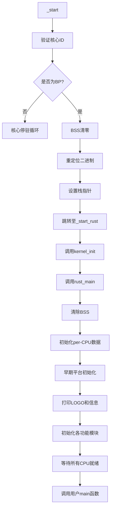
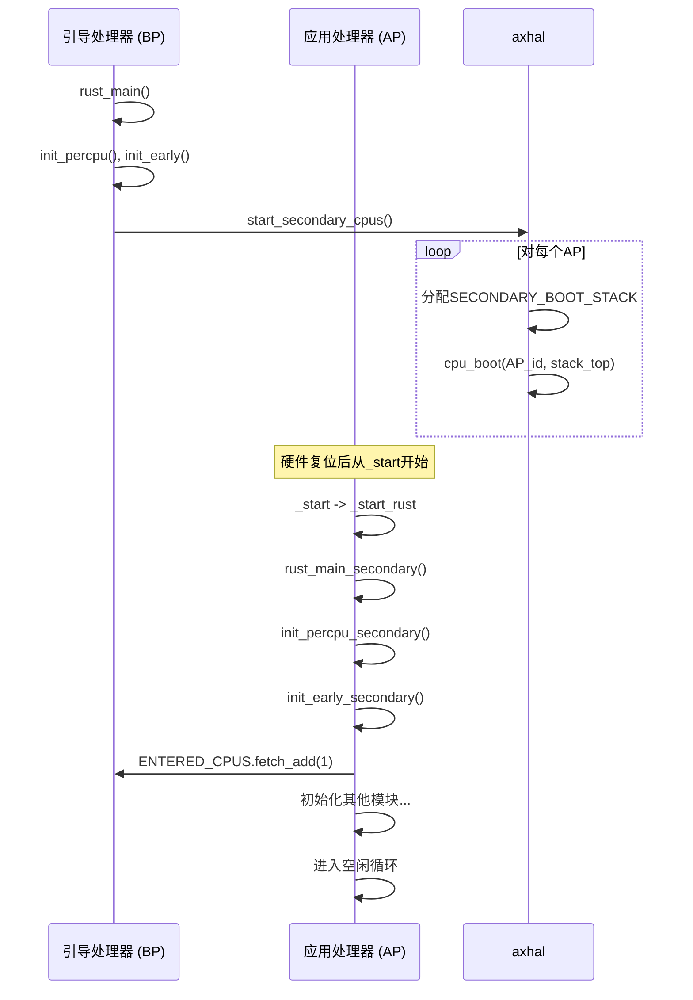
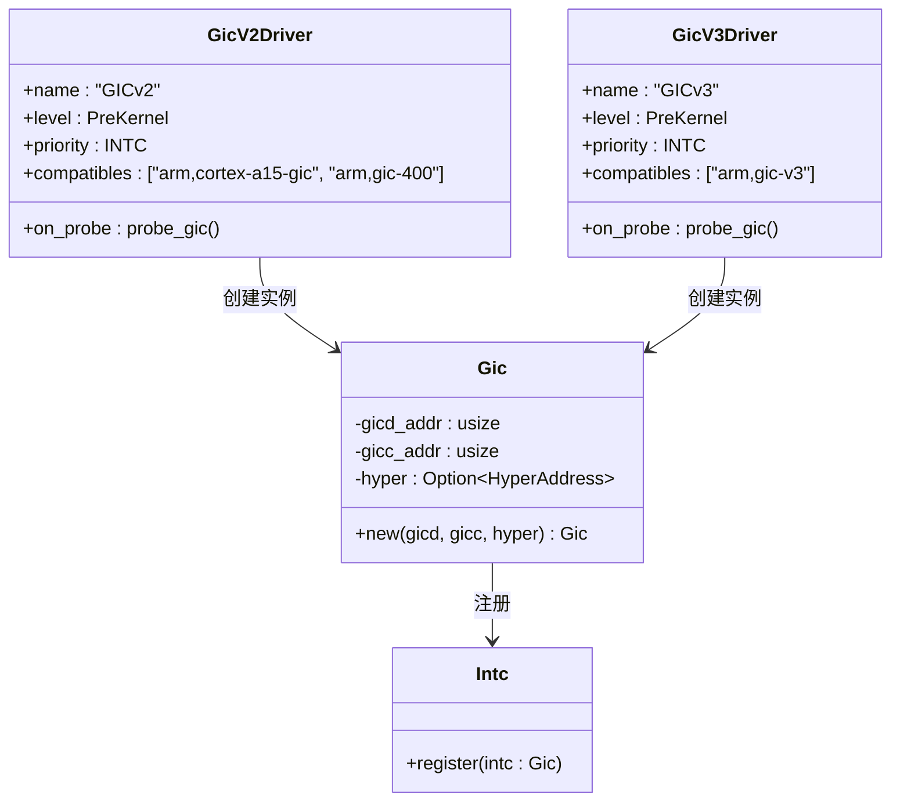

# CPU初始化流程详解

<cite>
**本文档引用的文件**
- [boot.s](file://tools/raspi4/chainloader/src/_arch/aarch64/cpu/boot.s)
- [boot.rs](file://tools/raspi4/chainloader/src/_arch/aarch64/cpu/boot.rs)
- [cpu.rs](file://tools/raspi4/chainloader/src/bsp/raspberrypi/cpu.rs)
- [memory.rs](file://tools/raspi4/chainloader/src/bsp/raspberrypi/memory.rs)
- [lib.rs](file://modules/axhal/src/lib.rs)
- [mp.rs](file://modules/axruntime/src/mp.rs)
- [gicv2.rs](file://modules/axdriver/src/dyn_drivers/intc/gicv2.rs)
- [gicv3.rs](file://modules/axdriver/src/dyn_drivers/intc/gicv3.rs)
</cite>

## 目录
1. [启动入口与汇编层初始化](#启动入口与汇编层初始化)
2. [Rust主函数调用链路](#rust主函数调用链路)
3. [多核SMP启动机制](#多核smp启动机制)
4. [CPU时钟、缓存与中断控制器初始化](#cpu时钟缓存与中断控制器初始化)
5. [常见错误与调试方法](#常见错误与调试方法)

## 启动入口与汇编层初始化

树莓派4平台的CPU启动过程始于汇编代码中的 `_start` 入口。该过程首先通过读取 `MPIDR_EL1` 寄存器获取当前核心的物理ID，并与由BSP模块定义的引导核心ID（`BOOT_CORE_ID`）进行比对，确保仅引导处理器（Bootstrap Processor, BP）继续执行，其余应用处理器（Application Processor, AP）进入等待循环。

在确认为BP后，系统依次执行以下关键步骤：
1. **BSS段清零**：将 `.bss` 段内存区域初始化为0。
2. **二进制重定位**：将内核镜像从加载地址复制到其链接地址，以支持位置无关代码。
3. **栈指针配置**：设置指向预分配的启动栈顶的栈指针（SP）。
4. **跳转至Rust代码**：最终通过绝对跳转指令（`br`）调用Rust世界入口 `_start_rust`。

此阶段完成了从裸机环境到高级语言运行环境的过渡，为后续的Rust初始化奠定了基础。

**Section sources**
- [boot.s](file://tools/raspi4/chainloader/src/_arch/aarch64/cpu/boot.s#L70-L88)
- [cpu.rs](file://tools/raspi4/chainloader/src/bsp/raspberrypi/cpu.rs#L10-L13)

## Rust主函数调用链路

汇编层的 `_start_rust` 函数是连接汇编与Rust世界的桥梁，它直接调用 `crate::kernel_init()` 进入平台无关的初始化流程。随后，控制权传递至 `axruntime` 模块的 `rust_main` 函数。

`rust_main` 的调用链路如下：
1. **清除BSS段**：调用 `axhal::mem::clear_bss()` 确保未初始化数据段被清零。
2. **初始化CPU本地数据**：调用 `axhal::init_percpu(cpu_id)` 为当前CPU建立本地存储结构。
3. **早期平台初始化**：调用 `axhal::init_early(cpu_id, arg)` 完成平台相关的早期设置，如解析设备树参数。
4. **打印系统信息**：输出架构、平台、构建模式等诊断信息。
5. **功能模块初始化**：根据编译特性（features），依次初始化内存管理（`paging`）、中断处理（`irq`）、全局构造函数（`ctor`）等。
6. **等待所有CPU就绪**：主核在此处自旋等待所有次级CPU完成初始化。
7. **执行用户主函数**：最后调用 `main()`，即用户应用程序的入口点。

**Diagram sources**
- [boot.rs](file://tools/raspi4/chainloader/src/_arch/aarch64/cpu/boot.rs#L29-L31)
- [lib.rs](file://modules/axruntime/src/lib.rs#L90-L131)

**Section sources**
- [boot.rs](file://tools/raspi4/chainloader/src/_arch/aarch64/cpu/boot.rs#L29-L31)
- [lib.rs](file://modules/axruntime/src/lib.rs#L90-L131)

## 多核SMP启动机制

在对称多处理（SMP）环境下，系统的启动分为引导处理器（BP）和应用处理器（AP）两个角色。

**引导处理器（BP）流程**：
BP在完成自身初始化后，负责唤醒并初始化所有AP。这通过 `axruntime::start_secondary_cpus` 函数实现。该函数遍历所有CPU ID，为每个AP分配一个专用的启动栈（`SECONDARY_BOOT_STACK`），并将栈顶的物理地址作为参数，调用 `axhal::power::cpu_boot` 触发次级CPU的启动。

**应用处理器（AP）流程**：
每个AP的启动由硬件或固件触发，其初始执行流同样从 `_start` 开始。经过核心ID检查后，AP会执行与BP相同的重定位和栈设置步骤，然后跳转到 `_start_rust`。此时，由于 `cpu_id` 非零，它将进入 `rust_main_secondary` 函数。

`rust_main_secondary` 的执行流程包括：
1. 初始化本CPU的本地数据结构（`init_percpu_secondary`）。
2. 执行次级CPU的早期初始化（`init_early_secondary`）。
3. 更新原子计数器 `ENTERED_CPUS`，通知BP本CPU已进入。
4. 根据特性初始化内存管理、调度器等模块。
5. 最终进入空闲任务循环或等待中断。

这种机制确保了所有CPU都能正确地初始化其本地状态，并同步加入到全局系统中。

**Diagram sources**
- [mp.rs](file://modules/axruntime/src/mp.rs#L0-L72)
- [lib.rs](file://modules/axhal/src/lib.rs#L91-L142)

**Section sources**
- [mp.rs](file://modules/axruntime/src/mp.rs#L0-L72)

## CPU时钟、缓存与中断控制器初始化

### CPU时钟与缓存
CPU时钟和缓存的初始化通常由底层平台（`axplat`）或硬件抽象层（`axhal`）在 `init_early` 或 `init_later` 阶段完成。具体的初始化代码位于特定于平台的crate中（如 `axplat_aarch64_raspi`）。虽然在当前上下文中未直接体现，但这些操作是确保CPU稳定运行的关键前置步骤。

### 中断控制器（GIC）初始化
ArceOS通过动态驱动框架（`rdrive`）自动探测并初始化中断控制器。对于树莓派4，其使用的是GICv2或GICv3。

- **GICv2初始化**：当设备树（FDT）节点匹配 `"arm,cortex-a15-gic"` 或 `"arm,gic-400"` 时，`probe_gic` 函数会被调用。该函数通过 `iomap` 将GIC Distributor (GICD) 和 CPU Interface (GICC) 的物理地址映射到虚拟地址，然后创建 `Gic` 实例并注册为中断控制器。
- **GICv3初始化**：类似地，对于 `"arm,gic-v3"` 设备，会映射GICD和Redistributor (GICR) 的地址来完成初始化。

这一过程发生在内核主初始化之前（`ProbeLevel::PreKernel`），确保中断系统在任何中断使能前就绪。

**Diagram sources**
- [gicv2.rs](file://modules/axdriver/src/dyn_drivers/intc/gicv2.rs#L0-L60)
- [gicv3.rs](file://modules/axdriver/src/dyn_drivers/intc/gicv3.rs#L0-L43)

**Section sources**
- [gicv2.rs](file://modules/axdriver/src/dyn_drivers/intc/gicv2.rs#L0-L60)
- [gicv3.rs](file://modules/axdriver/src/dyn_drivers/intc/gicv3.rs#L0-L43)

## 常见错误与调试方法

### 常见错误
1. **次级CPU无法启动**：最常见的原因是次级CPU的启动栈未正确分配或栈顶物理地址计算错误。需检查 `SECONDARY_BOOT_STACK` 的链接段属性和 `virt_to_phys` 转换逻辑。
2. **中断不工作**：若GIC驱动未能成功探测到设备树节点，中断将无法初始化。应检查设备树兼容性字符串是否匹配，以及内存映射（`iomap`）是否成功。
3. **BSP配置错误**：例如，`BOOT_CORE_ID` 设置错误会导致所有核心都进入停驻循环，系统无响应。
4. **重定位失败**：如果链接脚本（linker script）定义的 `__binary_nonzero_start` 地址与实际不符，可能导致代码复制错误。

### 调试方法
1. **JTAG调试**：推荐使用JTAG进行底层调试。如文档所述，可通过 `make jtagboot`、`make openocd` 和 `make gdb` 组合命令，在系统早期阶段（如 `_start`）设置断点，单步跟踪寄存器状态和内存布局。
2. **串口日志**：利用树莓派的UART接口输出调试信息。确保 `axlog` 模块已启用，并在关键路径插入 `info!` 或 `debug!` 日志。
3. **静态分析**：仔细审查链接脚本和内存映射定义，确保 `.text.boot`、`.bss.stack` 等特殊段的地址和大小符合预期。
4. **简化测试**：在调试SMP问题时，可先禁用SMP（`SMP=1`）以验证单核路径的正确性，再逐步恢复多核功能。

**Section sources**
- [doc/jtag_debug_in_raspi4.md](file://doc/jtag_debug_in_raspi4.md#L84-L150)
- [platform_raspi4.md](file://doc/platform_raspi4.md#L11-L28)