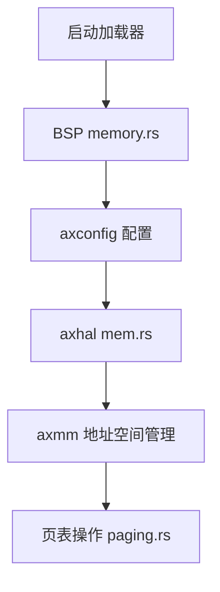
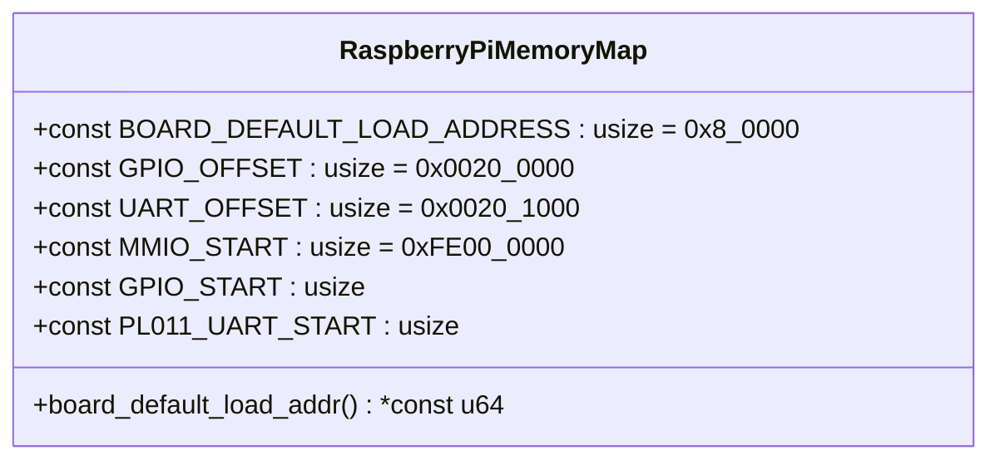
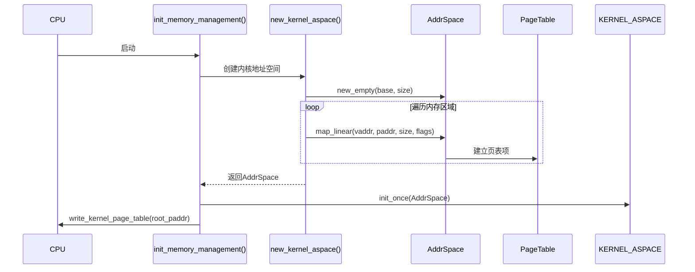
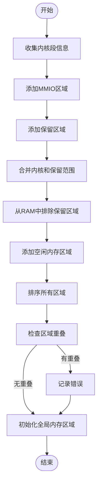

# 内存布局与物理内存映射

<cite>
**本文档引用文件**  
- [memory.rs](file://tools/raspi4/chainloader/src/bsp/raspberrypi/memory.rs)
- [lib.rs](file://modules/axmm/src/lib.rs)
- [aspace.rs](file://modules/axmm/src/aspace.rs)
- [mem.rs](file://modules/axhal/src/mem.rs)
- [paging.rs](file://modules/axhal/src/paging.rs)
- [lib.rs](file://modules/axconfig/src/lib.rs)
- [build.rs](file://modules/axconfig/build.rs)
- [dummy.toml](file://configs/dummy.toml)
- [defconfig.toml](file://configs/defconfig.toml)
</cite>

## 目录
1. [引言](#引言)
2. [项目结构概述](#项目结构概述)
3. [BSP内存布局定义](#bsp内存布局定义)
4. [核心内存管理模块分析](#核心内存管理模块分析)
5. [地址空间与页表映射机制](#地址空间与页表映射机制)
6. [物理内存区域划分实现](#物理内存区域划分实现)
7. [axmm模块交互机制](#axmm模块交互机制)
8. [内存冲突排查指南](#内存冲突排查指南)
9. [性能优化建议](#性能优化建议)
10. [结论](#结论)

## 引言
本文深入解析ArceOS在树莓派4平台上的内存布局规划与物理地址空间映射策略。重点阐述通过板级支持包（BSP）定义内核镜像加载地址、可用RAM区域及设备MMIO保留区等关键参数的机制。详细说明`memory.rs`中内存区域划分的实现逻辑，包括页表初始映射、静态虚拟地址分配以及与`axmm`模块的交互方式。同时提供内存冲突排查指南和性能优化建议，确保高效利用嵌入式系统有限的内存资源。

## 项目结构概述
ArceOS项目采用模块化设计，内存管理相关代码分布在多个模块中：
- `tools/raspi4/chainloader/src/bsp/raspberrypi/memory.rs`：树莓派4平台特定的内存布局定义
- `modules/axmm/`：核心内存管理模块，负责虚拟地址空间管理
- `modules/axhal/src/mem.rs`：硬件抽象层的物理内存管理
- `modules/axconfig/`：平台配置参数管理
- `configs/`：平台配置文件

这些组件协同工作，构建了完整的内存管理系统。

**图示来源**
- [memory.rs](file://tools/raspi4/chainloader/src/bsp/raspberrypi/memory.rs)
- [lib.rs](file://modules/axmm/src/lib.rs)
- [mem.rs](file://modules/axhal/src/mem.rs)
- [paging.rs](file://modules/axhal/src/paging.rs)

**本节来源**
- [memory.rs](file://tools/raspi4/chainloader/src/bsp/raspberrypi/memory.rs)
- [lib.rs](file://modules/axmm/src/lib.rs)
- [mem.rs](file://modules/axhal/src/mem.rs)

## BSP内存布局定义
树莓派4平台的内存布局由BSP中的`memory.rs`文件明确定义，包含内核加载地址、GPIO和UART设备偏移量以及MMIO区域起始地址等关键参数。

### 内核加载地址配置
树莓派固件默认将二进制镜像加载到固定物理地址，该地址由常量`BOARD_DEFAULT_LOAD_ADDRESS`定义为`0x8_0000`（即512KB处）。此地址作为内核镜像的起始加载位置，确保与树莓派固件的兼容性。

### 设备MMIO区域映射
针对树莓派4平台，MMIO区域被映射到`0xFE00_0000`起始的物理地址空间。具体设备包括：
- GPIO控制器：位于`MMIO_START + GPIO_OFFSET`
- PL011 UART控制器：位于`MMIO_START + UART_OFFSET`

这种布局确保了外设寄存器能够通过内存映射I/O方式进行访问。

**图示来源**
- [memory.rs](file://tools/raspi4/chainloader/src/bsp/raspberrypi/memory.rs)

**本节来源**
- [memory.rs](file://tools/raspi4/chainloader/src/bsp/raspberrypi/memory.rs)

## 核心内存管理模块分析
ArceOS的内存管理由`axmm`模块为核心，结合`axhal`和`axconfig`模块共同实现完整的内存管理功能。

### axconfig配置系统
`axconfig`模块通过TOML配置文件提供平台相关的常量和参数。在编译时，通过`build.rs`脚本读取环境变量`AX_CONFIG_PATH`指定的配置文件，或使用默认的`dummy.toml`作为回退配置。这使得内存布局参数可以灵活配置而无需修改源代码。

### 平台参数定义
在`dummy.toml`配置文件中定义了关键的内存管理参数，包括：
- `phys-memory-base`：物理内存基地址
- `phys-memory-size`：物理内存大小
- `kernel-aspace-base`：内核地址空间基地址
- `kernel-aspace-size`：内核地址空间大小
- `phys-virt-offset`：物理地址与虚拟地址转换偏移量

这些参数在运行时被`axhal`和`axmm`模块使用，以正确初始化内存管理系统。

**本节来源**
- [lib.rs](file://modules/axconfig/src/lib.rs)
- [build.rs](file://modules/axconfig/build.rs)
- [dummy.toml](file://configs/dummy.toml)
- [defconfig.toml](file://configs/defconfig.toml)

## 地址空间与页表映射机制
`axmm`模块提供了完整的虚拟地址空间管理功能，通过`AddrSpace`结构体实现地址空间的创建、映射和管理。

### 内核地址空间初始化
系统启动时调用`init_memory_management()`函数初始化虚拟内存管理系统。该过程包括：
1. 创建新的内核地址空间
2. 遍历所有物理内存区域并建立线性映射
3. 初始化全局内核地址空间单例
4. 设置CPU的页表根地址

### 线性映射实现
`map_linear()`方法用于建立物理地址到虚拟地址的线性映射。它接受物理地址、虚拟地址、大小和映射标志作为参数，创建一个`MemoryArea`并将其添加到地址空间中。这种映射方式适用于需要直接访问物理内存的场景，如设备I/O操作。

### 页表管理
`PageTable`类型封装了架构特定的页表操作，通过`PagingHandlerImpl`与底层物理内存分配器交互。在AArch64架构下，使用`A64PageTable`实现四级页表管理，支持4KB页面大小。

**图示来源**
- [lib.rs](file://modules/axmm/src/lib.rs)
- [aspace.rs](file://modules/axmm/src/aspace.rs)
- [paging.rs](file://modules/axhal/src/paging.rs)

**本节来源**
- [lib.rs](file://modules/axmm/src/lib.rs)
- [aspace.rs](file://modules/axmm/src/aspace.rs)
- [paging.rs](file://modules/axhal/src/paging.rs)

## 物理内存区域划分实现
`axhal::mem`模块负责物理内存区域的管理和初始化，通过`PhysMemRegion`结构体描述不同类型的内存区域。

### 内存区域类型
系统识别多种类型的物理内存区域：
- `.text`段：内核代码区域，只读可执行
- `.rodata`段：只读数据区域
- `.data`和`.bss`段：可读写数据区域
- `boot stack`：启动栈区域
- `free memory`：可用内存区域
- `mmio`：设备内存映射I/O区域
- `reserved`：保留内存区域

### 内存初始化流程
`init()`函数执行以下步骤完成物理内存初始化：
1. 收集内核镜像各段的物理地址范围
2. 添加MMIO和保留内存区域
3. 计算内核镜像占用的物理内存范围
4. 从物理RAM范围中排除所有保留区域
5. 将剩余区域标记为可用内存
6. 检查内存区域是否重叠

这种方法确保了内存管理的安全性和完整性。

### 虚拟地址转换
通过`phys_to_virt`和`virt_to_phys`函数实现物理地址与虚拟地址之间的转换。转换基于`phys-virt-offset`配置参数，允许快速的地址空间映射。

**图示来源**
- [mem.rs](file://modules/axhal/src/mem.rs)

**本节来源**
- [mem.rs](file://modules/axhal/src/mem.rs)

## axmm模块交互机制
`axmm`模块与其他系统组件通过清晰的接口进行交互，实现了高效的内存管理。

### 与axhal的集成
`axmm`通过`axhal::mem`模块获取物理内存信息，并使用`axhal::paging`提供的页表操作接口。`PagingHandlerImpl`结构体实现了`PagingHandler` trait，为页表操作提供物理内存分配和释放功能。

### 内存映射标志转换
`reg_flag_to_map_flag()`函数将`MemRegionFlags`转换为`MappingFlags`，确保内存区域属性正确传递到页表映射中。支持的标志包括读、写、执行、设备内存和非缓存等属性。

### 设备内存映射
`iomap()`函数专门用于设备内存的映射，自动对齐物理和虚拟地址到4KB边界，并设置设备内存标志。映射完成后会刷新TLB以确保一致性。

### 多地址空间管理
系统维护一个全局的内核地址空间单例（`KERNEL_ASPACE`），并通过`new_user_aspace()`函数为用户进程创建独立的地址空间。在非AArch64和LoongArch64架构上，用户地址空间会复制内核页表映射。

**本节来源**
- [lib.rs](file://modules/axmm/src/lib.rs)
- [aspace.rs](file://modules/axmm/src/aspace.rs)
- [mem.rs](file://modules/axhal/src/mem.rs)

## 内存冲突排查指南
在开发和调试过程中，可能会遇到各种内存相关的问题。以下是常见的排查方法：

###