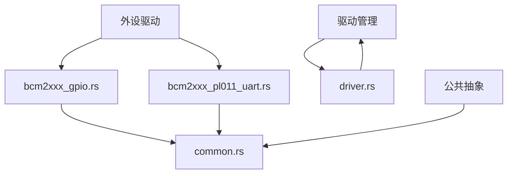
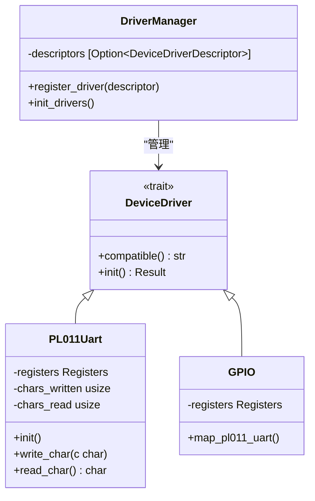
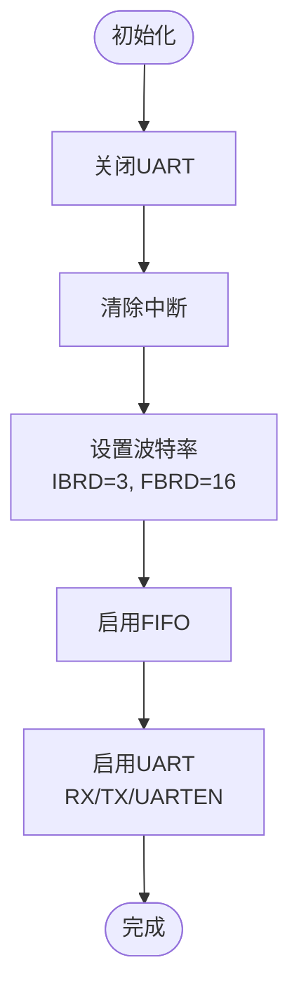
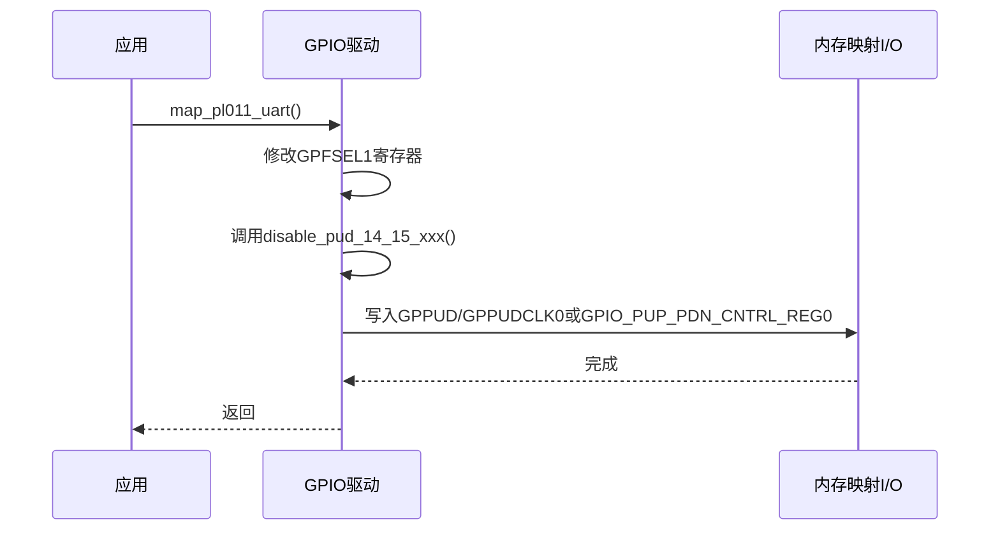
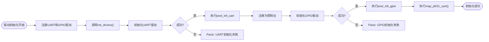

# 基础外设驱动适配

<cite>
**本文档引用文件**  
- [bcm2xxx_gpio.rs](file://tools/raspi4/chainloader/src/bsp/device_driver/bcm/bcm2xxx_gpio.rs)
- [bcm2xxx_pl011_uart.rs](file://tools/raspi4/chainloader/src/bsp/device_driver/bcm/bcm2xxx_pl011_uart.rs)
- [driver.rs](file://tools/raspi4/chainloader/src/bsp/raspberrypi/driver.rs)
- [driver.rs](file://tools/raspi4/chainloader/src/driver.rs)
</cite>

## 目录
1. [简介](#简介)
2. [项目结构](#项目结构)
3. [核心组件](#核心组件)
4. [架构概述](#架构概述)
5. [详细组件分析](#详细组件分析)
6. [依赖分析](#依赖分析)
7. [性能考虑](#性能考虑)
8. [故障排除指南](#故障排除指南)
9. [结论](#结论)

## 简介
本文档旨在指导开发者如何为新平台编写基础外设驱动，以BCM2XXX系列SoC的PL011 UART和GPIO控制器为例。文档将深入解析设备寄存器访问、中断号绑定、时钟使能等硬件操作细节，并展示`driver.rs`中设备驱动注册与初始化的实现模式。特别强调安全封装硬件操作的重要性，同时提供实用的驱动调试技巧，如通过串口输出诊断信息、使用静态分析工具检测数据竞争等。

## 项目结构
本项目采用分层模块化设计，外设驱动主要位于`tools/raspi4/chainloader/src/bsp`目录下，按芯片厂商（如BCM）分类组织。核心驱动管理逻辑位于`src/driver.rs`，提供统一的设备驱动接口和注册机制。GPIO与UART驱动分别实现在独立的Rust模块中，通过公共抽象（如MMIODerefWrapper）实现内存映射I/O的安全访问。



**图示来源**
- [bcm2xxx_gpio.rs](file://tools/raspi4/chainloader/src/bsp/device_driver/bcm/bcm2xxx_gpio.rs)
- [bcm2xxx_pl011_uart.rs](file://tools/raspi4/chainloader/src/bsp/device_driver/bcm/bcm2xxx_pl011_uart.rs)
- [driver.rs](file://tools/raspi4/chainloader/src/driver.rs)
- [common.rs](file://tools/raspi4/chainloader/src/bsp/device_driver/common.rs)

**章节来源**
- [bcm2xxx_gpio.rs](file://tools/raspi4/chainloader/src/bsp/device_driver/bcm/bcm2xxx_gpio.rs)
- [bcm2xxx_pl011_uart.rs](file://tools/raspi4/chainloader/src/bsp/device_driver/bcm/bcm2xxx_pl011_uart.rs)
- [driver.rs](file://tools/raspi4/chainloader/src/driver.rs)

## 核心组件
核心组件包括PL011 UART驱动和GPIO驱动，二者均实现了统一的`DeviceDriver`接口。UART驱动负责串行通信的初始化与数据收发，GPIO驱动则用于配置引脚功能（如将特定引脚映射为UART信号）。驱动管理器（`DriverManager`）负责注册并初始化所有驱动实例，确保系统启动时外设正确就绪。

**章节来源**
- [bcm2xxx_pl011_uart.rs](file://tools/raspi4/chainloader/src/bsp/device_driver/bcm/bcm2xxx_pl011_uart.rs)
- [bcm2xxx_gpio.rs](file://tools/raspi4/chainloader/src/bsp/device_driver/bcm/bcm2xxx_gpio.rs)
- [driver.rs](file://tools/raspi4/chainloader/src/driver.rs)

## 架构概述
系统采用分层驱动架构，上层为通用驱动接口，中层为具体设备驱动实现，底层为硬件抽象。`DeviceDriver` trait定义了驱动的基本行为（如`compatible`和`init`方法），所有具体驱动必须实现该接口。驱动通过`DeviceDriverDescriptor`描述符注册到全局`DriverManager`中，由其统一调度初始化流程。



**图示来源**
- [driver.rs](file://tools/raspi4/chainloader/src/driver.rs#L44-L153)
- [bcm2xxx_pl011_uart.rs](file://tools/raspi4/chainloader/src/bsp/device_driver/bcm/bcm2xxx_pl011_uart.rs#L200-L250)
- [bcm2xxx_gpio.rs](file://tools/raspi4/chainloader/src/bsp/device_driver/bcm/bcm2xxx_gpio.rs#L200-L220)

## 详细组件分析

### PL011 UART 驱动分析
该驱动实现了ARM PL011 UART控制器的完整功能，包括波特率设置、FIFO控制、数据收发等。通过`tock-registers`库提供的类型安全寄存器访问机制，避免了直接的内存操作风险。

#### 寄存器定义与访问
驱动使用`register_bitfields!`和`register_structs!`宏声明寄存器布局和位字段，确保对`FR`（标志寄存器）、`IBRD`（整数波特率除数）、`FBRD`（小数波特率除数）等寄存器的访问是类型安全的。



**图示来源**
- [bcm2xxx_pl011_uart.rs](file://tools/raspi4/chainloader/src/bsp/device_driver/bcm/bcm2xxx_pl011_uart.rs#L100-L180)

#### 安全并发控制
`PL011Uart`结构体内部使用`NullLock`包装`PL011UartInner`，确保在单核环境下对寄存器的访问是原子的，防止并发访问导致的数据竞争。

**章节来源**
- [bcm2xxx_pl011_uart.rs](file://tools/raspi4/chainloader/src/bsp/device_driver/bcm/bcm2xxx_pl011_uart.rs)

### GPIO 驱动分析
GPIO驱动负责配置树莓派SoC的通用输入输出引脚，特别是将GPIO14和GPIO15配置为PL011 UART的TX和RX信号。

#### 引脚功能选择
通过修改`GPFSEL1`寄存器的位域，将引脚14和15的功能设置为`AltFunc0`，即连接到PL011 UART外设。

#### 上拉/下拉电阻控制
根据不同的SoC型号（BCM2837或BCM2711），调用相应的函数（`disable_pud_14_15_bcm2837`或`disable_pud_14_15_bcm2711`）来禁用引脚的内部上下拉电阻，确保信号完整性。



**图示来源**
- [bcm2xxx_gpio.rs](file://tools/raspi4/chainloader/src/bsp/device_driver/bcm/bcm2xxx_gpio.rs#L150-L220)

**章节来源**
- [bcm2xxx_gpio.rs](file://tools/raspi4/chainloader/src/bsp/device_driver/bcm/bcm2xxx_gpio.rs)

### 驱动注册与初始化流程
驱动的注册与初始化遵循严格的顺序，确保硬件资源被正确配置。

#### 驱动注册
在`bsp/raspberrypi/driver.rs`中，创建`PL011_UART`和`GPIO`的静态实例，并通过`driver_manager().register_driver()`将其注册到驱动管理器中，注册时可指定初始化后的回调函数。

#### 初始化顺序
1. 首先初始化UART驱动。
2. 在UART驱动初始化成功后，调用其`post_init_callback`，将UART注册为控制台。
3. 接着初始化GPIO驱动。
4. 在GPIO驱动初始化成功后，调用其`post_init_callback`，执行`GPIO.map_pl011_uart()`，完成引脚复用配置。



**图示来源**
- [driver.rs](file://tools/raspi4/chainloader/src/bsp/raspberrypi/driver.rs#L50-L70)
- [driver.rs](file://tools/raspi4/chainloader/src/driver.rs#L125-L153)

**章节来源**
- [driver.rs](file://tools/raspi4/chainloader/src/bsp/raspberrypi/driver.rs)
- [driver.rs](file://tools/raspi4/chainloader/src/driver.rs)

## 依赖分析
驱动间存在明确的依赖关系：GPIO驱动的`map_pl011_uart`操作依赖于UART外设的存在，而控制台的注册又依赖于UART驱动的成功初始化。这种依赖通过`post_init_callback`机制在初始化阶段安全地解决，避免了循环依赖。

```mermaid
graph LR
DriverManager --> PL011Uart
DriverManager --> GPIO
PL011Uart --> Console[控制台子系统]
GPIO --> PL011Uart : "引脚映射"
```

**图示来源**
- [driver.rs](file://tools/raspi4/chainloader/src/driver.rs)
- [raspberrypi/driver.rs](file://tools/raspi4/chainloader/src/bsp/raspberrypi/driver.rs)

## 性能考虑
- **初始化时机**：驱动在系统启动早期初始化，确保控制台日志能尽早输出。
- **无锁设计**：在单核引导加载程序场景下，使用`NullLock`而非真正的互斥锁，避免不必要的开销。
- **忙等待**：在`flush`和`read_char`等操作中使用`cpu::nop()`进行忙等待，适用于实时性要求高且延迟短的场景。

## 故障排除指南
- **串口无输出**：检查`mmio::PL011_UART_START`和`mmio::GPIO_START`地址是否正确；确认`config.txt`中已设置正确的时钟频率。
- **字符乱码**：验证波特率计算是否准确，确保SoC时钟与代码中假设的48MHz一致。
- **死锁或挂起**：若在`init()`中卡住，检查硬件连接或使用JTAG调试器查看寄存器状态。
- **数据竞争**：尽管当前为单核环境，仍建议使用`static`+`Mutex`模式编写驱动，便于未来移植到多核系统。可使用`cargo clippy`检查潜在的并发问题。

**章节来源**
- [bcm2xxx_pl011_uart.rs](file://tools/raspi4/chainloader/src/bsp/device_driver/bcm/bcm2xxx_pl011_uart.rs#L150-L180)
- [bcm2xxx_gpio.rs](file://tools/raspi4/chainloader/src/bsp/device_driver/bcm/bcm2xxx_gpio.rs#L100-L140)

## 结论
本文档详细阐述了为BCM2XXX SoC编写PL011 UART和GPIO驱动的关键步骤。通过利用Rust语言的类型安全特性（如`tock-registers`宏和`MMIODerefWrapper`），可以有效封装危险的硬件操作。驱动注册与初始化框架提供了清晰的生命周期管理，而`post_init_callback`机制则优雅地解决了驱动间的依赖问题。开发者应遵循此模式，确保新平台的外设驱动既安全又可靠。