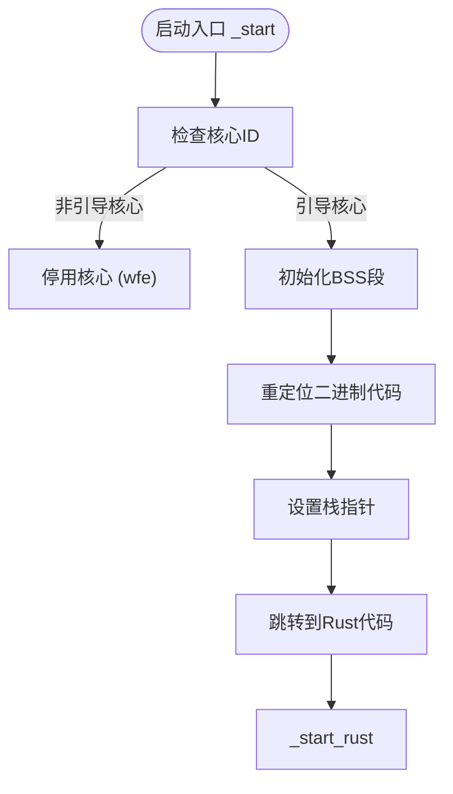
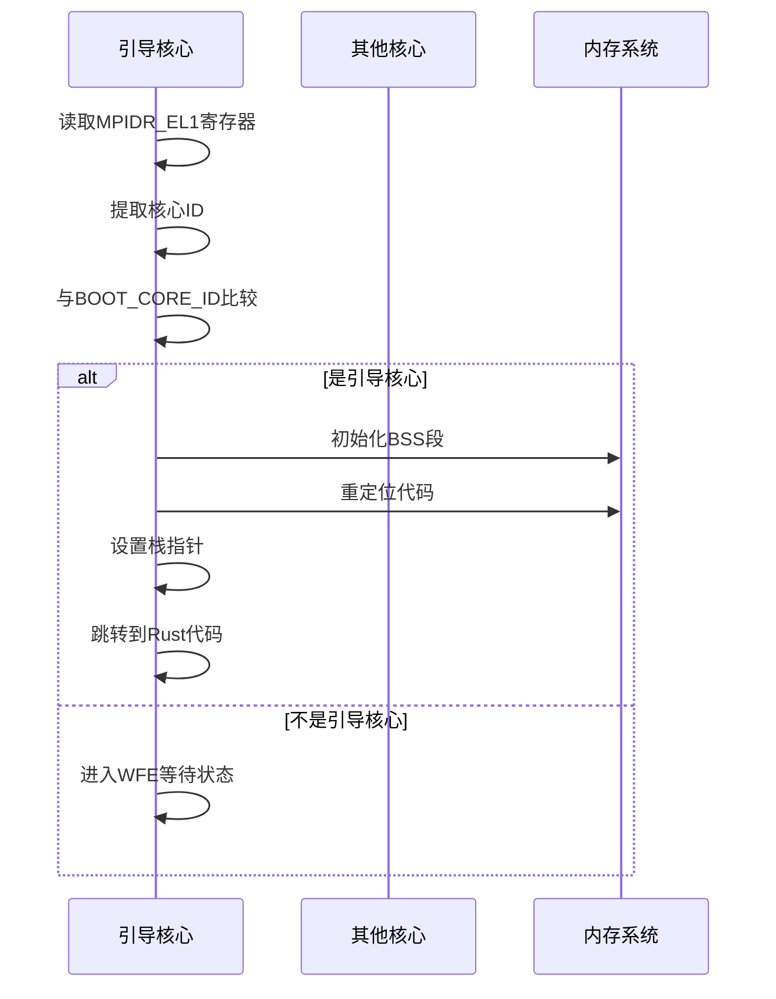
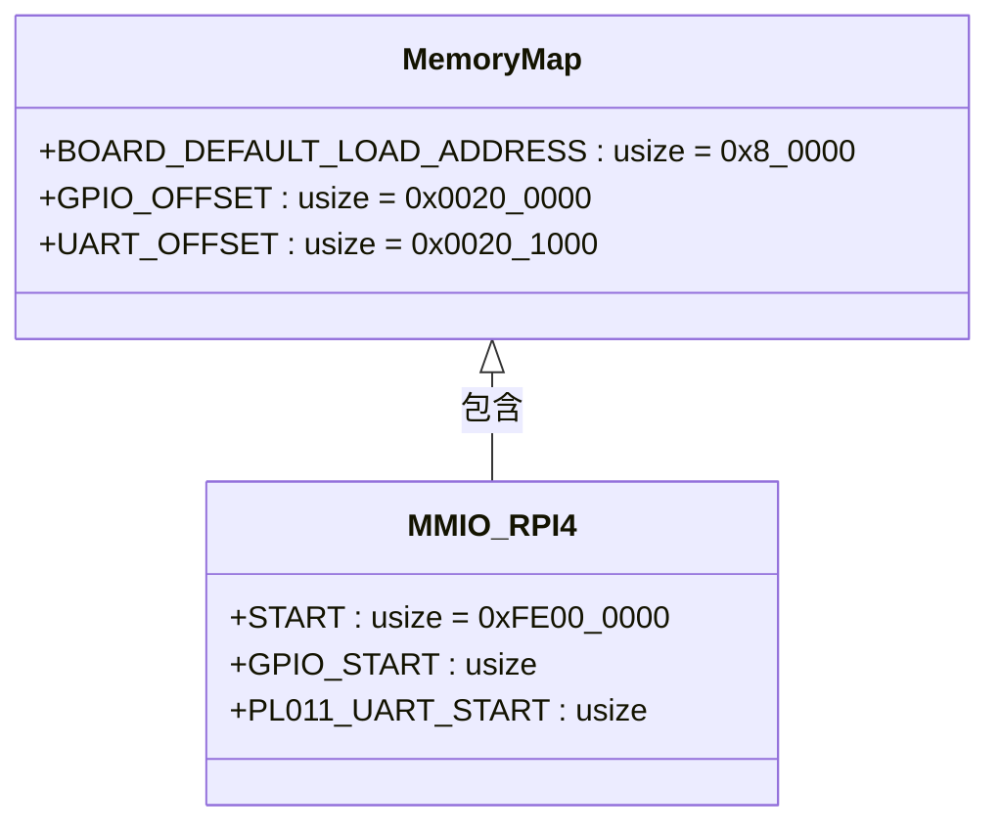
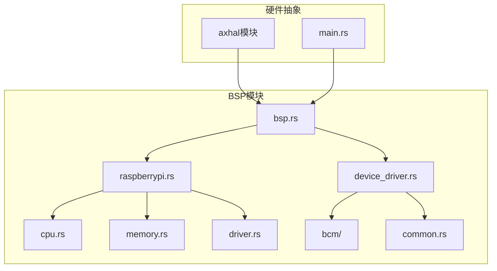
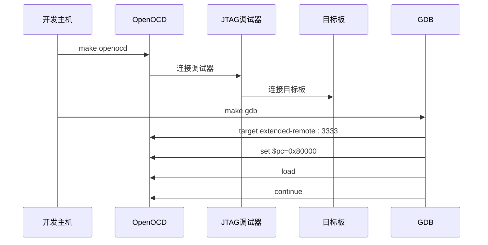

# 平台移植与BSP开发

<cite>
**本文档引用的文件**
- [platform_raspi4.md](file://doc/platform_raspi4.md)
- [jtag_debug_in_raspi4.md](file://doc/jtag_debug_in_raspi4.md)
- [bsp.rs](file://tools/raspi4/chainloader/src/bsp.rs)
- [raspberrypi.rs](file://tools/raspi4/chainloader/src/bsp/raspberrypi.rs)
- [memory.rs](file://tools/raspi4/chainloader/src/bsp/raspberrypi/memory.rs)
- [cpu.rs](file://tools/raspi4/chainloader/src/bsp/raspberrypi/cpu.rs)
- [driver.rs](file://tools/raspi4/chainloader/src/bsp/raspberrypi/driver.rs)
- [main.rs](file://tools/raspi4/chainloader/src/main.rs)
- [boot.rs](file://tools/raspi4/chainloader/src/_arch/aarch64/cpu/boot.rs)
- [boot.s](file://tools/raspi4/chainloader/src/_arch/aarch64/cpu/boot.s)
</cite>

## 目录
1. [引言](#引言)
2. [树莓派4平台移植概述](#树莓派4平台移植概述)
3. [底层启动代码分析](#底层启动代码分析)
4. [CPU初始化序列](#cpu初始化序列)
5. [内存布局配置](#内存布局配置)
6. [基础外设驱动实现](#基础外设驱动实现)
7. [BSP模块与axhal硬件抽象](#bsp模块与axhal硬件抽象)
8. [新SoC或开发板适配指南](#新soc或开发板适配指南)
9. [JTAG调试集成](#jtag调试集成)
10. [故障诊断方法](#故障诊断方法)

## 引言
本文档旨在为开发者提供完整的平台移植与板级支持包（BSP）开发指南。以树莓派4（raspi4）为例，详细说明如何编写底层启动代码、CPU初始化序列、内存布局配置和基础外设驱动。文档将解释BSP模块如何为axhal提供硬件抽象的具体实现，并指导开发者如何适配新的SoC或开发板。

## 树莓派4平台移植概述
树莓派4平台移植涉及多个关键组件的配置和初始化。根据项目文档，开发者需要首先参考rust-embedded/rust-raspberrypi-OS-tutorials教程，完成UART链式加载器和JTAG调试环境的搭建。移植过程主要通过设置`ARCH=aarch64 MYPLAT=axplat-aarch64-raspi`特性标志来指定目标架构和平台。

**Section sources**
- [platform_raspi4.md](file://doc/platform_raspi4.md)

## 底层启动代码分析
底层启动代码是系统启动的第一阶段，负责初始化处理器并跳转到高级语言编写的内核代码。在ArceOS中，启动流程从汇编代码`_start`函数开始，该函数位于`src/_arch/aarch64/cpu/boot.s`文件中。

启动代码执行以下关键步骤：
1. 检查当前核心ID，确保只有引导核心继续执行
2. 初始化BSS段，将未初始化的全局变量区域清零
3. 重定位二进制代码到链接地址
4. 设置栈指针
5. 跳转到Rust入口函数



**Diagram sources**
- [boot.s](file://tools/raspi4/chainloader/src/_arch/aarch64/cpu/boot.s)
- [boot.rs](file://tools/raspi4/chainloader/src/_arch/aarch64/cpu/boot.rs)

**Section sources**
- [boot.s](file://tools/raspi4/chainloader/src/_arch/aarch64/cpu/boot.s)
- [boot.rs](file://tools/raspi4/chainloader/src/_arch/aarch64/cpu/boot.rs)

## CPU初始化序列
CPU初始化序列定义了处理器核心的启动行为和初始状态。在树莓派4的BSP实现中，通过`BOOT_CORE_ID`静态变量指定引导核心的ID。



**Diagram sources**
- [cpu.rs](file://tools/raspi4/chainloader/src/bsp/raspberrypi/cpu.rs)
- [boot.s](file://tools/raspi4/chainloader/src/_arch/aarch64/cpu/boot.s)

**Section sources**
- [cpu.rs](file://tools/raspi4/chainloader/src/bsp/raspberrypi/cpu.rs)

## 内存布局配置
内存布局配置定义了系统的物理地址空间分配，包括设备内存映射和默认加载地址。树莓派4的内存布局在`memory.rs`文件中定义。



**Diagram sources**
- [memory.rs](file://tools/raspi4/chainloader/src/bsp/raspberrypi/memory.rs)

**Section sources**
- [memory.rs](file://tools/raspi4/chainloader/src/bsp/raspberrypi/memory.rs)

## 基础外设驱动实现
基础外设驱动包括GPIO和UART等关键设备的驱动程序。在树莓派4的BSP中，这些驱动通过设备驱动管理器进行注册和初始化。

```mermaid
flowchart LR
DriverManager[设备驱动管理器] --> UARTDriver[PL011 UART驱动]
DriverManager --> GPIODriver[GPIO驱动]
UARTDriver --> Console[控制台]
GPIODriver --> UARTConfig[配置UART引脚]
subgraph 初始化流程
A[调用bsp::driver::init()] --> B[注册UART驱动]
B --> C[注册GPIO驱动]
C --> D[初始化所有驱动]
D --> E[控制台可用]
end
```

**Diagram sources**
- [driver.rs](file://tools/raspi4/chainloader/src/bsp/raspberrypi/driver.rs)
- [device_driver.rs](file://tools/raspi4/chainloader/src/bsp/device_driver.rs)

**Section sources**
- [driver.rs](file://tools/raspi4/chainloader/src/bsp/raspberrypi/driver.rs)

## BSP模块与axhal硬件抽象
BSP模块作为硬件抽象层，为上层系统提供统一的硬件访问接口。在ArceOS中，BSP模块通过条件编译的方式支持不同的开发板。



**Diagram sources**
- [bsp.rs](file://tools/raspi4/chainloader/src/bsp.rs)
- [raspberrypi.rs](file://tools/raspi4/chainloader/src/bsp/raspberrypi.rs)

**Section sources**
- [bsp.rs](file://tools/raspi4/chainloader/src/bsp.rs)
- [raspberrypi.rs](file://tools/raspi4/chainloader/src/bsp/raspberrypi.rs)

## 新SoC或开发板适配指南
适配新的SoC或开发板需要创建相应的BSP模块，实现以下关键功能：

1. **中断向量设置**：定义异常向量表和中断处理程序
2. **时钟初始化**：配置系统时钟和外设时钟
3. **调试接口配置**：设置UART或其他调试输出接口
4. **内存映射定义**：指定物理地址空间布局
5. **设备驱动实现**：提供基础外设的驱动程序

适配步骤：
1. 在`tools/raspi4/chainloader/src/bsp`目录下创建新的板级支持包
2. 实现必要的硬件初始化函数
3. 在`Cargo.toml`中添加相应的特性标志
4. 测试基本功能，如串口输出和内存访问

**Section sources**
- [main.rs](file://tools/raspi4/chainloader/src/main.rs)

## JTAG调试集成
JTAG调试为嵌入式系统开发提供了强大的调试能力。在树莓派4上配置JTAG调试需要以下步骤：

1. 硬件连接：按照文档连接JTAG调试器到树莓派4的指定引脚
2. 配置文件修改：调整内核基地址和物理虚拟地址偏移
3. 启动调试会话：使用`make jtagboot`命令启动调试



**Diagram sources**
- [jtag_debug_in_raspi4.md](file://doc/jtag_debug_in_raspi4.md)

**Section sources**
- [jtag_debug_in_raspi4.md](file://doc/jtag_debug_in_raspi4.md)

## 故障诊断方法
有效的故障诊断方法对于嵌入式系统开发至关重要。以下是常见的诊断策略：

1. **串口日志输出**：通过UART输出调试信息
2. **LED指示灯**：使用GPIO控制LED显示系统状态
3. **断点调试**：利用JTAG设置断点进行单步调试
4. **内存检查**：检查关键数据结构的内存布局
5. **性能分析**：监控系统资源使用情况

当遇到问题时，建议按照以下流程进行诊断：
1. 确认硬件连接正确
2. 检查电源供应稳定
3. 验证启动代码执行流程
4. 逐步排查各模块初始化过程
5. 使用调试工具深入分析

**Section sources**
- [jtag_debug_in_raspi4.md](file://doc/jtag_debug_in_raspi4.md)
- [main.rs](file://tools/raspi4/chainloader/src/main.rs)