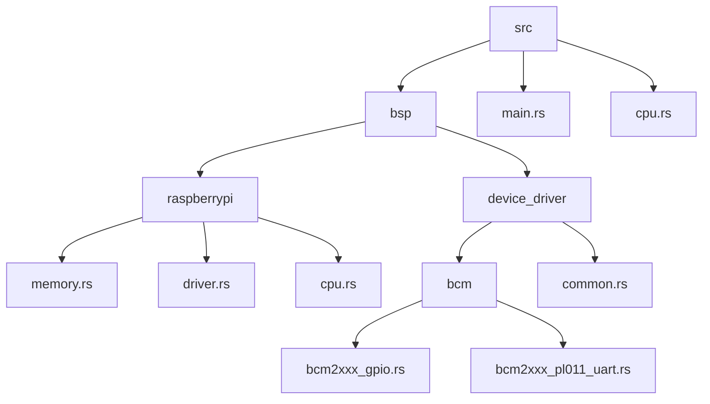
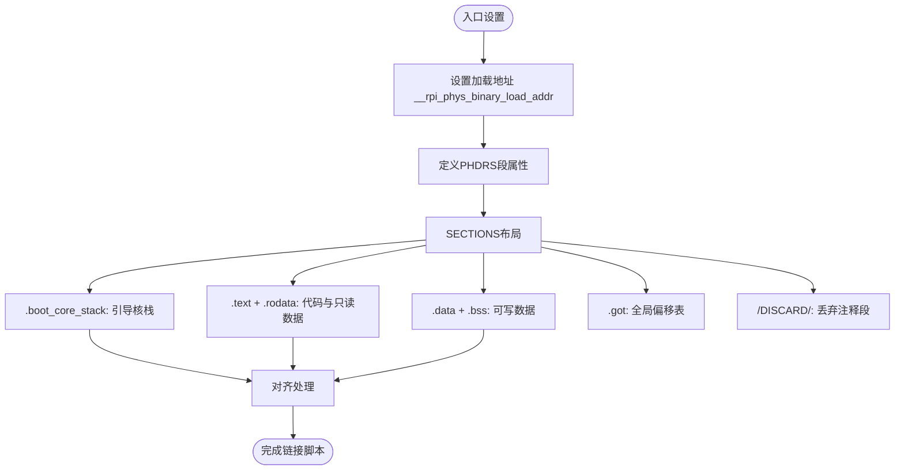
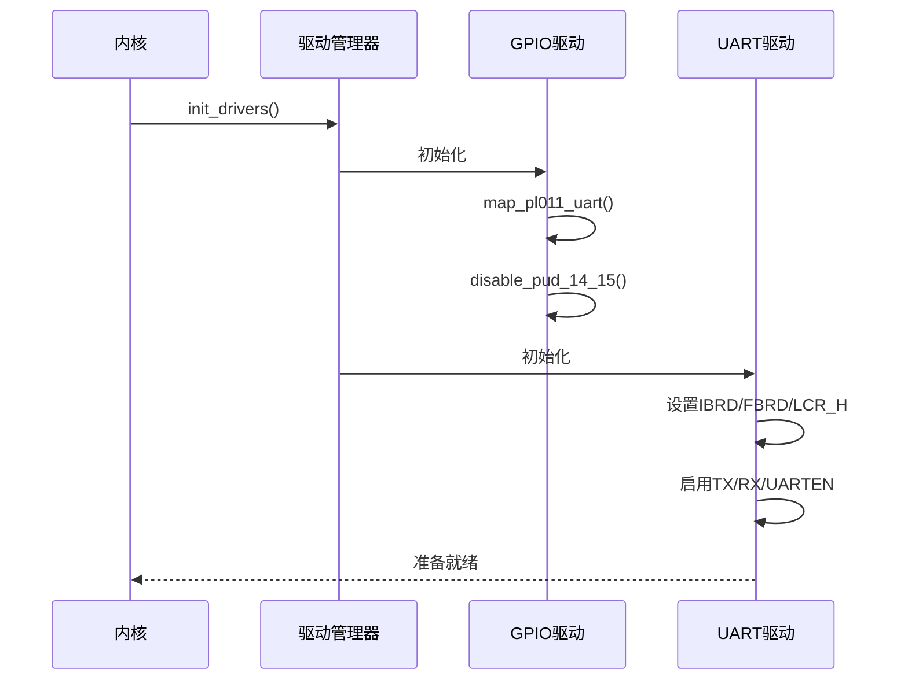

# 新平台移植实战指南

<cite>
**本文档中引用的文件**
- [common.rs](file://tools/raspi4/chainloader/src/bsp/device_driver/common.rs)
- [kernel.ld](file://tools/raspi4/chainloader/src/bsp/raspberrypi/kernel.ld)
- [bcm2xxx_gpio.rs](file://tools/raspi4/chainloader/src/bsp/device_driver/bcm/bcm2xxx_gpio.rs)
- [bcm2xxx_pl011_uart.rs](file://tools/raspi4/chainloader/src/bsp/device_driver/bcm/bcm2xxx_pl011_uart.rs)
- [memory.rs](file://tools/raspi4/chainloader/src/bsp/raspberrypi/memory.rs)
- [device_driver.rs](file://tools/raspi4/chainloader/src/bsp/device_driver.rs)
- [bsp.rs](file://tools/raspi4/chainloader/src/bsp.rs)
- [main.rs](file://tools/raspi4/chainloader/src/main.rs)
- [raspberrypi.rs](file://tools/raspi4/chainloader/src/bsp/raspberrypi.rs)
- [driver.rs](file://tools/raspi4/chainloader/src/bsp/raspberrypi/driver.rs)
</cite>

## 目录
1. [简介](#简介)
2. [项目结构与BSP组织](#项目结构与bsp组织)
3. [创建新的BSP目录结构](#创建新的bsp目录结构)
4. [链接脚本配置详解](#链接脚本配置详解)
5. [内存映射与物理地址定义](#内存映射与物理地址定义)
6. [核心设备驱动实现](#核心设备驱动实现)
7. [串口驱动与GPIO初始化](#串口驱动与gpio初始化)
8. [BSP顶层集成与注册](#bsp顶层集成与注册)
9. [必须实现的核心接口清单](#必须实现的核心接口清单)
10. [验证移植成功的关键测试步骤](#验证移植成功的关键测试步骤)

## 简介
本文档旨在为初学者提供一份完整的Arceos操作系统向新ARM64开发板移植的操作手册。通过分析Raspberry Pi 4（raspi4）的现有BSP实现，逐步指导开发者如何从零开始创建一个新的板级支持包（BSP）。内容涵盖BSP目录结构创建、链接脚本修改、内存布局定义、核心设备驱动实现以及系统启动流程控制等关键环节。

## 项目结构与BSP组织



**图示来源**
- [main.rs](file://tools/raspi4/chainloader/src/main.rs)
- [bsp.rs](file://tools/raspi4/chainloader/src/bsp.rs)
- [raspberrypi.rs](file://tools/raspi4/chainloader/src/bsp/raspberrypi.rs)
- [device_driver.rs](file://tools/raspi4/chainloader/src/bsp/device_driver.rs)

**章节来源**
- [main.rs](file://tools/raspi4/chainloader/src/main.rs#L0-L219)
- [bsp.rs](file://tools/raspi4/chainloader/src/bsp.rs#L0-L13)

## 创建新的BSP目录结构
要为新平台创建BSP，首先需要在`src/bsp`目录下建立对应的板级目录。参考raspi4的实现，应创建如下结构：
```
src/bsp/
└── your_new_board/
    ├── memory.rs        # 定义内存布局和物理地址
    ├── driver.rs        # 驱动管理器和设备注册
    ├── cpu.rs           # CPU特定功能
    └── kernel.ld        # 链接脚本
```
同时，在`src/bsp.rs`中添加条件编译模块引用，并导出相关项，确保新板型可通过feature进行选择。

**章节来源**
- [bsp.rs](file://tools/raspi4/chainloader/src/bsp.rs#L0-L13)
- [raspberrypi.rs](file://tools/raspi4/chainloader/src/bsp/raspberrypi.rs#L0-L26)

## 链接脚本配置详解



**图示来源**
- [kernel.ld](file://tools/raspi4/chainloader/src/bsp/raspberrypi/kernel.ld#L0-L83)

**章节来源**
- [kernel.ld](file://tools/raspi4/chainloader/src/bsp/raspberrypi/kernel.ld#L0-L83)

## 内存映射与物理地址定义
新平台需明确定义其内存布局，包括默认加载地址、外设MMIO偏移及起始地址。参考raspi3与raspi4的不同配置：

```rust
pub(super) mod map {
    pub const BOARD_DEFAULT_LOAD_ADDRESS: usize = 0x8_0000;

    pub const GPIO_OFFSET: usize = 0x0020_0000;
    pub const UART_OFFSET: usize = 0x0020_1000;

    #[cfg(feature = "your_board_v1")]
    pub mod mmio {
        use super::*;
        pub const START: usize = 0x3F00_0000;
        pub const GPIO_START: usize = START + GPIO_OFFSET;
        pub const PL011_UART_START: usize = START + UART_OFFSET;
    }

    #[cfg(feature = "your_board_v2")]
    pub mod mmio {
        use super::*;
        pub const START: usize = 0xFE00_0000;
        pub const GPIO_START: usize = START + GPIO_OFFSET;
        pub const PL011_UART_START: usize = START + UART_OFFSET;
    }
}
```

**章节来源**
- [memory.rs](file://tools/raspi4/chainloader/src/bsp/raspberrypi/memory.rs#L0-L48)

## 核心设备驱动实现
所有设备驱动应遵循统一抽象接口。通用组件`MMIODerefWrapper`用于安全访问内存映射I/O寄存器：

```rust
pub struct MMIODerefWrapper<T> {
    start_addr: usize,
    phantom: PhantomData<fn() -> T>,
}

impl<T> ops::Deref for MMIODerefWrapper<T> {
    type Target = T;
    fn deref(&self) -> &Self::Target {
        unsafe { &*(self.start_addr as *const _) }
    }
}
```

此模板可复用于任何基于MMIO的设备驱动开发。

**章节来源**
- [common.rs](file://tools/raspi4/chainloader/src/bsp/device_driver/common.rs#L0-L38)

## 串口驱动与GPIO初始化
PL011 UART驱动实现了完整的初始化流程，包括波特率设置（921600）、FIFO使能和8N1格式配置。GPIO驱动负责将指定引脚（如14/15）复用为UART功能，并根据SoC型号（BCM2837/BCM2711）正确禁用上下拉电阻。



**图示来源**
- [bcm2xxx_gpio.rs](file://tools/raspi4/chainloader/src/bsp/device_driver/bcm/bcm2xxx_gpio.rs#L0-L228)
- [bcm2xxx_pl011_uart.rs](file://tools/raspi4/chainloader/src/bsp/device_driver/bcm/bcm2xxx_pl011_uart.rs#L0-L402)

**章节来源**
- [bcm2xxx_gpio.rs](file://tools/raspi4/chainloader/src/bsp/device_driver/bcm/bcm2xxx_gpio.rs#L0-L228)
- [bcm2xxx_pl011_uart.rs](file://tools/raspi4/chainloader/src/bsp/device_driver/bcm/bcm2xxx_pl011_uart.rs#L0-L402)

## BSP顶层集成与注册
`driver.rs`负责实例化具体硬件设备并将其注册到全局驱动管理器中。通过`post_init`回调机制确保设备间依赖顺序正确（先GPIO后UART）：

```rust
static PL011_UART: device_driver::PL011Uart = unsafe { ... };
static GPIO: device_driver::GPIO = unsafe { ... };

fn post_init_uart() -> Result<(), &'static str> {
    console::register_console(&PL011_UART);
    Ok(())
}

fn post_init_gpio() -> Result<(), &'static str> {
    GPIO.map_pl011_uart();
    Ok(())
}
```

**章节来源**
- [driver.rs](file://tools/raspi4/chainloader/src/bsp/raspberrypi/driver.rs#L0-L71)

## 必须实现的核心接口清单
| 接口类别 | 必须实现项 | 说明 |
|--------|----------|------|
| 内存管理 | `board_default_load_addr()` | 返回固件默认加载地址 |
| 设备驱动 | `DeviceDriver::compatible()` | 提供设备兼容性字符串 |
|          | `DeviceDriver::init()` | 驱动初始化函数 |
| 控制台 | `console::interface::Write` | 支持字符输出 |
|         | `console::interface::Read` | 支持字符输入 |
| CPU抽象 | `cpu::nop()`, `cpu::wait_forever()` | 基础CPU操作 |
| BSP信息 | `board_name()` | 返回板卡名称 |

**章节来源**
- [main.rs](file://tools/raspi4/chainloader/src/main.rs#L0-L219)
- [driver.rs](file://tools/raspi4/chainloader/src/bsp/raspberrypi/driver.rs#L0-L71)
- [cpu.rs](file://tools/raspi4/chainloader/src/cpu.rs#L0-L19)

## 验证移植成功的关键测试步骤
1. **构建测试**：确保使用新BSP feature可成功编译生成镜像。
2. **串口通信测试**：连接串口终端，确认启动时打印logo和板名信息。
3. **链式加载协议测试**：发送同步字符（Ctrl+C x3），验证能正确接收二进制大小并回传"OK"。
4. **内存写入验证**：通过调试工具检查目标