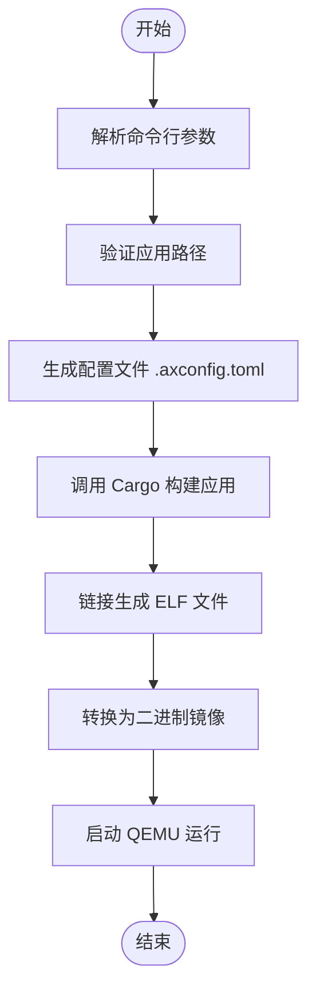
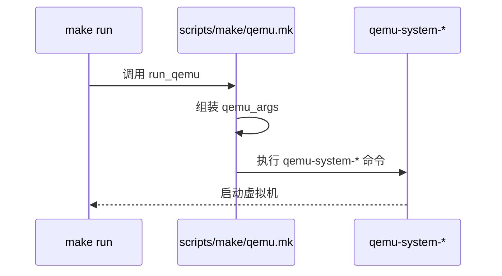

# 快速入门指南

<cite>
**本文档中引用的文件**  
- [Makefile](file://Makefile)
- [README.md](file://README.md)
- [defconfig.toml](file://configs/defconfig.toml)
- [helloworld/Cargo.toml](file://examples/helloworld/Cargo.toml)
- [httpserver/Cargo.toml](file://examples/httpserver/Cargo.toml)
- [build.md](file://doc/build.md)
- [scripts/make/build.mk](file://scripts/make/build.mk)
- [scripts/make/cargo.mk](file://scripts/make/cargo.mk)
- [scripts/make/qemu.mk](file://scripts/make/qemu.mk)
- [scripts/make/config.mk](file://scripts/make/config.mk)
</cite>

## 目录
1. [简介](#简介)
2. [环境准备](#环境准备)
3. [克隆仓库与项目结构](#克隆仓库与项目结构)
4. [构建配置](#构建配置)
5. [执行构建与运行](#执行构建与运行)
6. [示例演示：构建并运行 helloworld 和 httpserver](#示例演示构建并运行-helloworld-和-httpserver)
7. [关键构建脚本解析](#关键构建脚本解析)
8. [常见构建错误排查](#常见构建错误排查)
9. [总结](#总结)

## 简介
ArceOS 是一个用 Rust 编写的实验性模块化操作系统（或称单体内核）。本指南旨在为初学者提供从零开始构建和运行 ArceOS 的完整流程，涵盖环境搭建、代码获取、配置选择、编译构建及运行调试等环节。通过具体示例帮助开发者快速上手。

## 环境准备
在开始构建 ArceOS 之前，需要安装必要的工具链和依赖项。

### 安装 Rust 工具链
确保已安装 Rust 和 Cargo：
```bash
curl --proto '=https' --tlsv1.2 -sSf https://sh.rustup.rs | sh
source $HOME/.cargo/env
```

安装 `cargo-binutils` 以支持 `rust-objcopy` 和 `rust-objdump`：
```bash
cargo install cargo-binutils
rustup component add llvm-tools-preview
```

### 安装 axconfig-gen 和 cargo-axplat
这些工具用于生成内核配置和平台配置：
```bash
cargo install axconfig-gen cargo-axplat
```

### 安装交叉编译器
下载适用于不同架构的 musl 交叉编译工具链：
```bash
wget https://musl.cc/aarch64-linux-musl-cross.tgz
wget https://musl.cc/riscv64-linux-musl-cross.tgz
wget https://musl.cc/x86_64-linux-musl-cross.tgz
tar zxf aarch64-linux-musl-cross.tgz
tar zxf riscv64-linux-musl-cross.tgz
tar zxf x86_64-linux-musl-cross.tgz
export PATH=$(pwd)/x86_64-linux-musl-cross/bin:$(pwd)/aarch64-linux-musl-cross/bin:$(pwd)/riscv64-linux-musl-cross/bin:$PATH
```

### 安装 QEMU 模拟器
用于运行 ArceOS 镜像：
```bash
# Ubuntu/Debian
sudo apt-get install qemu-system

# macOS
brew install qemu
```

**Section sources**
- [README.md](file://README.md#L40-L80)

## 克隆仓库与项目结构
首先克隆 ArceOS 仓库：
```bash
git clone https://github.com/arceos-org/arceos.git
cd arceos
```

项目主要目录结构如下：
- `api/`: 提供系统 API 接口
- `configs/`: 包含默认和自定义配置文件
- `examples/`: 示例应用程序，如 helloworld、httpserver
- `modules/`: 核心模块实现，如内存管理、任务调度
- `ulib/`: 用户态库，如 axstd、axlibc
- `Makefile`: 主构建脚本

**Section sources**
- [README.md](file://README.md#L0-L218)

## 构建配置
ArceOS 使用 TOML 格式的配置文件来控制构建选项。

### 使用默认配置
默认配置文件位于 `configs/defconfig.toml`，包含基本参数：
```toml
task-stack-size = 0x40000   # 每个任务的栈大小
ticks-per-sec = 100         # 每秒定时器滴答数
```

### 自定义配置
可通过 `EXTRA_CONFIG` 参数传入额外配置，或使用 `PLAT_CONFIG` 指定平台特定配置（如 `configs/custom/x86_64-pc-oslab.toml`）。

生成最终配置文件：
```bash
make defconfig
```
该命令会根据 `ARCH`、`MYPLAT` 等参数生成 `.axconfig.toml`。

**Section sources**
- [defconfig.toml](file://configs/defconfig.toml#L0-L6)
- [Makefile](file://Makefile#L130-L135)
- [scripts/make/config.mk](file://scripts/make/config.mk#L0-L33)

## 执行构建与运行
使用 Makefile 提供的目标进行构建和运行。

### 基本构建命令
```bash
make A=examples/helloworld ARCH=x86_64 LOG=info run
```
其中：
- `A`: 应用路径
- `ARCH`: 目标架构（x86_64, riscv64, aarch64）
- `LOG`: 日志级别
- `run`: 构建后立即运行

### 清理构建产物
```bash
make clean
```

**Section sources**
- [Makefile](file://Makefile#L0-L232)

## 示例演示：构建并运行 helloworld 和 httpserver
### 构建并运行 helloworld
进入项目根目录，执行：
```bash
make A=examples/helloworld ARCH=riscv64 run
```
此命令将：
1. 解析 `examples/helloworld/Cargo.toml`
2. 调用 Cargo 构建应用
3. 生成二进制镜像
4. 启动 QEMU 运行

### 构建并运行 httpserver
```bash
make A=examples/httpserver ARCH=aarch64 LOG=info SMP=4 run NET=y
```
启用网络功能后，可在宿主机访问 `http://10.0.2.15:5555` 查看服务响应。

**Section sources**
- [helloworld/Cargo.toml](file://examples/helloworld/Cargo.toml#L0-L10)
- [httpserver/Cargo.toml](file://examples/httpserver/Cargo.toml#L0-L10)
- [README.md](file://README.md#L100-L115)

## 关键构建脚本解析
### Makefile 结构
主 `Makefile` 控制整体构建流程，关键变量包括：
- `ARCH`: 目标架构
- `APP`: 应用路径
- `FEATURES`: 启用的功能模块
- `NET`, `BLK`, `GRAPHIC`: 设备支持开关

### 构建流程图


**Diagram sources**
- [Makefile](file://Makefile#L0-L232)
- [scripts/make/build.mk](file://scripts/make/build.mk#L0-L74)
- [scripts/make/cargo.mk](file://scripts/make/cargo.mk#L0-L55)

### QEMU 启动流程


**Diagram sources**
- [scripts/make/qemu.mk](file://scripts/make/qemu.mk#L0-L120)
- [Makefile](file://Makefile#L220-L225)

## 常见构建错误排查
### 依赖缺失
现象：`cargo install` 失败或 `axconfig-gen` 找不到。
解决方法：确认所有工具已正确安装并加入 `PATH`。

### 工具链版本不匹配
现象：`rustc` 版本过旧导致编译失败。
解决方法：更新至最新稳定版：
```bash
rustup update stable
```

### 交叉编译器未找到
现象：`x86_64-linux-musl-gcc` 命令未找到。
解决方法：检查 `PATH` 是否包含交叉编译器路径，并确认文件存在。

### QEMU 权限问题
当使用 `tap` 或 `bridge` 网络模式时需 root 权限：
```bash
sudo make NET_DEV=tap NET=y run
```

### 空镜像问题
现象：生成的 `.bin` 文件为空。
解决方法：检查 `Cargo.toml` 中的依赖是否正确，特别是 `axstd` 的 features 是否匹配需求。

**Section sources**
- [README.md](file://README.md#L40-L80)
- [Makefile](file://Makefile#L200-L210)

## 总结
本指南详细介绍了从零开始构建和运行 ArceOS 的全过程。通过合理配置 Makefile 参数，结合 Docker 或本地环境，即使是新手也能顺利完成首次构建。建议先从 `helloworld` 示例入手，逐步尝试更复杂的 `httpserver` 应用，熟悉整个开发流程。