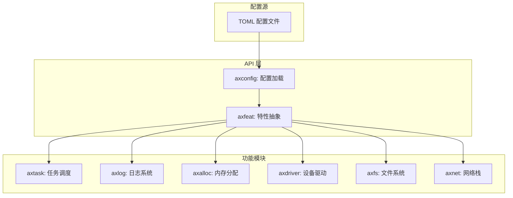
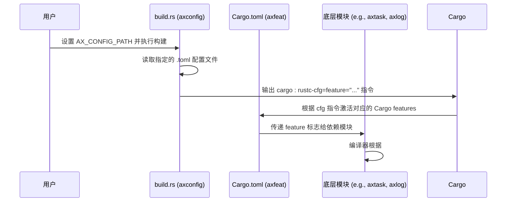
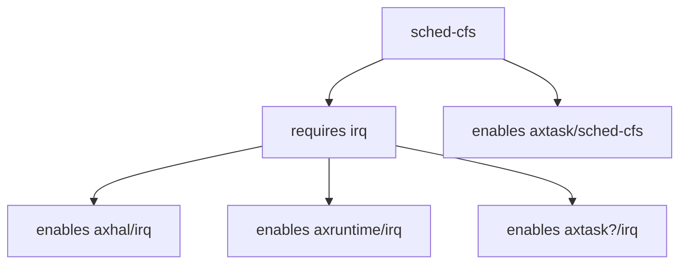
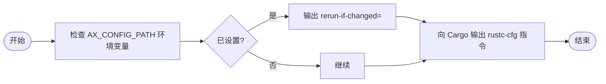
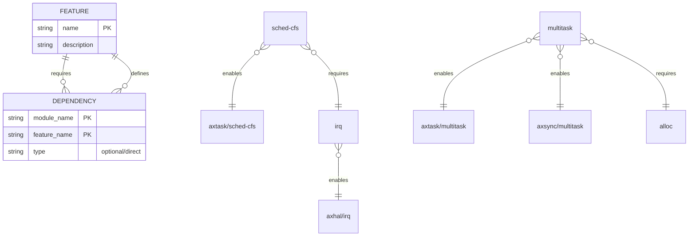

# 条件编译与特性开关

<cite>
**本文档引用的文件**  
- [lib.rs](file://api/axfeat/src/lib.rs)
- [Cargo.toml](file://api/axfeat/Cargo.toml)
- [lib.rs](file://modules/axconfig/src/lib.rs)
- [build.rs](file://modules/axconfig/build.rs)
- [lib.rs](file://modules/axtask/src/lib.rs)
- [lib.rs](file://modules/axlog/src/lib.rs)
- [Cargo.toml](file://Cargo.toml)
</cite>

## 目录
1. [引言](#引言)
2. [项目结构概览](#项目结构概览)
3. [核心组件分析](#核心组件分析)
4. [条件编译机制架构](#条件编译机制架构)
5. [详细组件分析](#详细组件分析)
6. [依赖关系分析](#依赖关系分析)
7. [性能影响与最佳实践](#性能影响与最佳实践)
8. [故障排查指南](#故障排查指南)
9. [结论](#结论)

## 引言
ArceOS 是一个模块化、可配置的操作系统内核，其设计强调灵活性和可裁剪性。本文件系统性地介绍 ArceOS 中基于 Cargo features 的条件编译机制，重点阐述 `axfeat` 模块如何作为特性的抽象接口层，结合 `axconfig` 提供的运行时配置，动态启用或禁用特定代码路径。通过分析 `Cargo.toml` 中 `[features]` 段落的定义方式以及 `build.rs` 脚本的作用，揭示该机制对最终二进制体积和性能的影响，并提供使用建议。

## 项目结构概览
ArceOS 的项目结构清晰地划分为多个模块（`modules/`）、API 接口层（`api/`）和用户库（`ulib/`）。其中，`api/axfeat` 和 `modules/axconfig` 是实现条件编译的核心组件。`configs/` 目录存放平台相关的 TOML 配置文件，而各模块的 `Cargo.toml` 文件则定义了功能特性及其依赖关系。

**Diagram sources**
- [lib.rs](file://api/axfeat/src/lib.rs)
- [lib.rs](file://modules/axconfig/src/lib.rs)

**Section sources**
- [lib.rs](file://api/axfeat/src/lib.rs)
- [lib.rs](file://modules/axconfig/src/lib.rs)

## 核心组件分析
`axfeat` 模块是整个系统特性选择的顶层入口，它通过 Rust 的 `#[cfg(feature = "...")]` 机制，将高层语义化的特性（如 `sched-cfs`、`log-level-info`）映射到底层具体模块的功能开关上。`axconfig` 模块负责在构建阶段读取外部配置文件（由环境变量 `AX_CONFIG_PATH` 指定），并生成相应的 `#[cfg(...)]` 标记，从而决定哪些 `axfeat` 特性被激活。

**Section sources**
- [lib.rs](file://api/axfeat/src/lib.rs)
- [lib.rs](file://modules/axconfig/src/lib.rs)

## 条件编译机制架构
ArceOS 的条件编译机制采用分层设计：`axconfig` 在构建时解析 TOML 配置，生成 `cfg` 属性；`axfeat` 则作为这些属性的聚合点，定义高层次的、语义明确的 Cargo features；最终，这些 features 通过依赖传递，激活各个底层模块（如 `axtask`、`axlog`）中的具体代码路径。

**Diagram sources**
- [build.rs](file://modules/axconfig/build.rs)
- [Cargo.toml](file://api/axfeat/Cargo.toml)
- [lib.rs](file://modules/axtask/src/lib.rs)
- [lib.rs](file://modules/axlog/src/lib.rs)

## 详细组件分析

### axfeat 模块分析
`axfeat` 模块的核心是一个高度组织化的 `Cargo.toml` 文件，其中 `[features]` 段落定义了所有可用的特性。每个特性都通过依赖关系（如 `dep:`）或直接传递（如 `module/feature`）的方式，关联到具体的底层实现模块。

#### 特性定义示例

**Diagram sources**
- [Cargo.toml](file://api/axfeat/Cargo.toml)

**Section sources**
- [Cargo.toml](file://api/axfeat/Cargo.toml)

### axconfig 模块分析
`axconfig` 模块利用自定义的宏 `axconfig_macros::include_configs!` 来包含外部的 TOML 配置文件。其 `build.rs` 脚本确保当环境变量 `AX_CONFIG_PATH` 或其所指向的配置文件发生变化时，Cargo 会重新运行构建脚本，保证配置的实时性。

#### 构建脚本逻辑

**Diagram sources**
- [build.rs](file://modules/axconfig/build.rs)
- [lib.rs](file://modules/axconfig/src/lib.rs)

**Section sources**
- [build.rs](file://modules/axconfig/build.rs)
- [lib.rs](file://modules/axconfig/src/lib.rs)

## 依赖关系分析
`axfeat` 模块通过 `Cargo.toml` 中的 `[dependencies]` 和 `[features]` 定义了复杂的依赖图。例如，启用 `multitask` 特性不仅需要 `axtask/multitask`，还会间接要求 `axsync/multitask` 和 `axruntime/multitask`，同时因为多任务通常涉及内存分配，所以也依赖于 `alloc` 特性。

**Diagram sources**
- [Cargo.toml](file://api/axfeat/Cargo.toml)

**Section sources**
- [Cargo.toml](file://api/axfeat/Cargo.toml)

## 性能影响与最佳实践
通过开启或关闭特定特性，可以显著影响最终二进制镜像的大小和运行时性能。例如：
- **开启 CFS 调度器 (`sched-cfs`)**：提供更公平的 CPU 时间片分配，但引入了红黑树等复杂数据结构和更频繁的调度决策开销。
- **关闭日志输出 (`log-level-off`)**：完全移除日志打印代码，减少代码体积和 I/O 开销，适用于生产环境以提升性能。

**最佳实践建议**：
1. **最小化原则**：仅启用目标平台必需的特性，避免不必要的代码膨胀。
2. **配置管理**：为不同环境（开发、测试、生产）维护独立的 `.toml` 配置文件。
3. **依赖审查**：理解每个特性带来的隐式依赖，防止意外引入不必要模块。
4. **性能测试**：在关键场景下，对比不同特性组合的性能表现。

**Section sources**
- [Cargo.toml](file://api/axfeat/Cargo.toml)
- [lib.rs](file://modules/axtask/src/lib.rs)
- [lib.rs](file://modules/axlog/src/lib.rs)

## 故障排查指南
当特性未按预期生效时，应检查以下方面：
1. **环境变量**：确认 `AX_CONFIG_PATH` 是否正确指向了期望的 `.toml` 文件。
2. **配置文件内容**：检查 `.toml` 文件中是否正确定义了所需的特性。
3. **构建缓存**：若修改了 `build.rs` 或配置文件，需清理构建目录（`cargo clean`）以确保 `build.rs` 重新执行。
4. **特性拼写**：核对 `Cargo.toml` 中的特性名称拼写是否准确。

**Section sources**
- [build.rs](file://modules/axconfig/build.rs)
- [lib.rs](file://api/axfeat/src/lib.rs)

## 结论
ArceOS 基于 Cargo features 和 `axconfig` 的条件编译机制，提供了一套强大且灵活的系统配置方案。`axfeat` 作为统一的特性抽象层，极大地简化了跨模块的功能开关管理。开发者应充分利用这一机制，在保证功能完整性的前提下，精细控制系统的资源占用和性能表现，实现真正的“按需定制”。