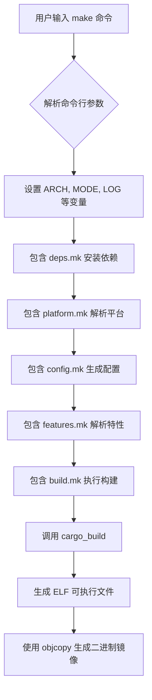
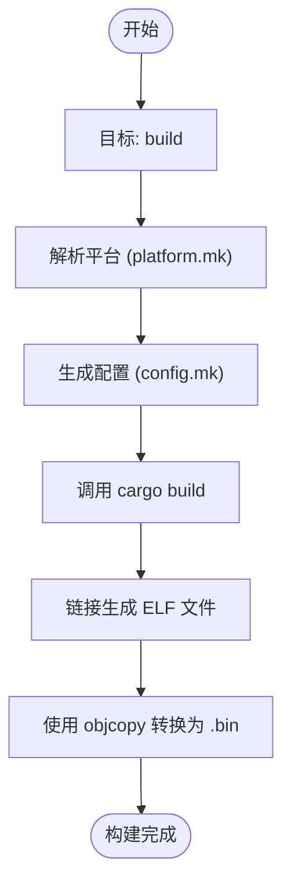

# 构建机制与工具链集成

<cite>
**本文档引用的文件**  
- [Makefile](file://Makefile)
- [rust-toolchain.toml](file://rust-toolchain.toml)
- [scripts/make/build.mk](file://scripts/make/build.mk)
- [scripts/make/cargo.mk](file://scripts/make/cargo.mk)
- [scripts/make/platform.mk](file://scripts/make/platform.mk)
- [scripts/make/config.mk](file://scripts/make/config.mk)
- [scripts/make/qemu.mk](file://scripts/make/qemu.mk)
- [modules/axhal/linker.lds.S](file://modules/axhal/linker.lds.S)
</cite>

## 目录
1. [引言](#引言)
2. [构建系统总体架构](#构建系统总体架构)
3. [Rust工具链版本控制](#rust工具链版本控制)
4. [Makefile目标与执行流程](#makefile目标与执行流程)
5. [no_std环境配置与内存布局控制](#no_std环境配置与内存布局控制)
6. [跨平台编译支持与依赖管理](#跨平台编译支持与依赖管理)
7. [结论](#结论)

## 引言
ArceOS是一个基于Rust语言开发的微内核操作系统，其构建系统采用Makefile作为顶层协调工具，通过调用Cargo完成Rust代码的编译与链接。该系统支持多架构交叉编译（x86_64、aarch64、riscv64等），并利用自定义链接脚本精确控制内核镜像的内存布局。本文将深入解析其构建机制，重点阐述Makefile如何协同Rust工具链实现高效、可配置的跨平台编译流程。

## 构建系统总体架构

ArceOS的构建系统由一个主`Makefile`和多个模块化的子Makefile组成，形成分层控制结构。主`Makefile`负责接收用户参数、设置全局变量，并根据目标调用相应的子模块。核心构建逻辑分散在`scripts/make/`目录下的多个`.mk`文件中，实现了职责分离。



**Diagram sources**
- [Makefile](file://Makefile#L0-L232)
- [scripts/make/build.mk](file://scripts/make/build.mk#L0-L74)

**Section sources**
- [Makefile](file://Makefile#L0-L232)
- [scripts/make/platform.mk](file://scripts/make/platform.mk#L0-L59)
- [scripts/make/config.mk](file://scripts/make/config.mk#L0-L33)

## Rust工具链版本控制

为了确保所有开发者和CI环境使用完全一致的Rust编译器版本，ArceOS项目根目录下提供了`rust-toolchain.toml`文件。该文件明确锁定了nightly通道的具体日期版本，避免了因工具链更新导致的构建不一致问题。

```toml
[toolchain]
channel = "nightly-2025-05-20"
components = ["rust-src", "llvm-tools", "rustfmt", "clippy"]
targets = [
    "x86_64-unknown-none",
    "riscv64gc-unknown-none-elf",
    "aarch64-unknown-none-softfloat",
    "loongarch64-unknown-none-softfloat",
]
```

当执行任何`cargo`命令时，Rust工具链会自动读取此文件，并下载或切换到指定的`nightly-2025-05-20`版本。`components`字段确保了`rust-src`组件被安装，这对于编译`no_std`环境下的底层代码至关重要，因为它包含了标准库的源码，允许编译器进行内联和优化。同时，`targets`字段预声明了所有支持的交叉编译目标，使得`rustup`可以提前安装好相应的目标文件。

**Section sources**
- [rust-toolchain.toml](file://rust-toolchain.toml#L0-L10)

## Makefile目标与执行流程

`Makefile`定义了一系列清晰的目标（target），每个目标对应构建过程中的一个阶段。这些目标通过依赖关系和函数调用，有序地驱动整个构建流程。

### 核心构建目标分析

#### `build` 目标
`build`是核心构建目标，其执行流程如下：
1.  **平台解析**：首先调用`platform.mk`中的逻辑，根据`ARCH`和`MYPLAT`参数确定具体的目标平台（如`axplat-aarch64-qemu-virt`）。
2.  **配置生成**：调用`config.mk`中的`oldconfig`或`defconfig`，合并默认配置、平台配置和用户额外配置，生成最终的`.axconfig.toml`。
3.  **Cargo构建**：执行`_cargo_build`规则，调用`cargo_build`宏。该宏使用`--target`指定目标三元组（如`aarch64-unknown-none-softfloat`），并传递`RUSTFLAGS`中的链接参数。
4.  **镜像生成**：构建出ELF格式的可执行文件后，使用`rust-objcopy`将其转换为纯二进制格式（`.bin`），这是大多数裸机环境加载所需的格式。



**Diagram sources**
- [Makefile](file://Makefile#L150-L152)
- [scripts/make/build.mk](file://scripts/make/build.mk#L0-L74)

#### `run` 和 `justrun` 目标
`run`目标依赖于`build`，确保在运行前已完成最新构建。它最终调用`qemu.mk`中的`run_qemu`宏来启动QEMU模拟器。`justrun`则跳过构建步骤，直接运行已存在的镜像。

#### `clean` 目标
`clean`目标用于清理构建产物，包括删除应用目录下的`.bin`和`.elf`文件、`target`目录以及生成的配置文件`.axconfig.toml`，保持工作区的整洁。

**Section sources**
- [Makefile](file://Makefile#L150-L232)
- [scripts/make/build.mk](file://scripts/make/build.mk#L0-L74)
- [scripts/make/qemu.mk](file://scripts/make/qemu.mk#L0-L120)

## no_std环境配置与内存布局控制

ArceOS作为一个操作系统内核，运行在没有标准C库的`no_std`环境中。其构建系统通过多种方式对此进行配置和控制。

### 链接脚本（Linker Script）的作用
链接脚本`linker.lds.S`是控制程序内存布局的核心。它定义了各个段（section）在物理内存中的起始地址和排列顺序。ArceOS的链接脚本位于`modules/axhal/linker.lds.S`，并在`Makefile`中通过`LD_SCRIPT`变量指定。

关键配置点包括：
-   **入口点**：`ENTRY(_start)` 指定程序的起始执行地址。
-   **基础地址**：`BASE_ADDRESS = %KERNEL_BASE%` 是内核加载的基地址，其具体值由`axconfig-gen`工具从配置文件中提取。
-   **段布局**：脚本严格定义了`.text`（代码）、`.rodata`（只读数据）、`.data`（初始化数据）、`.bss`（未初始化数据）等段的顺序和对齐要求（通常为4KB页对齐）。
-   **特殊段**：如`.percpu`段用于存放每个CPU核心的私有数据，其大小与`SMP`（CPU数量）参数相关。

### RUSTFLAGS中的链接参数
`Makefile`通过`RUSTFLAGS`环境变量向`rustc`传递关键的链接选项：
-   `-C link-arg=-T$(LD_SCRIPT)`：这是最关键的参数，它告诉链接器使用指定的链接脚本，从而实现对内存布局的精确控制。
-   `-C link-arg=-no-pie`：禁用位置无关可执行文件（PIE），因为内核需要加载到固定的物理地址。
-   `-C link-arg=-znostart-stop-gc`：禁用垃圾收集相关的启动和停止符号，这在`no_std`环境中是必要的。

**Section sources**
- [Makefile](file://Makefile#L110-L112)
- [scripts/make/cargo.mk](file://scripts/make/cargo.mk#L10-L12)
- [modules/axhal/linker.lds.S](file://modules/axhal/linker.lds.S#L0-L106)

## 跨平台编译支持与依赖管理

ArceOS的构建系统设计之初就考虑了多架构支持，能够无缝地在不同主机上交叉编译针对各种目标架构的镜像。

### 支持的架构与目标三元组
`Makefile`通过`ARCH`参数选择目标架构，并自动映射到正确的Rust目标三元组：
-   `x86_64` -> `x86_64-unknown-none`
-   `aarch64` -> `aarch64-unknown-none-softfloat`
-   `riscv64` -> `riscv64gc-unknown-none-elf`
-   `loongarch64` -> `loongarch64-unknown-none-softfloat`

### 交叉编译命令示例
在Linux主机上，可以通过以下命令为不同架构构建`helloworld`示例：

```bash
# 编译 x86_64 架构
make ARCH=x86_64 APP=examples/helloworld

# 编译 aarch64 架构
make ARCH=aarch64 APP=examples/helloworld

# 编译 riscv64 架构
make ARCH=riscv64 APP=examples/helloworld
```

### 依赖安装指南
要成功进行交叉编译，需要安装相应的工具链：
1.  **Rust工具链**：通过`rustup`安装，`rust-toolchain.toml`会自动处理。
2.  **LLD链接器**：Rust自带`rust-lld`，已在`Makefile`中通过`LD := rust-lld -flavor gnu`指定。
3.  **Binutils**：对于某些操作（如生成U-Boot镜像），可能需要原生的交叉编译工具链。例如，在Ubuntu上为aarch64安装：
    ```bash
    sudo apt-get install gcc-aarch64-linux-gnu binutils-aarch64-linux-gnu
    ```
    `Makefile`中的`CROSS_COMPILE ?= $(ARCH)-linux-musl-`变量会尝试使用这些工具。
4.  **QEMU**：用于运行和调试，可通过包管理器安装`qemu-system-x86`, `qemu-system-aarch64`等。

**Section sources**
- [Makefile](file://Makefile#L30-L50)
- [scripts/make/platform.mk](file://scripts/make/platform.mk#L30-L59)

## 结论
ArceOS的构建系统是一个精心设计的自动化流程，它以`Makefile`为指挥中心，有效整合了Rust工具链的强大功能。通过`rust-toolchain.toml`锁定编译器版本保证了构建的可重现性；通过模块化的Makefile实现了