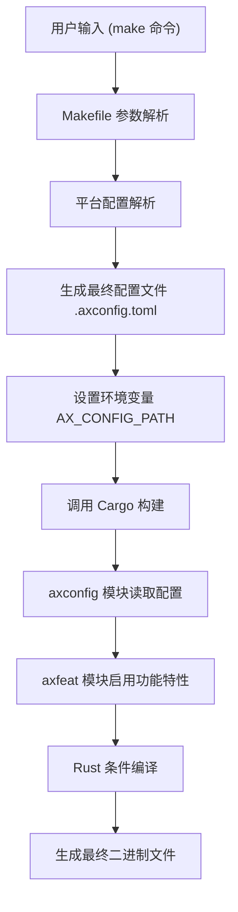
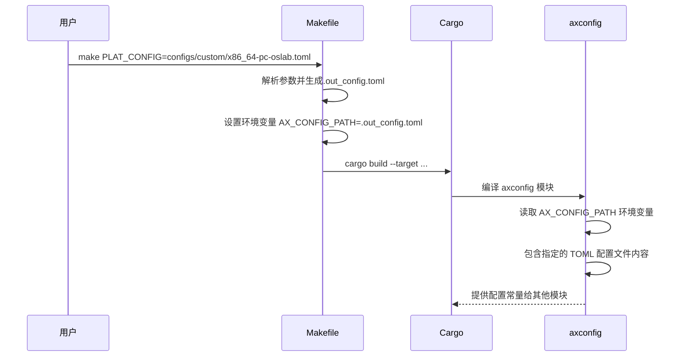
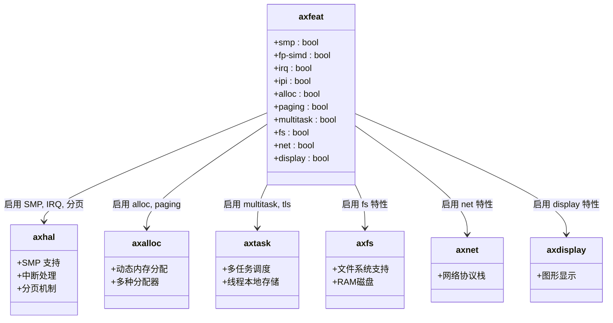

# 构建系统与配置

<cite>
**本文档引用的文件**
- [Makefile](file://Makefile)
- [Cargo.toml](file://Cargo.toml)
- [axconfig/src/lib.rs](file://modules/axconfig/src/lib.rs)
- [axconfig/build.rs](file://modules/axconfig/build.rs)
- [axfeat/src/lib.rs](file://api/axfeat/src/lib.rs)
- [axfeat/Cargo.toml](file://api/axfeat/Cargo.toml)
- [configs/defconfig.toml](file://configs/defconfig.toml)
- [configs/custom/x86_64-pc-oslab.toml](file://configs/custom/x86_64-pc-oslab.toml)
</cite>

## 目录
1. [简介](#简介)
2. [构建系统架构](#构建系统架构)
3. [配置管理机制](#配置管理机制)
4. [功能特性控制](#功能特性控制)
5. [自定义平台配置](#自定义平台配置)
6. [构建变体与编译选项](#构建变体与编译选项)
7. [性能调优建议](#性能调优建议)

## 简介
ArceOS 是一个模块化的操作系统框架，其构建系统基于 Makefile 和 Cargo.toml 协同工作。该系统通过 TOML 配置文件实现灵活的平台和功能配置，支持条件编译和跨平台构建。本指南详细说明了构建流程、配置注入机制以及如何通过 axconfig 和 axfeat 模块管理编译时配置。

## 构建系统架构

ArceOS 的构建系统由顶层 Makefile 驱动，协调 Rust 的 Cargo 构建系统完成整个项目的编译。Makefile 负责解析命令行参数、生成最终配置文件，并调用 Cargo 执行实际的 Rust 代码编译。



**Diagram sources**
- [Makefile](file://Makefile)
- [axconfig/src/lib.rs](file://modules/axconfig/src/lib.rs)
- [axfeat/Cargo.toml](file://api/axfeat/Cargo.toml)

**Section sources**
- [Makefile](file://Makefile#L1-L233)
- [Cargo.toml](file://Cargo.toml#L1-L75)

## 配置管理机制

ArceOS 使用分层的配置管理系统，核心是 `axconfig` 模块。该模块在编译时从指定的 TOML 文件中读取平台特定的常量和参数，并将其注入到编译过程中。

### 配置文件处理流程


**Diagram sources**
- [Makefile](file://Makefile#L100-L150)
- [axconfig/src/lib.rs](file://modules/axconfig/src/lib.rs#L1-L15)
- [axconfig/build.rs](file://modules/axconfig/build.rs#L1-L7)

**Section sources**
- [axconfig/src/lib.rs](file://modules/axconfig/src/lib.rs#L1-L15)
- [axconfig/build.rs](file://modules/axconfig/build.rs#L1-L7)

## 功能特性控制

功能特性的启用和禁用通过 `axfeat` 模块的 Cargo features 实现。这是一个中心化的功能开关系统，允许开发者通过简单的 feature 标志来控制内核组件的包含与否。

### 功能特性依赖关系


**Diagram sources**
- [axfeat/Cargo.toml](file://api/axfeat/Cargo.toml#L1-L93)
- [axfeat/src/lib.rs](file://api/axfeat/src/lib.rs#L1-L45)

**Section sources**
- [axfeat/Cargo.toml](file://api/axfeat/Cargo.toml#L1-L93)
- [axfeat/src/lib.rs](file://api/axfeat/src/lib.rs#L1-L45)

## 自定义平台配置

创建自定义平台配置需要编写一个符合规范的 TOML 文件，定义目标平台的硬件参数和内存布局。

### x86_64-pc-oslab.toml 配置分析
```toml
# 架构标识符
arch = "x86_64"
# 平台标识符
platform = "x86_64-pc-oslab"
# 平台包名称
package = "axplat-x86-pc"

[plat]
# CPU数量
cpu-num = 8
# 物理内存基地址
phys-memory-base = 0
# 物理内存大小 (2G)
phys-memory-size = 0x8000_0000
# 内核镜像物理基地址
kernel-base-paddr = 0x20_0000
# 内核镜像虚拟基地址
kernel-base-vaddr = "0xffff_8000_0020_0000"
# 物理-虚拟地址偏移
phys-virt-offset = "0xffff_8000_0000_0000"
```

此配置文件定义了一个 x86_64 架构的 PC 平台，具有 2GB 物理内存和 8 个 CPU 核心。关键的 `phys-virt-offset` 偏移量用于快速进行物理地址和虚拟地址之间的转换。

**Section sources**
- [configs/custom/x86_64-pc-oslab.toml](file://configs/custom/x86_64-pc-oslab.toml#L1-L62)
- [configs/defconfig.toml](file://configs/defconfig.toml#L1-L7)

## 构建变体与编译选项

ArceOS 支持多种构建变体和跨平台编译选项，通过 Makefile 参数进行控制。

### 构建参数映射表
| Makefile 参数 | 描述 | 默认值 | 对应 Cargo 配置 |
|---------------|------|--------|----------------|
| ARCH | 目标架构 | x86_64 | --target 参数 |
| MODE | 构建模式 | release | profile 配置 |
| LOG | 日志级别 | warn | 特性标志 log-level-* |
| FEATURES | 启用的功能特性 | 无 | --features 参数 |
| PLAT_CONFIG | 平台配置文件路径 | 无 | AX_CONFIG_PATH 环境变量 |
| SMP | CPU 数量 | 平台默认 | smp 特性 |

### 自定义构建脚本
`build.rs` 脚本在编译时执行，用于确保当配置文件或环境变量发生变化时重新编译：

```rust
fn main() {
    println!("cargo:rerun-if-env-changed=AX_CONFIG_PATH");
    if let Ok(config_path) = std::env::var("AX_CONFIG_PATH") {
        println!("cargo:rerun-if-changed={config_path}");
    }
}
```

这个脚本告诉 Cargo 在 `AX_CONFIG_PATH` 环境变量改变或指定的配置文件被修改时重新运行构建过程。

**Section sources**
- [Makefile](file://Makefile#L25-L90)
- [axconfig/build.rs](file://modules/axconfig/build.rs#L1-L7)

## 性能调优建议

为了获得最佳性能，建议使用以下编译标志和配置组合：

### 推荐的发布构建配置
```bash
make MODE=release \
     LOG=warn \
     FEATURES="smp alloc-buddy paging multitask sched-cfs net" \
     ARCH=x86_64 \
     PLAT_CONFIG=configs/custom/x86_64-pc-oslab.toml
```

### 性能优化要点
1. **选择合适的内存分配器**：对于大内存系统，使用 `alloc-buddy`；对于小内存系统，使用 `alloc-slab`
2. **启用抢占式调度**：使用 `sched-cfs` 或 `sched-rr` 获得更好的响应性
3. **关闭不必要的日志**：生产环境中使用 `log-level-warn` 或更低级别
4. **启用 SMP 支持**：在多核系统上充分利用并行处理能力
5. **使用 LTO 优化**：Cargo 配置中已启用 `lto = true`，可进行跨模块优化

这些配置组合可以显著提升系统的运行效率和响应速度。

**Section sources**
- [Cargo.toml](file://Cargo.toml#L70-L74)
- [Makefile](file://Makefile#L30-L35)
- [axfeat/Cargo.toml](file://api/axfeat/Cargo.toml)