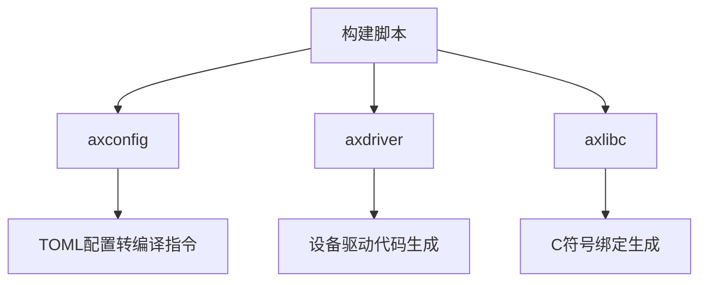
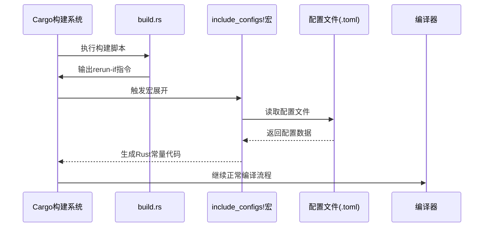
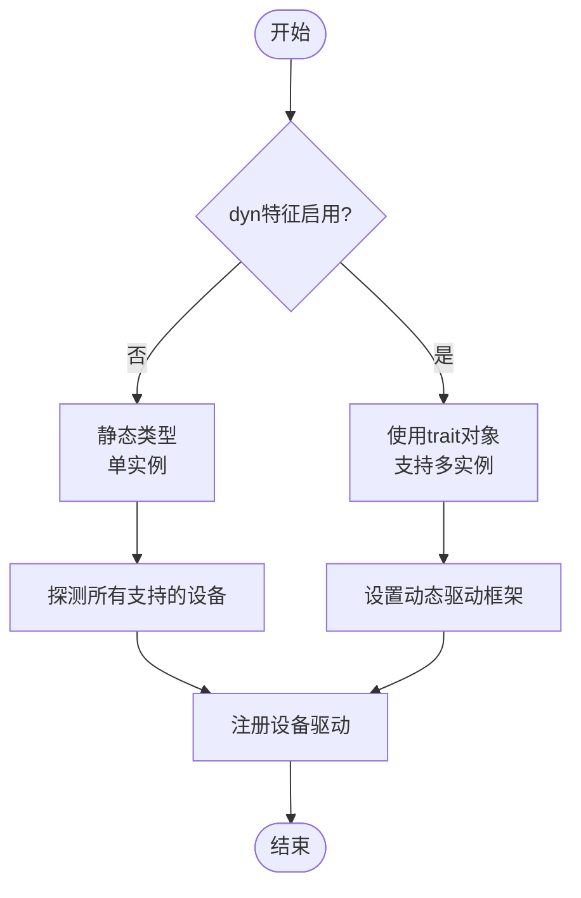
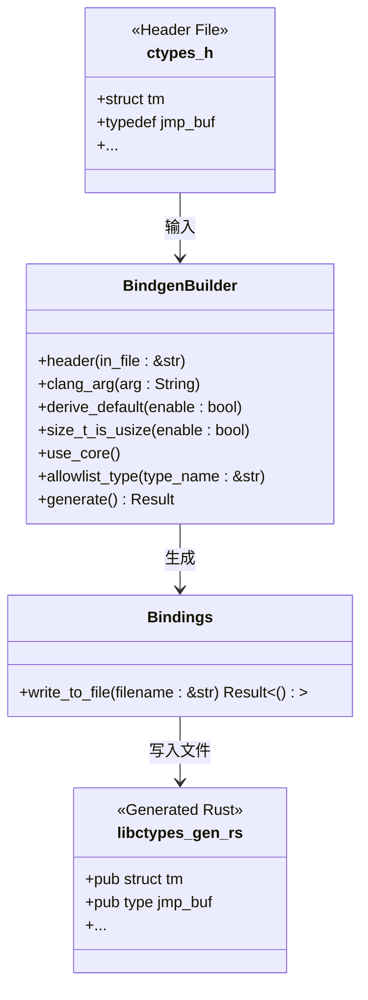

# 自定义构建脚本详解

<cite>
**本文档引用的文件**
- [build.rs](file://modules/axconfig/build.rs)
- [lib.rs](file://modules/axconfig/src/lib.rs)
- [Cargo.toml](file://modules/axconfig/Cargo.toml)
- [defconfig.toml](file://configs/defconfig.toml)
- [build.rs](file://modules/axdriver/build.rs)
- [lib.rs](file://modules/axdriver/src/lib.rs)
- [build.rs](file://ulib/axlibc/build.rs)
- [lib.rs](file://ulib/axlibc/src/lib.rs)
</cite>

## 目录
1. [引言](#引言)
2. [项目结构概述](#项目结构概述)
3. [核心模块分析](#核心模块分析)
4. [axconfig的构建原理](#axconfig的构建原理)
5. [axdriver的构建机制](#axdriver的构建机制)
6. [axlibc的符号导出处理](#axlibc的符号导出处理)
7. [构建脚本执行时机与限制](#构建脚本执行时机与限制)
8. [自定义构建脚本编写规范](#自定义构建脚本编写规范)
9. [结论](#结论)

## 引言
本文档全面解析ArceOS项目中关键模块的`build.rs`构建脚本实现原理。重点分析`axconfig`、`axdriver`和`axlibc`三个核心模块如何利用Rust的自定义构建系统完成配置转换、代码生成和符号导出等任务。通过深入剖析这些构建脚本的工作机制，为开发者提供编写高效可靠构建脚本的最佳实践指南。

## 项目结构概述
ArceOS项目的构建脚本分布在多个关键模块中，主要包括：
- `modules/axconfig`: 负责平台配置解析
- `modules/axdriver`: 设备驱动初始化代码生成
- `ulib/axlibc`: C兼容性符号导出处理

这些构建脚本在编译时运行，根据不同的配置条件生成相应的Rust代码或编译指令，从而实现高度可配置的系统构建。



**Diagram sources**
- [build.rs](file://modules/axconfig/build.rs)
- [build.rs](file://modules/axdriver/build.rs)
- [build.rs](file://ulib/axlibc/build.rs)

**Section sources**
- [build.rs](file://modules/axconfig/build.rs)
- [build.rs](file://modules/axdriver/build.rs)
- [build.rs](file://ulib/axlibc/build.rs)

## 核心模块分析
本节分析三个核心模块的构建脚本及其相关组件之间的关系。

### axconfig模块
该模块负责将TOML格式的配置文件转换为Rust编译时可用的常量参数。

**Section sources**
- [build.rs](file://modules/axconfig/build.rs)
- [lib.rs](file://modules/axconfig/src/lib.rs)
- [Cargo.toml](file://modules/axconfig/Cargo.toml)

### axdriver模块
该模块根据编译特征生成设备驱动初始化代码，支持静态和动态两种设备模型。

**Section sources**
- [build.rs](file://modules/axdriver/build.rs)
- [lib.rs](file://modules/axdriver/src/lib.rs)

### axlibc模块
该模块处理C语言兼容性符号的导出，确保用户程序能够正确调用标准C库函数。

**Section sources**
- [build.rs](file://ulib/axlibc/build.rs)
- [lib.rs](file://ulib/axlibc/src/lib.rs)

## axconfig的构建原理
`axconfig`模块的构建脚本主要负责监控配置文件的变化，并触发重新编译。

### 配置文件监控机制
构建脚本通过输出特定的cargo指令来声明其依赖关系：

```rust
println!("cargo:rerun-if-env-changed=AX_CONFIG_PATH");
if let Ok(config_path) = std::env::var("AX_CONFIG_PATH") {
    println!("cargo:rerun-if-changed={config_path}");
}
```

这种机制确保当环境变量`AX_CONFIG_PATH`改变或指定的配置文件被修改时，cargo会自动重新运行构建脚本。

### TOML到Rust常量的转换
实际的配置解析由`axconfig-macros` crate中的`include_configs!`宏完成：

```rust
axconfig_macros::include_configs!(
    path_env = "AX_CONFIG_PATH",
    fallback = "../../configs/dummy.toml"
);
```

该宏在编译时读取TOML文件，将其内容转换为Rust常量，例如从`defconfig.toml`中提取`task-stack-size`和`ticks-per-sec`等参数。



**Diagram sources**
- [build.rs](file://modules/axconfig/build.rs)
- [lib.rs](file://modules/axconfig/src/lib.rs)
- [defconfig.toml](file://configs/defconfig.toml)

**Section sources**
- [build.rs](file://modules/axconfig/build.rs)
- [lib.rs](file://modules/axconfig/src/lib.rs)

## axdriver的构建机制
`axdriver`模块的构建脚本实现了复杂的条件编译逻辑，用于生成设备驱动相关的配置。

### 特征检测与cfg标志生成
构建脚本通过检查环境变量中的`CARGO_FEATURE_*`来确定启用了哪些功能特性：

```rust
fn has_feature(feature: &str) -> bool {
    std::env::var(format!(
        "CARGO_FEATURE_{}",
        feature.to_uppercase().replace('-', "_")
    ))
    .is_ok()
}
```

基于检测结果，脚本使用`cargo:rustc-cfg`指令注入新的编译配置：

```rust
enable_cfg("bus", "mmio"); // 或 "pci"
enable_cfg("net_dev", "virtio-net"); // 或其他网络设备
```

### 设备类别管理
脚本定义了不同类型的设备特征列表：

```rust
const NET_DEV_FEATURES: &[&str] = &["fxmac", "ixgbe", "virtio-net"];
const BLOCK_DEV_FEATURES: &[&str] = &["ramdisk", "bcm2835-sdhci", "virtio-blk"];
const DISPLAY_DEV_FEATURES: &[&str] = &["virtio-gpu"];
```

根据`dyn`特征是否启用，决定是采用单例模式还是支持多个设备实例。



**Diagram sources**
- [build.rs](file://modules/axdriver/build.rs)
- [lib.rs](file://modules/axdriver/src/lib.rs)

**Section sources**
- [build.rs](file://modules/axdriver/build.rs)
- [lib.rs](file://modules/axdriver/src/lib.rs)

## axlibc的符号导出处理
`axlibc`模块的构建脚本专注于C语言兼容性支持。

### C到Rust绑定生成
使用`bindgen`工具自动生成C头文件到Rust的绑定：

```rust
fn gen_c_to_rust_bindings(in_file: &str, out_file: &str) {
    let mut builder = bindgen::Builder::default()
        .header(in_file)
        .clang_arg("-I./include")
        .derive_default(true)
        .size_t_is_usize(false)
        .use_core();
    
    // 处理特定目标架构
    if let Some(llvm_target) = target.strip_suffix("-softfloat") {
        builder = builder.clang_arg(format!("--target={llvm_target}"));
    }
    
    // 白名单允许的类型
    for ty in allow_types {
        builder = builder.allowlist_type(ty);
    }
    
    builder.generate().expect("生成失败").write_to_file(out_file)?;
}
```

### 符号白名单管理
脚本明确指定了需要导出的C标准库符号：

```rust
let allow_types = ["tm", "jmp_buf"];
```

这确保只有必要的C结构体被暴露给Rust代码，保持接口的精简和安全。



**Diagram sources**
- [build.rs](file://ulib/axlibc/build.rs)
- [ctypes.h](file://ulib/axlibc/ctypes.h)
- [libctypes_gen.rs](file://ulib/axlibc/src/libctypes_gen.rs)

**Section sources**
- [build.rs](file://ulib/axlibc/build.rs)
- [lib.rs](file://ulib/axlibc/src/lib.rs)

## 构建脚本执行时机与限制
理解构建脚本的执行环境对于正确编写至关重要。

### 执行时机
构建脚本在以下情况下执行：
- 首次构建项目时
- 当`build.rs`文件本身被修改时
- 当通过`cargo:rerun-if-changed`声明的文件发生变化时
- 当相关环境变量通过`cargo:rerun-if-env-changed`被修改时

### 可用API限制
构建脚本运行在特殊的环境中，有以下特点：
- 可以使用完整的Rust标准库
- 不能访问crate的依赖项（除非是构建依赖）
- 必须通过标准输出向cargo传递指令
- 应避免长时间运行的操作，以免影响开发体验

### 与常规Rust代码的区别
| 特性 | 构建脚本 | 常规Rust代码 |
|------|----------|-------------|
| 执行时间 | 编译期 | 运行期 |
| 目标平台 | 主机平台 | 目标平台 |
| 可用依赖 | 构建依赖 | 运行时依赖 |
| 输出方式 | 标准输出(cargo指令) | 程序逻辑 |

**Section sources**
- [build.rs](file://modules/axconfig/build.rs)
- [build.rs](file://modules/axdriver/build.rs)
- [build.rs](file://ulib/axlibc/build.rs)

## 自定义构建脚本编写规范
基于上述分析，提出编写高效可靠构建脚本的最佳实践。

### 错误处理
构建脚本应妥善处理各种错误情况：

```rust
// 正确的做法：使用expect提供清晰的错误信息
builder.generate().expect("Unable to generate c->rust bindings")

// 避免静默失败
```

### 缓存控制
合理使用cargo的缓存机制：

```rust
// 明确声明重新运行的条件
println!("cargo:rerun-if-changed=../configs/");
println!("cargo:rerun-if-env-changed=AX_CONFIG_PATH");
```

### 跨平台兼容性
考虑不同目标平台的差异：

```rust
// 处理