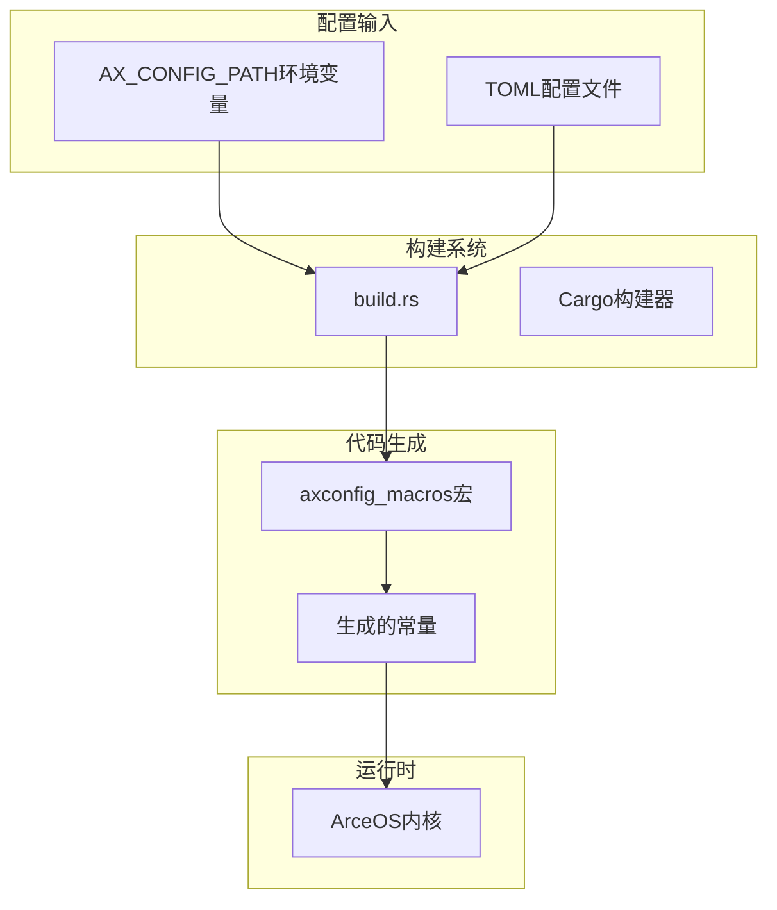
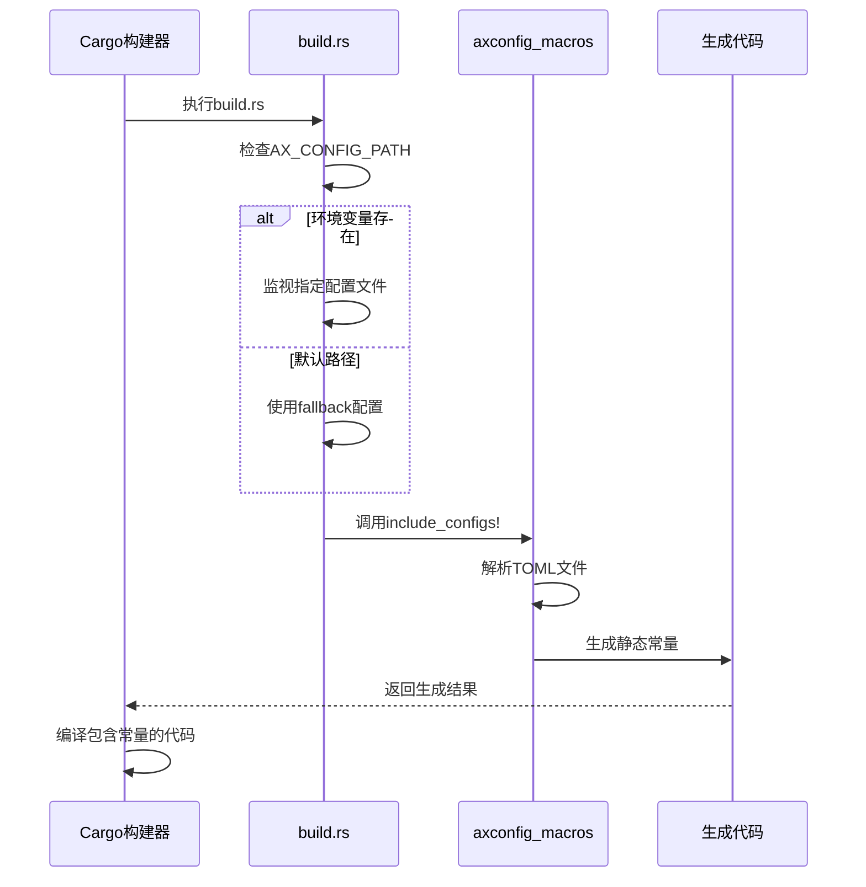

# 配置管理与功能定制

<cite>
**本文档引用的文件**
- [defconfig.toml](file://configs/defconfig.toml)
- [x86_64-pc-oslab.toml](file://configs/custom/x86_64-pc-oslab.toml)
- [lib.rs](file://modules/axconfig/src/lib.rs)
- [build.rs](file://modules/axconfig/build.rs)
- [Cargo.toml](file://modules/axconfig/Cargo.toml)
</cite>

## 目录
1. [简介](#简介)
2. [配置系统架构](#配置系统架构)
3. [TOML配置文件结构详解](#toml配置文件结构详解)
4. [编译期配置解析机制](#编译期配置解析机制)
5. [创建自定义平台配置](#创建自定义平台配置)
6. [典型编译错误与排查](#典型编译错误与排查)

## 简介
ArceOS采用基于TOML格式的静态配置管理系统，通过axconfig模块在编译期将平台参数注入内核。该系统支持灵活的功能开关和资源参数定制，开发者可通过环境变量指定配置文件路径，实现不同硬件平台的适配。

## 配置系统架构



**图示来源**
- [build.rs](file://modules/axconfig/build.rs#L1-L6)
- [lib.rs](file://modules/axconfig/src/lib.rs#L10-L13)

**本节来源**
- [lib.rs](file://modules/axconfig/src/lib.rs#L1-L14)
- [build.rs](file://modules/axconfig/build.rs#L1-L6)

## TOML配置文件结构详解

ArceOS的配置文件采用TOML格式，主要包含以下核心参数类别：

### 任务调度配置
- `task-stack-size`: 每个任务的栈空间大小（字节）
- `ticks-per-sec`: 每秒定时器滴答数（Hz）

### 系统功能开关
- `enable-net`: 是否启用网络子系统
- `enable-fs`: 是否启用文件系统支持
- `enable-display`: 图形显示支持开关

### 内存管理参数
- `heap-size`: 内核堆内存大小
- `page-size`: 内存页大小配置
- `phys-addr-offset`: 物理地址偏移量

### 架构特定参数
- `arch`: 目标架构（如x86_64、aarch64）
- `cpu-num`: 支持的CPU核心数量
- `timer-interval`: 定时器中断间隔

这些配置项在`defconfig.toml`中提供默认值，并可在自定义配置文件中覆盖。例如`custom/x86_64-pc-oslab.toml`为特定PC平台提供了优化配置。

**本节来源**
- [defconfig.toml](file://configs/defconfig.toml#L1-L7)
- [x86_64-pc-oslab.toml](file://configs/custom/x86_64-pc-oslab.toml)

## 编译期配置解析机制

axconfig模块利用Rust的编译期宏系统实现配置解析。其核心工作流程如下：



**图示来源**
- [lib.rs](file://modules/axconfig/src/lib.rs#L10-L13)
- [build.rs](file://modules/axconfig/build.rs#L1-L6)

**本节来源**
- [lib.rs](file://modules/axconfig/src/lib.rs#L10-L13)
- [build.rs](file://modules/axconfig/build.rs#L1-L6)

关键实现位于`axconfig/src/lib.rs`中的`include_configs!`宏调用，该宏根据环境变量`AX_CONFIG_PATH`指定的路径读取配置文件，若未设置则使用`../../configs/dummy.toml`作为默认配置。生成的配置常量以静态方式注入内核代码，避免运行时解析开销。

## 创建自定义平台配置

开发者可基于现有模板创建新的平台配置文件，步骤如下：

### 1. 复制基础模板
从`defconfig.toml`或现有平台配置复制模板：
```bash
cp configs/defconfig.toml configs/custom/my-platform.toml
```

### 2. 配置架构参数
设置目标平台架构特性：
```toml
arch = "riscv64"
cpu-num = 4
phys-addr-offset = 0x80000000
```

### 3. 定义内存布局
规划物理内存分布：
```toml
memory-layout = [
    { type = "ram", base = 0x80000000, size = 0x40000000 },
    { type = "mmio", base = 0xc0000000, size = 0x10000000 }
]
```

### 4. 设置调度策略
配置任务调度参数：
```toml
task-stack-size = 0x80000
ticks-per-sec = 1000
scheduler-type = "cfs"  # 可选：fifo、rr、cfs
```

### 5. 启用功能模块
根据需求开启相应功能：
```toml
enable-net = true
enable-fs = true
enable-display = false
enable-dma = true
```

### 6. 编译验证
通过环境变量指定配置进行编译：
```bash
AX_CONFIG_PATH=configs/custom/my-platform.toml make
```

**本节来源**
- [defconfig.toml](file://configs/defconfig.toml)
- [x86_64-pc-oslab.toml](file://configs/custom/x86_64-pc-oslab.toml)

## 典型编译错误与排查

当配置文件存在错误时，编译系统会产生相应的错误信息，常见问题及解决方案如下：

### 配置文件路径错误
**错误信息**：
```
Error: Cannot find config file specified by AX_CONFIG_PATH
```
**解决方案**：
- 检查`AX_CONFIG_PATH`环境变量路径是否正确
- 确认文件是否存在且有读取权限
- 使用相对路径时注意工作目录位置

### TOML语法错误
**错误信息**：
```
Parse error: invalid TOML syntax at line XX
```
**解决方案**：
- 使用在线TOML验证工具检查语法
- 确保字符串使用双引号包围
- 检查数组和表的括号匹配

### 类型不匹配
**错误信息**：
```
Type error: expected integer, found string for key 'task-stack-size'
```
**解决方案**：
- 核对配置项的数据类型要求
- 数值配置不要用引号包围
- 布尔值使用true/false而非"true"/"false"

### 必需字段缺失
**错误信息**：
```
Missing required field: arch
```
**解决方案**：
- 参考`defconfig.toml`确保必需字段存在
- 检查拼写错误和缩进层级
- 确认所有顶层配置项都已正确定义

**本节来源**
- [lib.rs](file://modules/axconfig/src/lib.rs#L10-L13)
- [build.rs](file://modules/axconfig/build.rs#L1-L6)
- [defconfig.toml](file://configs/defconfig.toml)