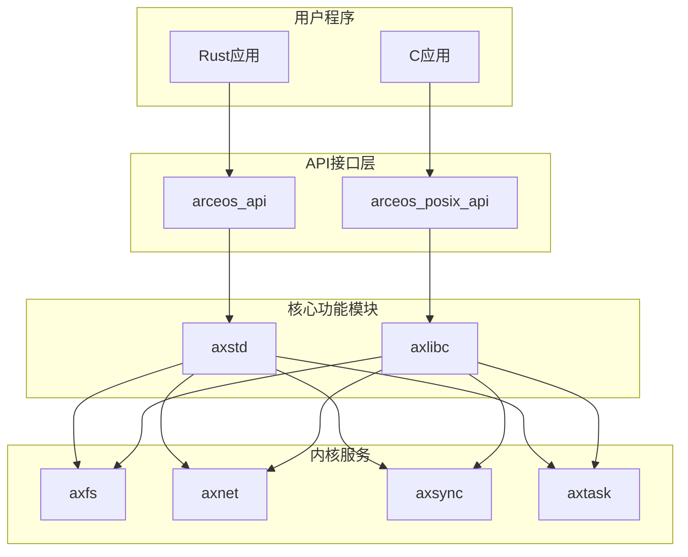
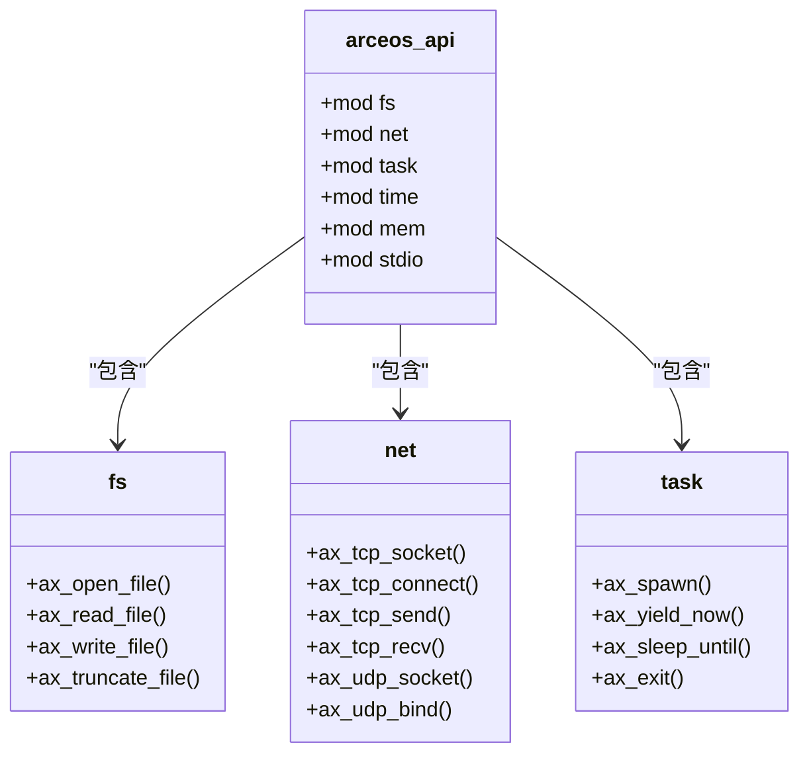
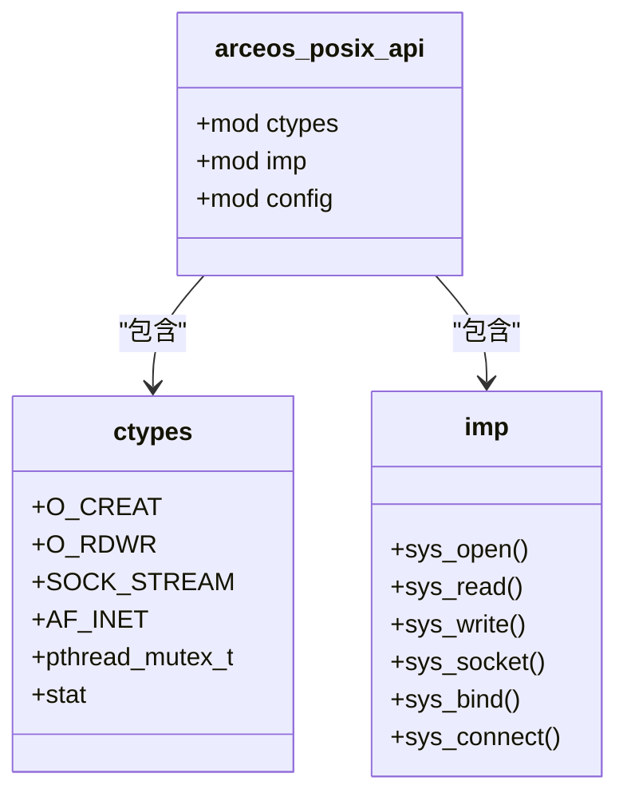
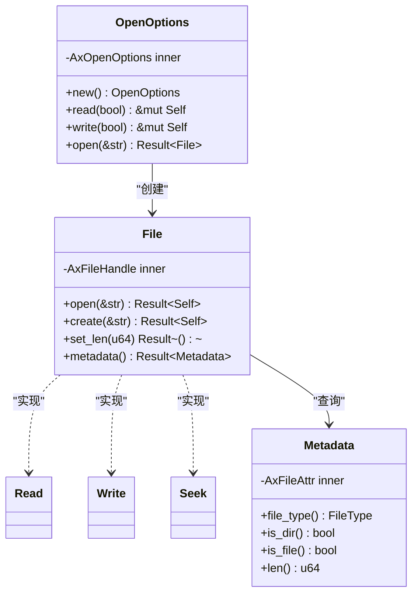
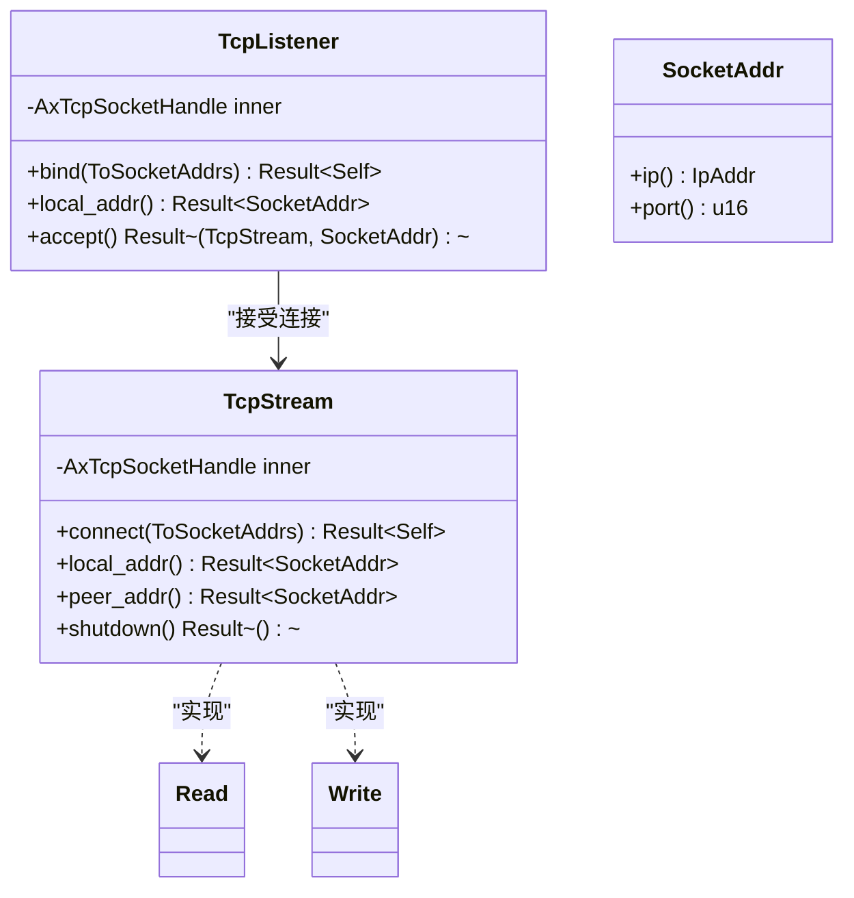
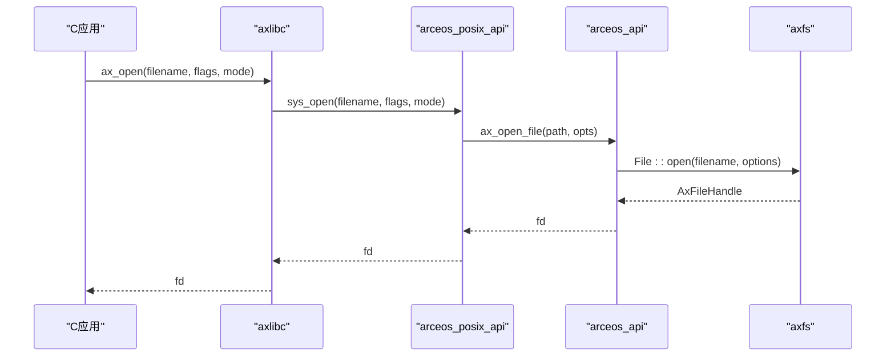
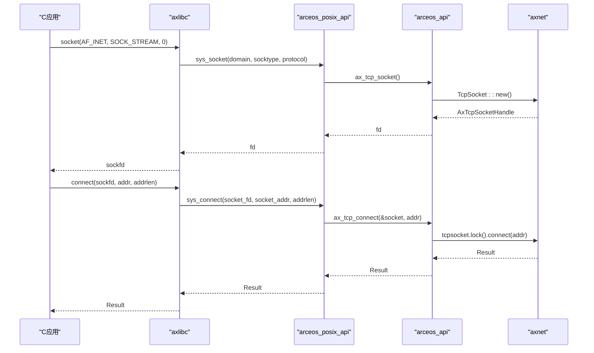
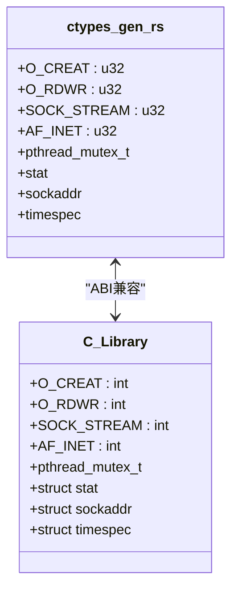
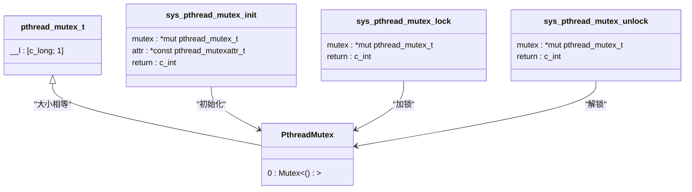

# API接口层架构

<cite>
**本文档中引用的文件**  
- [lib.rs](file://api/arceos_api/src/lib.rs)
- [lib.rs](file://api/arceos_posix_api/src/lib.rs)
- [ctypes_gen.rs](file://api/arceos_posix_api/src/ctypes_gen.rs)
- [ctypes.h](file://api/arceos_posix_api/ctypes.h)
- [mutex.rs](file://api/arceos_posix_api/src/imp/pthread/mutex.rs)
- [fs.rs](file://api/arceos_posix_api/src/imp/fs.rs)
- [net.rs](file://api/arceos_posix_api/src/imp/net.rs)
- [lib.rs](file://ulib/axstd/src/lib.rs)
- [file.rs](file://ulib/axstd/src/fs/file.rs)
- [tcp.rs](file://ulib/axstd/src/net/tcp.rs)
- [lib.rs](file://ulib/axlibc/src/lib.rs)
- [fs.rs](file://ulib/axlibc/src/fs.rs)
- [net.rs](file://ulib/axlibc/src/net.rs)
- [io.rs](file://ulib/axlibc/src/io.rs)
</cite>

## 目录
1. [引言](#引言)
2. [双层API架构设计](#双层api架构设计)
3. [原生ArceOS API分析](#原生arceos-api分析)
4. [POSIX兼容API分析](#posix兼容api分析)
5. [axstd标准库实现](#axstd标准库实现)
6. [axlibc C运行时支持](#axlibc-c运行时支持)
7. [系统调用路径追踪](#系统调用路径追踪)
8. [C ABI兼容性机制](#c-abi兼容性机制)
9. [头文件生成机制](#头文件生成机制)
10. [结论](#结论)

## 引言
ArceOS采用双层API架构设计，提供原生Rust风格API和POSIX兼容API两种接口。这种设计既保持了Rust语言的安全性和现代特性，又确保了与现有C应用程序的兼容性。本文档将深入分析这两种API的设计理念差异、适用场景以及底层实现机制。

## 双层API架构设计
ArceOS的双层API架构由两个主要部分组成：原生ArceOS API（arceos_api）和POSIX兼容API（arceos_posix_api）。这种分层设计允许开发者根据需求选择合适的接口层。



**图示来源**
- [lib.rs](file://api/arceos_api/src/lib.rs)
- [lib.rs](file://api/arceos_posix_api/src/lib.rs)
- [lib.rs](file://ulib/axstd/src/lib.rs)
- [lib.rs](file://ulib/axlibc/src/lib.rs)

## 原生ArceOS API分析
原生ArceOS API（arceos_api）是为Rust应用程序设计的现代化接口，充分利用了Rust语言的安全特性和类型系统。

### 设计理念
原生API采用Rust惯用法，提供类型安全、内存安全的接口。它通过define_api!宏定义API，确保编译时检查和零成本抽象。



**图示来源**
- [lib.rs](file://api/arceos_api/src/lib.rs#L1-L413)

**本节来源**
- [lib.rs](file://api/arceos_api/src/lib.rs#L1-L413)

## POSIX兼容API分析
POSIX兼容API（arceos_posix_api）为C应用程序提供了熟悉的接口，确保现有代码可以无缝移植到ArceOS平台。

### 设计理念
POSIX API遵循传统的C语言编程范式，使用函数指针和全局状态，与Linux系统调用保持语义一致性。



**图示来源**
- [lib.rs](file://api/arceos_posix_api/src/lib.rs#L1-L60)
- [ctypes_gen.rs](file://api/arceos_posix_api/src/ctypes_gen.rs#L1-L827)

**本节来源**
- [lib.rs](file://api/arceos_posix_api/src/lib.rs#L1-L60)
- [ctypes_gen.rs](file://api/arceos_posix_api/src/ctypes_gen.rs#L1-L827)

## axstd标准库实现
axstd作为Rust风格的标准库，封装了核心功能，为Rust应用程序提供现代化的API接口。

### 文件系统封装
axstd::fs模块封装了文件操作，提供了符合Rust惯用法的接口。



**图示来源**
- [file.rs](file://ulib/axstd/src/fs/file.rs#L1-L187)

**本节来源**
- [file.rs](file://ulib/axstd/src/fs/file.rs#L1-L187)
- [lib.rs](file://ulib/axstd/src/lib.rs#L1-L77)

### 网络通信封装
axstd::net模块提供了TCP/UDP网络通信的高级封装。



**图示来源**
- [tcp.rs](file://ulib/axstd/src/net/tcp.rs#L1-L105)

**本节来源**
- [tcp.rs](file://ulib/axstd/src/net/tcp.rs#L1-L105)
- [lib.rs](file://ulib/axstd/src/lib.rs#L1-L77)

## axlibc C运行时支持
axlibc实现了C运行时支持，使现有C应用程序能够在ArceOS上运行。

### 文件操作实现
axlibc通过系统调用桥接C标准库函数与底层API。



**图示来源**
- [fs.rs](file://ulib/axlibc/src/fs.rs#L1-L67)
- [fs.rs](file://api/arceos_posix_api/src/imp/fs.rs#L1-L218)

**本节来源**
- [fs.rs](file://ulib/axlibc/src/fs.rs#L1-L67)
- [fs.rs](file://api/arceos_posix_api/src/imp/fs.rs#L1-L218)

### 网络通信实现
axlibc的网络模块实现了socket API的完整功能集。



**图示来源**
- [net.rs](file://ulib/axlibc/src/net.rs#L1-L180)
- [net.rs](file://api/arceos_posix_api/src/imp/net.rs#L1-L581)

**本节来源**
- [net.rs](file://ulib/axlibc/src/net.rs#L1-L180)
- [net.rs](file://api/arceos_posix_api/src/imp/net.rs#L1-L581)

## 系统调用路径追踪
通过具体系统调用的代码路径追踪，展示从用户程序到内核服务的完整调用链。

### printf调用路径
```mermaid
flowchart TD
Start([printf("Hello")]) --> Format["格式化字符串"]
Format --> Write["调用write()"]
Write --> Axlibc["axlibc::write()"]
Axlibc --> PosixApi["arceos_posix_api::sys_write()"]
PosixApi --> ArceosApi["arceos_api::stdio::ax_console_write_bytes()"]
ArceosApi --> Console["控制台输出"]
Console --> End([显示结果])
```

**本节来源**
- [io.rs](file://ulib/axlibc/src/io.rs#L1-L32)
- [lib.rs](file://api/arceos_api/src/lib.rs#L1-L413)

### socket调用路径
```mermaid
flowchart TD
Start([socket()]) --> Axlibc["axlibc::socket()"]
Axlibc --> PosixApi["arceos_posix_api::sys_socket()"]
PosixApi --> ArceosApi["arceos_api::net::ax_tcp_socket()"]
ArceosApi --> Axnet["axnet::TcpSocket::new()"]
Axnet --> Memory["分配内存"]
Memory --> Handle["返回句柄"]
Handle --> FdTable["加入文件描述符表"]
FdTable --> End([返回sockfd])
```

**本节来源**
- [net.rs](file://ulib/axlibc/src/net.rs#L1-L180)
- [net.rs](file://api/arceos_posix_api/src/imp/net.rs#L1-L581)
- [lib.rs](file://api/arceos_api/src/lib.rs#L1-L413)

## C ABI兼容性机制
ctypes_gen.rs在保持C ABI兼容性中起着关键作用，确保Rust代码能够正确与C代码交互。

### 类型映射
ctypes_gen.rs通过rust-bindgen自动生成C类型定义，确保与C标准库的二进制兼容性。



**图示来源**
- [ctypes_gen.rs](file://api/arceos_posix_api/src/ctypes_gen.rs#L1-L827)

**本节来源**
- [ctypes_gen.rs](file://api/arceos_posix_api/src/ctypes_gen.rs#L1-L827)

## 头文件生成机制
pthread_mutex.h等头文件的生成机制确保了C应用程序能够正确使用ArceOS提供的同步原语。

### 互斥锁实现


**图示来源**
- [mutex.rs](file://api/arceos_posix_api/src/imp/pthread/mutex.rs#L1-L70)
- [ctypes_gen.rs](file://api/arceos_posix_api/src/ctypes_gen.rs#L1-L827)

**本节来源**
- [mutex.rs](file://api/arceos_posix_api/src/imp/pthread/mutex.rs#L1-L70)
- [ctypes_gen.rs](file://api/arceos_posix_api/src/ctypes_gen.rs#L1-L827)

## 结论
ArceOS的双层API架构成功地平衡了现代化编程语言特性和传统兼容性的需求。原生ArceOS API为Rust应用程序提供了安全、高效的接口，而POSIX兼容API则确保了现有C代码的可移植性。axstd和axlibc分别作为Rust和C的运行时支持，通过清晰的层次结构和精确的系统调用路径，实现了从用户程序到内核服务的高效通信。ctypes_gen.rs和头文件生成机制保证了C ABI的严格兼容，使得ArceOS成为一个既现代又实用的操作系统平台。