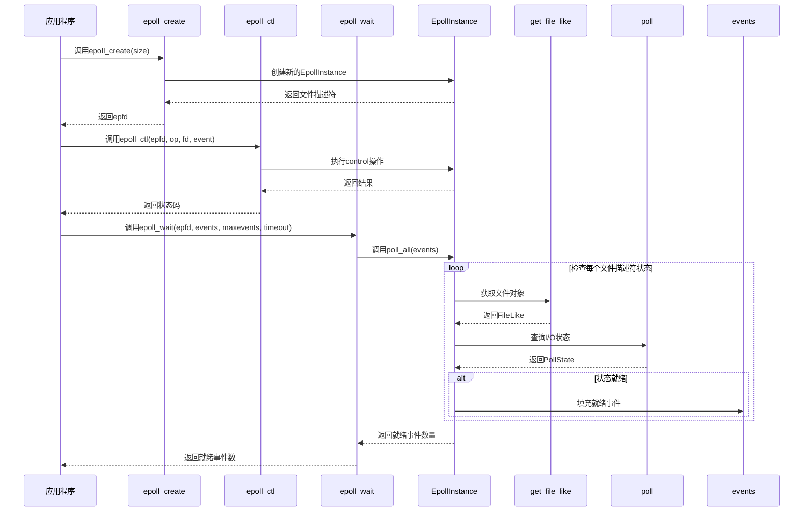
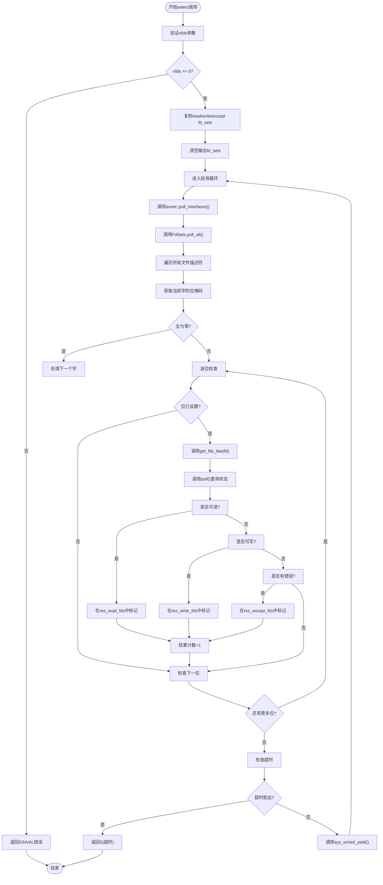
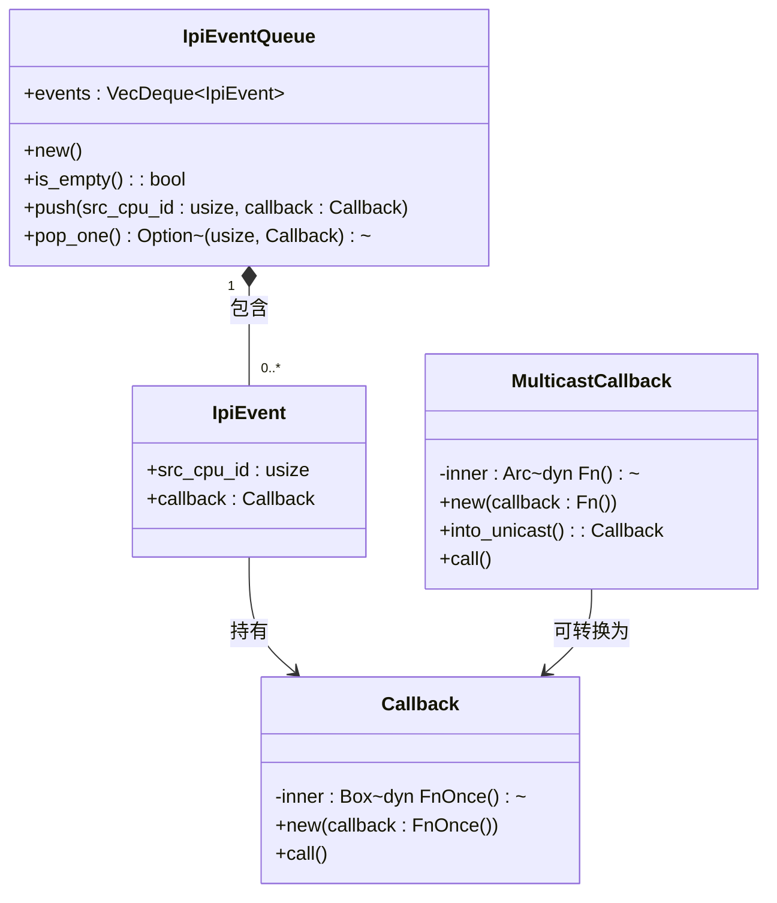

# I/O多路复用实现

<cite>
**本文档引用的文件**
- [epoll.rs](file://api/arceos_posix_api/src/imp/io_mpx/epoll.rs)
- [select.rs](file://api/arceos_posix_api/src/imp/io_mpx/select.rs)
- [lib.rs](file://modules/axipi/src/lib.rs)
- [queue.rs](file://modules/axipi/src/queue.rs)
- [event.rs](file://modules/axipi/src/event.rs)
- [epoll.h](file://ulib/axlibc/include/sys/epoll.h)
- [select.h](file://ulib/axlibc/include/sys/select.h)
</cite>

## 目录
1. [引言](#引言)
2. [epoll机制实现原理](#epoll机制实现原理)
3. [select机制实现原理](#select机制实现原理)
4. [底层事件驱动框架axipi分析](#底层事件驱动框架axipi分析)
5. [epoll与select性能对比](#epoll与select性能对比)
6. [高并发优化策略](#高并发优化策略)
7. [网络服务器代码示例](#网络服务器代码示例)
8. [边缘触发与水平触发支持现状](#边缘触发与水平触发支持现状)

## 引言
在现代操作系统中，I/O多路复用技术是构建高性能网络服务的核心。arceos_posix_api提供了对epoll和select两种I/O多路复用机制的支持，通过统一的POSIX接口为应用程序提供高效的事件通知能力。本文将深入分析这两种机制在arceos系统中的具体实现，探讨其底层架构设计，并比较它们在不同场景下的性能特征。

## epoll机制实现原理

### epoll_create、epoll_ctl、epoll_wait系统调用分析
epoll机制通过三个核心系统调用来管理文件描述符的事件监控：`epoll_create`用于创建一个新的epoll实例，`epoll_ctl`用于控制epoll实例中的文件描述符及其关注的事件类型，而`epoll_wait`则用于等待并获取就绪的事件。

在arceos_posix_api中，`sys_epoll_create`函数负责初始化一个`EpollInstance`对象，并将其注册到全局文件描述符管理系统中。该实例内部使用`BTreeMap`来维护被监控文件描述符与其对应事件之间的映射关系，确保了高效的查找和更新操作。

`sys_epoll_ctl`系统调用根据传入的操作码（如`EPOLL_CTL_ADD`、`EPOLL_CTL_MOD`或`EPOLL_CTL_DEL`）对指定文件描述符进行添加、修改或删除操作。这些操作均在`EpollInstance::control`方法中完成，通过对`BTreeMap`的原子性操作保证线程安全。

`sys_epoll_wait`则是事件等待的核心，它会循环调用`poll_all`方法检查所有注册文件描述符的状态变化。当检测到有文件描述符变为可读或可写时，立即将相关信息填充至用户提供的事件数组中并返回，从而避免了不必要的轮询开销。

**图示来源**
- [epoll.rs](file://api/arceos_posix_api/src/imp/io_mpx/epoll.rs#L0-L205)

**本节来源**
- [epoll.rs](file://api/arceos_posix_api/src/imp/io_mpx/epoll.rs#L0-L205)
- [epoll.h](file://ulib/axlibc/include/sys/epoll.h#L51-L59)

## select机制实现原理

### select系统调用的工作流程
select机制采用位图（bitmask）的方式管理文件描述符集合，通过`fd_set`结构体表示读、写和异常三类事件的关注集合。`sys_select`系统调用首先将输入的`fd_set`转换为内部的`FdSets`结构，然后进入循环等待阶段。

在每次迭代中，`poll_all`方法会遍历所有可能的文件描述符（最多FD_SETSIZE个），利用位运算快速跳过未设置的位段。对于每一个设置了标志位的文件描述符，调用`get_file_like`获取对应的文件对象，并通过`poll`方法查询其当前I/O状态。如果状态匹配且满足条件，则在输出的`fd_set`中标记该描述符为就绪状态。

由于select需要每次扫描整个文件描述符集合，因此其时间复杂度为O(n)，其中n为最大文件描述符编号。这种线性扫描方式在处理大量连接时效率较低。

**图示来源**
- [select.rs](file://api/arceos_posix_api/src/imp/io_mpx/select.rs#L0-L165)

**本节来源**
- [select.rs](file://api/arceos_posix_api/src/imp/io_mpx/select.rs#L0-L165)
- [select.h](file://ulib/axlibc/include/sys/select.h#L0-L35)

## 底层事件驱动框架axipi分析

### 就绪事件队列与任务等待队列的交互逻辑
axipi模块作为ArceOS的处理器间中断（IPI）基础组件，为跨CPU核心的任务调度和事件传递提供了底层支持。其核心数据结构`IpiEventQueue`基于`VecDeque`实现了先进先出（FIFO）的事件队列，每个CPU核心拥有独立的事件队列实例，由`LazyInit`延迟初始化。

当需要在特定CPU上执行回调函数时，`run_on_cpu`函数会判断目标CPU是否为当前CPU。若是，则直接执行回调；否则，将封装好的`Callback`对象推入目标CPU的`IPI_EVENT_QUEUE`中，并通过硬件IPI机制触发中断。目标CPU在中断处理程序`ipi_handler`中消费队列中的事件，依次执行回调函数。

这种设计使得事件通知与任务唤醒能够高效解耦：epoll等高层机制可以将就绪事件的处理逻辑封装为回调函数，提交给axipi框架进行异步执行，从而避免阻塞主线程。同时，任务等待队列可通过注册回调的方式监听特定事件，实现精准的唤醒机制。

**图示来源**
- [lib.rs](file://modules/axipi/src/lib.rs#L0-L80)
- [queue.rs](file://modules/axipi/src/queue.rs#L0-L53)
- [event.rs](file://modules/axipi/src/event.rs#L0-L57)

**本节来源**
- [lib.rs](file://modules/axipi/src/lib.rs#L0-L80)
- [queue.rs](file://modules/axipi/src/queue.rs#L0-L53)
- [event.rs](file://modules/axipi/src/event.rs#L0-L57)

## epoll与select性能对比

### 轮询与回调机制的差异
select采用基于轮询的主动查询模式，每次调用都需要遍历所有被监视的文件描述符，无论其状态是否发生变化。这导致其时间复杂度始终为O(n)，即使只有少数几个描述符就绪，也无法减少扫描开销。此外，select受限