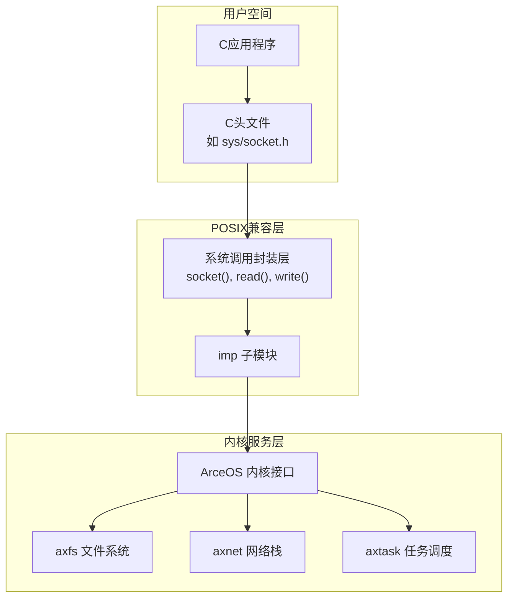
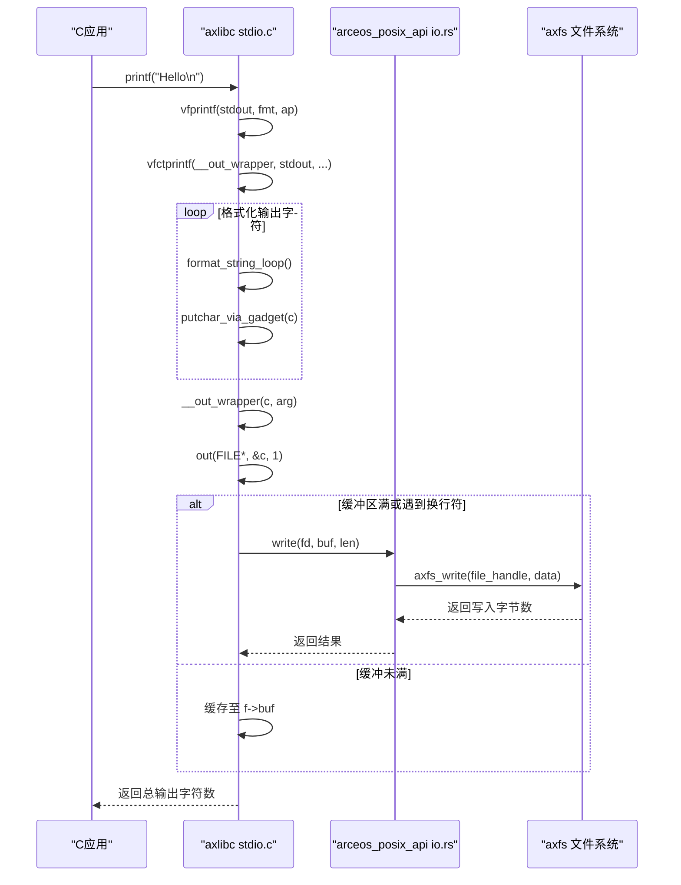
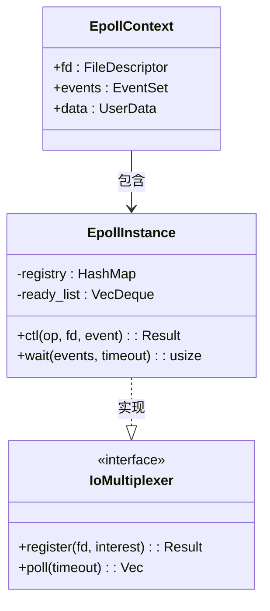
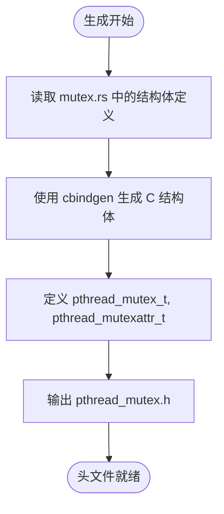

# POSIX兼容层实现

<cite>
**本文档引用的文件**
- [ctypes_gen.rs](file://api/arceos_posix_api/src/ctypes_gen.rs)
- [stdio.c](file://ulib/axlibc/c/stdio.c)
- [io.rs](file://api/arceos_posix_api/src/imp/io.rs)
- [file.rs](file://modules/axfs/src/api/file.rs)
</cite>

## 目录
1. [引言](#引言)
2. [架构分层设计](#架构分层设计)
3. [C数据类型ABI兼容性实现](#c数据类型abi兼容性实现)
4. [典型调用链追踪：printf()](#典型调用链追踪printf)
5. [多路复用I/O实现机制](#多路复用io实现机制)
6. [线程同步与pthread支持](#线程同步与pthread支持)
7. [性能优化建议](#性能优化建议)
8. [结论](#结论)

## 引言
`arceos_posix_api` 是 ArceOS 操作系统中用于提供 POSIX 标准兼容性的核心模块，旨在支持传统 C 应用程序在该平台上无缝运行。通过构建上层 C 头文件、中层系统调用封装和底层内核服务对接的三层架构，实现了对标准 C 库函数的完整支持。本文将深入分析其内部实现机制，重点解析 ABI 兼容性保障、调用链路流程以及关键子系统如 epoll 和 pthread 的实现细节。

## 架构分层设计

`arceos_posix_api` 采用清晰的三层架构模式来实现 POSIX 兼容性：



**Diagram sources**
- [lib.rs](file://api/arceos_posix_api/src/lib.rs)
- [mod.rs](file://api/arceos_posix_api/src/imp/mod.rs)

**Section sources**
- [lib.rs](file://api/arceos_posix_api/src/lib.rs)
- [mod.rs](file://api/arceos_posix_api/src/imp/mod.rs)

## C数据类型ABI兼容性实现

为了确保 C 语言与 Rust 之间的二进制接口（ABI）兼容性，`arceos_posix_api` 使用 `ctypes_gen.rs` 自动生成与 C 类型一一对应的 Rust 绑定类型。

### ctypes_gen.rs 的作用
该文件利用 Rust 的 `bindgen` 工具或手动宏定义方式，将 C 中的标准类型（如 `size_t`, `off_t`, `time_t` 等）映射为具有相同内存布局的 Rust 类型。这保证了跨语言调用时参数传递的正确性。

```rust
// 示例：由 ctypes_gen.rs 生成的关键类型定义
pub type c_int = i32;
pub type c_uint = u32;
pub type size_t = usize;
pub type off_t = i64;
```

此外，`ctypes.h` 提供了 C 端的类型声明，确保编译器在处理 C 代码时使用一致的类型大小和对齐规则。

**Section sources**
- [ctypes_gen.rs](file://api/arceos_posix_api/src/ctypes_gen.rs)
- [ctypes.h](file://api/arceos_posix_api/ctypes.h)

## 典型调用链追踪：printf()

以下是从用户程序调用 `printf()` 到最终写入文件系统的完整调用链分析：



**Diagram sources**
- [stdio.c](file://ulib/axlibc/c/stdio.c)
- [io.rs](file://api/arceos_posix_api/src/imp/io.rs)
- [file.rs](file://modules/axfs/src/api/file.rs)

**Section sources**
- [stdio.c](file://ulib/axlibc/c/stdio.c)
- [io.rs](file://api/arceos_posix_api/src/imp/io.rs)
- [file.rs](file://modules/axfs/src/api/file.rs)

### 关键步骤说明
1. **格式化阶段**：`printf` 调用 `vfprintf`，再通过 `vfctprintf` 驱动 `format_string_loop` 完成格式字符串解析与字符生成。
2. **输出包装器**：`__out_wrapper` 将每个字符传给 `out` 函数，后者负责缓冲管理。
3. **系统调用触发**：当缓冲区满或遇到 `\n` 时，调用 `write` 系统调用。
4. **内核交互**：`arceos_posix_api` 的 `write` 实现在 `imp/io.rs` 中，最终转发至 `axfs` 的 `write` 接口完成持久化。

## 多路复用I/O实现机制

`arceos_posix_api` 支持 `epoll` 和 `select` 两种主流 I/O 多路复用机制，其实现位于 `imp/io_mpx` 模块。

### epoll 实现结构


**Diagram sources**
- [epoll.rs](file://api/arceos_posix_api/src/imp/io_mpx/epoll.rs)
- [mod.rs](file://api/arceos_posix_api/src/imp/io_mpx/mod.rs)

#### 核心特性
- 基于红黑树或哈希表维护监听文件描述符集合（`epoll_ctl`）
- 就绪事件队列采用双端队列实现高效通知（`epoll_wait`）
- 与底层设备驱动事件机制集成，实现异步唤醒

### select 实现
`select` 的实现基于 `fd_set` 位图轮询机制，适用于小规模文件描述符监控场景。其性能低于 `epoll`，但兼容性更好。

**Section sources**
- [epoll.rs](file://api/arceos_posix_api/src/imp/io_mpx/epoll.rs)
- [select.rs](file://api/arceos_posix_api/src/imp/io_mpx/select.rs)

## 线程同步与pthread支持

`arceos_posix_api` 提供完整的 POSIX 线程（pthread）支持，包括互斥锁、条件变量、线程创建等。

### pthread_mutex.h 生成机制
`pthread_mutex.h` 并非手写，而是通过构建脚本（`build.rs`）从 Rust 定义自动生成 C 可见的头文件。这一过程结合了 `cbindgen` 工具与宏展开技术，确保 C 层能正确调用底层 `axsync::Mutex`。



**Diagram sources**
- [mutex.rs](file://api/arceos_posix_api/src/imp/pthread/mutex.rs)
- [build.rs](file://api/arceos_posix_api/build.rs)

### 互斥锁实现路径
- C 层调用 `pthread_mutex_lock()` →
- Rust FFI 封装函数 →
- 调用 `axsync::Mutex::lock()` →
- 底层基于 `spinlock` 或 `futex` 实现等待

**Section sources**
- [mutex.rs](file://api/arceos_posix_api/src/imp/pthread/mutex.rs)
- [pthread.h](file://ulib/axlibc/include/pthread.h)

## 性能优化建议

| 优化方向 | 建议措施 | 说明 |
|--------|--------|------|
| **I/O 缓冲** | 合理设置 `FILE_BUF_SIZE` | 减少 `write` 系统调用频率 |
| **多路复用选择** | 高并发场景优先使用 `epoll` | 避免 `select` 的 O(n) 轮询开销 |
| **锁粒度控制** | 细化临界区，避免长时间持有 `pthread_mutex` | 降低线程竞争概率 |
| **内存分配** | 复用缓冲区，减少频繁堆分配 | 配合 `axalloc` 提升效率 |
| **系统调用批处理** | 使用 `writev/readv` 替代多次 `write/read` | 减少上下文切换次数 |

## 结论
`arceos_posix_api` 通过精心设计的三层架构成功实现了对 POSIX 标准的兼容，使得传统 C 应用能够在 ArceOS 上顺利运行。其核心在于：
- 利用 `ctypes_gen.rs` 保障 C/Rust ABI 兼容；
- 构建清晰的系统调用封装层对接内核服务；
- 完整实现 `epoll`、`pthread` 等关键 POSIX 子系统；
- 通过自动化工具生成 C 头文件，提升开发效率与一致性。

未来可进一步优化的方向包括引入零拷贝 I/O、增强异步支持以及完善信号处理机制，以全面提升系统性能与兼容性。