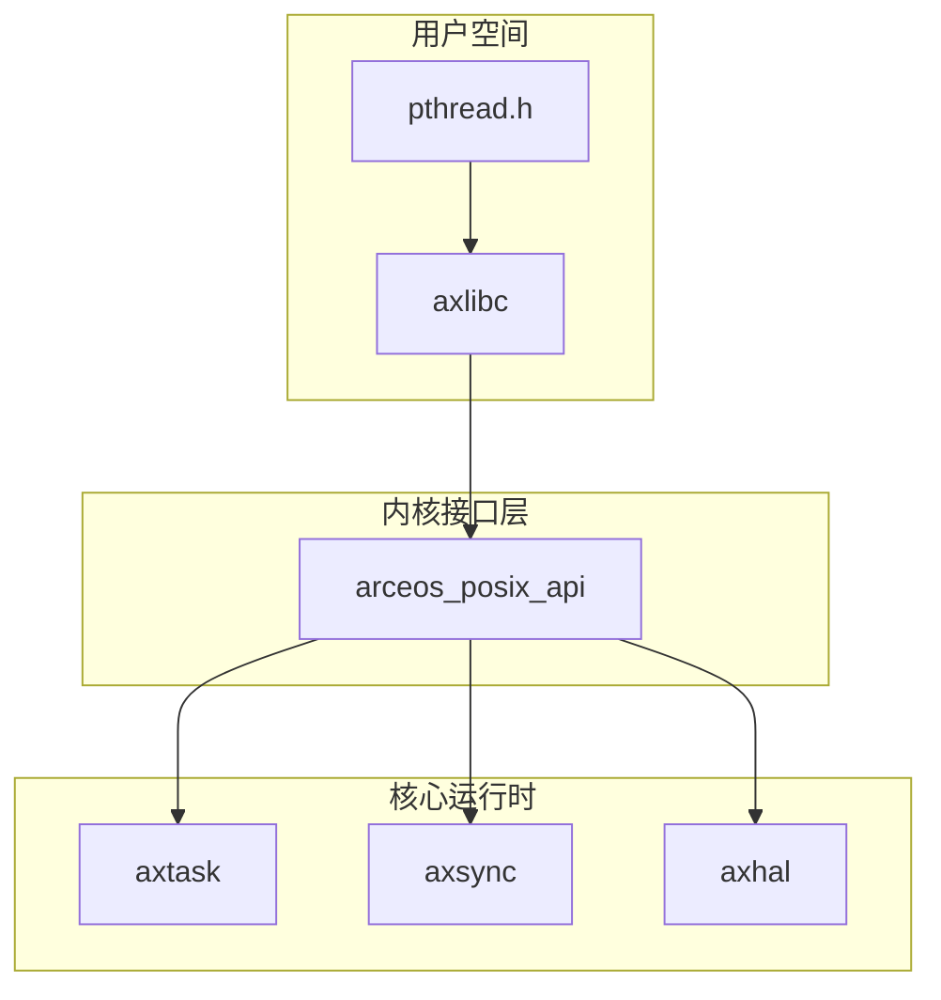
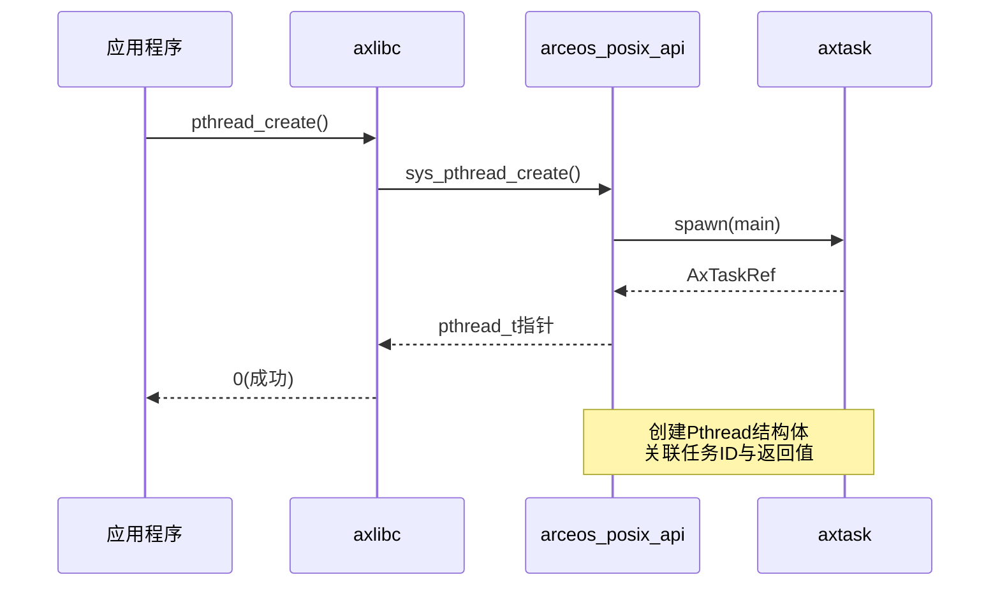
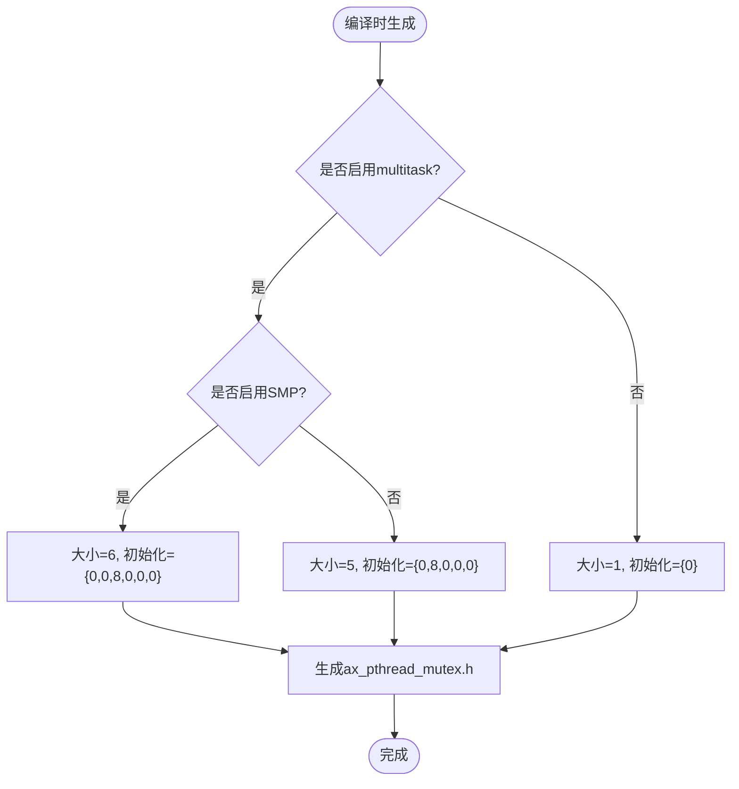
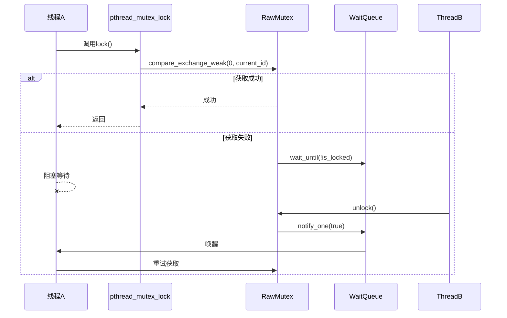
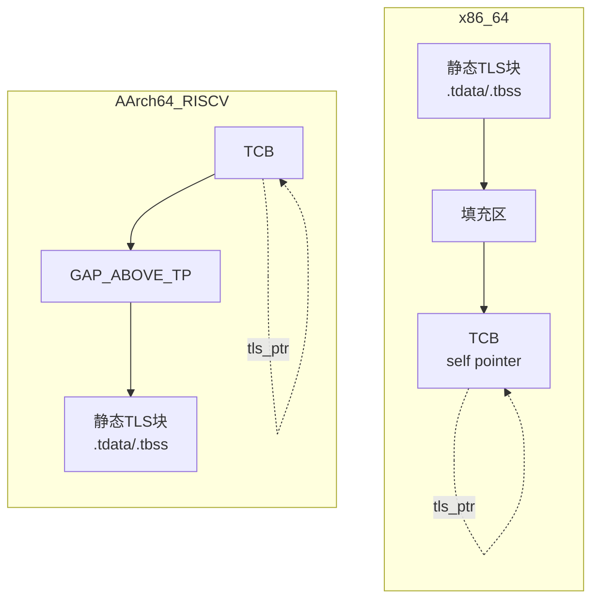

# 线程与同步原语

<cite>
**本文档引用文件**  
- [pthread.rs](file://ulib/axlibc/src/pthread.rs)
- [mod.rs](file://api/arceos_posix_api/src/imp/pthread/mod.rs)
- [mutex.rs](file://api/arceos_posix_api/src/imp/pthread/mutex.rs)
- [task.rs](file://modules/axtask/src/task.rs)
- [mutex.rs](file://modules/axsync/src/mutex.rs)
- [tls.rs](file://modules/axhal/src/tls.rs)
- [pthread.h](file://ulib/axlibc/include/pthread.h)
- [ax_pthread_mutex.h](file://ulib/axlibc/include/ax_pthread_mutex.h)
</cite>

## 目录
1. [引言](#引言)
2. [POSIX线程API实现机制](#posix线程api实现机制)
3. [线程创建与管理](#线程创建与管理)
4. [互斥锁实现与ABI兼容性](#互斥锁实现与abi兼容性)
5. [线程局部存储初始化](#线程局部存储初始化)
6. [线程属性与状态管理](#线程属性与状态管理)
7. [多线程调试与死锁预防](#多线程调试与死锁预防)

## 引言
ArceOS作为轻量级操作系统，通过封装底层任务调度和同步原语，实现了完整的POSIX线程（pthread）API。本文深入解析pthread_create、pthread_join、pthread_mutex_lock等关键函数的实现机制，重点分析其如何基于axtask任务调度模块和axsync同步原语构建多线程环境。

## POSIX线程API实现机制
ArceOS的POSIX线程API采用分层架构设计，上层提供标准C接口，中层进行系统调用封装，底层依赖Rust异步运行时组件。该设计实现了C语言接口与Rust安全并发模型的无缝集成。



**图示来源**
- [pthread.h](file://ulib/axlibc/include/pthread.h)
- [pthread.rs](file://ulib/axlibc/src/pthread.rs)
- [mod.rs](file://api/arceos_posix_api/src/imp/pthread/mod.rs)

## 线程创建与管理

### pthread_create实现流程
`pthread_create`函数通过三层调用链完成线程创建：从C接口到Rust系统调用，最终由axtask模块完成实际的任务生成。



**图示来源**
- [pthread.rs](file://ulib/axlibc/src/pthread.rs#L15-L28)
- [mod.rs](file://api/arceos_posix_api/src/imp/pthread/mod.rs#L50-L80)

### 线程生命周期管理
线程的整个生命周期由Pthread结构体统一管理，包含任务引用、返回值传递和资源回收机制。

```mermaid
classDiagram
class Pthread {
+inner : AxTaskRef
+retval : Arc~Packet<*mut c_void>~
+create() LinuxResult~ctypes : : pthread_t~
+current_ptr() *mut Pthread
+exit_current(retval) !
+join(ptr) LinuxResult~*mut c_void~
}
class Packet[T] {
+result : UnsafeCell~T~
}
class AxTaskRef {
+id() TaskId
+join()
}
Pthread --> Packet : 包含
Pthread --> AxTaskRef : 持有
Pthread ..> TaskInner : 映射
```

**图示来源**
- [mod.rs](file://api/arceos_posix_api/src/imp/pthread/mod.rs#L20-L150)
- [task.rs](file://modules/axtask/src/task.rs#L50-L100)

**本节来源**
- [pthread.rs](file://ulib/axlibc/src/pthread.rs#L15-L40)
- [mod.rs](file://api/arceos_posix_api/src/imp/pthread/mod.rs#L50-L100)

## 互斥锁实现与ABI兼容性

### pthread_mutex_t ABI兼容性处理
为确保与标准C库的二进制兼容性，Arceos_posix_api在编译时动态生成pthread_mutex_t结构体定义，使其内存布局与glibc保持一致。



**图示来源**
- [build.rs](file://api/arceos_posix_api/build.rs#L10-L30)
- [ax_pthread_mutex.h](file://ulib/axlibc/include/ax_pthread_mutex.h)

### 互斥锁内部实现
pthread_mutex_lock等操作最终映射到axsync::Mutex的底层实现，通过原子操作和等待队列实现阻塞同步。



**图示来源**
- [mutex.rs](file://api/arceos_posix_api/src/imp/pthread/mutex.rs#L20-L70)
- [mutex.rs](file://modules/axsync/src/mutex.rs#L20-L80)

**本节来源**
- [mutex.rs](file://api/arceos_posix_api/src/imp/pthread/mutex.rs)
- [ax_pthread_mutex.h](file://ulib/axlibc/include/ax_pthread_mutex.h)

## 线程局部存储初始化

### TLS内存布局
根据不同的CPU架构，TLS区域采用不同的内存布局策略，确保与主流编译器生成代码的兼容性。



**图示来源**
- [tls.rs](file://modules/axhal/src/tls.rs#L10-L50)

### TLS初始化流程
每个新线程创建时都会分配独立的TLS区域，并正确设置线程指针寄存器。

```mermaid
flowchart TD
Start([线程创建]) --> Alloc[tls_area_size()计算]
Alloc --> Zero[alloc_zeroed(layout)]
Zero --> Copy[复制.tdata段数据]
Copy --> Init[init_tcb(area_base)]
Init --> SetTP[write_thread_pointer(tls_ptr)]
SetTP --> End([初始化完成])
Note over Init,SetTP: x86_64需写入自引用指针
```

**图示来源**
- [tls.rs](file://modules/axhal/src/tls.rs#L100-L150)

**本节来源**
- [tls.rs](file://modules/axhal/src/tls.rs)

## 线程属性与状态管理

### 线程属性支持
当前实现支持基本的线程属性配置，包括栈大小和保护大小等参数。

```mermaid
erDiagram
pthread_attr_t {
union __u PK
int __i[9 or 14]
volatile int __vi[9 or 14]
unsigned long __s[7 or 9]
}
CONFIG : "sizeof(long)==8" ||--o{ pthread_attr_t : "决定数组大小"
pthread_attr_t ||--o{ STACK_SIZE : "_a_stacksize=__u.__s[0]"
pthread_attr_t ||--o{ GUARD_SIZE : "_a_guardsize=__u.__s[1]"
pthread_attr_t ||--o{ STACK_ADDR : "_a_stackaddr=__u.__s[2]"
```

**图示来源**
- [pthread.h](file://ulib/axlibc/include/pthread.h#L23-L29)
- [ctypes_gen.rs](file://api/arceos_posix_api/src/ctypes_gen.rs#L657-L688)

### 线程状态与取消机制
虽然基础框架已建立，但线程取消和分离状态等功能尚在开发中。

```mermaid
stateDiagram-v2
    [*] --> RUNNING
    RUNNING