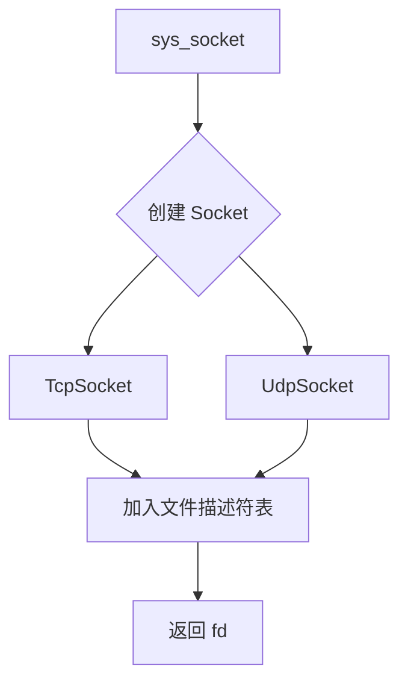
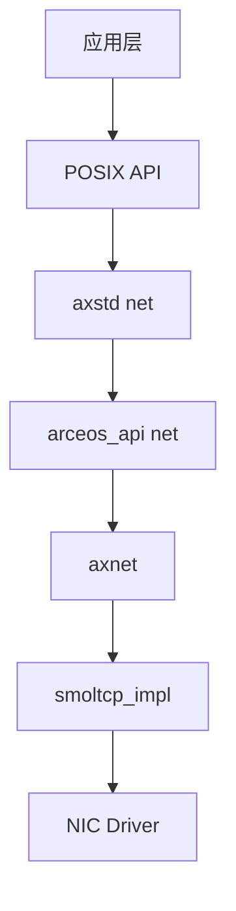
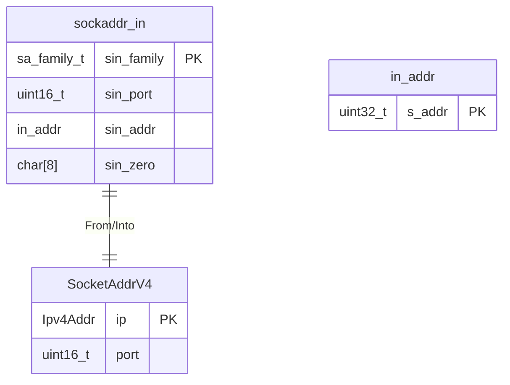
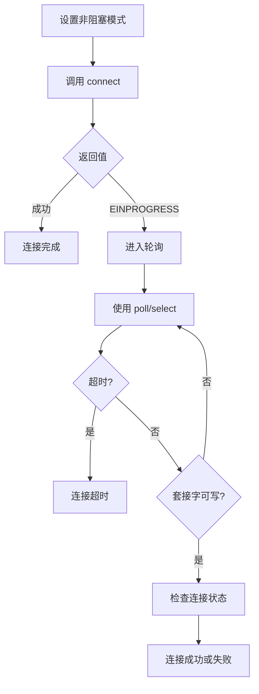

# 网络编程接口

<cite>
**本文档中引用的文件**
- [net.rs](file://api/arceos_posix_api/src/imp/net.rs)
- [socket.h](file://ulib/axlibc/include/sys/socket.h)
- [tcp.rs](file://ulib/axstd/src/net/tcp.rs)
- [udp.rs](file://ulib/axstd/src/net/udp.rs)
- [lib.rs](file://modules/axnet/src/lib.rs)
- [ctypes.h](file://api/arceos_posix_api/ctypes.h)
- [httpclient.c](file://examples/httpclient-c/httpclient.c)
</cite>

## 目录
1. [引言](#引言)
2. [POSIX Socket API 实现概览](#posix-socket-api-实现概览)
3. [地址族与套接字类型支持](#地址族与套接字类型支持)
4. [axnet 网络栈集成](#axnet-网络栈集成)
5. [sockaddr_in 结构体与 C 类型对齐](#sockaddr_in-结构体与-c-类型对齐)
6. [HTTP 客户端示例分析](#http-客户端示例分析)
7. [非阻塞 connect 与超时控制](#非阻塞-connect-与超时控制)
8. [NAT 穿透与防火墙兼容性](#nat-穿透与防火墙兼容性)
9. [结论](#结论)

## 引言
ArceOS 是一个基于 Rust 的轻量级操作系统，其设计目标是提供安全、高效的系统服务。在网络编程方面，ArceOS 通过 POSIX 兼容的 socket API 提供了 TCP 和 UDP 通信能力。本文档旨在全面解析 ArceOS 中 POSIX socket API 的实现机制，涵盖从底层网络栈绑定到高层应用示例的各个方面。

**Section sources**
- [net.rs](file://api/arceos_posix_api/src/imp/net.rs#L1-L581)

## POSIX Socket API 实现概览
ArceOS 的 POSIX socket API 实现在 `api/arceos_posix_api/src/imp/net.rs` 文件中，提供了标准的 `socket`, `bind`, `connect`, `send`, `recv` 等系统调用。这些函数通过封装内部的 `Socket` 枚举类型来统一管理 TCP 和 UDP 套接字。



**Diagram sources**
- [net.rs](file://api/arceos_posix_api/src/imp/net.rs#L100-L150)

**Section sources**
- [net.rs](file://api/arceos_posix_api/src/imp/net.rs#L1-L581)

## 地址族与套接字类型支持
ArceOS 当前仅支持 IPv4 地址族（AF_INET），不支持 IPv6（AF_INET6）。在 `sys_socket` 函数中，通过匹配 `domain`, `socktype`, `protocol` 参数来决定创建何种类型的套接字。

对于流式套接字（SOCK_STREAM），仅支持 TCP 协议；对于数据报套接字（SOCK_DGRAM），仅支持 UDP 协议。其他组合将返回 `EINVAL` 错误。


**Diagram sources**
- [socket.h](file://ulib/axlibc/include/sys/socket.h#L1-L311)
- [net.rs](file://api/arceos_posix_api/src/imp/net.rs#L150-L180)

**Section sources**
- [socket.h](file://ulib/axlibc/include/sys/socket.h#L1-L311)
- [net.rs](file://api/arceos_posix_api/src/imp/net.rs#L150-L180)

## axnet 网络栈集成
ArceOS 使用 `axnet` 模块作为其网络子系统的核心，该模块位于 `modules/axnet/src/lib.rs`。`axnet` 提供了统一的 TCP 和 UDP 套接字抽象，并默认使用 [smoltcp](https://github.com/smoltcp-rs/smoltcp) 作为底层网络协议栈。

`TcpSocket` 和 `UdpSocket` 类型通过条件编译（`cfg_if!`）引入 `smoltcp_impl` 模块的具体实现。网络初始化由 `init_network` 函数完成，它接收 NIC 设备并传递给底层实现进行初始化。



**Diagram sources**
- [lib.rs](file://modules/axnet/src/lib.rs#L1-L48)
- [net.rs](file://api/arceos_posix_api/src/imp/net.rs#L1-L581)

**Section sources**
- [lib.rs](file://modules/axnet/src/lib.rs#L1-L48)

## sockaddr_in 结构体与 C 类型对齐
`sockaddr_in` 结构体定义在 `ctypes.h` 所包含的 `<netinet/in.h>` 头文件中，其内存布局遵循 C 语言的标准。在 ArceOS 中，该结构体通过 `From` trait 与 Rust 的 `SocketAddrV4` 类型相互转换。

转换过程中需要注意字节序问题：IP 地址和端口号在 `sockaddr_in` 中以大端序存储，而 Rust 内部使用主机字节序。因此，在转换时需要进行适当的字节序转换。



**Diagram sources**
- [net.rs](file://api/arceos_posix_api/src/imp/net.rs#L200-L230)
- [ctypes.h](file://api/arceos_posix_api/ctypes.h#L1-L16)

**Section sources**
- [net.rs](file://api/arceos_posix_api/src/imp/net.rs#L200-L230)

## HTTP 客户端示例分析
位于 `examples/httpclient-c/httpclient.c` 的示例展示了如何使用 C 语言编写一个简单的 HTTP 客户端。该程序通过 `getaddrinfo` 解析域名，建立 TCP 连接，发送 HTTP 请求并接收响应。

关键步骤包括：
1. 创建 AF_INET 地址族的 SOCK_STREAM 套接字
2. 使用 `getaddrinfo` 查询目标域名的 IP 地址
3. 调用 `connect` 连接到服务器 80 端口
4. 使用 `send` 发送 HTTP GET 请求
5. 使用 `recv` 接收服务器响应

```mermaid
sequenceDiagram
participant App as 应用程序
participant LibC as libc
participant Kernel as 内核
participant Network as 网络栈
App->>LibC : socket(AF_INET, SOCK_STREAM, TCP)
LibC->>Kernel : sys_socket()
Kernel-->>LibC : fd
LibC-->>App : fd
App->>LibC : getaddrinfo("ident.me", NULL, &res)
LibC->>Network : dns_query("ident.me")
Network-->>LibC : IP 地址列表
LibC-->>App : addrinfo 结构
App->>LibC : connect(fd, res->ai_addr, len)
LibC->>Kernel : sys_connect()
Kernel->>Network : TCP 三次握手
Network-->>Kernel : 连接成功
Kernel-->>LibC : OK
LibC-->>App : OK
App->>LibC : send(fd, request, len, 0)
LibC->>Kernel : sys_send()
Kernel->>Network : 发送 TCP 数据包
Network-->>App : 发送完成
App->>LibC : recv(fd, buf, size, 0)
LibC->>Kernel : sys_recv()
Kernel<-Network : 接收 TCP 数据包
Kernel-->>LibC : 数据长度
LibC-->>App : 接收到的数据
```

**Diagram sources**
- [httpclient.c](file://examples/httpclient-c/httpclient.c#L1-L57)
- [net.rs](file://api/arceos_posix_api/src/imp/net.rs#L1-L581)

**Section sources**
- [httpclient.c](file://examples/httpclient-c/httpclient.c#L1-L57)

## 非阻塞 connect 与超时控制
ArceOS 支持通过 `set_nonblocking` 方法将套接字设置为非阻塞模式。在非阻塞模式下，`connect` 调用会立即返回，可能返回 `EINPROGRESS` 错误表示连接正在进行中。

为了实现超时控制，应用程序可以结合使用 `poll` 或 `select` 系统调用来监视套接字的状态变化。当套接字变为可写状态时，表示连接已建立或失败。



**Diagram sources**
- [net.rs](file://api/arceos_posix_api/src/imp/net.rs#L90-L100)
- [tcp.rs](file://ulib/axstd/src/net/tcp.rs#L1-L106)

**Section sources**
- [net.rs](file://api/arceos_posix_api/src/imp/net.rs#L90-L100)

## NAT 穿透与防火墙兼容性
由于 ArceOS 主要面向嵌入式和虚拟化环境，其网络配置通常处于受控环境中。对于 NAT 穿透场景，建议使用以下策略：

1. **被动模式**：作为客户端主动连接外部服务器，避免被 NAT 设备阻止入站连接。
2. **长连接**：建立持久连接以维持 NAT 映射表项。
3. **心跳机制**：定期发送保活包防止连接被中间设备中断。

防火墙兼容性方面，应确保：
- 使用标准端口（如 80、443）
- 遵循 RFC 规范构造协议数据
- 实现正确的错误处理和重试逻辑

目前 ArceOS 尚未内置 STUN/TURN 等高级 NAT 穿透协议支持，需在应用层自行实现。

**Section sources**
- [net.rs](file://api/arceos_posix_api/src/imp/net.rs#L1-L581)

## 结论
ArceOS 提供了一套完整的 POSIX 兼容 socket API 实现，基于 `axnet` 网络模块和 `smoltcp` 协议栈。虽然当前仅支持 IPv4 和基本的 TCP/UDP 功能，但其清晰的分层架构为后续扩展奠定了良好基础。开发者可以利用这套 API 构建各种网络应用，同时需要注意其在 NAT 环境下的行为特点。