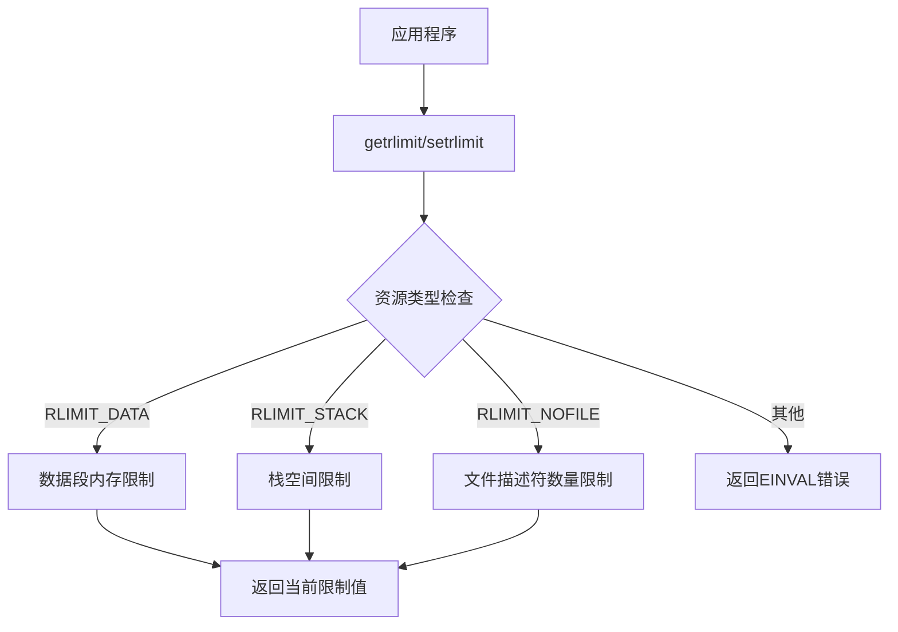
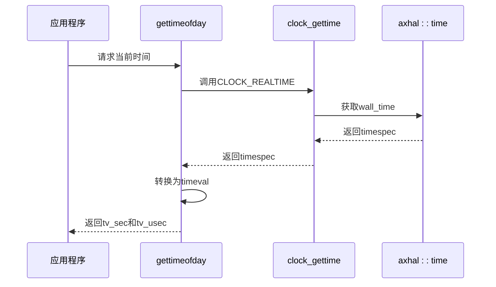
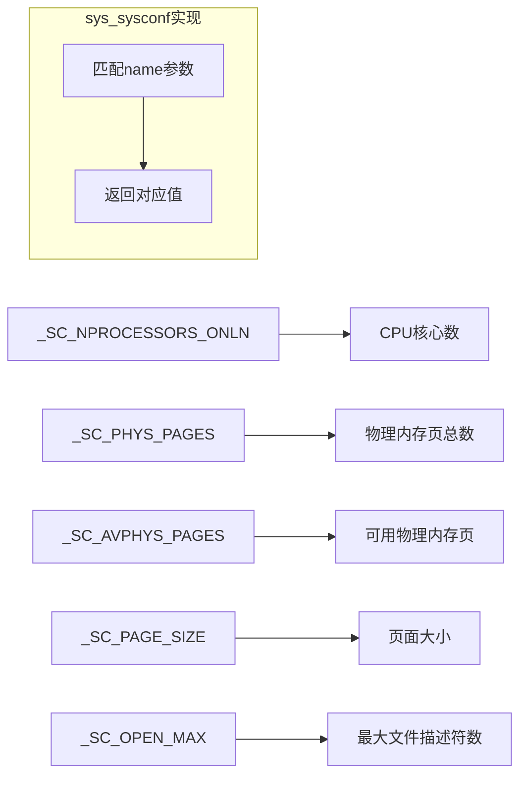
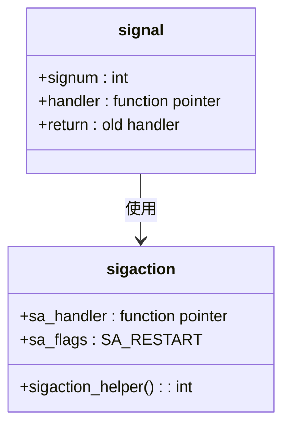
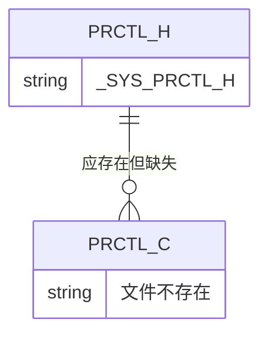

# 资源与系统调用管理

<cite>
**本文档引用的文件**
- [resource.h](file://ulib/axlibc/include/sys/resource.h)
- [resources.rs](file://api/arceos_posix_api/src/imp/resources.rs)
- [time.c](file://ulib/axlibc/c/time.c)
- [time.rs](file://api/arceos_posix_api/src/imp/time.rs)
- [sysconf.h](file://ulib/axlibc/include/unistd.h)
- [sys.rs](file://api/arceos_posix_api/src/imp/sys.rs)
- [utsname.h](file://ulib/axlibc/include/sys/utsname.h)
- [utsname.c](file://ulib/axlibc/c/utsname.c)
- [signal.h](file://ulib/axlibc/include/signal.h)
- [signal.c](file://ulib/axlibc/c/signal.c)
- [prctl.h](file://ulib/axlibc/include/sys/prctl.h)
</cite>

## 目录
1. [引言](#引言)
2. [POSIX资源限制接口实现](#posix资源限制接口实现)
3. [时间服务接口实现](#时间服务接口实现)
4. [系统状态查询接口分析](#系统状态查询接口分析)
5. [信号机制支持情况](#信号机制支持情况)
6. [系统调用模拟实现策略](#系统调用模拟实现策略)
7. [未来扩展方向](#未来扩展方向)
8. [结论](#结论)

## 引言
本文档详细阐述了ArceOS超轻量级操作系统中POSIX资源管理接口的实现机制。重点分析了`getrlimit`/`setrlimit`对内存和文件描述符数量的控制、`gettimeofday`/`clock_gettime`提供的时间服务，以及`sysconf`等系统查询接口如何反映内核运行时状态。同时探讨了信号机制的初步支持情况和`prctl`、`uname`等系统调用的模拟实现策略，并讨论了实时性保障和资源隔离的未来扩展方向。

## POSIX资源限制接口实现

### getrlimit/setrlimit接口功能
`getrlimit`和`setrlimit`系统调用用于获取和设置进程的资源使用限制。这些接口在用户库层声明，在内核层实现具体逻辑。



**图示来源**
- [resource.h](file://ulib/axlibc/include/sys/resource.h#L57-L58)
- [resources.rs](file://api/arceos_posix_api/src/imp/resources.rs#L1-L51)

### 内存与文件描述符限制控制
系统实现了对关键资源的限制控制：

- **内存限制**：通过`RLIMIT_DATA`和`RLIMIT_STACK`控制数据段和栈空间大小，其值来源于编译时配置`axconfig::TASK_STACK_SIZE`
- **文件描述符限制**：通过`RLIMIT_NOFILE`控制每个进程可打开的文件描述符数量，其值由`super::fd_ops::AX_FILE_LIMIT`定义

目前`setrlimit`接口尚未真正实现资源设置功能，仅作参数验证。

**本节来源**
- [resources.rs](file://api/arceos_posix_api/src/imp/resources.rs#L1-L51)
- [resource.h](file://ulib/axlibc/include/sys/resource.h#L57-L63)

## 时间服务接口实现

### gettimeofday与clock_gettime关系
`gettimeofday`函数基于`clock_gettime`实现，将高精度的`timespec`结构转换为微秒级精度的`timeval`结构。



**图示来源**
- [time.c](file://ulib/axlibc/c/time.c#L151-L160)
- [time.rs](file://api/arceos_posix_api/src/imp/time.rs#L49-L71)

### 时钟源实现机制
系统提供了两种主要时钟源：

- **CLOCK_REALTIME**：基于系统墙钟时间（wall time），反映实际流逝的时间
- **CLOCK_MONOTONIC**：基于单调递增时间，不受系统时间调整影响

`sys_clock_gettime`系统调用根据请求的时钟类型，分别调用`axhal::time::wall_time()`或`axhal::time::monotonic_time()`获取对应的时间值。

**本节来源**
- [time.rs](file://api/arceos_posix_api/src/imp/time.rs#L49-L71)
- [time.h](file://ulib/axlibc/include/sys/time.h#L34-L41)

## 系统状态查询接口分析

### sysconf接口功能实现
`sys_sysconf`系统调用用于查询系统配置信息，将底层硬件和内核状态以标准化方式暴露给应用程序。



**图示来源**
- [sys.rs](file://api/arceos_posix_api/src/imp/sys.rs#L1-L43)
- [unistd.h](file://ulib/axlibc/include/unistd.h#L94-L240)

### 运行时状态反映机制
系统通过以下方式反映内核运行时状态：

- **处理器信息**：`_SC_NPROCESSORS_ONLN`返回`axconfig::plat::CPU_NUM`，即平台配置的CPU核心数量
- **内存信息**：`_SC_PHYS_PAGES`基于`axhal::mem::total_ram_size()`计算总物理页数；`_SC_AVPHYS_PAGES`根据内存分配器状态或保留内存范围计算可用页数
- **文件系统限制**：`_SC_OPEN_MAX`返回`super::fd_ops::AX_FILE_LIMIT`定义的最大文件描述符数

**本节来源**
- [sys.rs](file://api/arceos_posix_api/src/imp/sys.rs#L1-L43)
- [unistd.h](file://ulib/axlibc/include/unistd.h#L94-L240)

## 信号机制支持情况

### 信号处理基础支持
系统已实现基本的信号处理框架，包括`signal`和`sigaction`等关键函数。



**图示来源**
- [signal.c](file://ulib/axlibc/c/signal.c#L17-L28)
- [signal.h](file://ulib/axlibc/include/signal.h#L165-L165)

### 当前实现局限性
信号机制目前处于初步支持阶段，存在以下局限：

- `kill`、`raise`、`pthread_kill`等函数标记为`unimplemented()`
- `pthread_sigmask`信号掩码操作未实现
- 仅支持基本的信号处理语义（SA_RESTART标志）
- 缺少完整的信号集操作支持

尽管如此，`signal`函数已能完成基本的信号处理程序注册功能。

**本节来源**
- [signal.c](file://ulib/axlibc/c/signal.c#L17-L87)
- [signal.h](file://ulib/axlibc/include/signal.h#L165-L165)

## 系统调用模拟实现策略

### uname系统调用模拟
`uname`系统调用目前采用占位符实现策略，直接调用`unimplemented()`并返回0。

```mermaid
flowchart TD
A[应用程序] --> B[调用uname]
B --> C[执行unimplemented()]
C --> D[返回0]
```

这种实现表明该功能尚未完成，需要后续补充具体的系统信息填充逻辑。

**本节来源**
- [utsname.c](file://ulib/axlibc/c/utsname.c#L4-L8)
- [utsname.h](file://ulib/axlibc/include/sys/utsname.h#L20-L20)

### prctl系统调用状态
`prctl`系统调用头文件存在但无实现文件，表明该功能尚未开始开发。



**图示来源**
- [prctl.h](file://ulib/axlibc/include/sys/prctl.h#L1-L5)

## 未来扩展方向

### 实时性保障增强
未来可通过以下方式增强系统的实时性保障能力：

- 完善高精度定时器支持
- 实现更精细的调度策略控制
- 增强中断响应确定性
- 提供实时信号支持

### 资源隔离机制
建议的资源隔离扩展方向包括：

- 完整实现`setrlimit`资源限制功能
- 引入命名空间（namespace）机制
- 实现cgroups类似的资源分组管理
- 加强内存隔离和CPU配额控制

### 信号机制完善
信号子系统的改进计划应包含：

- 实现完整的信号发送和接收机制
- 支持信号队列和优先级
- 完成多线程环境下的信号处理
- 实现可靠的信号掩码操作

## 结论
ArceOS目前已实现了POSIX标准中关键的资源管理和时间服务接口，为应用程序提供了基本的系统交互能力。`getrlimit`/`setrlimit`和`sysconf`等接口能够有效控制和查询系统资源状态，`gettimeofday`/`clock_gettime`提供了可靠的时间服务。信号机制虽已建立基础框架，但仍需进一步完善。`uname`和`prctl`等系统调用的模拟实现表明这些功能尚待开发。未来应在实时性保障和资源隔离方面持续投入，以提升系统的完整性和可靠性。