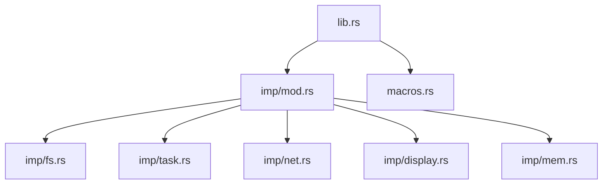
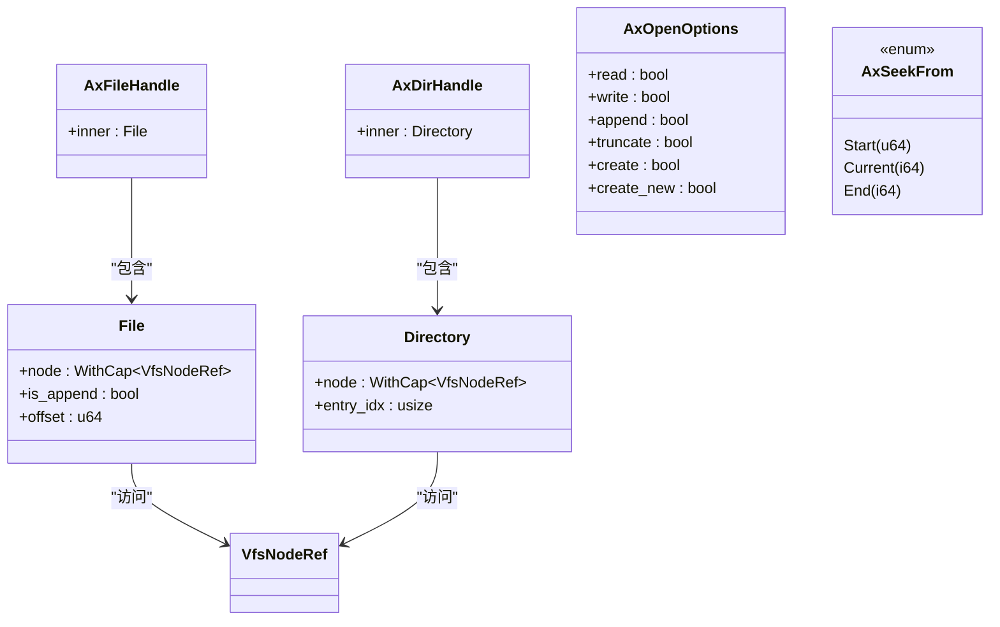
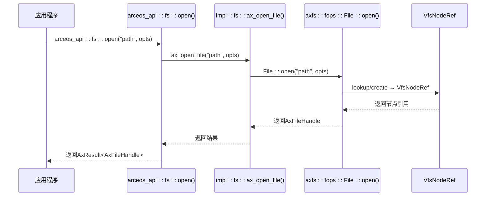
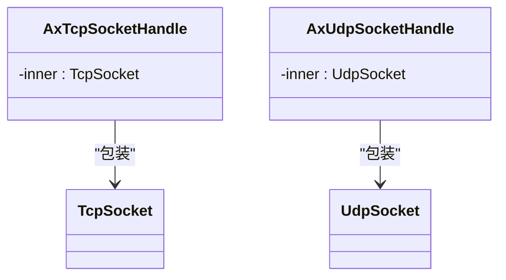

# 原生ArceOS API设计

<cite>
**本文档中引用的文件**  
- [lib.rs](file://api/arceos_api/src/lib.rs)
- [macros.rs](file://api/arceos_api/src/macros.rs)
- [fs.rs](file://api/arceos_api/src/imp/fs.rs)
- [task.rs](file://api/arceos_api/src/imp/task.rs)
- [net.rs](file://api/arceos_api/src/imp/net.rs)
- [display.rs](file://api/arceos_api/src/imp/display.rs)
- [lib.rs](file://modules/axfs/src/lib.rs)
- [fops.rs](file://modules/axfs/src/fops.rs)
- [file.rs](file://modules/axfs/src/api/file.rs)
</cite>

## 目录
1. [引言](#引言)
2. [项目结构](#项目结构)
3. [核心组件](#核心组件)
4. [架构概述](#架构概述)
5. [详细组件分析](#详细组件分析)
6. [依赖关系分析](#依赖关系分析)
7. [性能考量](#性能考量)
8. [故障排查指南](#故障排查指南)
9. [结论](#结论)

## 引言
本文件深入解析`arceos_api`模块的设计理念与实现机制，阐述其作为操作系统原生接口如何直接暴露内核功能。涵盖任务管理、文件系统、网络通信和显示控制等核心服务，并通过具体示例展示从API层到实际模块的调用路径。

## 项目结构
`arceos_api`模块位于`api/arceos_api/src`目录下，采用清晰的分层结构组织代码。公共接口定义在`lib.rs`中，而各子系统的具体实现在`imp`子目录下的独立文件中（如`fs.rs`、`task.rs`）。宏系统在`macros.rs`中定义，用于生成类型安全且无开销的API函数。



**图源**
- [lib.rs](file://api/arceos_api/src/lib.rs)
- [imp/fs.rs](file://api/arceos_api/src/imp/fs.rs)
- [imp/task.rs](file://api/arceos_api/src/imp/task.rs)
- [imp/net.rs](file://api/arceos_api/src/imp/net.rs)
- [imp/display.rs](file://api/arceos_api/src/imp/display.rs)

**节源**
- [lib.rs](file://api/arceos_api/src/lib.rs)
- [imp/fs.rs](file://api/arceos_api/src/imp/fs.rs)

## 核心组件
`arceos_api`的核心在于其将操作系统底层功能以Rust语言特性封装为类型安全、内存安全的高层API。主要模块包括：
- `fs`: 文件系统操作
- `task`: 多任务调度
- `net`: 网络通信
- `display`: 显示控制
- `mem`: 内存管理

这些模块通过统一的宏机制实现抽象与具体实现的解耦。

**节源**
- [lib.rs](file://api/arceos_api/src/lib.rs#L1-L413)

## 架构概述
该API的设计遵循“零成本抽象”原则，利用Rust宏在编译期生成直接调用底层模块的代码，避免运行时开销。公共接口在`lib.rs`中声明，使用`define_api!`宏展开为对`imp`模块中对应函数的实际调用。


**图源**
- [lib.rs](file://api/arceos_api/src/lib.rs)
- [macros.rs](file://api/arceos_api/src/macros.rs)
- [imp/fs.rs](file://api/arceos_api/src/imp/fs.rs)
- [lib.rs](file://modules/axfs/src/lib.rs)

**节源**
- [lib.rs](file://api/arceos_api/src/lib.rs#L1-L413)
- [macros.rs](file://api/arceos_api/src/macros.rs#L1-L110)

## 详细组件分析

### 文件系统模块分析
`arceos_api::fs`模块提供完整的文件操作接口，从高层API到底层实现形成清晰的调用链。

#### 类图：文件系统数据结构


**图源**
- [imp/fs.rs](file://api/arceos_api/src/imp/fs.rs#L1-L87)
- [fops.rs](file://modules/axfs/src/fops.rs#L1-L418)

#### 调用序列图：打开文件流程


**图源**
- [lib.rs](file://api/arceos_api/src/lib.rs#L150-L180)
- [imp/fs.rs](file://api/arceos_api/src/imp/fs.rs#L15-L20)
- [fops.rs](file://modules/axfs/src/fops.rs#L150-L170)

**节源**
- [lib.rs](file://api/arceos_api/src/lib.rs#L150-L180)
- [imp/fs.rs](file://api/arceos_api/src/imp/fs.rs#L1-L87)
- [fops.rs](file://modules/axfs/src/fops.rs#L1-L418)

### 任务管理模块分析
任务管理模块提供了多线程环境下的基本操作，支持任务创建、同步和调度。

#### 类图：任务管理数据结构
```mermaid
classDiagram
class AxTaskHandle {
-inner : axtask : : AxTaskRef
-id : u64
}
class AxWaitQueueHandle {
-inner : axtask : : WaitQueue
}
class AxCpuMask {
<<struct>>
mask : u64
}
AxTaskHandle --> axtask : : AxTaskRef : "引用"
AxWaitQueueHandle --> axtask : : WaitQueue : "包装"
```

**图源**
- [imp/task.rs](file://api/arceos_api/src/imp/task.rs#L1-L138)

**节源**
- [imp/task.rs](file://api/arceos_api/src/imp/task.rs#L1-L138)

### 网络通信模块分析
网络模块封装了TCP/UDP套接字操作，提供异步友好的接口。

#### 类图：网络通信数据结构


**图源**
- [imp/net.rs](file://api/arceos_api/src/imp/net.rs#L1-L131)

**节源**
- [imp/net.rs](file://api/arceos_api/src/imp/net.rs#L1-L131)

### 显示控制模块分析
显示模块提供帧缓冲区的访问接口，用于图形输出。

#### 类图：显示控制数据结构
```mermaid
classDiagram
class AxDisplayInfo {
width : u32
height : u32
pitch : u32
pixel_format : PixelFormat
}
class axdisplay : : DisplayInfo {
同上
}
AxDisplayInfo <|-- axdisplay : : DisplayInfo : "类型别名"
```

**图源**
- [imp/display.rs](file://api/arceos_api/src/imp/display.rs#L1-L11)

**节源**
- [imp/display.rs](file://api/arceos_api/src/imp/display.rs#L1-L11)

## 依赖关系分析
`arceos_api`模块通过条件编译特性(feature)按需启用不同子系统，各模块依赖相应的底层实现：

```mermaid
graph TD
A[arceos_api] --> |cfg="fs"| B[axfs]
A --> |cfg="net"| C[axnet]
A --> |cfg="multitask"| D[axtask]
A --> |cfg="display"| E[axdisplay]
A --> |cfg="dma"| F[axdma]
A --> G[axconfig]
A --> H[axhal]
A --> I[axlog]
style A fill:#cfc,stroke:#333
style B fill:#ccf,stroke:#333
style C fill:#ccf,stroke:#333
style D fill:#ccf,stroke:#333
style E fill:#ccf,stroke:#333
style F fill:#ccf,stroke:#333
```

**图源**
- [lib.rs](file://api/arceos_api/src/lib.rs)
- [Cargo.toml](file://api/arceos_api/Cargo.toml)

**节源**
- [lib.rs](file://api/arceos_api/src/lib.rs#L1-L413)

## 性能考量
- **优势**：完全消除C ABI开销，所有调用均为直接函数调用或内联
- **类型安全**：利用Rust类型系统防止常见错误
- **内存安全**：无需手动内存管理，RAII确保资源正确释放
- **局限性**：仅适用于Rust应用程序，无法被C/C++直接调用
- **编译期开销**：宏展开可能增加编译时间，但不影响运行时性能

## 故障排查指南
常见问题及解决方案：

| 问题现象 | 可能原因 | 解决方案 |
|--------|--------|--------|
| `ax_open_file`返回错误 | 路径不存在或权限不足 | 检查