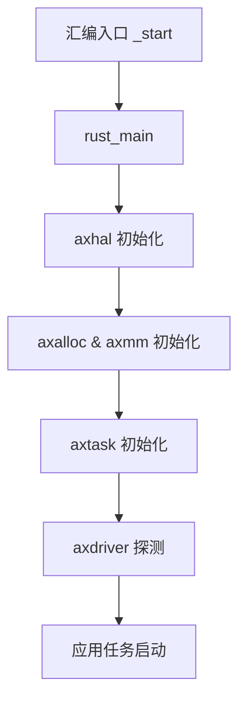
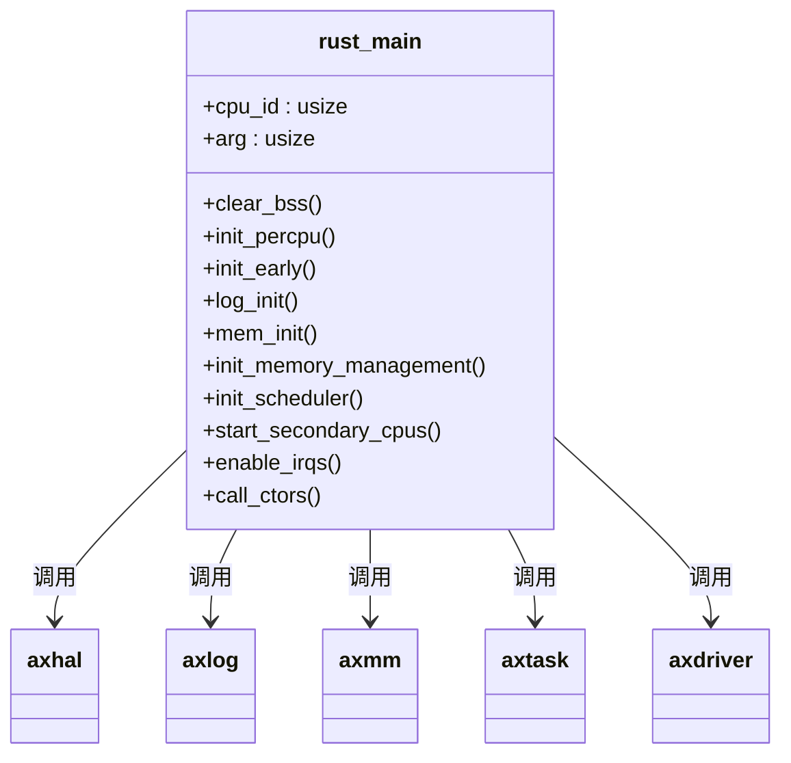
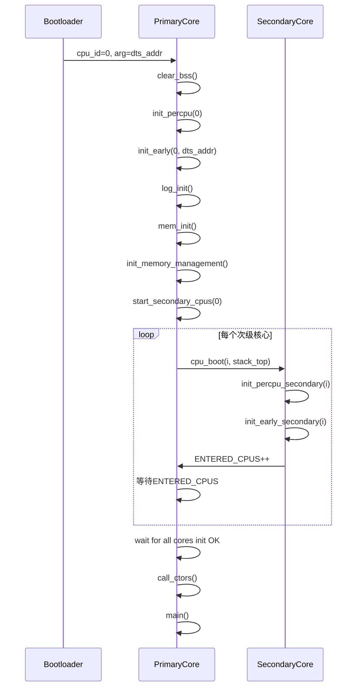

# 启动与初始化流程

<cite>
**本文档引用的文件**
- [lang_items.rs](file://modules/axruntime/src/lang_items.rs)
- [lib.rs](file://modules/axruntime/src/lib.rs)
- [mp.rs](file://modules/axruntime/src/mp.rs)
- [lib.rs](file://modules/axhal/src/lib.rs)
- [mem.rs](file://modules/axhal/src/mem.rs)
- [lib.rs](file://modules/axmm/src/lib.rs)
- [lib.rs](file://modules/axalloc/src/lib.rs)
- [lib.rs](file://modules/axtask/src/lib.rs)
- [lib.rs](file://modules/axdriver/src/lib.rs)
</cite>

## 目录
1. [引言](#引言)
2. [启动流程概览](#启动流程概览)
3. [从汇编入口到Rust主函数](#从汇编入口到rust主函数)
4. [axruntime模块的角色](#axruntime模块的角色)
5. [no_std环境下的语言项](#no_std环境下的语言项)
6. [多阶段初始化顺序](#多阶段初始化顺序)
7. [初始化依赖图](#初始化依赖图)
8. [SMP初始化流程分析](#smp初始化流程分析)
9. [单核与多核差异](#单核与多核差异)
10. [常见启动失败诊断](#常见启动失败诊断)

## 引言
Arceos是一个模块化的操作系统框架，其启动与初始化过程设计精巧，确保系统能够可靠地从底层硬件过渡到高级服务。本文档详细描述了从底层汇编代码`_start`到Rust运行时`rust_main`的控制权转移过程，并深入分析了`axruntime`模块如何协调整个系统的初始化。

**Section sources**
- [lib.rs](file://modules/axruntime/src/lib.rs#L1-L311)

## 启动流程概览
Arceos的启动流程遵循严格的顺序：首先由平台特定的汇编代码执行最低级别的初始化，然后跳转到Rust运行时入口，依次完成硬件抽象层、内存系统、任务调度器、设备驱动等核心组件的初始化，最终启动用户应用程序。



**Diagram sources**
- [lib.rs](file://modules/axruntime/src/lib.rs#L105-L150)

## 从汇编入口到rust主函数
系统启动始于平台特定的汇编代码中的`_start`标签。该代码负责设置基本的CPU状态和栈指针，随后调用`_start_rust`函数，正式进入Rust世界。`_start_rust`进一步调用`axplat::main`属性标记的`rust_main`函数，完成从汇编到高级语言的过渡。

**Section sources**
- [lib.rs](file://modules/axruntime/src/lib.rs#L105-L115)

## axruntime模块的角色
`axruntime`模块是Arceos系统初始化的核心协调者。它通过`rust_main`函数作为主要入口点，在主核上执行完整的初始化序列，包括日志系统、内存管理、中断处理、任务调度等关键子系统的配置和启动。



**Diagram sources**
- [lib.rs](file://modules/axruntime/src/lib.rs#L105-L150)

## no_std环境下的语言项
在`no_std`环境下，Rust程序无法依赖标准库提供的运行时支持。`lang_items.rs`文件定义了必需的语言项，特别是`panic_handler`，它捕获所有未处理的恐慌并安全地关闭系统，确保即使在严重错误情况下也能保持系统稳定性。


**Diagram sources**
- [lang_items.rs](file://modules/axruntime/src/lang_items.rs#L1-L8)

## 多阶段初始化顺序
Arceos采用分阶段初始化策略，确保各组件按正确依赖顺序启动：

1. **硬件抽象层(axhal)初始化**：设置CPU本地数据结构、早期平台初始化
2. **内存系统(axalloc, axmm)初始化**：清BSS段、初始化物理内存管理、建立虚拟内存
3. **任务调度器(axtask)初始化**：创建调度器数据结构
4. **设备驱动探测(axdriver)初始化**：发现并初始化可用硬件设备
5. **应用任务启动**：调用用户`main`函数

**Section sources**
- [lib.rs](file://modules/axruntime/src/lib.rs#L116-L145)

## 初始化依赖图
以下图表展示了各模块初始化函数的调用时机和同步机制：



**Diagram sources**
- [lib.rs](file://modules/axruntime/src/lib.rs#L105-L150)
- [mp.rs](file://modules/axruntime/src/mp.rs#L1-L73)

## SMP初始化流程分析
在多核系统中，`mp.rs`文件中的`start_secondary_cpus`函数负责启动次级核心。主核为每个次级核心分配启动栈，通过`cpu_boot`调用平台特定的启动例程。次级核心执行`rust_main_secondary`入口，完成自身初始化后加入全局同步。

```mermaid
flowchart TB
Start[主核开始] --> Loop{遍历所有CPU}
Loop --> |i ≠ primary| Boot[调用cpu_boot(i)]
Boot --> Wait[等待ENTERED_CPUS增加]
Wait --> Next[下一个CPU]
Next --> Loop
Loop --> |全部完成| Continue[继续主核初始化]
```

**Diagram sources**
- [mp.rs](file://modules/axruntime/src/mp.rs#L1-L73)

## 单核与多核差异
单核与多核场景的主要差异体现在初始化路径和同步机制上。单核系统直接执行完整初始化序列；而多核系统需要区分主核和次级核心的初始化流程，使用原子计数器(`INITED_CPUS`)进行跨核同步，确保所有核心都完成初始化后才启动应用。

**Section sources**
- [lib.rs](file://modules/axruntime/src/lib.rs#L103-L105)
- [mp.rs](file://modules/axruntime/src/mp.rs#L35-L73)

## 常见启动失败诊断
常见的启动问题包括：
- BSS段清除失败：检查链接脚本中`_sbss`和`_ebss`符号定义
- 内存区域重叠：验证`memory_regions()`返回的物理内存范围
- 次级核心未启动：确认`SECONDARY_BOOT_STACK`分配和`cpu_boot`调用成功
- 中断使能失败：检查`enable_irqs()`前是否已正确注册中断处理程序

**Section sources**
- [mem.rs](file://modules/axhal/src/mem.rs#L87-L126)
- [lib.rs](file://modules/axmm/src/lib.rs#L100-L130)