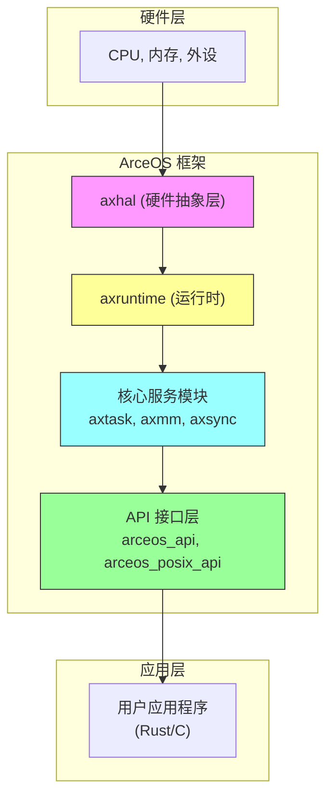
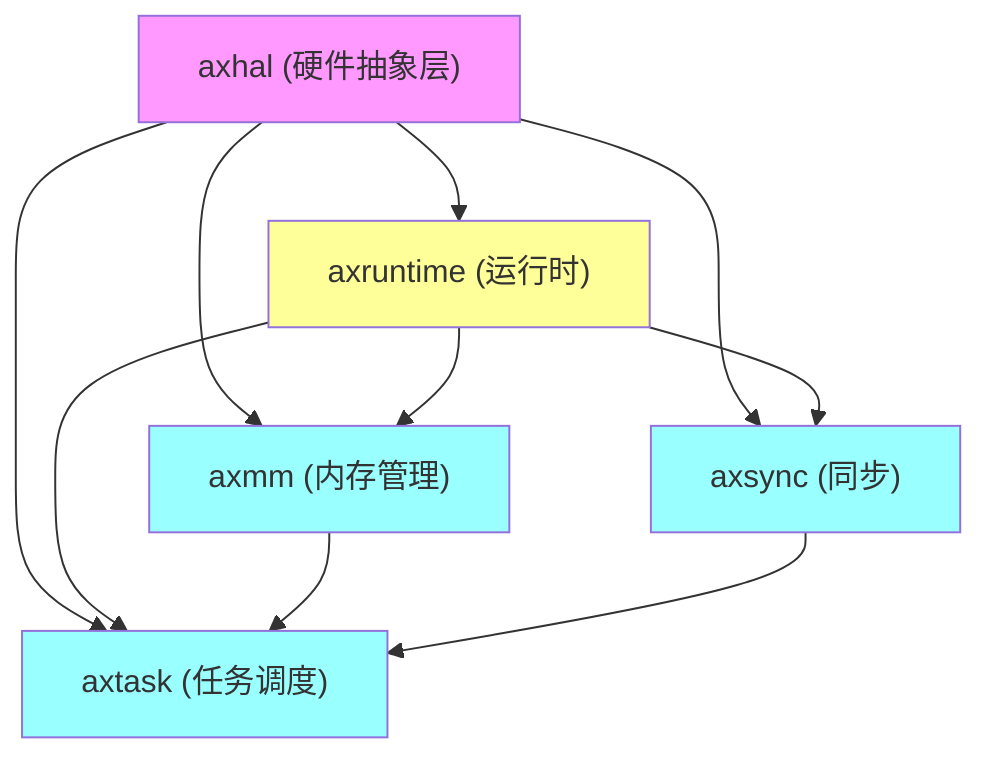

# 架构设计

<cite>
**本文档引用的文件**  
- [lib.rs](file://modules/axhal/src/lib.rs)
- [lib.rs](file://modules/axruntime/src/lib.rs)
- [lib.rs](file://modules/axtask/src/lib.rs)
- [lib.rs](file://modules/axmm/src/lib.rs)
- [lib.rs](file://modules/axsync/src/lib.rs)
- [lib.rs](file://api/arceos_api/src/lib.rs)
- [lib.rs](file://api/arceos_posix_api/src/lib.rs)
</cite>

## 目录
1. [引言](#引言)
2. [系统上下文与整体架构](#系统上下文与整体架构)
3. [分层模块化架构详解](#分层模块化架构详解)
4. [核心模块依赖关系分析](#核心模块依赖关系分析)
5. [启动流程：从汇编到Rust主函数](#启动流程：从汇编到rust主函数)
6. [模块间通信与全局状态管理](#模块间通信与全局状态管理)
7. [静态初始化与动态设备模型的设计权衡](#静态初始化与动态设备模型的设计权衡)
8. [API接口层设计](#api接口层设计)
9. [结论](#结论)

## 引言

ArceOS是一个为嵌入式和操作系统开发而设计的模块化、可扩展的Rust操作系统框架。其核心设计理念是通过清晰的分层和模块化结构，实现硬件抽象、核心服务与应用接口的解耦。本架构设计文档旨在深入剖析ArceOS系统的分层模块化架构，详细描述从底层硬件抽象层（`axhal`）到运行时（`axruntime`）、核心服务模块（如`axtask`、`axmm`、`axsync`），再到上层API接口（`arceos_api`、`arceos_posix_api`）的整体数据流与控制流。

文档将重点阐述各模块间的依赖关系、系统启动流程、模块间通信机制以及全局状态管理策略，为开发者提供一个全面、深入的系统级理解。

## 系统上下文与整体架构

ArceOS系统构建于裸机环境之上，不依赖标准库（`no_std`），直接与物理硬件交互。其整体架构采用自底向上的分层设计，每一层都向上一层提供抽象化的服务。

**图示来源**
- [lib.rs](file://modules/axhal/src/lib.rs)
- [lib.rs](file://modules/axruntime/src/lib.rs)
- [lib.rs](file://modules/axtask/src/lib.rs)
- [lib.rs](file://modules/axmm/src/lib.rs)
- [lib.rs](file://modules/axsync/src/lib.rs)
- [lib.rs](file://api/arceos_api/src/lib.rs)

**本节来源**
- [lib.rs](file://modules/axhal/src/lib.rs#L0-L143)
- [lib.rs](file://modules/axruntime/src/lib.rs#L0-L311)

## 分层模块化架构详解

### 硬件抽象层 (axhal)

`axhal`模块是整个系统的基础，它为上层提供了统一的、平台无关的硬件操作接口。该层屏蔽了不同架构（x86_64, RISC-V, AArch64等）和平台（QEMU, Raspberry Pi等）的差异。

其主要职责包括：
- **内存管理**：提供物理内存区域的枚举、BSS段清零、虚拟地址转换等功能。
- **CPU管理**：负责CPU本地数据结构的初始化（`init_percpu`）、多核引导（`cpu_boot`）和关机（`system_off`）。
- **时间与中断**：提供单调时钟（`monotonic_time`）、实时时钟（`wall_time_nanos`）和中断处理注册（`register_trap_handler`）。
- **陷阱与上下文**：处理异常和中断，并提供任务上下文（`TaskContext`）和陷入帧（`TrapFrame`）的定义。

`axhal`通过条件编译（`cfg_if!`）链接到特定平台的实现（如`axplat_x86_pc`），确保了代码的可移植性。

**本节来源**
- [lib.rs](file://modules/axhal/src/lib.rs#L0-L143)

### 运行时 (axruntime)

`axruntime`是连接底层硬件和上层应用的桥梁。它在应用程序的`main`函数执行前完成所有必要的系统初始化工作。

其核心功能由`rust_main`函数驱动，执行流程如下：
1.  **早期初始化**：清除BSS段，初始化CPU本地数据和早期平台组件。
2.  **日志系统初始化**：设置日志输出目标（通常为`axhal::console`）并启用日志记录。
3.  **内存系统初始化**：根据配置特征（`alloc`, `paging`）初始化全局分配器和虚拟内存管理系统。
4.  **设备驱动初始化**：发现并初始化块设备、网络设备和显示设备。
5.  **多核启动**：如果启用了SMP，启动其他CPU核心。
6.  **中断系统初始化**：注册定时器中断等处理程序。
7.  **构造函数调用**：执行所有使用`#[ctor]`宏标记的初始化函数。
8.  **跳转至应用**：最后调用用户定义的`main`函数。

`axruntime`通过Cargo特性（features）实现了高度的可配置性，允许用户按需启用或禁用特定功能。

**本节来源**
- [lib.rs](file://modules/axruntime/src/lib.rs#L0-L311)

### 核心服务模块

#### 任务调度 (axtask)

`axtask`模块提供了任务（或线程）的创建、调度、睡眠和终止等核心功能。它支持多种调度算法（FIFO, RR, CFS），并通过`multitask`特性进行开关。

关键组件包括：
- **任务结构体 (`task`)**：封装了任务的上下文、状态和元数据。
- **运行队列 (`run_queue`)**：存放就绪任务的数据结构，具体实现取决于所选的调度器。
- **等待队列 (`wait_queue`)**：用于任务同步，支持超时等待。
- **定时器 (`timers`)**：基于硬件定时器实现任务的周期性唤醒和延迟。

`axtask`依赖于`axsync`进行内部同步，并依赖于`axmm`来管理任务的地址空间。

**本节来源**
- [lib.rs](file://modules/axtask/src/lib.rs#L0-L59)

#### 内存管理 (axmm)

`axmm`模块负责虚拟内存管理和内核地址空间的维护。它建立在`axhal`提供的页表操作基础之上。

其主要功能有：
- **地址空间 (`AddrSpace`)**：代表一个独立的虚拟地址空间，内核和用户进程各自拥有自己的地址空间。
- **内存映射**：将物理内存或设备I/O区域映射到虚拟地址空间，支持读、写、执行和设备内存等属性。
- **初始化**：`init_memory_management`函数会遍历`axhal`提供的内存区域列表，为内核创建一个精细粒度的页表。

`axmm`是`axtask`创建用户任务时必不可少的依赖，同时也被`axdriver`等模块用于设备I/O映射。

**本节来源**
- [lib.rs](file://modules/axmm/src/lib.rs#L0-L130)

#### 同步原语 (axsync)

`axsync`模块提供了多任务环境下的同步机制。其核心是`Mutex`互斥锁。

一个重要的设计决策是，`Mutex`的行为依赖于`multitask`特性：
- 当`multitask`启用时，`Mutex`是一个真正的、可能引起任务切换的阻塞锁。
- 当`multitask`未启用时，`Mutex`被定义为`kspin::SpinNoIrq`，即一个在禁用中断情况下使用的自旋锁，适用于单任务或中断上下文。

这种设计使得`axsync`可以在单线程和多线程环境中无缝切换，提高了代码的复用性和灵活性。

**本节来源**
- [lib.rs](file://modules/axsync/src/lib.rs#L0-L28)

## 核心模块依赖关系分析

ArceOS的模块间存在明确的依赖关系，形成了一个稳定的依赖树。

**图示来源**
- [lib.rs](file://modules/axhal/src/lib.rs#L0-L143)
- [lib.rs](file://modules/axruntime/src/lib.rs#L0-L311)
- [lib.rs](file://modules/axtask/src/lib.rs#L0-L59)
- [lib.rs](file://modules/axmm/src/lib.rs#L0-L130)
- [lib.rs](file://modules/axsync