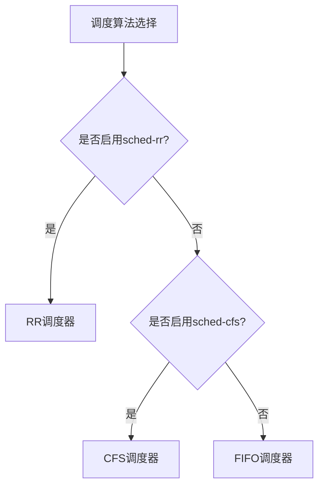
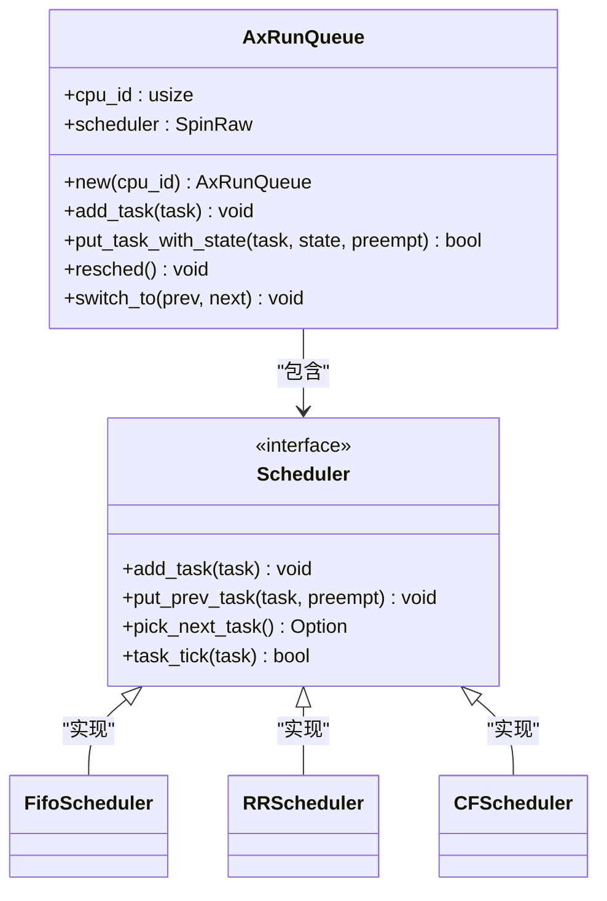
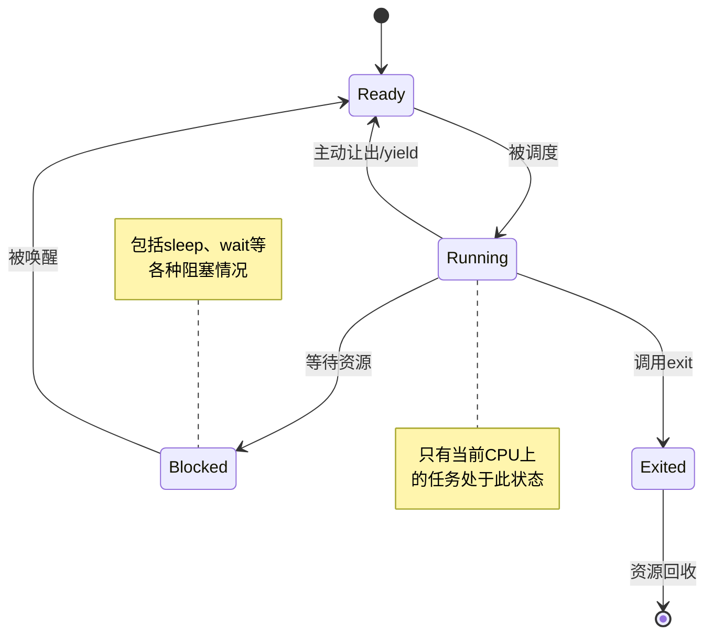
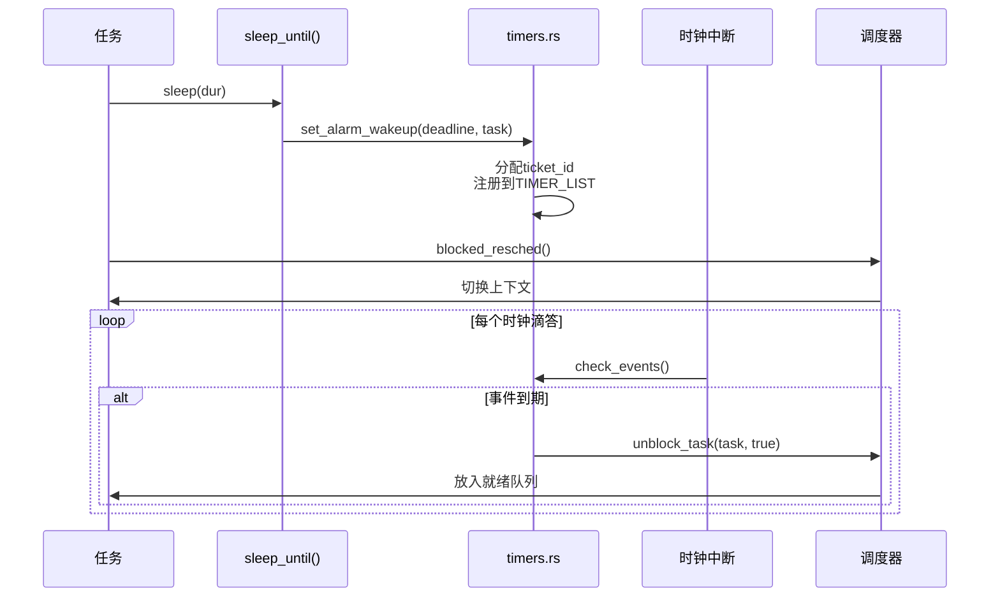
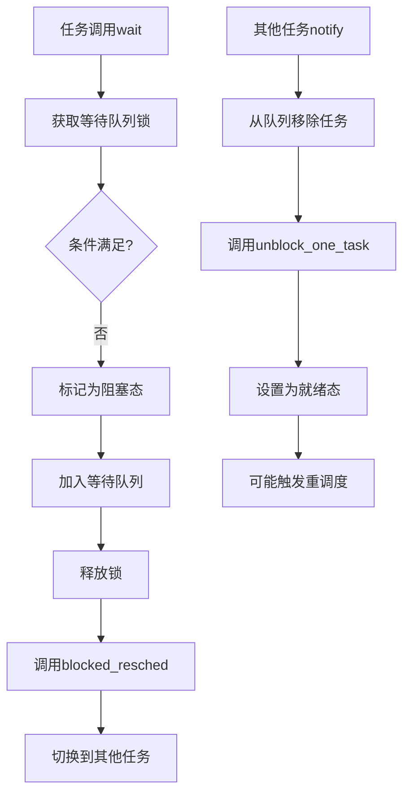

# 任务调度系统

<cite>
**本文档引用的文件**
- [api.rs](file://modules/axtask/src/api.rs)
- [run_queue.rs](file://modules/axtask/src/run_queue.rs)
- [task.rs](file://modules/axtask/src/task.rs)
- [timers.rs](file://modules/axtask/src/timers.rs)
- [wait_queue.rs](file://modules/axtask/src/wait_queue.rs)
- [mp.rs](file://modules/axruntime/src/mp.rs)
</cite>

## 目录
1. [引言](#引言)
2. [FIFO、轮转(RR)和完全公平(CFS)调度算法实现机制](#fifo轮转rr和完全公平cfs调度算法实现机制)
3. [就绪队列管理策略差异分析](#就绪队列管理策略差异分析)
4. [任务控制块状态转换机设计](#任务控制块状态转换机设计)
5. [定时器与调度器协同工作机制](#定时器与调度器协同工作机制)
6. [任务创建与管理API使用示例](#任务创建与管理api使用示例)
7. [等待队列同步机制](#等待队列同步机制)
8. [多核场景下的SMP调度优化策略](#多核场景下的smp调度优化策略)
9. [结论](#结论)

## 引言
Arceos任务调度系统是该操作系统的核心组件之一，负责管理和协调多个任务的执行。本技术文档深入解析了axtask模块中三种主要调度算法（FIFO、轮转RR和完全公平CFS）的实现机制，详细阐述了任务控制块的状态转换机设计，以及定时器、等待队列等关键组件的工作原理。同时，文档还分析了在多核环境下的SMP调度优化策略，为开发者提供了全面的技术参考。

## FIFO、轮转(RR)和完全公平(CFS)调度算法实现机制
Arceos通过条件编译特性实现了三种不同的调度算法：先进先出(FIFO)、时间片轮转(RR)和完全公平调度(CFS)。这些算法的选择由编译时特征决定，其中FIFO作为默认调度器。

当启用`sched-rr`特征时，系统采用时间片轮转调度算法，每个任务被分配固定的时间片（MAX_TIME_SLICE定义为5个单位）。RR调度器确保所有就绪任务按顺序轮流执行，当前任务用完时间片后会被抢占并重新放入就绪队列末尾。

若启用`sched-cfs`特征，则使用完全公平调度算法。CFS基于虚拟运行时间概念，优先选择累计运行时间最少的任务执行，从而实现更精细的CPU资源分配。

在未指定任何调度特征的情况下，系统默认使用FIFO调度器，按照任务到达顺序进行调度，直到任务主动让出或阻塞。



**Diagram sources**
- [api.rs](file://modules/axtask/src/api.rs#L10-L37)

**Section sources**
- [api.rs](file://modules/axtask/src/api.rs#L10-L37)

## 就绪队列管理策略差异分析
不同调度算法在run_queue.rs中的就绪队列管理策略存在显著差异。FIFO调度器维护一个简单的先进先出队列，新加入的任务直接添加到队列末尾，调度时从队首取出下一个任务。

RR调度器除了基本的队列操作外，还需要处理时间片管理。每次时钟中断触发scheduler_timer_tick时，会检查当前任务的时间片是否耗尽，若耗尽则设置抢占标志。这种机制保证了即使计算密集型任务也无法独占CPU资源。

CFS调度器采用红黑树等高效数据结构来维护就绪任务，按键值为虚拟运行时间排序。这使得选择下一个运行任务的操作复杂度保持在O(log n)，能够快速找到最"饥饿"的任务。

所有调度器都实现了统一的接口抽象，通过AxRunQueue结构体提供add_task、put_task_with_state和pick_next_task等核心方法，确保上层调用的一致性。



**Diagram sources**
- [run_queue.rs](file://modules/axtask/src/run_queue.rs#L270-L458)
- [api.rs](file://modules/axtask/src/api.rs#L10-L37)

**Section sources**
- [run_queue.rs](file://modules/axtask/src/run_queue.rs#L270-L458)

## 任务控制块状态转换机设计
任务控制块(task.rs)采用有限状态机模型管理任务生命周期，定义了四种核心状态：运行(Running)、就绪(Ready)、阻塞(Blocked)和已退出(Exited)。

状态迁移遵循严格的规则：
- 运行态任务可通过yield_current显式让出CPU，进入就绪态
- 当前任务可因I/O等待等原因调用blocked_resched进入阻塞态
- 阻塞任务被唤醒后经由unblock_task转入就绪态
- 任务正常结束或调用exit时进入已退出态
- 调度器始终从就绪队列选取下一个运行任务

状态转换通过原子操作保证线程安全，transition_state方法使用compare_exchange实现无锁状态更新。这种设计避免了传统锁机制带来的性能开销，特别适合高并发场景。



**Diagram sources**
- [task.rs](file://modules/axtask/src/task.rs#L30-L555)

**Section sources**
- [task.rs](file://modules/axtask/src/task.rs#L30-L555)

## 定时器与调度器协同工作机制
timers.rs模块实现了基于时间片轮转和定时唤醒的功能，与调度器紧密协作。系统使用全局递增的TIMER_TICKET_ID为每个定时事件分配唯一标识，防止过期事件错误触发。

当任务调用sleep_until时，系统创建TaskWakeupEvent并注册到对应CPU的TIMER_LIST中。在每个时钟中断处理函数on_timer_tick中，check_events遍历到期事件，通过select_run_queue找到目标任务所在的运行队列，并调用unblock_task将其唤醒。

关键设计包括：
- 使用ticket_id验证事件有效性，避免竞态条件
- 每个CPU拥有独立的timer_list，减少锁争用
- 原子操作管理timer_ticket_id，确保全局唯一性
- 在中断上下文中处理超时，保证实时性

这种机制不仅支持精确的睡眠功能，也为信号量、互斥锁等同步原语提供了基础支持。



**Diagram sources**
- [timers.rs](file://modules/axtask/src/timers.rs#L0-L66)
- [run_queue.rs](file://modules/axtask/src/run_queue.rs#L270-L293)

**Section sources**
- [timers.rs](file://modules/axtask/src/timers.rs#L0-L66)

## 任务创建与管理API使用示例
api.rs提供了简洁的任务创建和管理接口。开发者可以通过spawn系列函数轻松创建新任务：

- spawn()：创建具有默认参数的任务
- spawn_raw()：允许自定义任务名称和栈大小
- spawn_task()：直接传入TaskInner实例

实际代码示例如下：
```rust
// 创建并启动一个简单任务
let task = axtask::spawn(|| {
    println!("Hello from new task!");
});

// 创建带自定义参数的任务
let named_task = axtask::spawn_raw(
    move || complex_work(),
    "worker".into(),
    8192 // 自定义栈大小
);
```

此外，API还提供了一系列管理功能：
- yield_now()：主动让出CPU
- set_priority()：调整任务优先级
- set_current_affinity()：设置CPU亲和性
- exit()：终止当前任务

这些接口封装了底层复杂性，使应用开发更加便捷。

**Section sources**
- [api.rs](file://modules/axtask/src/api.rs#L50-L220)

## 等待队列同步机制
wait_queue.rs实现了高效的任务同步原语，基于VecDeque构建阻塞任务队列。其核心机制包括：

- 多种等待模式：wait()、wait_until()、wait_timeout()等
- 灵活的通知方式：notify_one()、notify_all()、notify_task()
- 与定时器集成的超时支持
- 安全的事件取消机制

典型使用模式如下：
```rust
static WQ: WaitQueue = WaitQueue::new();
static VALUE: AtomicU32 = AtomicU32::new(0);

// 生产者任务
axtask::spawn(|| {
    VALUE.fetch_add(1, Ordering::Release);
    WQ.notify_one(true); // 唤醒消费者
});

// 消费者任务  
WQ.wait_until(|| VALUE.load(Ordering::Acquire) > 0);
```

关键设计要点：
- 使用SpinNoIrq锁保护内部队列，确保中断上下文安全
- 提供wait_timeout系列函数支持超时语义
- requeue方法支持队列间任务迁移
- 原子标志位防止重复唤醒



**Diagram sources**
- [wait_queue.rs](file://modules/axtask/src/wait_queue.rs#L0-L247)

**Section sources**
- [wait_queue.rs](file://modules/axtask/src/wait_queue.rs#L0-L247)

## 多核