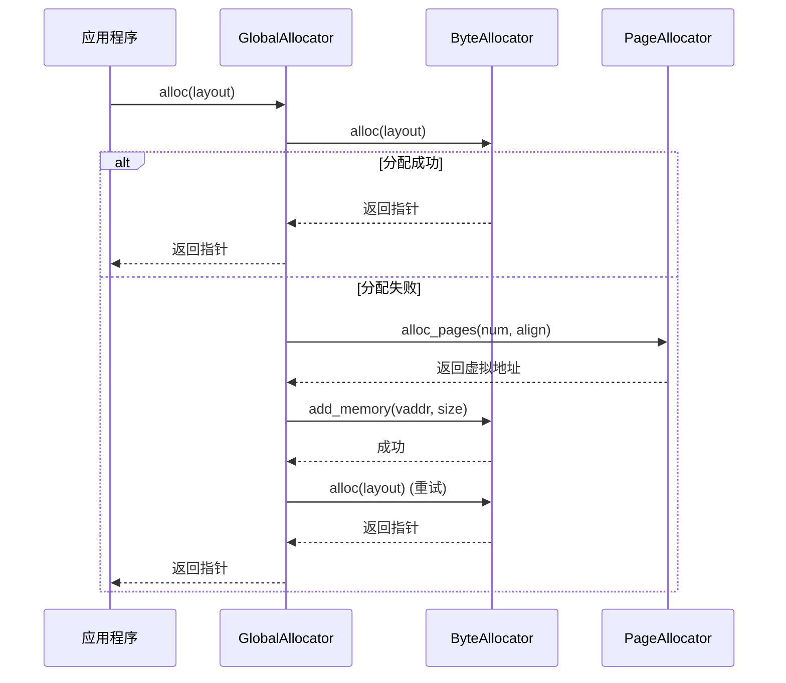
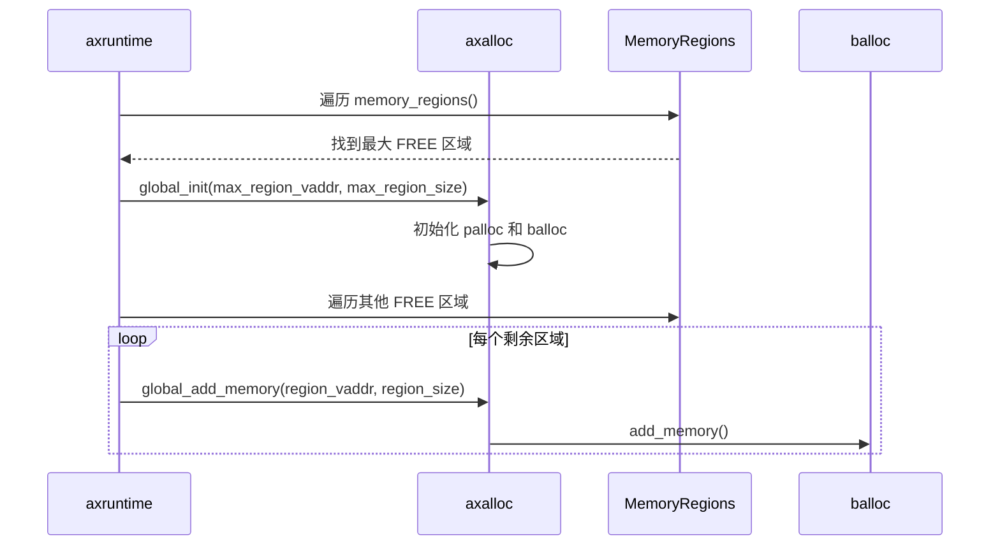

# 内存分配器

<cite>
**本文档引用的文件**
- [lib.rs](file://modules/axalloc/src/lib.rs)
- [page.rs](file://modules/axalloc/src/page.rs)
</cite>

## 目录
1. [简介](#简介)
2. [两级内存分配架构](#两级内存分配架构)
3. [对象分配器与页面分配器的协同机制](#对象分配器与页面分配器的协同机制)
4. [Slab分配器的缓存行对齐优化](#slab分配器的缓存行对齐优化)
5. [页面分配器与axmm的交互](#页面分配器与axmm的交互)
6. [不同场景下的分配器选择指南](#不同场景下的分配器选择指南)
7. [内存耗尽异常处理](#内存耗尽异常处理)
8. [系统启动阶段的初始化顺序](#系统启动阶段的初始化顺序)
9. [结论](#结论)

## 简介
ArceOS全局内存分配器（`axalloc`）为操作系统提供核心的内存管理功能。该模块实现了`core::alloc::GlobalAlloc` trait，并通过`#[global_allocator]`属性注册为标准库的默认分配器。分配器采用两级架构设计，结合了对象分配器（Byte Allocator）和页面分配器（Page Allocator），以满足不同粒度的内存需求。本专业文档将深入解析其设计理念、实现细节及在系统中的关键作用。

## 两级内存分配架构
`axalloc`模块的核心是`GlobalAllocator`结构体，它实现了两层内存分配策略：第一层为对象分配器，负责小块内存的精细管理；第二层为页面分配器，负责大块物理页帧的分配。这种分层设计旨在平衡分配效率与内存碎片控制。

**Diagram sources**
- [lib.rs](file://modules/axalloc/src/lib.rs#L38-L82)

**Section sources**
- [lib.rs](file://modules/axalloc/src/lib.rs#L38-L82)

## 对象分配器与页面分配器的协同机制
`GlobalAllocator`通过`alloc`方法协调两个分配器的工作。当应用程序请求内存时，首先尝试由对象分配器（`balloc`）进行分配。若对象分配器无法满足请求，则触发页面分配器（`palloc`）分配新的物理页，然后将这些页加入对象分配器的管理范围，从而扩展堆空间。

此过程在`alloc_level2`函数中实现：当`balloc.alloc(layout)`失败时，计算需要扩展的大小（取当前堆大小、请求大小和页面大小的最大值的下一个2的幂），调用`alloc_pages`从页面分配器获取新页，最后通过`add_memory`将新页添加到对象分配器中。

**Diagram sources**
- [lib.rs](file://modules/axalloc/src/lib.rs#L138-L171)

**Section sources**
- [lib.rs](file://modules/axalloc/src/lib.rs#L114-L171)

## Slab分配器的缓存行对齐优化
当启用`slab`特性时，`DefaultByteAllocator`被定义为`allocator::SlabByteAllocator`。Slab分配器通过预分配固定大小的对象池来减少内存碎片并提高分配速度。其核心优化在于缓存行对齐（Cache Line Alignment），确保每个分配的对象都位于独立的缓存行上，从而避免伪共享（False Sharing）问题。

虽然具体实现位于外部`allocator` crate中，但`axalloc`通过配置`cfg_if!`宏选择不同的后端（如`slab`、`buddy`或`tlsf`），使得Slab分配器能够无缝集成到全局分配框架中。这种设计保证了频繁分配的小对象（如任务控制块、网络缓冲区）具有最佳的访问性能。

**Section sources**
- [lib.rs](file://modules/axalloc/src/lib.rs#L20-L27)

## 页面分配器与axmm的交互
`page.rs`文件中的`GlobalPage`结构体提供了对4KB物理页的RAII封装。它通过调用`global_allocator().alloc_pages()`和`dealloc_pages()`来管理页面的生命周期。而底层的物理页帧获取与释放则依赖于`axmm`模块。

在`axmm`的`backend/alloc.rs`中，`alloc_frame`函数调用`global_allocator().alloc_pages(1, PAGE_SIZE_4K)`来获取一个虚拟地址，然后通过`virt_to_phys`转换为物理地址供页表使用。反之，`dealloc_frame`函数将物理地址转换回虚拟地址后，调用`global_allocator().dealloc_pages()`完成释放。这表明`axmm`完全依赖`axalloc`作为其物理内存的后端。

**Diagram sources**
- [page.rs](file://modules/axalloc/src/page.rs#L0-L48)
- [alloc.rs](file://modules/axmm/src/backend/alloc.rs#L0-L25)

**Section sources**
- [page.rs](file://modules/axalloc/src/page.rs#L0-L48)
- [alloc.rs](file://modules/axmm/src/backend/alloc.rs#L0-L25)

## 不同场景下的分配器选择指南
根据内存需求的不同，应选择合适的分配接口：

- **小对象分配**：使用标准的`alloc`和`dealloc`，由对象分配器高效处理。
- **大块连续内存**：直接调用`alloc_pages`和`dealloc_pages`，避免经过对象分配器的额外开销。
- **C语言兼容**：通过`ulib/axlibc`中的`malloc`和`free`，它们内部调用Rust的`alloc`和`dealloc`，共享同一堆。
- **DMA内存**：使用`axdma`模块，它会调用`global_allocator().alloc_pages`获取内存，并设置非缓存标志。
- **零初始化内存**：使用`GlobalPage::alloc_zero()`，它在分配后自动填充零。

此外，可通过Cargo特性（feature）选择不同的对象分配器后端：
- `slab`：适合分配大量小且大小固定的对象。
- `buddy`：适合需要良好内存局部性和低碎片的场景。
- `tlsf`：适合实时性要求高、分配模式多变的场景。

**Section sources**
- [lib.rs](file://modules/axalloc/src/lib.rs#L173-L217)
- [page.rs](file://modules/axalloc/src/page.rs#L0-L48)
- [malloc.rs](file://ulib/axlibc/src/malloc.rs#L0-L55)

## 内存耗尽异常处理
当内存分配失败时，系统通过`alloc::alloc::handle_alloc_error(layout)`进行处理。这是Rust标准库定义的全局分配错误处理函数。用户可以通过实现`#[alloc_error_handler]`来定制此行为，例如记录日志、触发系统重启或进入安全模式。

在`GlobalAllocator`的`unsafe impl GlobalAlloc`中，`alloc`方法明确调用了`handle_alloc_error`。这意味着任何未能满足的分配请求都将触发此错误处理流程，确保系统不会因内存不足而静默失败或产生未定义行为。

**Section sources**
- [lib.rs](file://modules/axalloc/src/lib.rs#L275-L287)

## 系统启动阶段的初始化顺序
内存分配器的初始化是系统启动的关键步骤，必须在任何动态内存分配之前完成。其初始化顺序如下：

1. **确定最大空闲区域**：`axruntime`遍历内存区域，找到最大的标记为`FREE`的区域。
2. **初始化主分配器**：调用`axalloc::global_init(start_vaddr, size)`，传入最大空闲区域的虚拟地址和大小。此函数会先初始化页面分配器，再从中分配32KB用于初始化对象分配器。
3. **添加其他区域**：将剩余的空闲区域通过`axalloc::global_add_memory`加入分配器，扩展可用内存池。

这一过程确保了内核和后续模块可以立即使用一个功能完整的堆。

**Diagram sources**
- [lib.rs](file://modules/axalloc/src/lib.rs#L289-L324)
- [lib.rs](file://modules/axruntime/src/lib.rs#L183-L224)

**Section sources**
- [lib.rs](file://modules/axalloc/src/lib.rs#L289-L324)
- [lib.rs](file://modules/axruntime/src/lib.rs#L183-L224)

## 结论
`axalloc`内存分配器通过精巧的两级架构，有效地支撑了ArceOS的内存管理需求。其对象分配器与页面分配器的协同工作模式，既保证了小对象分配的高效性，又确保了大块内存的灵活获取。与`axmm`等核心模块的深度集成，使其成为整个系统稳定运行的基石。开发者应根据具体场景选择合适的分配接口，并理解其在系统启动过程中的关键作用。