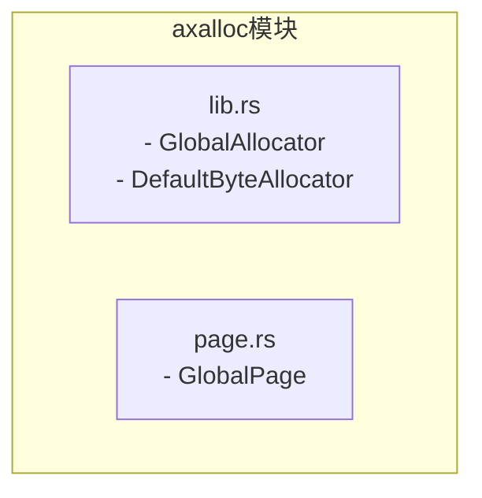
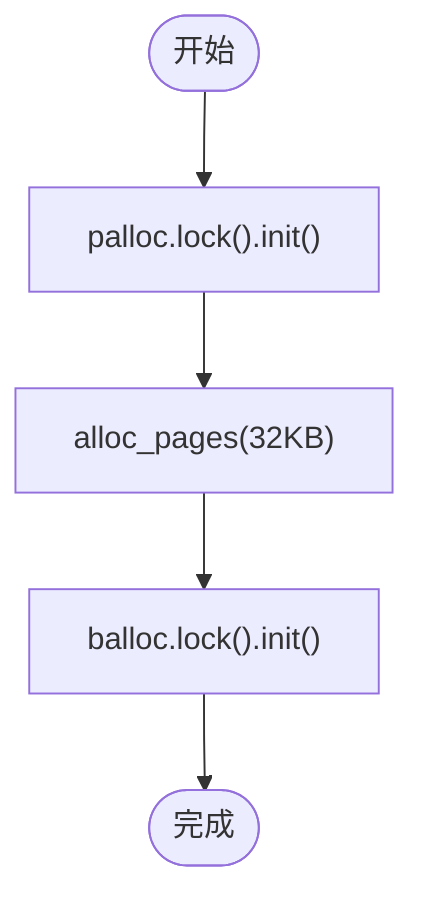
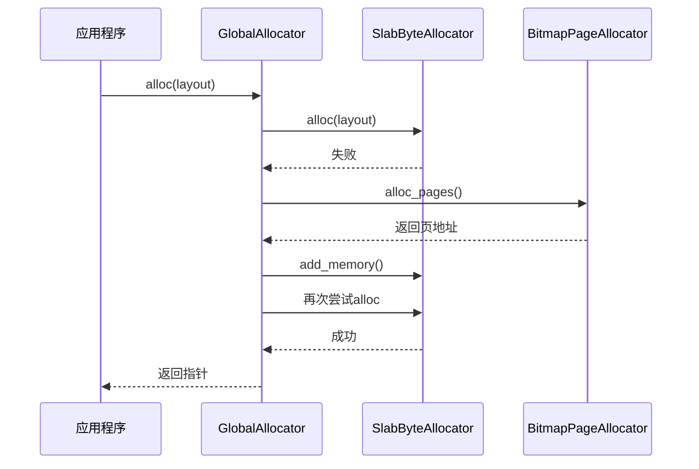
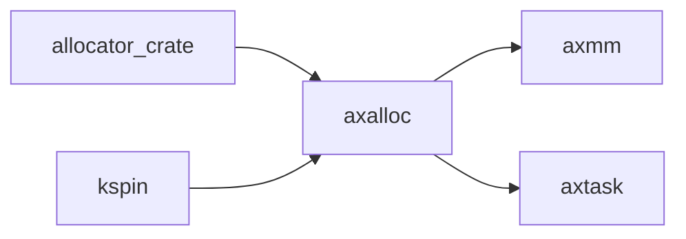

# 对象分配器

<cite>
**本文档中引用的文件**  
- [lib.rs](file://modules/axalloc/src/lib.rs)
- [page.rs](file://modules/axalloc/src/page.rs)
</cite>

## 目录
1. [简介](#简介)  
2. [项目结构](#项目结构)  
3. [核心组件](#核心组件)  
4. [架构概述](#架构概述)  
5. [详细组件分析](#详细组件分析)  
6. [依赖分析](#依赖分析)  
7. [性能考虑](#性能考虑)  
8. [故障排除指南](#故障排除指南)  
9. [结论](#结论)

## 简介
本文档深入解析 ArceOS 操作系统中 `axalloc` 模块的对象分配器实现，重点聚焦于基于 `Slab` 的内存分配机制。该分配器通过两层结构（字节分配器与页分配器）高效管理内存，支持小对象快速分配、缓存行对齐优化及碎片控制。文档将详细阐述其与 Rust 的 `GlobalAlloc` trait 集成方式、线程本地缓存设计及其在高并发场景下的性能优势。

## 项目结构
`axalloc` 模块是 ArceOS 内核的核心内存管理组件，位于 `modules/axalloc` 目录下，主要包含两个源文件：`lib.rs` 和 `page.rs`。前者实现了全局分配器和 Slab 分配逻辑，后者提供了以页为单位的 RAII 内存管理接口。



**图示来源**  
- [lib.rs](file://modules/axalloc/src/lib.rs#L0-L325)
- [page.rs](file://modules/axalloc/src/page.rs#L0-L108)

**本节来源**  
- [lib.rs](file://modules/axalloc/src/lib.rs#L0-L325)
- [page.rs](file://modules/axalloc/src/page.rs#L0-L108)

## 核心组件
`axalloc` 的核心是 `GlobalAllocator` 结构体，它结合了字节粒度的 `DefaultByteAllocator`（根据编译特征可为 `SlabByteAllocator`、`BuddyByteAllocator` 或 `TlsfByteAllocator`）和页粒度的 `BitmapPageAllocator`，形成两级内存分配体系。当启用 `slab` 特性时，`DefaultByteAllocator` 被定义为 `allocator::SlabByteAllocator`，专为频繁的小对象分配而优化。

**本节来源**  
- [lib.rs](file://modules/axalloc/src/lib.rs#L38-L82)

## 架构概述
`axalloc` 采用分层内存管理架构。顶层的 `GlobalAllocator` 负责协调；底层的 `SlabByteAllocator` 处理小内存块的快速分配与回收，减少内部碎片；`BitmapPageAllocator` 管理物理页的分配，为上层提供连续内存块。这种设计分离了不同粒度的内存管理职责，提升了整体效率。


**图示来源**  
- [lib.rs](file://modules/axalloc/src/lib.rs#L84-L112)
- [lib.rs](file://modules/axalloc/src/lib.rs#L114-L171)

## 详细组件分析

### GlobalAllocator 分析
`GlobalAllocator` 是整个系统的默认全局分配器，通过 `#[global_allocator]` 属性注册。它封装了 `SpinNoIrq` 自旋锁以保证多核环境下的安全访问。

#### 初始化流程
初始化过程首先将大块内存区域交由 `BitmapPageAllocator` 管理，然后从中分配 32KB 小块来初始化 `SlabByteAllocator`，确保后续小对象分配的高效性。



**图示来源**  
- [lib.rs](file://modules/axalloc/src/lib.rs#L84-L95)

#### 内存分配流程 (alloc_level2)
对于非 level-1 模式，分配流程如下：优先尝试从 `SlabByteAllocator` 分配，若失败则向 `BitmapPageAllocator` 申请新的页，扩展堆空间后重试。



**图示来源**  
- [lib.rs](file://modules/axalloc/src/lib.rs#L138-L158)

### kmem_cache_t 设计原理
虽然代码中未直接出现 `kmem_cache_t` 类型，但 `SlabByteAllocator` 的设计思想与之高度一致。它通过预分配固定大小的对象池（slab），将相同类型的对象集中管理。这带来了显著的性能优势：
- **缓存友好性**：同类型对象在内存中连续存放，提高 CPU 缓存命中率。
- **降低碎片**：避免了因频繁分配/释放不同大小对象导致的外部碎片。
- **快速分配**：分配操作简化为从空闲链表中取出一个节点，时间复杂度接近 O(1)。

**本节来源**  
- [lib.rs](file://modules/axalloc/src/lib.rs#L28-L36)

### 接口调用示例
以下是如何使用 `alloc` 和 `dealloc` 接口的伪代码示例：

```rust
// 分配一个任务控制块(TCB)大小的内存
let layout = Layout::new::<TaskControlBlock>();
let ptr = global_allocator().alloc(layout).unwrap();

// 使用完后释放
global_allocator().dealloc(ptr, layout);
```

要为特定类型（如 TCB）定制专用内存池，可在 `SlabByteAllocator` 内部为该类型大小创建独立的 slab 缓存，但这需要修改底层分配器实现。

**本节来源**  
- [lib.rs](file://modules/axalloc/src/lib.rs#L114-L171)

### 与 Alloc Trait 集成
`GlobalAllocator` 通过实现 `core::alloc::GlobalAlloc` trait 来集成到 Rust 的标准库中。`unsafe impl GlobalAlloc for GlobalAllocator` 提供了 `alloc` 和 `dealloc` 方法，使得 `Box<T>`、`Vec<T>` 等标准容器能无缝使用此分配器。

**本节来源**  
- [lib.rs](file://modules/axalloc/src/lib.rs#L249-L261)

### 线程本地缓存与并发性能
当前实现使用 `SpinNoIrq` 锁保护 `balloc` 和 `palloc`，这意味着所有核心共享同一个分配器实例，存在锁竞争。理想情况下，应引入 per-CPU 缓存（线程本地缓存）来进一步减少锁争用：每个核心维护自己的小型对象缓存，仅在本地缓存耗尽或满时才与全局分配器交互。尽管现有代码未体现此优化，但这是提升高并发场景下性能的关键方向。

在高并发场景下，性能瓶颈主要在于 `SpinNoIrq` 锁的争用。调优建议包括：
1. 启用 `slab` 特性以利用其低碎片特性。
2. 尽可能使用对象池模式，减少 `alloc/dealloc` 调用频率。
3. 未来可引入 per-CPU 缓存机制。

**本节来源**  
- [lib.rs](file://modules/axalloc/src/lib.rs#L249-L261)

## 依赖分析
`axalloc` 模块依赖于 `allocator` crate 提供的基础分配器实现，并通过 `kspin::SpinNoIrq` 实现无中断自旋锁。它向上为 `axmm`（内存管理）、`axtask`（任务管理）等模块提供内存分配服务。



**图示来源**  
- [lib.rs](file://modules/axalloc/src/lib.rs#L0-L36)

**本节来源**  
- [lib.rs](file://modules/axalloc/src/lib.rs#L0-L36)

## 性能考虑
`Slab` 分配器在处理大量小对象时表现出色，因其分配/释放速度快且碎片少。但在极端高并发下，全局锁可能成为瓶颈。未来的 `per-cpu cache` 设计将是解决此问题的关键。

## 故障排除指南
常见问题包括初始化内存不足（需 >32KB）或双端释放。确保 `global_init` 只调用一次，并正确匹配 `alloc` 和 `dealloc` 的 `Layout` 参数。

**本节来源**  
- [lib.rs](file://modules/axalloc/src/lib.rs#L84-L95)

## 结论
`axalloc` 模块通过 `Slab` 分配器实现了高效的对象内存管理，其两层架构平衡了灵活性与性能。虽然当前实现存在全局锁的潜在瓶颈，但其设计为未来的 `per-cpu cache` 优化奠定了良好基础，适用于操作系统内核中频繁的小对象分配场景。