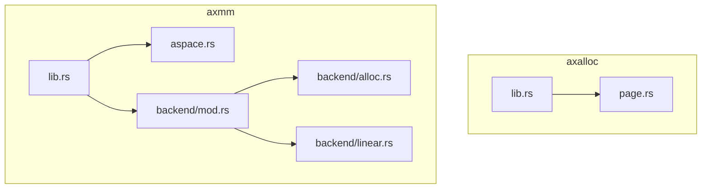
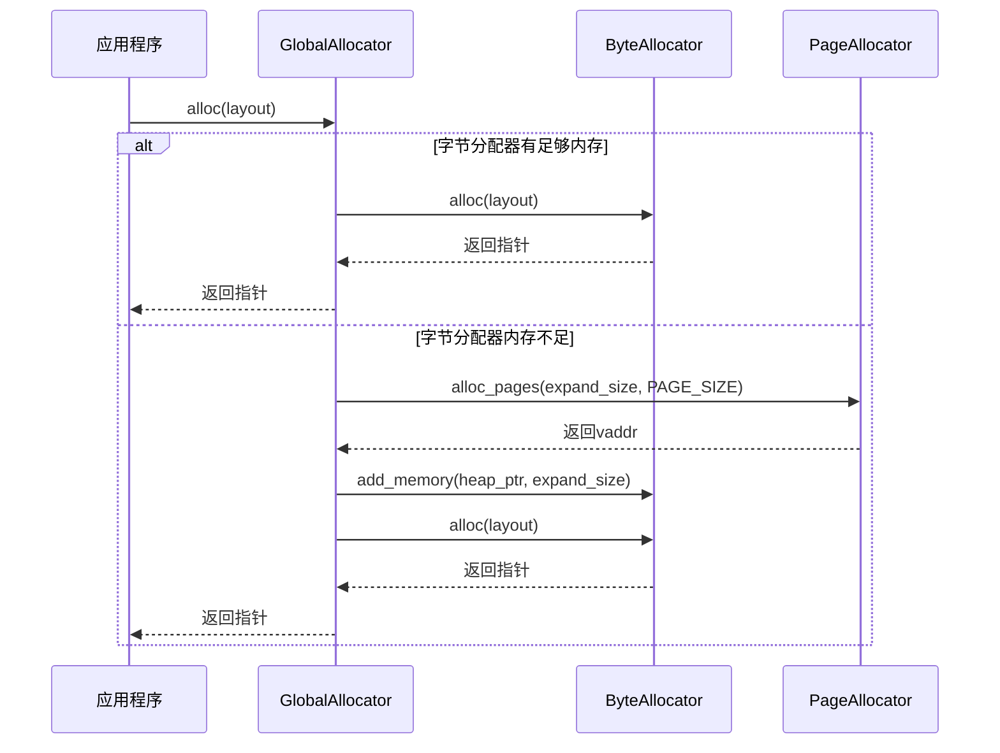
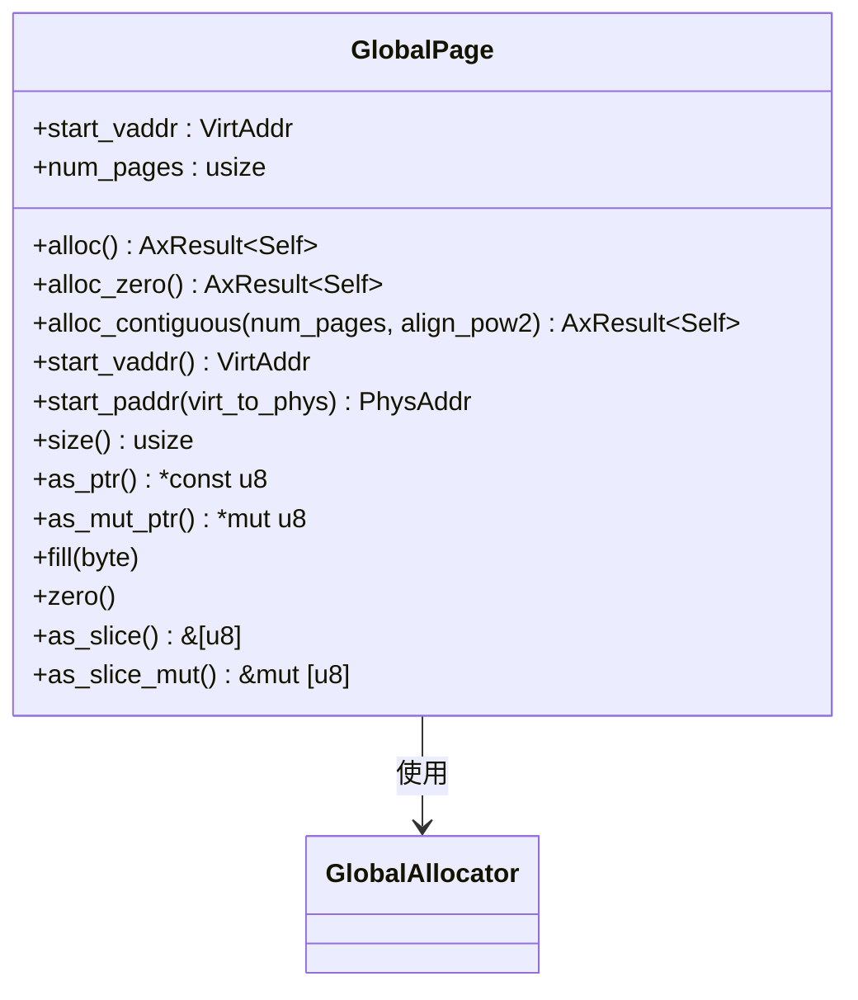

# 页面分配器

<cite>
**本文档中引用的文件**   
- [page.rs](file://modules/axalloc/src/page.rs)
- [lib.rs](file://modules/axalloc/src/lib.rs)
- [lib.rs](file://modules/axmm/src/lib.rs)
- [aspace.rs](file://modules/axmm/src/aspace.rs)
- [alloc.rs](file://modules/axmm/src/backend/alloc.rs)
- [mod.rs](file://modules/axmm/src/backend/mod.rs)
- [linear.rs](file://modules/axmm/src/backend/linear.rs)
</cite>

## 目录
1. [简介](#简介)
2. [项目结构](#项目结构)
3. [核心组件](#核心组件)
4. [架构概述](#架构概述)
5. [详细组件分析](#详细组件分析)
6. [依赖关系分析](#依赖关系分析)
7. [性能考量](#性能考量)
8. [故障排查指南](#故障排查指南)
9. [结论](#结论)

## 简介
页面分配器是ArceOS操作系统中的关键内存管理组件，负责物理页帧的分配与回收。该文档深入剖析了`axalloc`模块中`page.rs`实现的物理页帧分配机制，涵盖位图管理、伙伴系统或空闲列表等算法的应用。同时，阐述了页面分配器如何与`axmm`模块协同工作，完成虚拟内存映射与物理地址绑定的过程。此外，还提供了`page_alloc`和`page_dealloc`接口的使用方法，并解释了大页（huge page）支持的实现逻辑。最后，分析了在系统启动早期阶段页面分配器的初始化流程及其对后续内存子系统构建的关键作用。

## 项目结构
`axalloc`模块位于`modules/axalloc/src/`目录下，主要包含两个源文件：`lib.rs`和`page.rs`。其中，`lib.rs`定义了全局分配器`GlobalAllocator`，而`page.rs`则实现了针对4K大小页面的RAII包装器`GlobalPage`。`axmm`模块负责内存管理，包括地址空间管理和页表操作，其源代码位于`modules/axmm/src/`目录下。



**Diagram sources**
- [lib.rs](file://modules/axalloc/src/lib.rs)
- [page.rs](file://modules/axalloc/src/page.rs)
- [lib.rs](file://modules/axmm/src/lib.rs)
- [aspace.rs](file://modules/axmm/src/aspace.rs)
- [mod.rs](file://modules/axmm/src/backend/mod.rs)
- [alloc.rs](file://modules/axmm/src/backend/alloc.rs)
- [linear.rs](file://modules/axmm/src/backend/linear.rs)

**Section sources**
- [lib.rs](file://modules/axalloc/src/lib.rs)
- [page.rs](file://modules/axalloc/src/page.rs)
- [lib.rs](file://modules/axmm/src/lib.rs)

## 核心组件
`axalloc`模块的核心在于`GlobalAllocator`结构体，它结合了字节分配器和页分配器，形成一个简单的两级分配器。当字节分配器无法满足请求时，会向页分配器申请更多内存并将其添加到字节分配器中。目前，`TlsfByteAllocator`被用作字节分配器，而`BitmapPageAllocator`则作为页分配器。

**Section sources**
- [lib.rs](file://modules/axalloc/src/lib.rs#L38-L82)

## 架构概述
页面分配器通过`GlobalAllocator`提供统一的内存分配接口。对于小块内存分配，优先尝试从字节分配器获取；若失败，则从页分配器申请新的页并扩展堆内存。对于大块连续内存或特定对齐要求的分配，则直接通过页分配器处理。`axmm`模块利用这些分配的页面来建立虚拟内存映射，确保物理地址与虚拟地址之间的正确绑定。



**Diagram sources**
- [lib.rs](file://modules/axalloc/src/lib.rs#L114-L171)

## 详细组件分析

### GlobalPage 分析
`GlobalPage`是一个RAII风格的4K页面包装器，自动管理页面的生命周期。一旦实例超出作用域，就会调用`Drop` trait自动释放所持有的页面。

#### 对象模型


**Diagram sources**
- [page.rs](file://modules/axalloc/src/page.rs#L0-L48)

**Section sources**
- [page.rs](file://modules/axalloc/src/page.rs#L0-L108)

### 内存分配流程分析
当需要分配内存时，`GlobalAllocator`首先尝试从`ByteAllocator`中分配。如果失败，它将从`PageAllocator`中申请新的页面以扩展堆空间，然后再次尝试分配。

#### 分配流程图


**Diagram sources**
- [lib.rs](file://modules/axalloc/src/lib.rs#L138-L171)

### 大页支持实现逻辑
虽然当前实现主要关注4K页面，但通过配置不同的特征（feature），可以启用对大页的支持。例如，在`level-1`模式下，所有分配都直接由字节分配器处理，这可能更适合大页场景。

**Section sources**
- [lib.rs](file://modules/axalloc/src/lib.rs#L173-L217)

## 依赖关系分析
页面分配器不仅依赖于底层硬件抽象层提供的物理地址转换功能，还需要与内存管理模块紧密协作。特别是`axmm`模块中的`Backend`枚举类型，定义了不同类型的内存映射后端，如线性映射和分配映射，它们共同构成了完整的内存管理系统。

```mermaid
graph TB
subgraph "axalloc"
GlobalAllocator
BitmapPageAllocator
TlsfByteAllocator
end
subgraph "axmm"
AddrSpace
Backend
PageTable
end
GlobalAllocator --> BitmapPageAllocator
GlobalAllocator --> TlsfByteAllocator
AddrSpace --> Backend
Backend --> PageTable
GlobalAllocator --> Backend : 提供物理页帧
Backend --> GlobalAllocator : 请求物理页帧
```

**Diagram sources**
- [lib.rs](file://modules/axalloc/src/lib.rs)
- [aspace.rs](file://modules/axmm/src/aspace.rs)
- [mod.rs](file://modules/axmm/src/backend/mod.rs)

**Section sources**
- [lib.rs](file://modules/axalloc/src/lib.rs)
- [aspace.rs](file://modules/axmm/src/aspace.rs)
- [mod.rs](file://modules/axmm/src/backend/mod.rs)

## 性能考量
页面分配器的设计考虑到了性能优化。采用两级分配策略减少了频繁访问慢速页分配器的需求，提高了小块内存分配的速度。同时，通过预分配一定量的堆内存给字节分配器，避免了每次分配都需要进行复杂的页级操作。

## 故障排查指南
在遇到内存分配失败的情况时，应检查以下几点：
- 确认已正确初始化全局分配器。
- 检查是否有足够的可用物理内存。
- 验证分配请求的大小和对齐要求是否合理。
- 查看日志输出，寻找任何关于内存不足或其他错误的信息。

**Section sources**
- [lib.rs](file://modules/axalloc/src/lib.rs#L84-L112)
- [page.rs](file://modules/axalloc/src/page.rs#L94-L107)

## 结论
综上所述，`axalloc`模块中的页面分配器通过高效地管理物理页帧，为整个系统的稳定运行奠定了坚实的基础。通过对`GlobalAllocator`和`GlobalPage`等核心组件的深入理解，开发者能够更好地掌握ArceOS的内存管理机制，并在此基础上进行进一步的优化和定制。