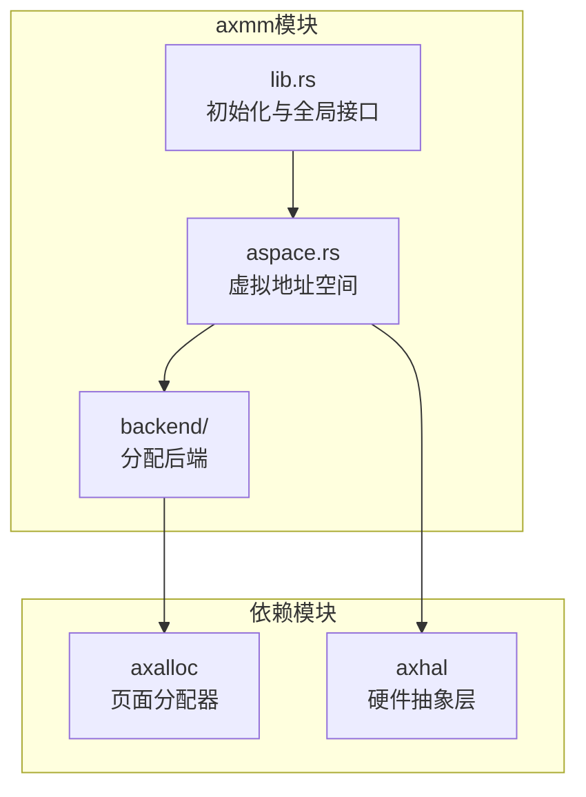
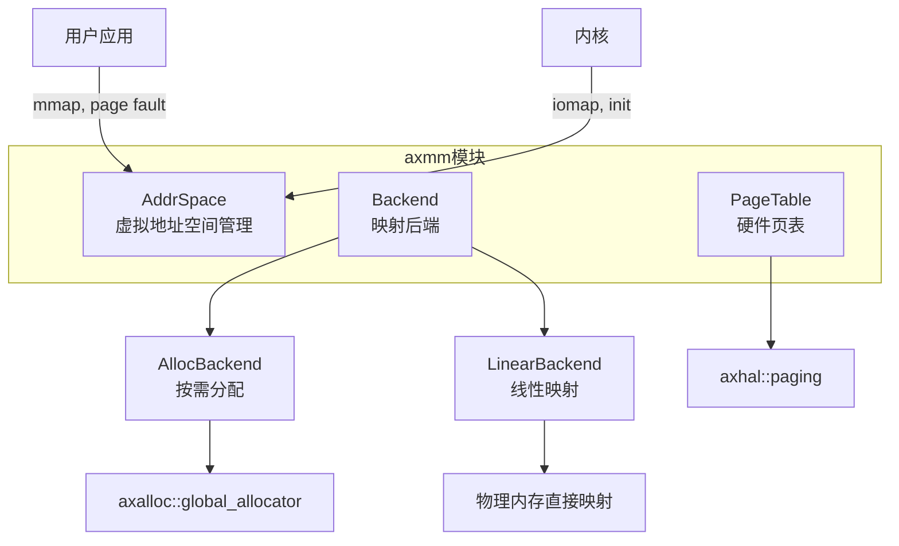
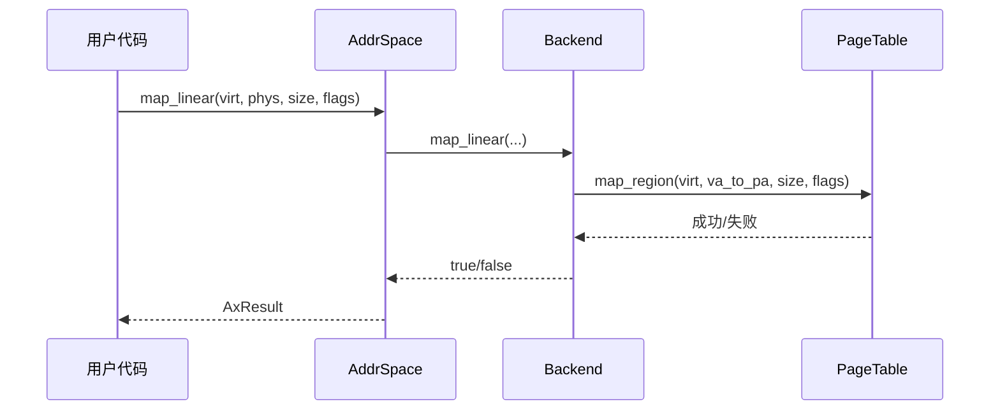
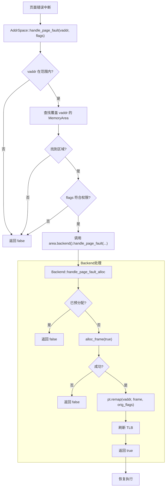
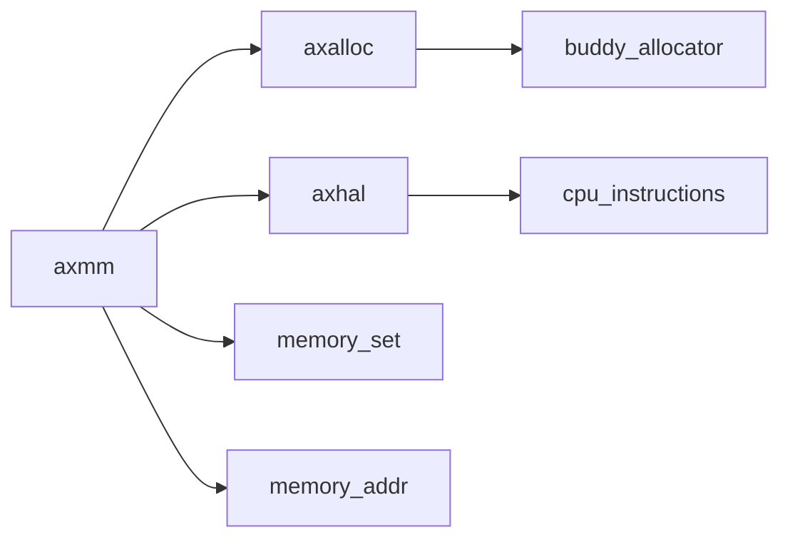

# 内存管理系统

<cite>
**本文档引用的文件**  
- [aspace.rs](file://modules/axmm/src/aspace.rs)
- [alloc.rs](file://modules/axmm/src/backend/alloc.rs)
- [linear.rs](file://modules/axmm/src/backend/linear.rs)
- [lib.rs](file://modules/axmm/src/lib.rs)
- [page.rs](file://modules/axalloc/src/page.rs)
</cite>

## 目录
1. [简介](#简介)
2. [项目结构](#项目结构)
3. [核心组件](#核心组件)
4. [架构概述](#架构概述)
5. [详细组件分析](#详细组件分析)
6. [依赖关系分析](#依赖关系分析)
7. [性能考量](#性能考量)
8. [故障排除指南](#故障排除指南)
9. [结论](#结论)

## 简介
arceos 是一个轻量级操作系统内核，其内存管理模块（axmm）负责虚拟地址空间的创建与管理、物理内存的分配策略以及页面错误处理。本文档深入解析 axmm 模块中 `aspace.rs` 的层次化页表机制，探讨 backend 子模块如何实现不同的物理内存后端分配策略，并对比基于页面分配（alloc.rs）和线性映射（linear.rs）两种后端的适用场景与性能特征。

## 项目结构
arceos 的内存管理功能主要集中在 `modules/axmm` 目录下，包含虚拟地址空间管理（aspace.rs）、后端分配策略（backend/）及顶层接口定义（lib.rs）。该模块依赖于 `axalloc` 提供的底层页面分配能力，并通过 `axhal` 与硬件抽象层交互以完成页表操作和物理地址转换。



**图示来源**
- [aspace.rs](file://modules/axmm/src/aspace.rs#L1-L322)
- [lib.rs](file://modules/axmm/src/lib.rs#L1-L131)
- [alloc.rs](file://modules/axmm/src/backend/alloc.rs#L1-L109)
- [linear.rs](file://modules/axmm/src/backend/linear.rs#L1-L47)

**章节来源**
- [aspace.rs](file://modules/axmm/src/aspace.rs#L1-L322)
- [lib.rs](file://modules/axmm/src/lib.rs#L1-L131)

## 核心组件
axmm 模块的核心是 `AddrSpace` 结构体，它封装了虚拟地址范围、内存区域集合（MemorySet）和页表实例（PageTable），用于表示一个独立的虚拟地址空间。通过 `Backend` 枚举类型支持多种物理内存映射策略，包括按需分配（Alloc）和线性偏移映射（Linear）。

**章节来源**
- [aspace.rs](file://modules/axmm/src/aspace.rs#L15-L322)
- [lib.rs](file://modules/axmm/src/lib.rs#L50-L131)

## 架构概述
axmm 模块采用分层设计，上层为虚拟地址空间管理，中层为映射后端抽象，底层依赖于 `axalloc` 和 `axhal` 完成实际的物理内存分配与页表操作。系统启动时初始化内核地址空间，后续用户进程可继承或独立创建新的地址空间。



**图示来源**
- [aspace.rs](file://modules/axmm/src/aspace.rs#L15-L322)
- [alloc.rs](file://modules/axmm/src/backend/alloc.rs#L1-L109)
- [linear.rs](file://modules/axmm/src/backend/linear.rs#L1-L47)
- [lib.rs](file://modules/axmm/src/lib.rs#L50-L131)

## 详细组件分析

### 虚拟地址空间管理（aspace.rs）
`AddrSpace` 提供了对虚拟地址空间的完整控制，包括映射、解映射、保护属性修改、数据读写及页面错误处理。每个地址空间拥有独立的页表根地址，确保多任务环境下的内存隔离。

#### 类图：地址空间结构
```mermaid
classDiagram
class AddrSpace {
+va_range : VirtAddrRange
+areas : MemorySet~Backend~
+pt : PageTable
+base() VirtAddr
+end() VirtAddr
+size() usize
+page_table() &PageTable
+page_table_root() PhysAddr
+contains_range(start, size) bool
+new_empty(base, size) AxResult~Self~
+copy_mappings_from(other) AxResult
+find_free_area(hint, size, limit) Option~VirtAddr~
+map_linear(start_vaddr, start_paddr, size, flags) AxResult
+map_alloc(start, size, flags, populate) AxResult
+unmap(start, size) AxResult
+read(start, buf) AxResult
+write(start, buf) AxResult
+protect(start, size, flags) AxResult
+clear()
+can_access_range(start, size, access_flags) bool
+handle_page_fault(vaddr, access_flags) bool
}
class MemorySet {
<<generic>>
+map(area, pt, lazy) Result
+unmap(start, size, pt) Result
+find(vaddr) Option~&MemoryArea~
+find_free_area(...) Option~VirtAddr~
+clear(pt) Result
}
class MemoryArea {
+start : VirtAddr
+size : usize
+flags : MappingFlags
+backend : Backend
}
class Backend {
<<enum>>
+Alloc{populate : bool}
+Linear{pa_va_offset : usize}
}
AddrSpace --> MemorySet : 包含
MemorySet --> MemoryArea : 管理多个
MemoryArea --> Backend : 使用后端策略
```

**图示来源**
- [aspace.rs](file://modules/axmm/src/aspace.rs#L15-L322)

**章节来源**
- [aspace.rs](file://modules/axmm/src/aspace.rs#L15-L322)

### 后端分配策略分析

#### 基于页面分配（alloc.rs）
`Alloc` 后端利用 `axalloc` 全局分配器动态分配物理页帧，支持惰性分配（on-demand）和预分配（populated）两种模式。适用于堆、栈等需要动态增长的内存区域。

##### 流程图：页面分配映射流程


**图示来源**
- [alloc.rs](file://modules/axmm/src/backend/alloc.rs#L1-L109)

**章节来源**
- [alloc.rs](file://modules/axmm/src/backend/alloc.rs#L1-L109)

#### 线性分配（linear.rs）
`Linear` 后端通过固定的物理-虚拟地址偏移实现直接映射，无需动态分配物理内存。常用于设备内存映射（如MMIO）或固定内存池。

##### 序列图：线性映射调用流程


**图示来源**
- [linear.rs](file://modules/axmm/src/backend/linear.rs#L1-L47)

**章节来源**
- [linear.rs](file://modules/axmm/src/backend/linear.rs#L1-L47)

### 内存映射与页面错误处理流程
当发生页面错误时，`handle_page_fault` 方法会查找对应的内存区域并交由相应后端处理。对于 `Alloc` 类型且未预分配的区域，将触发惰性分配；否则视为非法访问。



**图示来源**
- [aspace.rs](file://modules/axmm/src/aspace.rs#L250-L270)
- [alloc.rs](file://modules/axmm/src/backend/alloc.rs#L70-L90)

**章节来源**
- [aspace.rs](file://modules/axmm/src/aspace.rs#L250-L270)
- [alloc.rs](file://modules/axmm/src/backend/alloc.rs#L70-L90)

### 创建与管理独立地址空间示例
可通过 `new_user_aspace` 创建用户地址空间，继承内核映射（x86_64平台除外），并通过 `map_alloc` 或 `map_linear` 添加自定义映射。

```rust
let base = VirtAddr::from(0x10000000);
let size = 0x1000000; // 16MB
let mut user_aspace = new_user_aspace(base, size)?;

// 分配堆内存
user_aspace.map_alloc(
    base,
    0x100000, // 1MB
    MappingFlags::READ | MappingFlags::WRITE,
    false, // 惰性分配
)?;

// 映射设备内存
user_aspace.map_linear(
    base + 0x200000,
    device_paddr,
    0x1000,
    MappingFlags::DEVICE | MappingFlags::READ | MappingFlags::WRITE,
)?;
```

**章节来源**
- [lib.rs](file://modules/axmm/src/lib.rs#L90-L110)
- [aspace.rs](file://modules/axmm/src/aspace.rs#L100-L150)

## 依赖关系分析
axmm 模块高度依赖 `axalloc` 提供物理页帧分配能力，并通过 `axhal::paging` 接口操作硬件页表。同时，`memory_addr` 和 `memory_set` 库提供了地址计算与内存区域管理的基础支持。



**图示来源**
- [lib.rs](file://modules/axmm/src/lib.rs#L1-L131)
- [alloc.rs](file://modules/axmm/src/backend/alloc.rs#L1-L109)

**章节来源**
- [lib.rs](file://modules/axmm/src/lib.rs#L1-L131)
- [alloc.rs](file://modules/axmm/src/backend/alloc.rs#L1-L109)

## 性能考量
- **线性映射（Linear）**：映射速度快，适合大块连续物理内存的直接映射，但不支持动态扩展。
- **页面分配（Alloc）**：支持按需分配，节省物理内存，但首次访问可能触发页面错误并产生分配开销。
- **TLB 刷新策略**：在映射和解映射时采用局部刷新而非全局刷新，减少性能损耗。

## 故障排除指南
常见问题包括：
- 地址未对齐导致 `InvalidInput` 错误 → 确保虚拟/物理地址及大小均按 4KB 对齐。
- 页面错误无法处理 → 检查是否启用了惰性分配且后端正确配置。
- 内存泄漏 → 确保 `unmap` 正确释放物理页帧。

**章节来源**
- [aspace.rs](file://modules/axmm/src/aspace.rs#L200-L240)
- [alloc.rs](file://modules/axmm/src/backend/alloc.rs#L40-L60)

## 结论
arceos 的 axmm 模块通过清晰的分层设计实现了灵活高效的内存管理。`AddrSpace` 抽象了虚拟地址空间的操作，`Backend` 支持多种物理内存映射策略，结合 `axalloc` 实现了从虚拟到物理地址的完整映射链路。该设计既满足了内核自身的需求，也为用户进程提供了安全隔离的内存环境。