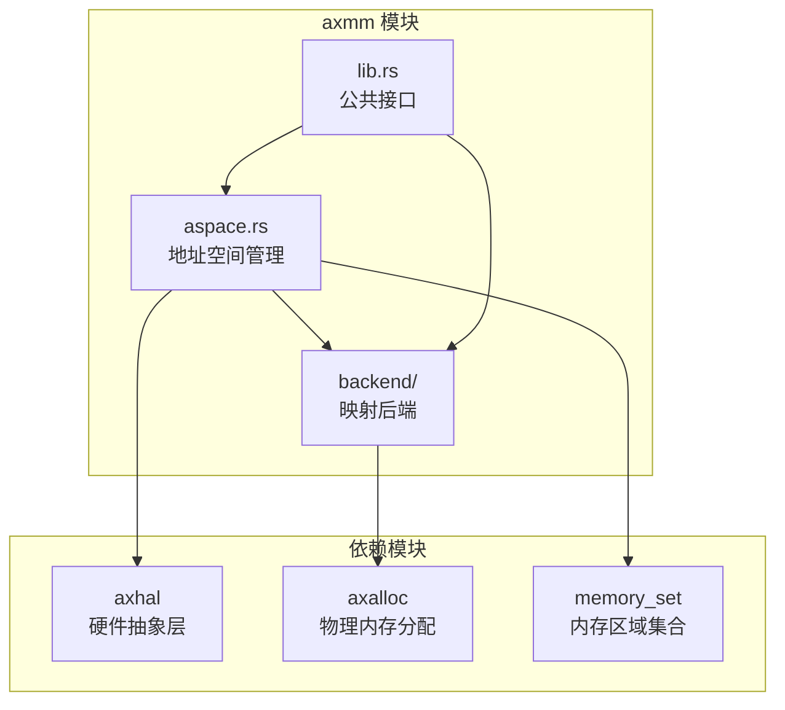
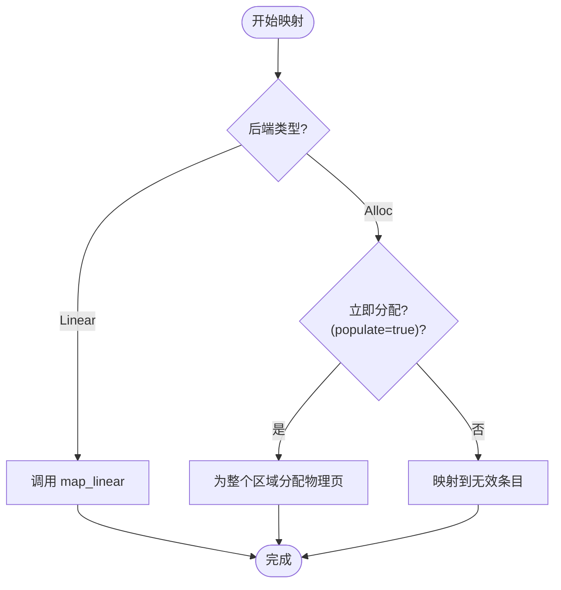
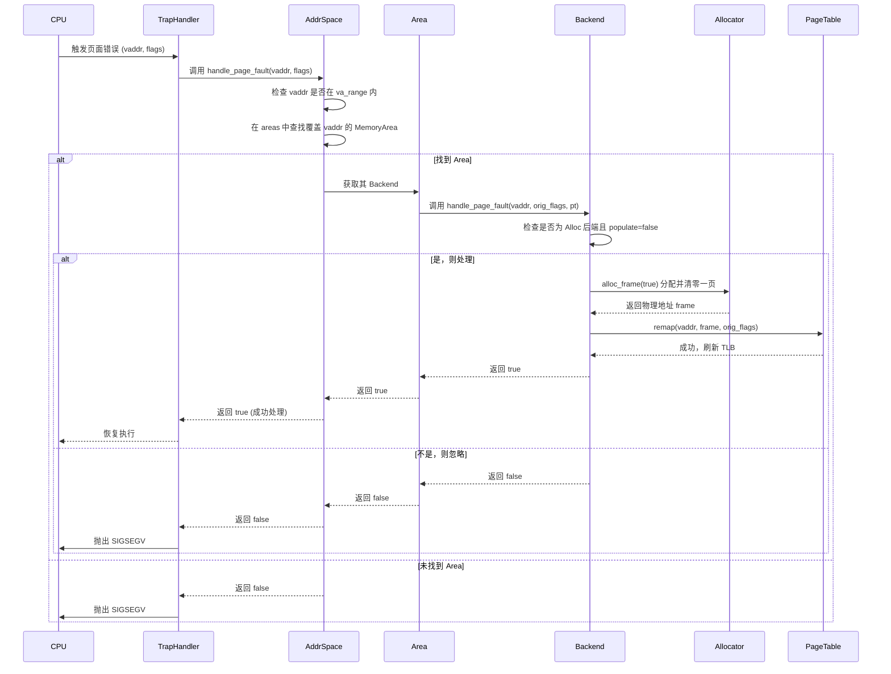
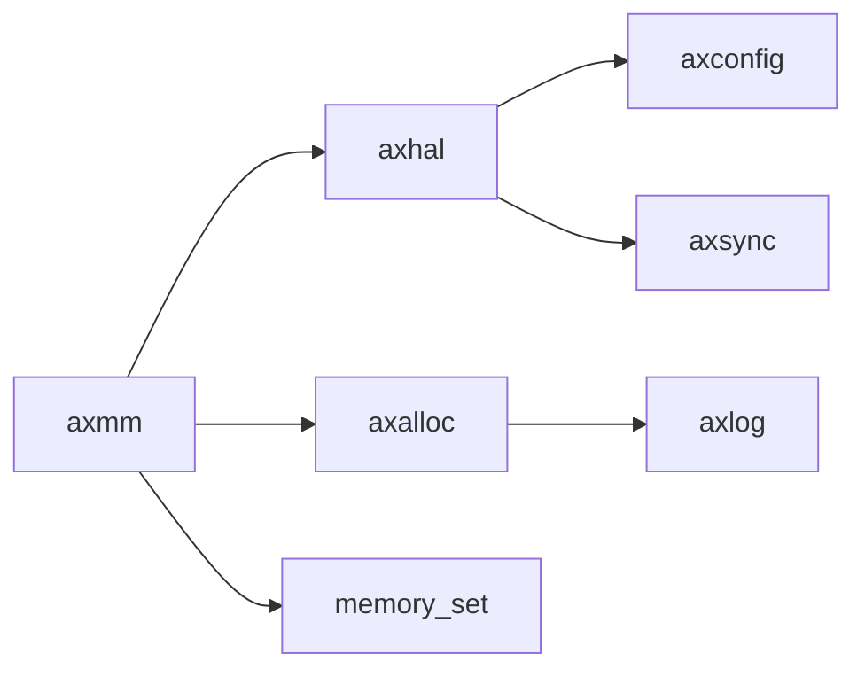

# 地址空间管理（前端）

<cite>
**本文档引用文件**  
- [aspace.rs](file://modules/axmm/src/aspace.rs)
- [lib.rs](file://modules/axmm/src/lib.rs)
- [backend/mod.rs](file://modules/axmm/src/backend/mod.rs)
- [backend/alloc.rs](file://modules/axmm/src/backend/alloc.rs)
- [backend/linear.rs](file://modules/axmm/src/backend/linear.rs)
- [axtask/src/task.rs](file://modules/axtask/src/task.rs)
</cite>

## 目录
1. [简介](#简介)
2. [项目结构](#项目结构)
3. [核心组件](#核心组件)
4. [架构概述](#架构概述)
5. [详细组件分析](#详细组件分析)
6. [依赖分析](#依赖分析)
7. [性能考虑](#性能考虑)
8. [故障排除指南](#故障排除指南)
9. [结论](#结论)

## 简介
本文档深入解析 ArceOS 内存管理系统中虚拟地址空间的前端实现，重点聚焦于 `aspace.rs` 模块中的 `AddrSpace` 结构。文档将阐述其对 x86_64 页表层级（PML4/PDP/PD/PT）的抽象机制、虚拟内存区域（VMA）的管理策略、内存映射（mmap）的建立与解除流程，以及页面错误（page fault）的处理路径。同时，说明该模块如何与任务调度系统协同工作以实现地址空间切换，并描述其与后端物理内存分配器的交互契约。

## 项目结构
ArceOS 的内存管理模块（`axmm`）位于 `/modules/axmm` 目录下，是操作系统内核的核心组件之一。该模块负责为内核和用户进程提供虚拟内存管理服务。



**Diagram sources**
- [aspace.rs](file://modules/axmm/src/aspace.rs#L1-L321)
- [backend/mod.rs](file://modules/axmm/src/backend/mod.rs#L1-L87)

**Section sources**
- [aspace.rs](file://modules/axmm/src/aspace.rs#L1-L321)
- [lib.rs](file://modules/axmm/src/lib.rs#L1-L130)

## 核心组件
`AddrSpace` 是 ArceOS 虚拟内存管理的核心数据结构，它封装了一个完整的虚拟地址空间，包括其范围、内部的虚拟内存区域（VMAs）集合以及底层的多级页表。

**Section sources**
- [aspace.rs](file://modules/axmm/src/aspace.rs#L15-L321)

## 架构概述
ArceOS 的地址空间管理采用分层设计，`AddrSpace` 作为顶层抽象，通过 `MemorySet` 管理多个 `MemoryArea`（即 VMA），每个 VMA 使用不同的 `Backend` 策略来操作底层的 `PageTable`。

```mermaid
classDiagram
class AddrSpace {
+va_range : VirtAddrRange
+areas : MemorySet~Backend~
+pt : PageTable
+new_empty(base, size) AddrSpace
+map_linear(start_vaddr, start_paddr, size, flags)
+map_alloc(start, size, flags, populate)
+unmap(start, size)
+handle_page_fault(vaddr, access_flags)
}
class MemorySet {
+areas : Vec~MemoryArea~
+find_free_area(hint, size, limit)
+map(area, page_table, flush_tlb)
+unmap(start, size, page_table)
+clear(page_table)
}
class MemoryArea {
+start : VirtAddr
+size : usize
+flags : MappingFlags
+backend : Backend
+find(addr) Option~MemoryArea~
}
class Backend {
<<enumeration>>
Linear{pa_va_offset}
Alloc{populate}
+map(start, size, flags, pt)
+unmap(start, size, pt)
+handle_page_fault(vaddr, orig_flags, pt)
}
class PageTable {
+root_paddr()
+map_region(start, va_to_pa, size, flags)
+unmap_region(start, size)
+protect_region(start, size, new_flags)
+remap(vaddr, frame, flags)
}
AddrSpace --> MemorySet : "包含"
AddrSpace --> PageTable : "持有"
MemorySet --> MemoryArea : "管理"
MemoryArea --> Backend : "使用"
Backend ..> PageTable : "操作"
AddrSpace ..> Backend : "间接使用"
```

**Diagram sources**
- [aspace.rs](file://modules/axmm/src/aspace.rs#L15-L321)
- [backend/mod.rs](file://modules/axmm/src/backend/mod.rs#L1-L87)

## 详细组件分析

### AddressSpace 结构分析
`AddrSpace` 结构体是虚拟地址空间的直接表示，其设计遵循清晰的职责分离原则。

#### 数据成员
- **`va_range`**: 定义了该地址空间的起始和结束虚拟地址。
- **`areas`**: 类型为 `MemorySet<Backend>`，是一个有序集合，用于管理所有已分配的虚拟内存区域（VMAs）。它能高效地查找空闲区域、检查重叠等。
- **`pt`**: 类型为 `PageTable`，代表该地址空间的根页表，负责实际的虚拟到物理地址转换。

#### 关键方法
- **`new_empty`**: 创建一个全新的、空的地址空间，通常用于创建新的用户进程地址空间。
- **`copy_mappings_from`**: 将另一个地址空间（通常是内核空间）的页表项复制到当前空间，用于在用户进程中映射内核空间。
- **`find_free_area`**: 在指定范围内查找一个足够大的连续空闲虚拟地址区域，为新的内存映射做准备。
- **`map_linear` 和 `map_alloc`**: 分别用于创建线性映射和动态分配映射，是建立内存映射的核心入口。
- **`unmap`**: 解除指定虚拟地址范围的映射，并释放关联的物理内存（对于 `Alloc` 后端）。
- **`handle_page_fault`**: 处理页面错误异常。它首先检查访问地址是否在地址空间范围内，然后查找对应的 `MemoryArea`，最后调用该区域后端的 `handle_page_fault` 方法进行具体处理。

**Section sources**
- [aspace.rs](file://modules/axmm/src/aspace.rs#L15-L321)

### 虚拟内存区域（VMA）与后端机制
虚拟内存区域（VMA）由 `MemoryArea` 表示，其行为由 `Backend` 枚举决定，实现了灵活的内存映射策略。

#### Backend 枚举
`Backend` 是一个关键的枚举类型，定义了两种主要的映射后端：
- **`Linear`**: 用于线性映射，如设备内存或内核代码段。它要求物理地址在映射时就已知，并且虚拟地址与物理地址之间存在固定的偏移量（`pa_va_offset`）。
- **`Alloc`**: 用于通用的动态内存映射，如堆、栈或匿名映射。它不预先分配物理页帧，而是按需分配。



**Diagram sources**
- [backend/mod.rs](file://modules/axmm/src/backend/mod.rs#L1-L87)
- [backend/linear.rs](file://modules/axmm/src/backend/linear.rs#L1-L46)
- [backend/alloc.rs](file://modules/axmm/src/backend/alloc.rs#L1-L108)

#### 映射建立流程
1.  用户调用 `AddrSpace::map_alloc` 或 `AddrSpace::map_linear`。
2.  `AddrSpace` 验证参数（地址范围、对齐）。
3.  创建一个 `MemoryArea` 对象，并将其添加到 `MemorySet` 中。
4.  调用 `MemorySet::map`，该方法会委托给 `MemoryArea` 的 `Backend` 来执行具体的页表操作。
5.  对于 `Linear` 后端，直接计算物理地址并调用 `PageTable::map_region` 建立映射。
6.  对于 `Alloc` 后端，如果 `populate=true`，则为整个区域预分配并清零物理页；否则，仅建立一个指向无效物理地址的映射，等待后续的页面错误来触发实际分配。

**Section sources**
- [backend/mod.rs](file://modules/axmm/src/backend/mod.rs#L1-L87)
- [backend/linear.rs](file://modules/axmm/src/backend/linear.rs#L1-L46)
- [backend/alloc.rs](file://modules/axmm/src/backend/alloc.rs#L1-L108)

### 页面错误处理流程
页面错误是实现按需分页的关键机制。当访问一个尚未分配物理页的虚拟地址时，CPU 会触发页面错误异常。



**Diagram sources**
- [aspace.rs](file://modules/axmm/src/aspace.rs#L250-L270)
- [backend/alloc.rs](file://modules/axmm/src/backend/alloc.rs#L80-L108)

**Section sources**
- [aspace.rs](file://modules/axmm/src/aspace.rs#L250-L270)
- [backend/alloc.rs](file://modules/axmm/src/backend/alloc.rs#L80-L108)

### 与任务调度的协同
`axmm` 模块与 `axtask` 模块紧密协作，实现多任务环境下的地址空间隔离。

#### 地址空间切换
每个 `Task` 结构体都持有一个 `AddrSpace` 的引用。当发生任务切换时，调度器会调用特定于体系结构的汇编代码，将新任务的页表根物理地址写入 CPU 的页表基址寄存器（如 x86_64 的 CR3 寄存器）。

```rust
// 伪代码：上下文切换时的地址空间切换
fn switch_context(old_task: &mut Task, new_task: &Task) {
    // ... 保存旧任务上下文 ...
    
    // 切换地址空间
    unsafe {
        axhal::asm::write_user_page_table(new_task.aspace().page_table_root());
    }
    
    // ... 恢复新任务上下文并跳转 ...
}
```

**Section sources**
- [axtask/src/task.rs](file://modules/axtask/src/task.rs)
- [aspace.rs](file://modules/axmm/src/aspace.rs#L50-L55)

### 与后端分配器的交互契约
`axmm` 模块通过 `axalloc` 模块提供的全局分配器来获取和释放物理页帧。

- **交互点**: 主要在 `backend/alloc.rs` 中的 `alloc_frame` 和 `dealloc_frame` 函数。
- **契约**:
  - `alloc_frame(zeroed: bool)` 请求分配一个物理页帧。如果 `zeroed` 为 `true`，则返回前必须将该页内容清零。
  - `dealloc_frame(frame: PhysAddr)` 通知分配器可以回收指定的物理页帧。
- **解耦设计**: `axmm` 只关心页帧的分配和释放，而不关心底层的分配算法（如伙伴系统、slab 分配器等），这使得内存管理前后端可以独立演化。

**Section sources**
- [backend/alloc.rs](file://modules/axmm/src/backend/alloc.rs#L1-L25)
- [axalloc/src/lib.rs](file://modules/axalloc/src/lib.rs)

## 依赖分析
`axmm` 模块依赖于多个其他内核模块，形成了一个清晰的依赖图。



**Diagram sources**
- [lib.rs](file://modules/axmm/src/lib.rs#L1-L130)
- [Cargo.toml](file://modules/axmm/Cargo.toml)

**Section sources**
- [lib.rs](file://modules/axmm/src/lib.rs#L1-L130)

## 性能考虑
- **TLB 刷新优化**: 在建立或解除映射时，代码明确注释了 `tlb.ignore()`，表明在某些情况下（如新建映射）无需立即刷新 TLB，因为不存在过时的缓存条目，从而减少了不必要的开销。
- **惰性分配**: `Alloc` 后端支持 `populate=false` 的惰性分配模式，避免了为大块内存提前分配物理页，节省了宝贵的物理内存资源。
- **高效的 VMA 管理**: 使用 `MemorySet` 这种有序数据结构来管理 VMAs，使得查找、插入和删除操作具有良好的时间复杂度。

## 故障排除指南
- **`InvalidInput` 错误**: 通常由地址未对齐（4KB）、超出地址空间范围或大小为零引起。请确保所有传入 `map_*` 或 `unmap` 的参数都符合要求。
- **`NoMemory` 错误**: 在创建新地址空间时可能遇到，表明