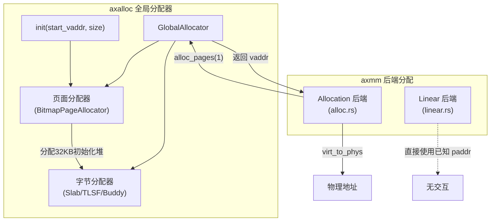

# 物理内存分配（后端）

<cite>
**本文档引用的文件**
- [mod.rs](file://modules/axmm/src/backend/mod.rs)
- [alloc.rs](file://modules/axmm/src/backend/alloc.rs)
- [linear.rs](file://modules/axmm/src/backend/linear.rs)
- [lib.rs](file://modules/axalloc/src/lib.rs)
- [page.rs](file://modules/axalloc/src/page.rs)
</cite>

## 目录
1. [引言](#引言)
2. [Backend 枚举与前后端解耦机制](#backend-枚举与前后端解耦机制)
3. 基于 axalloc 的页面粒度分配策略（alloc.rs）
   - [数据结构设计](#数据结构设计)
   - [分配与释放算法](#分配与释放算法)
   - [缺页处理机制](#缺页处理机制)
   - [时间复杂度分析](#时间复杂度分析)
4. 线性位图分配策略（linear.rs）
   - [线性映射原理](#线性映射原理)
   - [映射与解映射实现](#映射与解映射实现)
   - [适用场景与限制](#适用场景与限制)
5. 全局堆与线性分配器的协作关系](#全局堆与线性分配器的协作关系)
6. 性能调优建议与策略选择](#性能调优建议与策略选择)

## 引言

在 ArceOS 操作系统中，物理内存管理是核心子系统之一。`axmm` 模块负责虚拟地址空间的管理，其后端分配策略通过 `backend` 子模块实现。本技术文档深入分析 `backend` 目录下的两种关键内存分配策略：基于 `axalloc` 的页面粒度分配（`alloc.rs`）和线性位图分配（`linear.rs`）。我们将详细对比它们的数据结构、算法逻辑、性能特征及适用场景，并阐明 `mod.rs` 中 `Backend` trait 如何实现前后端解耦，为系统性能优化提供指导。

## Backend 枚举与前后端解耦机制

`mod.rs` 文件定义了 `Backend` 枚举类型，作为统一的内存映射后端接口，实现了清晰的前后端解耦。

```mermaid
classDiagram
class Backend {
<<enumeration>>
+Linear { pa_va_offset : usize }
+Alloc { populate : bool }
}
class MappingBackend {
<<trait>>
+map(start, size, flags, pt) bool
+unmap(start, size, pt) bool
+protect(start, size, new_flags, page_table) bool
}
Backend ..|> MappingBackend : 实现
```

**Diagram sources**
- [mod.rs](file://modules/axmm/src/backend/mod.rs#L10-L87)

**Section sources**
- [mod.rs](file://modules/axmm/src/backend/mod.rs#L10-L87)

该枚举包含两个变体：
- **Linear**: 用于线性映射，要求目标物理帧连续且地址已知，通过 `pa_va_offset` 计算虚拟地址到物理地址的偏移。
- **Alloc**: 用于通用或延迟映射，物理帧从全局分配器按需获取。

`Backend` 类型实现了 `MappingBackend` trait，该 trait 定义了 `map`、`unmap` 和 `protect` 三个核心方法。当调用这些方法时，会根据 `Backend` 的具体变体进行模式匹配，动态分发到对应的实现函数（如 `map_linear` 或 `map_alloc`）。这种设计将内存映射的抽象接口与具体实现完全分离，使得上层代码无需关心底层分配细节，从而实现了高度的模块化和可替换性。

## 基于 axalloc 的页面粒度分配策略（alloc.rs）

### 数据结构设计

此策略不维护复杂的专有数据结构，而是依赖 `axalloc` 模块提供的全局页面分配器。其核心在于利用 `GlobalAllocator` 的两层架构：
1.  **字节分配器 (ByteAllocator)**: 负责小对象的精细分配（如 `slab`, `tlsf`）。
2.  **页面分配器 (PageAllocator)**: 负责以 4KB 页面为单位的大块内存分配，通常使用位图 (`BitmapPageAllocator`)。

`alloc.rs` 中的 `alloc_frame` 和 `dealloc_frame` 函数作为桥梁，将页面级别的请求转换为对 `global_allocator()` 的调用，从而复用整个全局分配系统的功能。

**Section sources**
- [alloc.rs](file://modules/axmm/src/backend/alloc.rs#L0-L108)

### 分配与释放算法

#### 分配算法 (`map_alloc`)
- **预填充模式 (populate = true)**:
  1.  遍历指定虚拟地址范围内的每一个 4KB 页面。
  2.  对每个页面，调用 `alloc_frame(true)` 从全局分配器申请一个物理页框，并将其清零。
  3.  将虚拟页与物理页框直接映射到页表中。
  4.  此模式下，所有内存都在映射创建时一次性分配完毕，后续访问不会触发缺页异常。
- **按需分配模式 (populate = false)**:
  1.  在页表中创建一个“空”区域，标记为需要处理缺页异常。
  2.  当程序首次访问该区域时，会触发缺页异常，由 `handle_page_fault_alloc` 函数处理，此时才实际分配物理内存并建立映射。

#### 释放算法 (`unmap_alloc`)
1.  遍历待释放虚拟地址范围内的所有 4KB 页面。
2.  调用 `pt.unmap(addr)` 从页表中解除映射，获取对应的物理页框地址。
3.  调用 `dealloc_frame(frame)` 将物理页框归还给全局分配器。

**Section sources**
- [alloc.rs](file://modules/axmm/src/backend/alloc.rs#L27-L79)

### 缺页处理机制

`handle_page_fault_alloc` 函数是按需分配的核心。它仅在 `populate` 为 `false` 时生效。当发生缺页异常时，该函数会：
1.  调用 `alloc_frame(true)` 分配一个新的、已清零的物理页框。
2.  调用 `pt.remap(vaddr, frame, orig_flags)` 将故障的虚拟地址映射到新分配的物理页框上。
3.  返回成功状态，使程序得以继续执行。

这实现了经典的“惰性分配”(Lazy Allocation)，有效避免了为未使用的内存区域提前消耗物理资源。

**Section sources**
- [alloc.rs](file://modules/axmm/src/backend/alloc.rs#L81-L108)

### 时间复杂度分析

- **预填充分配**: O(n)，其中 n 是映射的页面数量。因为需要遍历并为每个页面单独分配。
- **按需分配 (映射阶段)**: O(1)，仅设置页表项，不实际分配内存。
- **按需分配 (缺页处理)**: O(1)，单次缺页处理只分配一个页面。
- **释放**: O(n)，需要遍历并逐个释放所有页面。

虽然释放操作的时间复杂度较高，但由于内存释放通常是批量进行的，且频率远低于分配，因此在大多数场景下可以接受。

## 线性位图分配策略（linear.rs）

### 线性映射原理

线性分配策略适用于物理内存布局已知且需要大块连续映射的场景，例如内核自身的初始化或设备内存的映射。其核心思想是建立一个固定的线性偏移关系：`物理地址 = 虚拟地址 - pa_va_offset`。

这意味着，一旦确定了 `pa_va_offset`，任何虚拟地址都可以通过简单的减法运算得到其对应的物理地址，无需查询复杂的分配表。

**Section sources**
- [linear.rs](file://modules/axmm/src/backend/linear.rs#L0-L46)

### 映射与解映射实现

#### 映射算法 (`map_linear`)
1.  创建一个闭包 `va_to_pa`，它封装了 `vaddr - pa_va_offset` 的计算逻辑。
2.  调用页表的 `map_region` 方法，传入起始虚拟地址、大小、权限标志以及这个 `va_to_pa` 闭包。
3.  `map_region` 内部会自动迭代虚拟地址范围，并对每个页面应用 `va_to_pa` 函数来获取物理地址，然后完成映射。

#### 解映射算法 (`unmap_linear`)
1.  调用页表的 `unmap_region` 方法，传入要解映射的虚拟地址范围。
2.  该方法会遍历该区域的所有页面，并从页表中移除它们的映射条目。

值得注意的是，线性映射**不支持**缺页异常处理。如果尝试访问未映射的线性区域，`handle_page_fault` 会直接返回 `false`，导致程序崩溃。因此，必须确保映射的区域在物理上是真实存在且可用的。

**Section sources**
- [linear.rs](file://modules/axmm/src/backend/linear.rs#L15-L46)

### 适用场景与限制

- **适用场景**:
  - 映射已知的、大块的、连续的物理内存区域（如内核代码段、静态数据区、设备MMIO区域）。
  - 需要高性能、低开销的直接地址转换。
  - 不需要动态分配和释放内存的场景。
- **限制**:
  - 物理内存必须是连续的。
  - 必须预先知道物理地址。
  - 不支持按需分配和缺页处理。
  - 灵活性差，无法像 `alloc` 后端那样动态管理碎片化的内存。

## 全局堆与线性分配器的协作关系

`axalloc` 模块中的全局堆 (`GlobalAllocator`) 与 `axmm` 的后端分配策略紧密协作，共同构成完整的内存管理系统。



**Diagram sources**
- [lib.rs](file://modules/axalloc/src/lib.rs#L84-L112)
- [page.rs](file://modules/axalloc/src/page.rs#L0-L108)
- [alloc.rs](file://modules/axmm/src/backend/alloc.rs#L0-L108)

`axalloc` 的初始化过程 (`global_init`) 至关重要：
1.  系统启动时，会将一大块物理内存区域