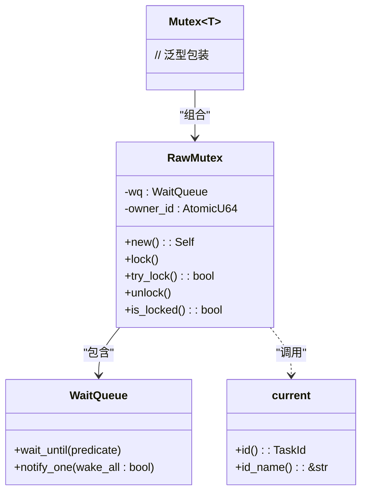
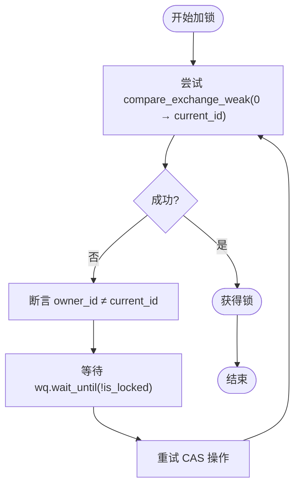
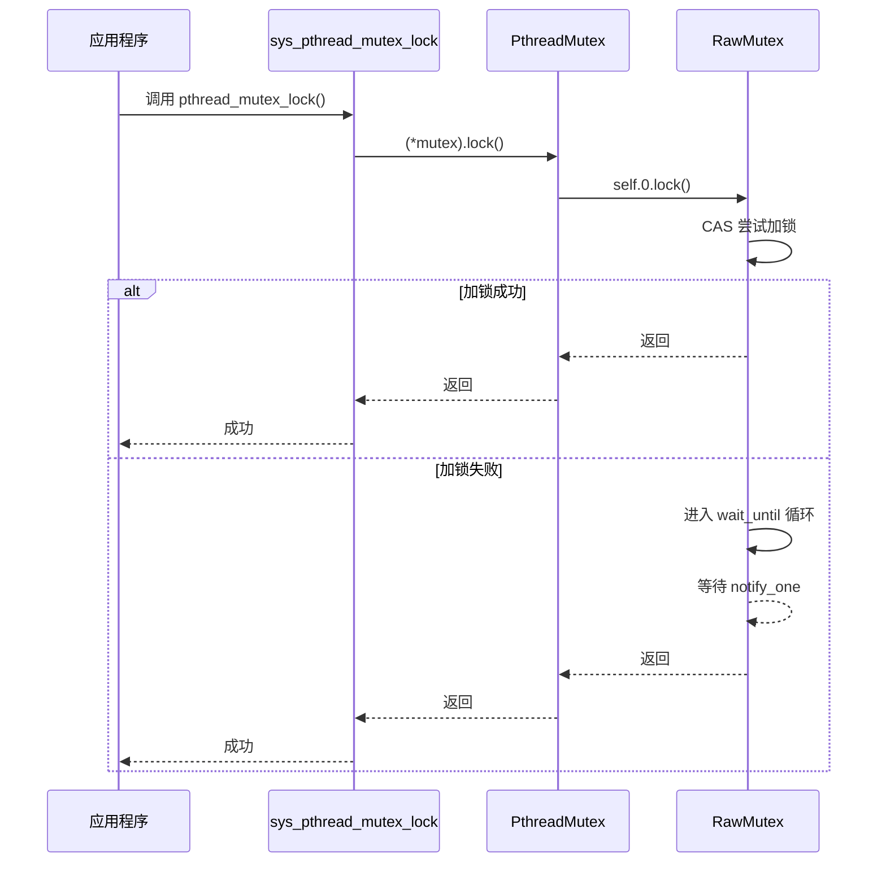

# 同步原语

<cite>
**本文档引用的文件**
- [mutex.rs](file://modules/axsync/src/mutex.rs)
- [lib.rs](file://modules/axsync/src/lib.rs)
- [Cargo.toml](file://modules/axsync/Cargo.toml)
- [pthread/mutex.rs](file://api/arceos_posix_api/src/imp/pthread/mutex.rs)
- [axhal/src/lib.rs](file://modules/axhal/src/lib.rs)
- [axhal/src/percpu.rs](file://modules/axhal/src/percpu.rs)
- [axhal/src/irq.rs](file://modules/axhal/src/irq.rs)
</cite>

## 目录
1. [简介](#简介)
2. [项目结构与模块依赖](#项目结构与模块依赖)
3. [核心组件分析](#核心组件分析)
4. [架构概览](#架构概览)
5. [详细组件分析](#详细组件分析)
6. [依赖关系分析](#依赖关系分析)
7. [性能考量](#性能考量)
8. [故障排查指南](#故障排查指南)
9. [结论](#结论)

## 简介
`axsync` 模块是 ArceOS 操作系统中用于提供同步原语的核心组件，主要实现互斥锁（Mutex）、自旋锁等并发控制机制。该模块在多任务环境下通过原子操作和等待队列机制保障资源访问的安全性。其设计结合了无竞争快速路径与有竞争慢速路径的双重策略，兼顾性能与正确性。

本技术参考文档旨在全面解析 `axsync` 模块的技术实现，重点分析 `mutex.rs` 中基于原子操作的锁机制、递归性处理、死锁检测以及与底层硬件抽象层 `axhal` 的依赖关系。同时对比无锁编程与传统锁机制在 `axnet` 和 `axfs` 模块中的应用权衡，并提供典型多线程资源竞争问题的解决方案示例。

## 项目结构与模块依赖

```mermaid
graph TD
subgraph "同步模块"
axsync[axsync]
end
subgraph "操作系统核心"
axtask[axtask]
axhal[axhal]
kspin[kspin]
lock_api[lock_api]
end
subgraph "上层接口"
arceos_posix_api[arceos_posix_api]
ulib_axstd[ulib::axstd]
end
axsync --> axtask : "依赖 WaitQueue"
axsync --> axhal : "间接依赖原子指令"
axsync --> kspin : "提供自旋锁基础"
axsync --> lock_api : "封装通用锁接口"
arceos_posix_api --> axsync : "POSIX 互斥量实现"
ulib_axstd --> axsync : "标准库同步支持"
```

**Diagram sources**
- [Cargo.toml](file://modules/axsync/Cargo.toml#L1-L23)
- [lib.rs](file://modules/axsync/src/lib.rs#L1-L29)

**Section sources**
- [Cargo.toml](file://modules/axsync/Cargo.toml#L1-L23)
- [lib.rs](file://modules/axsync/src/lib.rs#L1-L29)

## 核心组件分析

`axsync` 模块的核心在于 `RawMutex` 结构体的实现，它利用 `AtomicU64` 存储当前持有锁的任务 ID，并结合 `WaitQueue` 实现阻塞式等待。当启用 `multitask` 特性时，`Mutex<T>` 成为 `lock_api::Mutex<RawMutex, T>` 的别名，从而支持多线程环境下的安全共享。

该模块的设计允许在无竞争情况下通过原子比较交换（CAS）快速获取锁，而在发生竞争时则将当前任务加入等待队列并挂起，直到锁被释放后由调度器唤醒。这种双重路径策略有效减少了高并发场景下的上下文切换开销。

**Section sources**
- [mutex.rs](file://modules/axsync/src/mutex.rs#L1-L150)
- [lib.rs](file://modules/axsync/src/lib.rs#L1-L29)

## 架构概览



**Diagram sources**
- [mutex.rs](file://modules/axsync/src/mutex.rs#L1-L150)

**Section sources**
- [mutex.rs](file://modules/axsync/src/mutex.rs#L1-L150)

## 详细组件分析

### RawMutex 实现分析

`RawMutex` 是 `axsync` 中互斥锁的实际实现，其关键字段包括：

- `wq`: 类型为 `WaitQueue`，用于管理等待获取锁的任务列表。
- `owner_id`: 类型为 `AtomicU64`，记录当前持有锁的任务唯一标识符（ID），值为 0 表示未加锁。

#### 无竞争快速路径
在 `lock()` 方法中，首先尝试使用 `compare_exchange_weak` 原子操作将 `owner_id` 从 0 更新为当前任务 ID。若成功，则立即获得锁，无需进入等待队列，此为快速路径。

#### 有竞争慢速路径
若 `compare_exchange_weak` 失败（表明已有其他任务持锁），则执行断言确保不是同一线程重复加锁（不支持递归锁），随后调用 `self.wq.wait_until(|| !self.is_locked())` 将当前任务阻塞，直至锁状态变为未锁定。



**Diagram sources**
- [mutex.rs](file://modules/axsync/src/mutex.rs#L1-L150)

**Section sources**
- [mutex.rs](file://modules/axsync/src/mutex.rs#L1-L150)

### 死锁检测机制

`axsync` 在运行时通过断言机制进行基本的死锁预防。当一个任务尝试获取已被自己持有的锁时，`assert_ne!(owner_id, current_id, ...)` 断言会触发 panic，防止形成死锁条件。然而，该机制仅能检测直接的自锁行为，对于跨多个锁的循环等待（经典死锁）并无静态或动态检测能力。

### POSIX API 兼容层

`arceos_posix_api` 模块通过封装 `axsync::Mutex<()>` 实现了 POSIX 风格的互斥量（`pthread_mutex_t`）。每个 `PthreadMutex` 内部持有一个无数据的 `Mutex<()>`，并通过系统调用 `sys_pthread_mutex_lock/unlock` 提供 C 接口。



**Diagram sources**
- [pthread/mutex.rs](file://api/arceos_posix_api/src/imp/pthread/mutex.rs#L1-L69)
- [mutex.rs](file://modules/axsync/src/mutex.rs#L1-L150)

**Section sources**
- [pthread/mutex.rs](file://api/arceos_posix_api/src/imp/pthread/mutex.rs#L1-L69)

## 依赖关系分析

`axsync` 模块的正常运作高度依赖于以下底层组件：

- **axtask**: 提供 `current()` 函数以获取当前任务信息及 `WaitQueue` 用于任务阻塞与唤醒。
- **axhal**: 提供底层原子操作支持（如 `compare_exchange_weak` 所依赖的 CPU 指令），尽管这些操作由 Rust 标准库间接暴露，但其正确性依赖于 `axhal` 对特定架构（x86_64, aarch64 等）的初始化与配置。
- **kspin**: 当未启用 `multitask` 特性时，`Mutex` 退化为 `kspin::SpinNoIrq`，即禁用中断的自旋锁，适用于单任务或中断上下文。

```mermaid
graph LR
axsync --> axtask
axsync --> kspin
axsync --> lock_api
axtask --> axhal
kspin --> axhal
axhal -.-> "CPU 原子指令"
```

**Diagram sources**
- [Cargo.toml](file://modules/axsync/Cargo.toml#L1-L23)
- [lib.rs](file://modules/axsync/src/lib.rs#L1-L29)
- [axhal/src/lib.rs](file://modules/axhal/src/lib.rs#L1-L143)

**Section sources**
- [Cargo.toml](file://modules/axsync/Cargo.toml#L1-L23)
- [lib.rs](file://modules/axsync/src/lib.rs#L1-L29)
- [axhal/src/lib.rs](file://modules/axhal/src/lib.rs#L1-L143)

## 性能考量

`axsync` 的互斥锁设计在性能上进行了权衡：

- **优点**：在无竞争或低竞争场景下，快速路径的 CAS 操作开销极小；在高竞争场景下，通过阻塞而非忙等待避免了 CPU 资源浪费。
- **缺点**：每次加锁都