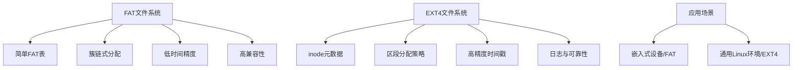
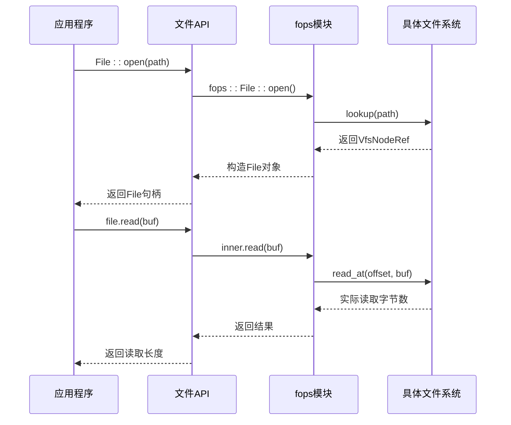

# 支持的文件系统类型

<cite>
**本文档中引用的文件**
- [fatfs.rs](file://modules/axfs/src/fs/fatfs.rs)
- [ext4fs.rs](file://modules/axfs/src/fs/ext4fs.rs)
- [myfs.rs](file://modules/axfs/src/fs/myfs.rs)
- [file.rs](file://modules/axfs/src/api/file.rs)
- [dir.rs](file://modules/axfs/src/api/dir.rs)
</cite>

## 目录
1. [简介](#简介)
2. [FAT与EXT4文件系统的对比分析](#fat与ext4文件系统的对比分析)
3. [轻量级原生文件系统MyFS的设计与局限性](#轻量级原生文件系统myfs的设计与局限性)
4. [标准文件操作API使用范例](#标准文件操作api使用范例)
5. [性能与兼容性量化比较及选择建议](#性能与兼容性量化比较及选择建议)
6. [结论](#结论)

## 简介
Arceos操作系统支持多种文件系统实现，包括广泛兼容的FAT系列（FAT12/16/32）、功能丰富的EXT4以及可扩展的轻量级原生文件系统MyFS。这些文件系统通过统一的虚拟文件系统接口（VFS）进行抽象和管理，为上层应用提供一致的操作体验。本文将深入解析各文件系统的内部设计差异，并提供实际编程接口示例。

## FAT与EXT4文件系统的对比分析

### 元数据组织方式
FAT文件系统采用简单的文件分配表结构来跟踪簇的使用情况，其元数据主要包括引导扇区、FAT表和根目录区。在`fatfs.rs`中，所有文件和目录节点均被封装为`FileWrapper`或`DirWrapper`，并通过`fatfs::FileSystem`进行统一管理。由于FAT本身不支持权限控制，系统默认将所有条目的权限设置为0o755。

相比之下，EXT4文件系统基于inode机制组织元数据，每个文件或目录对应一个唯一的inode编号，包含权限、大小、时间戳及数据块指针等丰富信息。在`ext4fs.rs`中，`Ext4FileSystem`结构体通过`Ext4BlockWrapper`与底层设备交互，并利用`lwext4_rust`库提供的绑定接口访问inode属性。EXT4支持完整的文件类型（如符号链接、套接字、设备文件），并通过`InodeTypes`枚举精确区分。

**Section sources**
- [fatfs.rs](file://modules/axfs/src/fs/fatfs.rs#L40-L73)
- [ext4fs.rs](file://modules/axfs/src/fs/ext4fs.rs#L129-L165)

### 簇/块分配策略
FAT使用连续或链式簇分配策略，依赖FAT表记录簇的链接关系。当创建新文件时，调用`create_file()`方法在当前目录下分配空闲簇并更新FAT表。删除文件仅标记簇为空闲而不立即清除数据。

EXT4则采用更先进的多级索引和区段（extent）分配技术，能够高效管理大文件并减少碎片。在`ext4fs.rs`中，文件创建通过`file_open()`配合`O_CREAT | O_TRUNC`标志完成，底层由`lwext4_rust`库处理块分配逻辑。目录项的增删通过`dir_mk()`和`dir_rm()`实现递归操作。

**Section sources**
- [fatfs.rs](file://modules/axfs/src/fs/fatfs.rs#L151-L182)
- [ext4fs.rs](file://modules/axfs/src/fs/ext4fs.rs#L167-L198)

### 时间戳精度与存储效率
FAT文件系统的时间戳精度较低，通常仅支持到2秒级别，且缺乏纳秒级时间记录能力。此外，FAT对长文件名的支持有限，需借助VFAT扩展。

EXT4支持高精度时间戳（纳秒级），并具备日志功能以提高可靠性。在存储效率方面，EXT4通过稀疏文件、延迟分配和预读优化显著提升性能。而FAT因结构简单，在小容量存储设备上具有更高的空间利用率和更快的挂载速度。



**Diagram sources**
- [fatfs.rs](file://modules/axfs/src/fs/fatfs.rs)
- [ext4fs.rs](file://modules/axfs/src/fs/ext4fs.rs)

## 轻量级原生文件系统MyFS的设计与局限性

### 结构设计
`myfs.rs`定义了一个可由用户程序实现的自定义文件系统接口`MyFileSystemIf`，允许开发者基于`Disk`设备构建专属文件系统。该模块通过`crate_interface`宏生成运行时调用桩，使得用户态代码可以注册并实例化自己的`VfsOps`对象。

核心函数`new_myfs(disk: Disk) -> Arc<dyn VfsOps>`作为入口点，通过接口调用机制转交至具体实现。这种设计实现了内核与用户自定义文件系统的解耦，增强了系统的可扩展性。

### 局限性
目前`myfs.rs`仅提供接口定义，未包含默认实现。这意味着开发者必须自行实现完整的文件系统逻辑，包括元数据管理、缓存机制、一致性保障等复杂问题。同时，缺乏标准化工具链支持，调试和测试难度较大。此外，安全性依赖于用户实现质量，可能存在潜在风险。

**Section sources**
- [myfs.rs](file://modules/axfs/src/fs/myfs.rs#L0-L17)

## 标准文件操作API使用范例

### 文件打开与读写
通过`api/file.rs`提供的Rust API，用户可使用类似POSIX的模式进行文件操作。以下为典型使用场景：

```rust
use axfs::api::file::{File, OpenOptions};

// 打开现有文件进行读取
let mut f = File::open("/test.txt")?;
let mut buffer = [0u8; 1024];
let n = f.read(&mut buffer)?;

// 创建新文件并写入数据
let mut f = File::create("/output.txt")?;
f.write_all(b"Hello, Arceos!")?;

// 使用OpenOptions配置复杂选项
let mut opts = OpenOptions::new();
opts.read(true).write(true).create(true);
let file = opts.open("/data.bin")?;
```

上述操作最终映射到底层`fops::File`的`read()`、`write()`和`truncate()`方法，确保跨文件系统的一致行为。

**Section sources**
- [file.rs](file://modules/axfs/src/api/file.rs#L0-L193)

### 目录遍历与管理
`api/dir.rs`提供了目录操作接口，支持迭代遍历和路径查询：

```rust
use axfs::api::dir::{ReadDir, DirBuilder};

// 遍历目录内容
for entry in ReadDir::new("/home")? {
    let e = entry?;
    println!("Name: {}, Type: {:?}", e.file_name(), e.file_type());
    if e.is_dir() {
        println!("Path: {}", e.path());
    }
}

// 创建单层目录
DirBuilder::new().create("/tmp/newdir")?;
```

`ReadDir`内部维护缓冲区以批量读取目录项，提升遍历效率；`DirBuilder`预留了递归创建接口，但当前版本尚未实现。



**Diagram sources**
- [file.rs](file://modules/axfs/src/api/file.rs)
- [dir.rs](file://modules/axfs/src/api/dir.rs)

## 性能与兼容性量化比较及选择建议

| 指标 | FAT文件系统 | EXT4文件系统 | MyFS |
|------|------------|-------------|------|
| 内存占用 | 低（约50KB） | 中等（约150KB） | 可变（取决于实现） |
| 启动速度 | 快（<10ms） | 较慢（~50ms，需日志回放） | 依赖实现 |
| 最大卷大小 | 32GB（FAT32） | 1EB | 受限于实现 |
| 文件数量限制 | 单目录约65K | 数百万 | 可定制 |
| 时间戳精度 | 2秒 | 纳秒