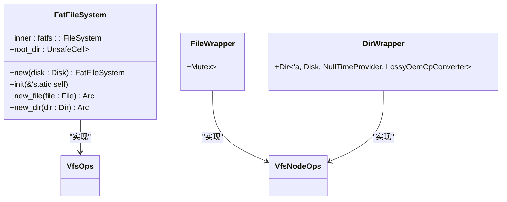
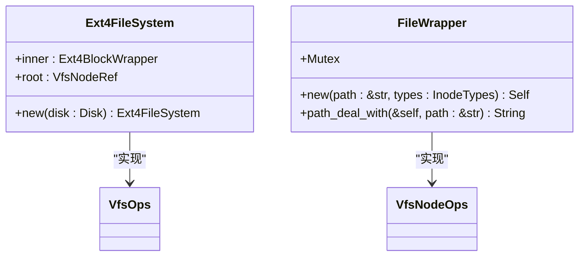
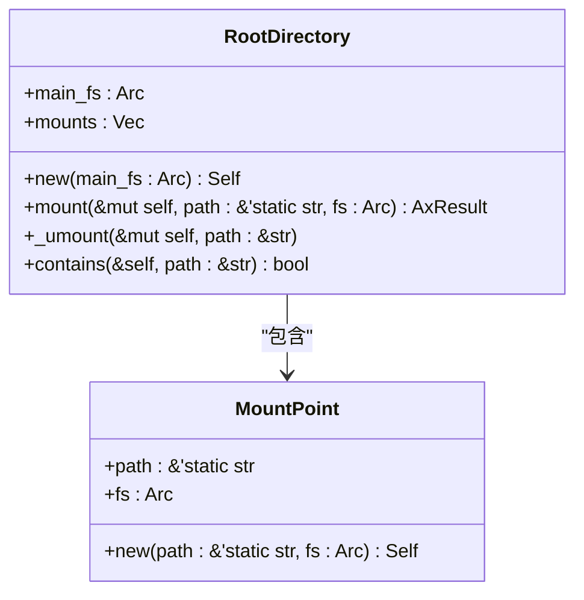
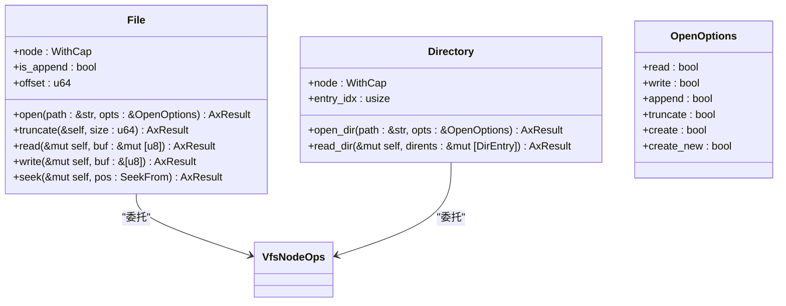
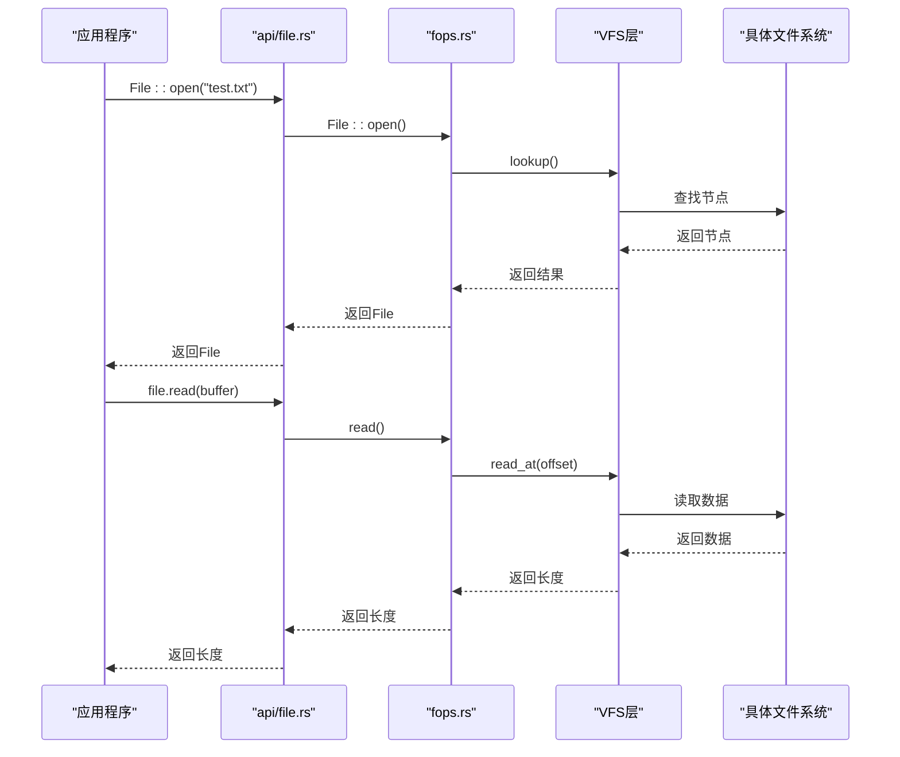
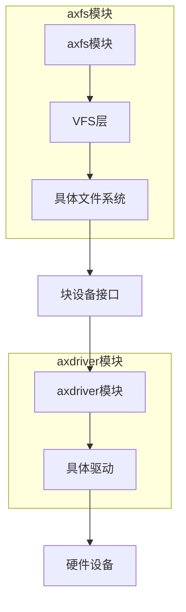

# 文件系统

<cite>
**本文档中引用的文件**
- [fatfs.rs](file://modules/axfs/src/fs/fatfs.rs)
- [ext4fs.rs](file://modules/axfs/src/fs/ext4fs.rs)
- [mounts.rs](file://modules/axfs/src/mounts.rs)
- [fops.rs](file://modules/axfs/src/fops.rs)
- [api/file.rs](file://modules/axfs/src/api/file.rs)
- [root.rs](file://modules/axfs/src/root.rs)
- [lib.rs](file://modules/axdriver/src/lib.rs)
- [blk/mod.rs](file://modules/axdriver/src/dyn_drivers/blk/mod.rs)
</cite>

## 目录
1. [引言](#引言)
2. [文件系统类型支持](#文件系统类型支持)
3. [元数据管理与存储效率对比](#元数据管理与存储效率对比)
4. [挂载点管理与抽象接口设计](#挂载点管理与抽象接口设计)
5. [文件操作向量表分发机制](#文件操作向量表分发机制)
6. [标准编程范例](#标准编程范例)
7. [I/O调度协作模式](#io调度协作模式)
8. [结论](#结论)

## 引言
arceos操作系统中的axfs模块提供了一个统一的文件系统框架，支持多种文件系统类型。该模块通过虚拟文件系统（VFS）层实现了对FAT、EXT4和RAMFS等不同文件系统的抽象，为上层应用提供了统一的访问接口。本手册将深入分析axfs模块的核心组件及其工作机制。

## 文件系统类型支持
axfs模块通过`fs`子模块实现了对多种文件系统的支持，包括FAT、EXT4和RAMFS。这些文件系统通过统一的VFS接口进行集成，允许在运行时动态挂载和卸载。

### FAT文件系统实现
FAT文件系统由`fatfs.rs`文件实现，基于`fatfs`库构建。它使用`FatFileSystem`结构体封装底层磁盘设备，并通过`VfsOps` trait提供根目录访问能力。



**图源**
- [fatfs.rs](file://modules/axfs/src/fs/fatfs.rs#L10-L301)

**节源**
- [fatfs.rs](file://modules/axfs/src/fs/fatfs.rs#L10-L301)

### EXT4文件系统实现
EXT4文件系统由`ext4fs.rs`文件实现，基于`lwext4_rust`库构建。它使用`Ext4FileSystem`结构体管理EXT4卷，并通过`Ext4BlockWrapper`与底层块设备交互。



**图源**
- [ext4fs.rs](file://modules/axfs/src/fs/ext4fs.rs#L10-L377)

**节源**
- [ext4fs.rs](file://modules/axfs/src/fs/ext4fs.rs#L10-L377)

### RAMFS内存文件系统
RAMFS是一种基于内存的临时文件系统，用于`/tmp`、`/proc`和`/sys`等特殊目录。它通过`mounts.rs`中的辅助函数创建和初始化。

**节源**
- [mounts.rs](file://modules/axfs/src/mounts.rs#L10-L82)

## 元数据管理与存储效率对比
FAT和EXT4文件系统在元数据管理和存储效率方面存在显著差异，这主要体现在权限模型、inode结构和空间分配策略上。

### 权限模型差异
FAT文件系统不支持Unix风格的权限位，因此在`fatfs.rs`中将所有文件的权限硬编码为0o755：

```rust
// FAT文件系统权限处理
let perm = VfsNodePerm::from_bits_truncate(0o755);
```

而EXT4文件系统则完整保留了原始的权限信息：

```rust
// EXT4文件系统权限处理
let perm = file.file_mode_get().unwrap_or(0o755);
let perm = VfsNodePerm::from_bits_truncate((perm as u16) & 0o777);
```

### 存储效率比较
| 特性 | FAT文件系统 | EXT4文件系统 |
|------|------------|-------------|
| 块大小 | 固定512字节 | 可配置 |
| 碎片管理 | 链表式簇分配 | 多级B+树索引 |
| 元数据开销 | 低 | 较高 |
| 扩展属性支持 | 不支持 | 支持 |
| 日志功能 | 无 | 有 |

**节源**
- [fatfs.rs](file://modules/axfs/src/fs/fatfs.rs#L10-L301)
- [ext4fs.rs](file://modules/axfs/src/fs/ext4fs.rs#L10-L377)

## 挂载点管理与抽象接口设计
axfs模块通过`mounts.rs`和`root.rs`实现了灵活的挂载点管理系统，允许多个文件系统实例挂载到统一的命名空间中。

### 挂载点管理机制
`RootDirectory`结构体维护了一个`mounts`向量，记录所有已挂载的文件系统及其路径：



**图源**
- [root.rs](file://modules/axfs/src/root.rs#L10-L317)

**节源**
- [root.rs](file://modules/axfs/src/root.rs#L10-L317)

### 统一抽象接口
所有文件系统都实现了`VfsOps` trait，提供统一的根目录访问接口：

```rust
pub trait VfsOps {
    fn root_dir(&self) -> VfsNodeRef;
    fn umount(&self) -> VfsResult<()> { Ok(()) }
}
```

这种设计使得上层代码无需关心具体文件系统类型即可进行操作。

**节源**
- [mounts.rs](file://modules/axfs/src/mounts.rs#L10-L82)
- [root.rs](file://modules/axfs/src/root.rs#L10-L317)

## 文件操作向量表分发机制
`fops.rs`模块实现了文件操作的向量表分发机制，通过`File`和`Directory`结构体封装底层VFS节点，并提供安全的访问控制。

### 文件操作结构
`File`结构体包含一个带权限标记的VFS节点引用，以及文件偏移和追加模式标志：



**图源**
- [fops.rs](file://modules/axfs/src/fops.rs#L10-L418)

**节源**
- [fops.rs](file://modules/axfs/src/fops.rs#L10-L418)

### 权限映射机制
系统通过`perm_to_cap`函数将文件权限转换为能力位：

```rust
fn perm_to_cap(perm: FilePerm) -> Cap {
    let mut cap = Cap::empty();
    if perm.owner_readable() {
        cap |= Cap::READ;
    }
    if perm.owner_writable() {
        cap |= Cap::WRITE;
    }
    if perm.owner_executable() {
        cap |= Cap::EXECUTE;
    }
    cap
}
```

**节源**
- [fops.rs](file://modules/axfs/src/fops.rs#L10-L418)

## 标准编程范例
通过`api/file.rs`提供的高层API，开发者可以使用标准Rust I/O trait进行文件操作。

### 文件读写示例


**图源**
- [api/file.rs](file://modules/axfs/src/api/file.rs#L10-L193)
- [fops.rs](file://modules/axfs/src/fops.rs#L10-L418)

**节源**
- [api/file.rs](file://modules/axfs/src/api/file.rs#L10-L193)

## I/O调度协作模式
axfs模块与axdriver模块通过块设备驱动接口进行I/O调度协作，形成完整的存储栈。

### 协作架构


### 块设备驱动接口
`axdriver`模块定义了统一的块设备抽象：

```rust
pub struct AllDevices {
    #[cfg(feature = "block")]
    pub block: AxDeviceContainer<AxBlockDevice>,
}

impl AllDevices {
    pub fn init_drivers() -> AllDevices { ... }
}
```

具体驱动实现位于`dyn_drivers/blk/mod.rs`，提供读写块的基本操作：

```rust
impl BlockDriverOps for Block {
    fn read_block(&mut self, block_id: u64, buf: &mut [u8]) -> DevResult { ... }
    fn write_block(&mut self, block_id: u64, buf: &[u8]) -> DevResult { ... }
}
```

**图源**
- [lib.rs](file://modules/axdriver/src/lib.rs#L10-L198)
- [blk/mod.rs](file://modules/axdriver/src/dyn_drivers/blk/mod.rs#L10-L105)

**节源**
- [lib.rs](file://modules/axdriver/src/lib.rs#L10-L198)
- [blk/mod.rs](file://modules/axdriver/src/dyn_drivers/blk/mod.rs#L10-L105)

## 结论
arceos的axfs模块通过精心设计的分层架构，成功整合了多种文件系统类型。其核心优势在于：
1. 统一的VFS抽象层确保了接口一致性
2. 灵活的挂载机制支持复杂的目录结构
3. 安全的能力模型保护文件系统完整性
4. 高效的I/O调度与底层驱动紧密协作

该设计既保持了传统Unix文件系统的语义，又适应了现代操作系统的需求，为arceos提供了可靠的存储基础。