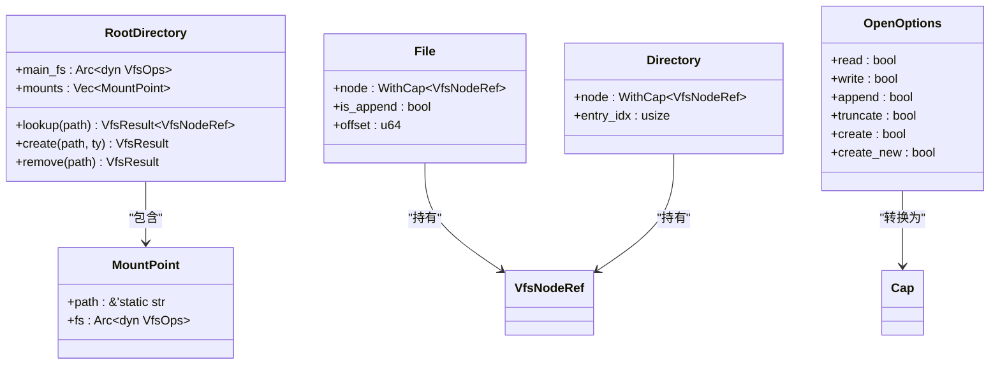
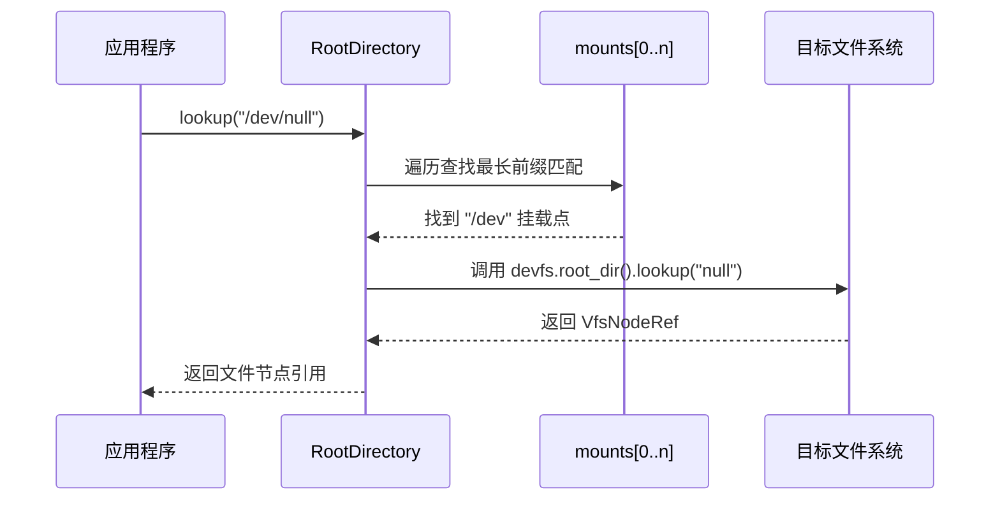
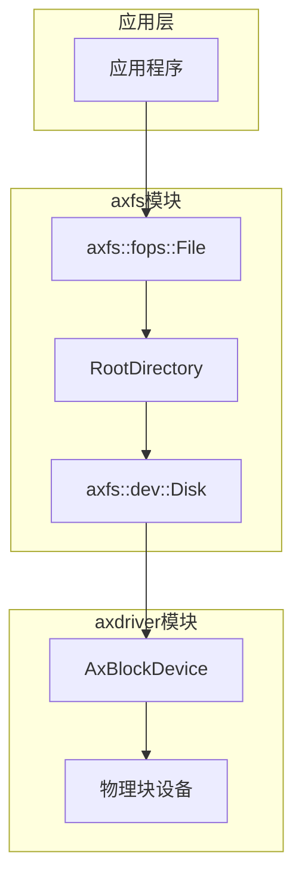

# 文件系统架构概述

<cite>
**本文档引用的文件**
- [lib.rs](file://modules/axfs/src/lib.rs)
- [mounts.rs](file://modules/axfs/src/mounts.rs)
- [fops.rs](file://modules/axfs/src/fops.rs)
- [root.rs](file://modules/axfs/src/root.rs)
- [dev.rs](file://modules/axfs/src/dev.rs)
</cite>

## 目录
1. [引言](#引言)
2. [模块设计哲学与分层结构](#模块设计哲学与分层结构)
3. [核心类型与全局状态管理](#核心类型与全局状态管理)
4. [多文件系统挂载点管理](#多文件系统挂载点管理)
5. [文件操作向量表与动态分发机制](#文件操作向量表与动态分发机制)
6. [根文件系统初始化流程](#根文件系统初始化流程)
7. [设备节点支持机制](#设备节点支持机制)
8. [统一接口抽象与I/O协同](#统一接口抽象与io协同)

## 引言

ArceOS 的 `axfs` 模块为多种文件系统提供了统一的操作接口，旨在实现跨文件系统的兼容性与可扩展性。该模块通过分层设计、虚拟文件系统（VFS）抽象和灵活的挂载机制，支持 FAT、ext4、ramfs 等多种文件系统，并允许用户自定义实现。本技术文档将深入剖析其架构设计、核心组件协作机制以及与底层块设备驱动的 I/O 调度协同。

## 模块设计哲学与分层结构

`axfs` 模块采用清晰的分层架构，分为三个主要层次：**抽象层**、**操作分发层** 和 **具体实现层**。

- **抽象层**：基于 `axfs_vfs` 提供的虚拟文件系统接口（如 `VfsOps`、`VfsNodeOps`），定义了文件系统操作的标准契约，屏蔽底层差异。
- **操作分发层**：由 `root.rs` 和 `fops.rs` 构成，负责路径解析、权限检查、操作路由至具体的文件系统实例。
- **具体实现层**：位于 `fs/` 子模块中，包含 `fatfs`、`ext4fs`、`ramfs` 等具体文件系统的实现，直接处理数据读写逻辑。

这种分层设计实现了高内聚低耦合，使得新增文件系统或替换默认实现变得简单而安全。

**Section sources**
- [lib.rs](file://modules/axfs/src/lib.rs#L1-L45)
- [root.rs](file://modules/axfs/src/root.rs#L1-L317)

## 核心类型与全局状态管理

`lib.rs` 是模块的入口，定义了对外暴露的核心类型和初始化函数。它通过条件编译特性（Cargo features）控制不同文件系统的启用，如 `fatfs` 作为默认根文件系统，`devfs` 挂载于 `/dev`，`ramfs` 挂载于 `/tmp`。

全局状态由 `lazyinit::LazyInit` 和 `axns::ResArc` 等同步原语管理，确保线程安全。关键的全局状态包括：
- `ROOT_DIR`：指向根目录对象的原子引用计数指针，是整个文件系统树的起点。
- `CURRENT_DIR` 和 `CURRENT_DIR_PATH`：维护当前工作目录的节点引用和路径字符串，支持相对路径解析。

这些状态在系统启动时由 `init_filesystems` 函数初始化，之后保持稳定。



**Diagram sources**
- [lib.rs](file://modules/axfs/src/lib.rs#L1-L45)
- [root.rs](file://modules/axfs/src/root.rs#L1-L317)
- [fops.rs](file://modules/axfs/src/fops.rs#L1-L418)

**Section sources**
- [lib.rs](file://modules/axfs/src/lib.rs#L1-L45)
- [root.rs](file://modules/axfs/src/root.rs#L1-L317)
- [fops.rs](file://modules/axfs/src/fops.rs#L1-L418)

## 多文件系统挂载点管理

`mounts.rs` 模块负责预定义特殊文件系统的创建与初始化。例如，在启用 `devfs` 特性时，`devfs()` 函数会构建一个包含 `/dev/null`、`/dev/zero` 等设备节点的设备文件系统。

挂载点的注册与查询由 `root.rs` 中的 `RootDirectory` 结构体管理。它维护一个 `mounts` 向量，存储所有已挂载的文件系统及其路径。`mount` 方法用于注册新的挂载点，它首先在主文件系统中创建挂载目录，然后调用目标文件系统的 `mount` 方法完成绑定。

路径查找时，`lookup_mounted_fs` 函数会遍历所有挂载点，寻找与给定路径前缀匹配最长的条目，从而确定应由哪个文件系统处理该请求。这保证了挂载点的正确路由。



**Diagram sources**
- [mounts.rs](file://modules/axfs/src/mounts.rs#L1-L82)
- [root.rs](file://modules/axfs/src/root.rs#L1-L317)

**Section sources**
- [mounts.rs](file://modules/axfs/src/mounts.rs#L1-L82)
- [root.rs](file://modules/axfs/src/root.rs#L1-L317)

## 文件操作向量表与动态分发机制

`fops.rs` 模块实现了文件操作向量表（File Operations Vector），封装了对文件和目录的所有操作。核心类型 `File` 和 `Directory` 结构体包装了 `VfsNodeRef`，并附加了打开选项（`OpenOptions`）和当前位置（偏移量或目录项索引）。

动态分发机制体现在：
1. **权限映射**：`OpenOptions` 在打开文件时被转换为能力位（`Cap`），并与文件节点的权限（`FilePerm`）进行比对，确保操作合法性。
2. **方法委托**：`File` 的 `read`、`write` 等方法最终委托给内部 `VfsNodeRef` 的 `read_at`、`write_at` 等 VFS 接口，由具体文件系统实现。
3. **生命周期管理**：利用 `Drop` trait 自动释放文件句柄，确保资源不泄露。

此机制通过统一的 API 屏蔽了底层文件系统的差异，同时通过能力模型增强了安全性。

```mermaid
flowchart TD
A["应用程序调用 File::read()"] --> B{检查访问能力<br/>access_node(Cap::READ)}
B --> |失败| C[返回 PermissionDenied]
B --> |成功| D["调用 node.read_at(offset, buf)"]
D --> E["更新 offset += read_len"]
E --> F["返回读取字节数"]
```

**Diagram sources**
- [fops.rs](file://modules/axfs/src/fops.rs#L1-L418)

**Section sources**
- [fops.rs](file://modules/axfs/src/fops.rs#L1-L418)

## 根文件系统初始化流程

`root.rs` 中的 `init_rootfs` 函数负责系统启动时的根文件系统初始化。其流程如下：
1. 根据 Cargo 特性选择主文件系统实现（默认为 `fatfs`）。
2. 创建 `RootDirectory` 实例，以主文件系统作为基础。
3. 根据启用的特性，依次将 `devfs`、`ramfs`、`procfs`、`sysfs` 等文件系统挂载到指定路径（如 `/dev`、`/tmp`）。
4. 将构建好的 `RootDirectory` 初始化为全局单例 `ROOT_DIR`，并设置当前工作目录为根目录。

此过程确保了系统启动后即拥有一个功能完整的、包含多种文件系统的虚拟文件系统树。

**Section sources**
- [root.rs](file://modules/axfs/src/root.rs#L164-L208)

## 设备节点支持机制

`dev.rs` 模块定义了 `Disk` 结构体，作为块设备的高层抽象。它封装了来自 `axdriver` 的 `AxBlockDevice`，提供面向字节流的读写接口（`read_one`、`write_one`），自动处理块边界对齐。

对于字符设备节点（如 `/dev/null`、`/dev/urandom`），它们在 `mounts.rs` 中被直接创建为特殊的 `VfsNodeRef` 实例，并挂载到 `devfs` 文件系统中。这些节点的行为由其实现决定，例如 `NullDev` 对写入的数据直接丢弃，对读取返回空。

这种设计将块设备的物理I/O与设备文件的逻辑行为分离，提高了模块的灵活性。

**Section sources**
- [dev.rs](file://modules/axfs/src/dev.rs#L1-L92)
- [mounts.rs](file://modules/axfs/src/mounts.rs#L1-L82)

## 统一接口抽象与I/O协同

`axfs` 模块通过 `axfs_vfs` 定义的统一接口（`VfsOps`、`VfsNodeOps`）抽象了不同文件系统的实现细节。无论是 `fatfs` 还是 `ext4fs`，它们都必须实现这些接口，从而可以被 `RootDirectory` 统一管理和调度。

在 I/O 请求调度方面，`axfs` 与 `axdriver` 紧密协同：
- `axfs` 层将高层文件操作（如 `write_at`）转化为对 `Disk` 抽象的读写请求。
- `Disk` 层进一步将其分解为对 `AxBlockDevice` 的 `read_block`/`write_block` 调用。
- `axdriver` 负责与具体的硬件驱动（如 VirtIO 块设备）通信，完成实际的数据传输。

这一链条确保了从应用层到硬件层的高效、可靠的数据读写路径。



**Diagram sources**
- [lib.rs](file://modules/axfs/src/lib.rs#L1-L45)
- [dev.rs](file://modules/axfs/src/dev.rs#L1-L92)
- [root.rs](file://modules/axfs/src/root.rs#L1-L317)
- [axdriver](file://modules/axdriver/src/lib.rs)