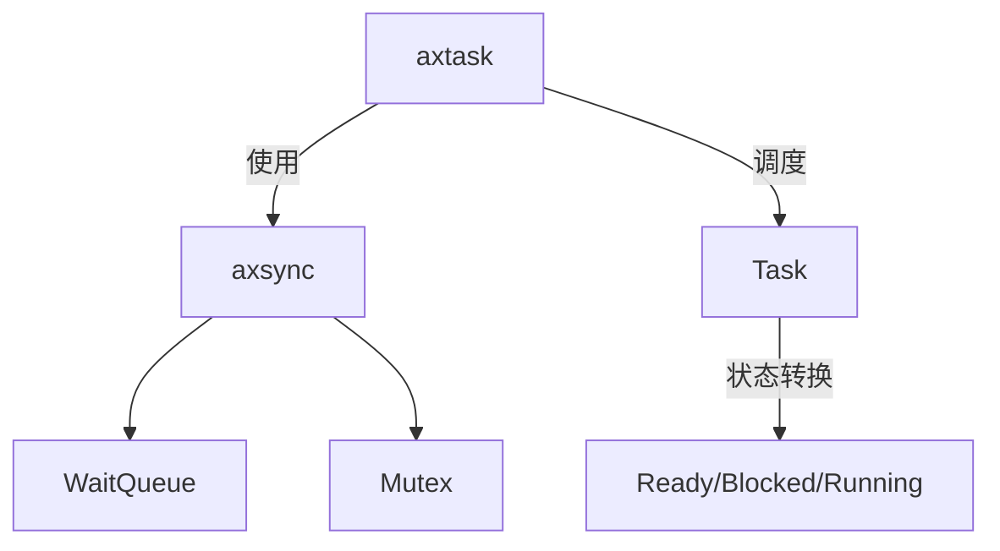
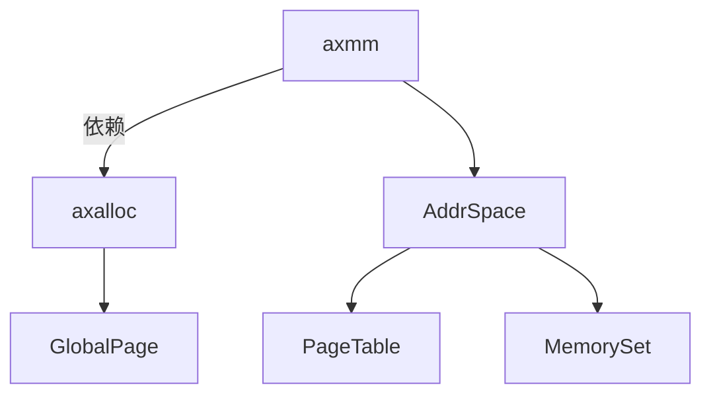
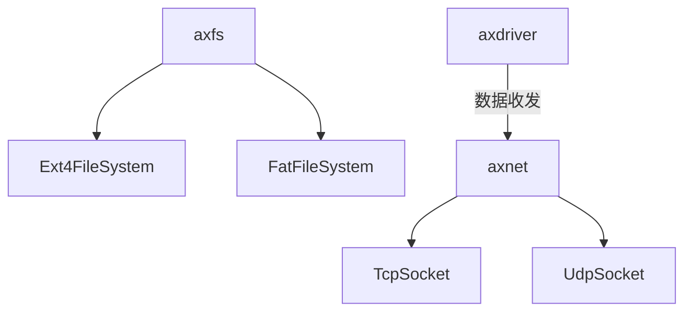
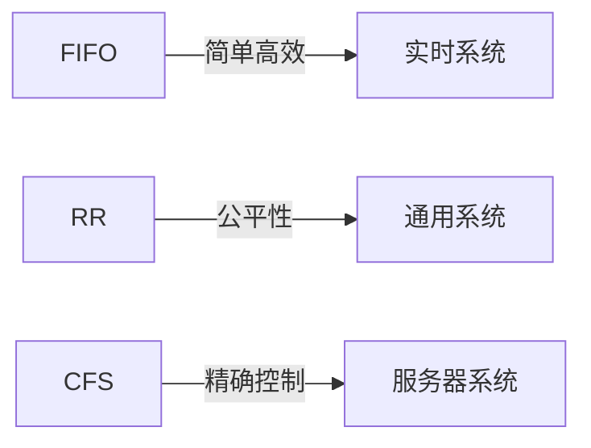
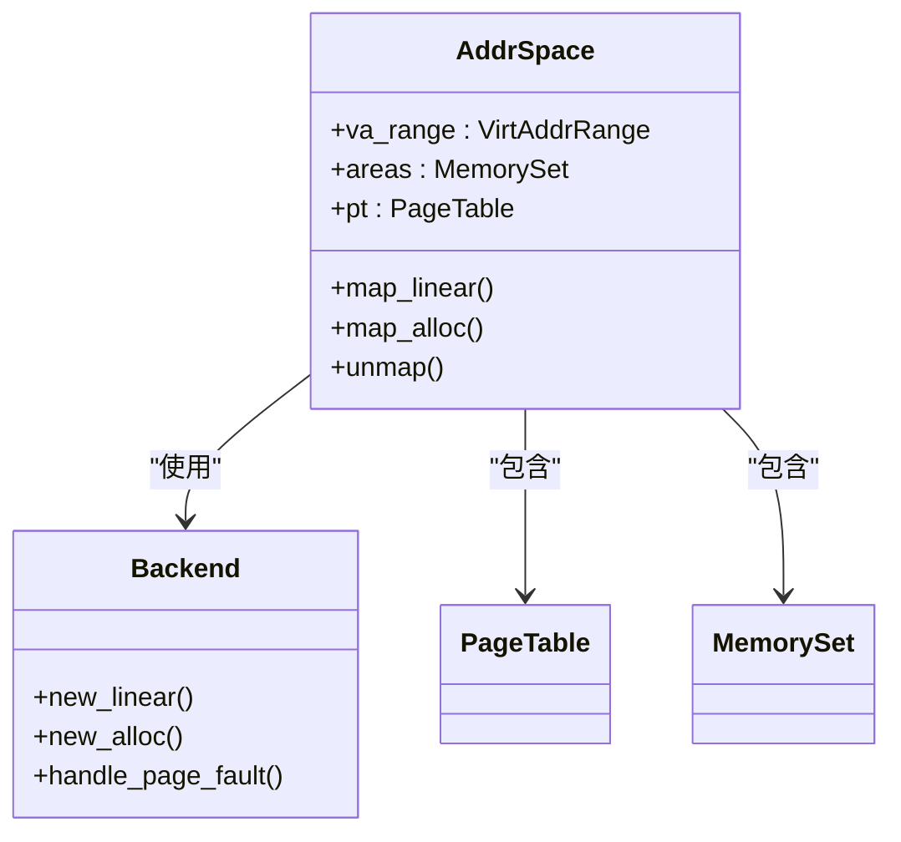
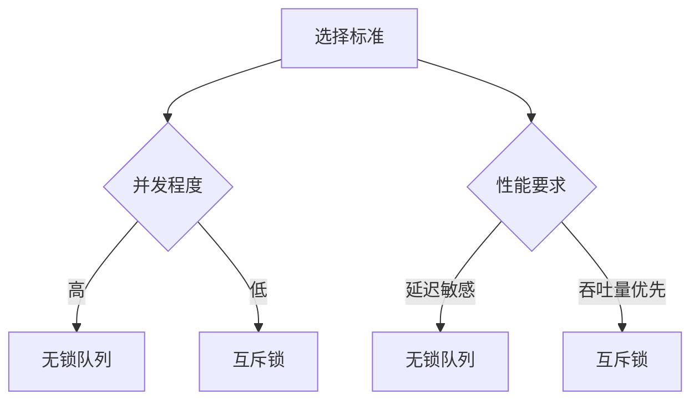

# 核心服务模块架构

<cite>
**本文档引用的文件**
- [run_queue.rs](file://modules/axtask/src/run_queue.rs)
- [aspace.rs](file://modules/axmm/src/aspace.rs)
- [mutex.rs](file://modules/axsync/src/mutex.rs)
- [page.rs](file://modules/axalloc/src/page.rs)
- [ext4fs.rs](file://modules/axfs/src/fs/ext4fs.rs)
- [lib.rs](file://modules/axnet/src/lib.rs)
</cite>

## 目录
1. [引言](#引言)
2. [核心模块协同机制](#核心模块协同机制)
3. [任务调度算法对比](#任务调度算法对比)
4. [内存管理设计解析](#内存管理设计解析)
5. [同步原语应用分析](#同步原语应用分析)
6. [组件交互图](#组件交互图)

## 引言
Arceos核心服务模块采用微内核架构，通过axtask、axmm、axsync、axalloc、axfs和axnet六大核心模块的协同工作，为上层应用提供完整的操作系统服务。这些模块通过清晰的接口定义和依赖关系，实现了高内聚低耦合的系统设计。

## 核心模块协同机制

### 任务调度与同步
axtask模块作为系统的核心调度器，依赖axsync提供的同步原语来管理任务状态转换。当任务需要等待资源时，通过wait_queue机制将任务置于阻塞状态，并在资源可用时由axsync唤醒。



**图表来源**
- [run_queue.rs](file://modules/axtask/src/run_queue.rs)
- [mutex.rs](file://modules/axsync/src/mutex.rs)

**本节来源**
- [run_queue.rs](file://modules/axtask/src/run_queue.rs#L1-L668)
- [mutex.rs](file://modules/axsync/src/mutex.rs#L1-L150)

### 内存管理与分配
axmm模块负责虚拟内存管理，其后端实现依赖于axalloc提供的物理页帧分配能力。这种分层设计使得虚拟内存管理和物理内存分配可以独立演化。



**图表来源**
- [aspace.rs](file://modules/axmm/src/aspace.rs)
- [page.rs](file://modules/axalloc/src/page.rs)

**本节来源**
- [aspace.rs](file://modules/axmm/src/aspace.rs#L1-L321)
- [page.rs](file://modules/axalloc/src/page.rs#L1-L108)

### 文件系统与网络栈
axfs模块提供统一的文件系统接口，支持多种文件系统格式；axnet模块则基于smoltcp实现TCP/IP协议栈，两者共同为系统提供I/O能力。



**图表来源**
- [ext4fs.rs](file://modules/axfs/src/fs/ext4fs.rs)
- [lib.rs](file://modules/axnet/src/lib.rs)

**本节来源**
- [ext4fs.rs](file://modules/axfs/src/fs/ext4fs.rs#L1-L377)
- [lib.rs](file://modules/axnet/src/lib.rs#L1-L47)

## 任务调度算法对比

### FIFO调度算法
先进先出（FIFO）调度算法按照任务到达顺序进行调度，适用于实时性要求不高的场景。在axtask中，该算法通过简单的队列管理实现。

### RR调度算法
轮转（RR）调度算法为每个任务分配固定的时间片，时间片用完后自动让出CPU，确保所有任务都能获得执行机会。

### CFS调度算法
完全公平调度（CFS）算法基于虚拟运行时间进行调度决策，优先调度虚拟运行时间最短的任务，实现更精细的CPU时间分配。



**本节来源**
- [run_queue.rs](file://modules/axtask/src/run_queue.rs#L1-L668)

## 内存管理设计解析

### 虚拟地址空间分离设计
axmm模块采用前后端分离的设计模式，将虚拟地址空间管理（aspace.rs）与物理内存分配（backend/）解耦。前端负责虚拟内存布局和映射管理，后端负责具体的物理页帧分配。



**图表来源**
- [aspace.rs](file://modules/axmm/src/aspace.rs#L1-L321)
- [backend/](file://modules/axmm/src/backend/)

**本节来源**
- [aspace.rs](file://modules/axmm/src/aspace.rs#L1-L321)

## 同步原语应用分析

### 无锁队列应用场景
axsync中的无锁队列适用于高并发、低延迟的场景，如任务就绪队列管理。通过原子操作避免了传统锁的竞争开销。

### 传统互斥锁应用场景
传统互斥锁适用于需要严格串行化访问的场景，如关键数据结构的修改操作。在axsync中，Mutex提供了完整的锁语义保证。



**图表来源**
- [mutex.rs](file://modules/axsync/src/mutex.rs#L1-L150)

**本节来源**
- [mutex.rs](file://modules/axsync/src/mutex.rs#L1-L150)

## 组件交互图

```mermaid
graph TD
subgraph "核心模块"
A[axtask]
B[axmm]
C[axsync]
D[axalloc]
E[axfs]
F[axnet]
end
subgraph "依赖关系"
A --> C : "任务同步"
B --> D : "物理页帧获取"
F --> G[axdriver] : "数据收发"
C --> H[WaitQueue] : "阻塞/唤醒"
B --> I[PageTable] : "页表管理"
end
A --> |创建进程| B
E --> |文件操作| B
F --> |网络缓冲| B
```

**图表来源**
- [run_queue.rs](file://modules/axtask/src/run_queue.rs)
- [aspace.rs](file://modules/axmm/src/aspace.rs)
- [mutex.rs](file://modules/axsync/src/mutex.rs)
- [page.rs](file://modules/axalloc/src/page.rs)
- [ext4fs.rs](file://modules/axfs/src/fs/ext4fs.rs)
- [lib.rs](file://modules/axnet/src/lib.rs)

**本节来源**
- [run_queue.rs](file://modules/axtask/src/run_queue.rs#L1-L668)
- [aspace.rs](file://modules/axmm/src/aspace.rs#L1-L321)
- [mutex.rs](file://modules/axsync/src/mutex.rs#L1-L150)
- [page.rs](file://modules/axalloc/src/page.rs#L1-L108)
- [ext4fs.rs](file://modules/axfs/src/fs/ext4fs.rs#L1-L377)
- [lib.rs](file://modules/axnet/src/lib.rs#L1-L47)